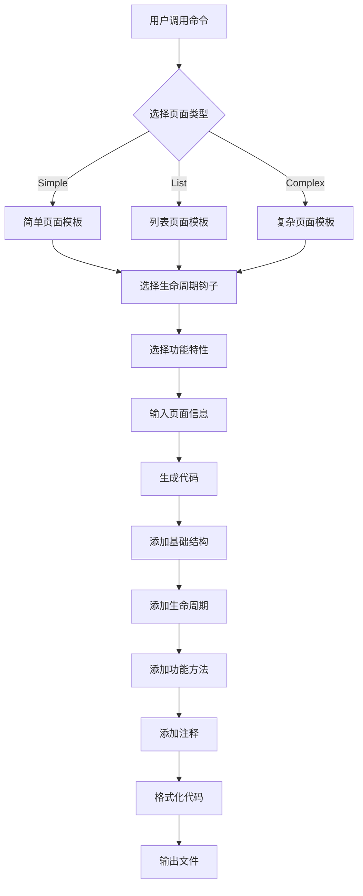

# GaiaXPage 扩展命令设计文档

## 设计目标

基于 Gemini Extension 框架,为 GaiaXPage 创建一个智能化的命令扩展,用于自动生成 GaiaXPage 的 JS 使用样例(index.js 文件)。该扩展将帮助开发者快速创建符合 GaiaXPage 规范的页面模板代码。

## 背景分析

### GaiaXPage 概述

GaiaXPage 是 GaiaX 框架提供的页面级容器能力,支持通过 JavaScript 定义页面生命周期和交互逻辑。与普通的 GaiaX Component 不同,Page 提供了更丰富的页面级生命周期管理和 API。

### GaiaXPage 核心特性

#### 页面生命周期

GaiaXPage 定义了完整的页面生命周期钩子:

- **onPreprocess**: 页面 JS 加载开始预加载时回调
- **onLoad**: 页面 JS 加载完成时回调,接收初始化数据
- **onShow**: 页面可见(回前台)时回调
- **onReady**: 列表首次渲染完成时回调,整个生命周期内只回调一次
- **onUpdate**: 页面更新数据时回调
- **onHide**: 页面不可见(压后台)时回调
- **onUnload**: 页面销毁时回调
- **onPageScroll**: 页面滑动回调,接收滚动位置信息
- **onReachBottom**: 页面触底回调,用于加载更多
- **onResize**: 页面显示区域尺寸发生改变时回调

#### 页面 API 能力

GaiaXPage 提供丰富的页面级 API:

**组件管理 API**:
- createComponentByData: 创建组件实例
- addComponentByData: 添加组件到页面
- updateComponentByData: 更新组件数据
- removeComponentByData: 移除组件
- batchCreateComponentByData: 批量创建组件
- batchAddComponentByData: 批量添加组件
- batchUpdateComponentByData: 批量更新组件
- batchRemoveComponentByData: 批量移除组件
- batchReplaceComponentByData: 批量替换组件

**UI 交互 API**:
- showFloatingView: 弹出悬浮视图
- hideFloatingView: 隐藏悬浮视图
- setupActionBar: 创建页面 ActionBar
- setBackgroundColor: 设置页面背景颜色
- setStatusBarBlack: 设置状态栏文字颜色
- presentModal: 创建全屏窗口
- dismissModal: 关闭全屏窗口
- closePage: 关闭当前页面
- pageScrollTo: 滑动到指定组件

**状态管理 API**:
- getPageStateManager: 获取页面状态管理器
  - setLoadingView: 设置加载视图
  - setErrorView: 设置错误视图
  - setRootView: 设置根视图

**网络请求 API**:
- gaiax.mtop: 发起 MTOP 接口请求
- gaiax.getUserInfo: 获取用户信息
- gaiax.getSystemInfo: 获取系统信息
- gaiax.checkSession: 检查登录状态

**事件通信 API**:
- onNativeEvent: 接收 Native 发送的事件

### GaiaX Component 对比

GaiaX Component 生命周期(用于对比理解):
- onDataInit: 数据初始化,整个生命周期只回调一次
- onReady: 渲染完成后回调,整个生命周期只回调一次
- onShow: 组件显示时回调
- onHide: 组件隐藏时回调
- onReuse: 组件复用时回调
- onDestroy: 组件销毁时回调
- onLoadMore: 加载更多时回调

### Gemini Extension 框架参考

基于 android-extension 样例,Gemini Extension 的核心结构包括:

- **commands 定义**: 在 extension.json 中声明可用命令
- **命令处理器**: 实现命令的具体逻辑
- **用户交互**: 支持参数输入、选择等交互方式
- **代码生成**: 基于模板生成目标代码

## 需求分析

### 功能需求

1. **命令定义**: 创建 "生成 GaiaXPage 样例" 命令
2. **交互设计**: 引导用户选择需要的页面特性
3. **模板生成**: 基于选择生成完整的 index.js 代码
4. **代码规范**: 确保生成的代码符合 GaiaXPage 最佳实践

### 用户交互流程

用户调用命令后的交互流程:

1. **选择页面类型**
   - 简单页面: 仅包含基础生命周期
   - 列表页面: 包含滚动、加载更多等特性
   - 复杂页面: 包含组件管理、状态管理等完整特性

2. **选择需要的生命周期钩子**
   - 必选: onLoad, onReady, onUnload
   - 可选: onShow, onHide, onPageScroll, onReachBottom, onUpdate, onResize

3. **选择需要的功能特性**
   - 组件动态管理(增删改查)
   - 状态管理(加载/错误/内容状态)
   - 滚动交互(监听滚动、触底加载)
   - 浮层管理(悬浮窗、全屏模态)
   - 网络请求(MTOP 接口调用)
   - 事件通信(Native 事件监听)

4. **输入页面基础信息**
   - 页面描述(可选)
   - 是否包含示例数据
   - 是否添加详细注释

5. **生成文件位置**
   - 默认位置建议
   - 允许用户自定义路径

### 生成代码规范

#### 基础页面结构

```
Page({
  // 页面数据
  data: {},
  
  // 生命周期钩子
  onLoad(options) {},
  onReady() {},
  onUnload() {},
  
  // 页面方法
  // ...
})
```

#### 代码组织原则

1. **数据在前**: data 对象定义在最前面
2. **生命周期顺序**: 按照执行顺序排列生命周期钩子
   - onPreprocess
   - onLoad
   - onShow
   - onReady
   - onUpdate
   - onHide
   - onUnload
   - onPageScroll
   - onReachBottom
   - onResize
3. **方法分组**: 按功能分组页面方法
   - 组件管理方法
   - UI 交互方法
   - 数据处理方法
   - 工具方法
4. **注释规范**: 
   - 每个生命周期钩子添加说明注释
   - 复杂逻辑添加实现注释
   - 示例代码添加使用说明

#### 命名规范

- 页面数据使用小驼峰: `pageData`, `userInfo`
- 方法名使用动词开头: `handleScroll`, `loadMore`, `createComponent`
- 私有方法使用下划线前缀: `_initData`, `_handleError`

## 设计方案

### 命令定义

在 gaiax-extension 的 extension.json 中添加命令定义:

#### 命令基本信息

| 字段 | 值 | 说明 |
|------|-----|------|
| command | gaiax.generatePageSample | 命令唯一标识 |
| title | 生成 GaiaXPage 样例 | 命令显示名称 |
| category | GaiaX | 命令分类 |
| description | 创建一个符合规范的 GaiaXPage index.js 文件 | 命令描述 |

#### 命令参数

| 参数名 | 类型 | 必填 | 默认值 | 说明 |
|--------|------|------|--------|------|
| pageType | enum | 是 | simple | 页面类型: simple/list/complex |
| lifecycles | array | 否 | [onLoad, onReady, onUnload] | 需要的生命周期钩子 |
| features | array | 否 | [] | 需要的功能特性 |
| description | string | 否 | "" | 页面描述 |
| withExamples | boolean | 否 | true | 是否包含示例代码 |
| withComments | boolean | 否 | true | 是否包含详细注释 |
| outputPath | string | 否 | "./index.js" | 输出文件路径 |

### 页面类型模板

#### 简单页面(Simple)

**特点**: 
- 包含基础生命周期
- 适用于静态展示页面
- 代码简洁,易于理解

**包含内容**:
- data: 基础数据对象
- onLoad: 页面加载
- onReady: 页面就绪
- onUnload: 页面销毁

**生成示例**:

```
Page({
  data: {
    title: '页面标题',
    content: '页面内容'
  },
  
  /**
   * 页面加载时调用
   * @param {Object} options - 页面参数
   */
  onLoad(options) {
    console.log('Page loaded with options:', options);
    // 初始化页面数据
  },
  
  /**
   * 页面首次渲染完成时调用
   * 整个生命周期内只会调用一次
   */
  onReady() {
    console.log('Page ready');
    // 页面渲染完成后的初始化操作
  },
  
  /**
   * 页面销毁时调用
   */
  onUnload() {
    console.log('Page unload');
    // 清理资源
  }
});
```

#### 列表页面(List)

**特点**:
- 支持滚动监听
- 支持下拉刷新、上拉加载
- 包含列表数据管理

**包含内容**:
- data: 包含列表数据、分页信息
- onLoad: 初始化加载
- onReady: 首屏渲染完成
- onShow: 页面显示时刷新
- onHide: 页面隐藏时暂停
- onPageScroll: 滚动监听
- onReachBottom: 触底加载更多
- onUnload: 清理资源
- refreshData: 刷新数据方法
- loadMore: 加载更多方法

**生成示例**:

```
Page({
  data: {
    list: [],
    page: 1,
    pageSize: 20,
    hasMore: true,
    loading: false
  },
  
  /**
   * 页面加载时调用
   * @param {Object} options - 页面参数
   */
  onLoad(options) {
    console.log('List page loaded');
    this._initData();
  },
  
  /**
   * 页面首次渲染完成
   */
  onReady() {
    console.log('List page ready');
  },
  
  /**
   * 页面显示时调用
   */
  onShow() {
    console.log('List page show');
    // 页面显示时可以刷新数据
  },
  
  /**
   * 页面隐藏时调用
   */
  onHide() {
    console.log('List page hide');
  },
  
  /**
   * 页面滚动时调用
   * @param {Object} event - 滚动事件对象
   * @param {Number} event.scrollTop - 滚动距离
   * @param {Number} event.scrollHeight - 内容高度
   */
  onPageScroll(event) {
    // 可以实现滚动相关交互,如吸顶效果
    const { scrollTop } = event;
    if (scrollTop > 100) {
      // 显示回到顶部按钮等
    }
  },
  
  /**
   * 页面触底时调用
   */
  onReachBottom() {
    console.log('Reach bottom, load more');
    this.loadMore();
  },
  
  /**
   * 页面销毁时调用
   */
  onUnload() {
    console.log('List page unload');
    this._clearData();
  },
  
  /**
   * 初始化数据
   * @private
   */
  _initData() {
    this.data.page = 1;
    this.data.list = [];
    this._fetchData();
  },
  
  /**
   * 加载更多数据
   */
  loadMore() {
    if (this.data.loading || !this.data.hasMore) {
      return;
    }
    
    this.data.page += 1;
    this._fetchData();
  },
  
  /**
   * 刷新数据
   */
  refreshData() {
    this.data.page = 1;
    this.data.list = [];
    this.data.hasMore = true;
    this._fetchData();
  },
  
  /**
   * 获取数据
   * @private
   */
  _fetchData() {
    this.data.loading = true;
    
    // 示例:调用 API 获取数据
    // API.getList({ page: this.data.page, pageSize: this.data.pageSize })
    //   .then(res => {
    //     const newList = res.data || [];
    //     this.data.list = this.data.page === 1 ? newList : [...this.data.list, ...newList];
    //     this.data.hasMore = newList.length >= this.data.pageSize;
    //     this.data.loading = false;
    //   })
    //   .catch(err => {
    //     console.error('Fetch data error:', err);
    //     this.data.loading = false;
    //   });
  },
  
  /**
   * 清理数据
   * @private
   */
  _clearData() {
    this.data.list = [];
    this.data.page = 1;
    this.data.hasMore = true;
  }
});
```

#### 复杂页面(Complex)

**特点**:
- 包含完整的生命周期
- 支持组件动态管理
- 包含状态管理
- 提供完整的错误处理

**包含内容**:
- data: 完整的数据结构(页面数据、状态、组件列表)
- 全部生命周期钩子
- 组件管理方法
- 状态管理方法
- 错误处理方法

**生成示例**:

```
Page({
  data: {
    // 页面基础数据
    pageInfo: {
      title: '',
      description: ''
    },
    
    // 组件列表
    components: [],
    
    // 页面状态
    pageState: 'loading' // loading | error | content
  },
  
  /**
   * 页面预处理
   * @param {Object} data - 预处理数据
   */
  onPreprocess(data) {
    console.log('Page preprocess:', data);
    // 页面预加载逻辑
  },
  
  /**
   * 页面加载
   * @param {Object} options - 页面参数
   */
  onLoad(options) {
    console.log('Complex page loaded:', options);
    this._initPage(options);
  },
  
  /**
   * 页面显示
   */
  onShow() {
    console.log('Complex page show');
    // 页面显示时的操作
  },
  
  /**
   * 页面首次渲染完成
   */
  onReady() {
    console.log('Complex page ready');
    this._setPageState('content');
  },
  
  /**
   * 页面数据更新
   * @param {Object} data - 更新的数据
   */
  onUpdate(data) {
    console.log('Page update:', data);
    this._handleDataUpdate(data);
  },
  
  /**
   * 页面隐藏
   */
  onHide() {
    console.log('Complex page hide');
  },
  
  /**
   * 页面销毁
   */
  onUnload() {
    console.log('Complex page unload');
    this._cleanup();
  },
  
  /**
   * 页面滚动
   * @param {Object} event - 滚动事件
   */
  onPageScroll(event) {
    const { scrollTop, scrollHeight } = event;
    // 处理滚动事件
  },
  
  /**
   * 页面触底
   */
  onReachBottom() {
    console.log('Page reach bottom');
    this._loadMoreData();
  },
  
  /**
   * 页面尺寸变化
   * @param {Object} size - 尺寸信息
   */
  onResize(size) {
    console.log('Page resize:', size);
    // 处理页面尺寸变化
  },
  
  /**
   * 接收 Native 事件
   * @param {Object} data - 事件数据
   */
  onNativeEvent(data) {
    console.log('Receive native event:', data);
    this._handleNativeEvent(data);
  },
  
  // ==================== 组件管理方法 ====================
  
  /**
   * 创建组件
   * @param {Object} componentData - 组件数据
   */
  async createComponent(componentData) {
    try {
      const result = await this.createComponentByData(componentData);
      console.log('Component created:', result);
      return result;
    } catch (error) {
      console.error('Create component error:', error);
      throw error;
    }
  },
  
  /**
   * 添加组件到页面
   * @param {Object} componentData - 组件数据
   */
  async addComponent(componentData) {
    try {
      const result = await this.addComponentByData(componentData);
      this.data.components.push(result);
      console.log('Component added:', result);
      return result;
    } catch (error) {
      console.error('Add component error:', error);
      throw error;
    }
  },
  
  /**
   * 更新组件
   * @param {Object} componentData - 组件数据
   */
  async updateComponent(componentData) {
    try {
      const result = await this.updateComponentByData(componentData);
      console.log('Component updated:', result);
      return result;
    } catch (error) {
      console.error('Update component error:', error);
      throw error;
    }
  },
  
  /**
   * 移除组件
   * @param {Object} componentData - 组件标识数据
   */
  async removeComponent(componentData) {
    try {
      await this.removeComponentByData(componentData);
      this.data.components = this.data.components.filter(
        c => c.instanceId !== componentData.instanceId
      );
      console.log('Component removed');
    } catch (error) {
      console.error('Remove component error:', error);
      throw error;
    }
  },
  
  /**
   * 批量添加组件
   * @param {Array} componentList - 组件列表
   */
  async batchAddComponents(componentList) {
    try {
      const result = await this.batchAddComponentByData(componentList);
      console.log('Batch add components:', result);
      return result;
    } catch (error) {
      console.error('Batch add components error:', error);
      throw error;
    }
  },
  
  // ==================== 状态管理方法 ====================
  
  /**
   * 设置页面状态
   * @param {String} state - 状态值: loading | error | content
   * @private
   */
  _setPageState(state) {
    this.data.pageState = state;
    const stateManager = this.getPageStateManager();
    
    switch (state) {
      case 'loading':
        // stateManager.setLoadingView(loadingView);
        break;
      case 'error':
        // stateManager.setErrorView(errorView);
        break;
      case 'content':
        // stateManager.setRootView(contentView);
        break;
    }
  },
  
  /**
   * 显示加载状态
   */
  showLoading() {
    this._setPageState('loading');
  },
  
  /**
   * 显示错误状态
   */
  showError() {
    this._setPageState('error');
  },
  
  /**
   * 显示内容
   */
  showContent() {
    this._setPageState('content');
  },
  
  // ==================== UI 交互方法 ====================
  
  /**
   * 显示悬浮窗
   * @param {Object} floatingData - 悬浮窗数据
   */
  showFloating(floatingData) {
    this.showFloatingView(floatingData, (result) => {
      console.log('Floating view shown:', result);
    });
  },
  
  /**
   * 隐藏悬浮窗
   * @param {Object} floatingData - 悬浮窗标识
   */
  hideFloating(floatingData) {
    this.hideFloatingView(floatingData, (result) => {
      console.log('Floating view hidden:', result);
    });
  },
  
  /**
   * 显示模态窗口
   * @param {Object} modalData - 模态窗口数据
   */
  async showModal(modalData) {
    try {
      const result = await this.presentModal(modalData);
      console.log('Modal presented:', result);
      return result;
    } catch (error) {
      console.error('Present modal error:', error);
      throw error;
    }
  },
  
  /**
   * 关闭模态窗口
   * @param {Object} modalData - 模态窗口标识
   */
  async hideModal(modalData) {
    try {
      await this.dismissModal(modalData);
      console.log('Modal dismissed');
    } catch (error) {
      console.error('Dismiss modal error:', error);
      throw error;
    }
  },
  
  /**
   * 滚动到指定组件
   * @param {Object} scrollData - 滚动目标数据
   */
  scrollToComponent(scrollData) {
    this.pageScrollTo(scrollData);
  },
  
  /**
   * 设置页面背景色
   * @param {Object} colorData - 颜色数据
   */
  setPageBackground(colorData) {
    this.setBackgroundColor(colorData, (result) => {
      console.log('Background color set:', result);
    });
  },
  
  /**
   * 关闭页面
   */
  closeCurrentPage() {
    this.closePage({}, (result) => {
      console.log('Page closed:', result);
    });
  },
  
  // ==================== 数据处理方法 ====================
  
  /**
   * 初始化页面
   * @param {Object} options - 页面参数
   * @private
   */
  _initPage(options) {
    this.showLoading();
    
    // 加载页面数据
    this._loadPageData()
      .then(() => {
        this.showContent();
      })
      .catch(error => {
        console.error('Init page error:', error);
        this.showError();
      });
  },
  
  /**
   * 加载页面数据
   * @private
   */
  async _loadPageData() {
    // 示例:加载页面数据
    // const data = await API.getPageData();
    // this.data.pageInfo = data;
    return Promise.resolve();
  },
  
  /**
   * 加载更多数据
   * @private
   */
  _loadMoreData() {
    // 实现加载更多逻辑
  },
  
  /**
   * 处理数据更新
   * @param {Object} data - 更新数据
   * @private
   */
  _handleDataUpdate(data) {
    // 处理数据更新逻辑
  },
  
  /**
   * 处理 Native 事件
   * @param {Object} data - 事件数据
   * @private
   */
  _handleNativeEvent(data) {
    const { eventType, eventData } = data;
    
    switch (eventType) {
      case 'custom_event':
        // 处理自定义事件
        break;
      default:
        console.log('Unknown native event:', eventType);
    }
  },
  
  /**
   * 清理资源
   * @private
   */
  _cleanup() {
    // 清理页面资源
    this.data.components = [];
    this.data.pageInfo = {};
  }
});
```

### 功能特性模板片段

#### 组件管理特性

**数据结构**:
```
data: {
  components: []
}
```

**方法集合**:
- createComponent: 创建单个组件
- addComponent: 添加单个组件
- updateComponent: 更新单个组件
- removeComponent: 移除单个组件
- batchAddComponents: 批量添加组件
- batchUpdateComponents: 批量更新组件
- batchRemoveComponents: 批量移除组件

#### 状态管理特性

**数据结构**:
```
data: {
  pageState: 'loading' // loading | error | content
}
```

**方法集合**:
- _setPageState: 设置页面状态(私有方法)
- showLoading: 显示加载状态
- showError: 显示错误状态
- showContent: 显示内容状态

#### 滚动交互特性

**生命周期**:
- onPageScroll: 监听滚动
- onReachBottom: 触底加载

**方法集合**:
- scrollToComponent: 滚动到指定组件
- handleScroll: 处理滚动事件(自定义)

#### 浮层管理特性

**方法集合**:
- showFloating: 显示悬浮窗
- hideFloating: 隐藏悬浮窗
- showModal: 显示模态窗口
- hideModal: 隐藏模态窗口

#### 网络请求特性

**基础 API**:
- gaiax.mtop: 发起 MTOP 接口请求
- gaiax.getUserInfo: 获取用户信息
- gaiax.getSystemInfo: 获取系统信息
- gaiax.checkSession: 检查登录状态

**请求示例**:

以下是从实际项目中提取的标准请求模式:

```javascript
// 1. 获取用户信息
getYtid: async function () {
  try {
    const userInfo = await gaiax.getUserInfo();
    return userInfo?.ytid || null;
  } catch (error) {
    return null;
  }
},

// 2. 发起 MTOP 请求
requestMainPage: async function (refresh) {
  console.log("requestMainPage");
  
  // 获取用户信息
  let ytid = (await this.getYtid()) ?? "";
  
  // 获取系统信息
  let systemInfo = gaiax.getSystemInfo().system_info;
  const utdid = systemInfo?.deviceId ?? "";
  
  // 准备请求参数
  let params = {};
  params["activityCode"] = this.state.pageParams.activityCode ?? "ACC2025092303496001";
  params["rttPageId"] = "honorWzMainPage";
  params["queryType"] = "PAGE";
  params["utdid"] = utdid;
  params["ytid"] = ytid;
  
  // 发起 MTOP 请求
  gaiax
    .mtop("mtop.youku.marketing.nintendo.basic.getMainPageV2", {
      api_version: "1.0",
      method: "POST",
      body: params,
    })
    .then((res) => {
      // 处理响应数据
      let groupNodes = res.data.groupNodes;
      for (let i = 0; i < groupNodes.length; i++) {
        let groupNode = groupNodes[i];
        console.log("groupNode: " + JSON.stringify(groupNode));
        
        // 根据 groupName 分类处理
        if (groupNode.groupName == GroupName.header) {
          let componentData = groupNode.data;
          this.state.dataModel.headerModel = new HeaderModel(componentData);
        } else if (groupNode.groupName == GroupName.login) {
          let componentData = groupNode.data;
          this.state.dataModel.loginModel = new LoginModel(componentData);
        }
        // ... 更多处理逻辑
      }
      
      // 构建组件数据
      let data = this.buildModules();
      if (refresh) {
        this.updateCopms(data);
      } else {
        this.createComps(data);
      }
    })
    .catch((error) => {
      // 错误处理
      console.log("error: " + JSON.stringify(error));
    });
},

// 3. 带 headers 的请求
request: function (api, bodyParams, onSuccess, onError) {
  let headers = {};
  headers["asac"] = bodyParams.asac ?? this.state.defaultAsac;
  
  gaiax
    .mtop(api, {
      api_version: "1.0",
      method: "POST",
      headers: headers,
      body: bodyParams,
    })
    .then((res) => {
      onSuccess?.(res);
    })
    .catch((error) => {
      console.log("请求异常:", JSON.stringify(error));
      onError?.({
        message: "网络或系统异常",
        code: "NETWORK_ERROR",
        originalError: error,
      });
    });
},
```

**请求最佳实践**:

1. **错误处理**: 始终使用 `.catch()` 捕获异常
2. **加载状态**: 请求前显示 loading,请求后隐藏
3. **参数验证**: 请求前验证必需参数
4. **日志输出**: 记录请求和响应俥于调试
5. **安全码**: 支持 asac 等安全参数

#### 事件通信特性

**生命周期**:
- onNativeEvent: 接收 Native 事件

**方法集合**:
- _handleNativeEvent: 处理 Native 事件

### 代码生成逻辑

#### 生成器架构



#### 模板组装策略

**代码块定义**:

| 代码块类型 | 说明 | 优先级 |
|-----------|------|--------|
| PageHeader | Page 函数头部 | 1 |
| DataBlock | data 数据对象 | 2 |
| LifecycleBlocks | 生命周期钩子集合 | 3 |
| FeatureBlocks | 功能方法集合 | 4 |
| UtilityBlocks | 工具方法集合 | 5 |
| PageFooter | Page 函数尾部 | 6 |

**组装规则**:

1. **固定结构**: PageHeader + DataBlock + PageFooter 始终存在
2. **生命周期插入**: 根据选择插入对应的生命周期钩子
3. **特性插入**: 根据选择插入对应的功能方法
4. **注释生成**: 
   - 每个方法添加 JSDoc 注释
   - 生命周期添加说明注释
   - 复杂逻辑添加行内注释
5. **示例代码**: 
   - withExamples=true 时添加示例实现
   - withExamples=false 时仅保留方法签名

#### 代码格式化

**缩进规则**:
- 使用 2 空格缩进
- 方法之间空 1 行
- 代码块之间空 2 行

**注释格式**:
```
/**
 * 方法描述
 * @param {类型} 参数名 - 参数说明
 * @returns {类型} 返回值说明
 */
```

**顺序规则**:
1. data 对象
2. 生命周期钩子(按执行顺序)
3. 组件管理方法
4. 状态管理方法
5. UI 交互方法
6. 网络请求方法
7. 数据处理方法
8. 工具方法

### 扩展配置结构

#### extension.json 配置

```
{
  "name": "gaiax-extension",
  "displayName": "GaiaX Extension",
  "version": "1.0.0",
  "description": "GaiaXPage 开发辅助扩展",
  "commands": [
    {
      "command": "gaiax.generatePageSample",
      "title": "生成 GaiaXPage 样例",
      "category": "GaiaX",
      "description": "创建一个符合规范的 GaiaXPage index.js 文件"
    }
  ],
  "contributes": {
    "commands": [
      {
        "command": "gaiax.generatePageSample",
        "title": "GaiaX: 生成 Page 样例"
      }
    ]
  }
}
```

#### 命令处理器结构

```
命令处理器
├── 参数收集模块
│   ├── 页面类型选择器
│   ├── 生命周期选择器
│   ├── 功能特性选择器
│   └── 基础信息输入器
├── 模板生成模块
│   ├── 模板选择器
│   ├── 代码块组装器
│   ├── 注释生成器
│   └── 格式化器
└── 文件输出模块
    ├── 路径验证器
    ├── 文件写入器
    └── 结果反馈器
```

## 实现要点

### 用户体验设计

#### 交互流程优化

**快速模式**: 
- 一键生成默认配置的页面
- 适用于快速原型开发

**自定义模式**:
- 分步引导用户选择
- 提供实时预览
- 支持配置保存和复用

**智能推荐**:
- 基于页面类型推荐常用配置
- 根据项目历史推荐配置
- 提供最佳实践提示

#### 错误处理

**输入验证**:
- 文件路径合法性检查
- 必选参数完整性检查
- 参数值有效性检查

**异常处理**:
- 文件写入失败处理
- 路径不存在自动创建
- 文件覆盖确认提示

**友好提示**:
- 清晰的错误消息
- 具体的解决建议
- 相关文档链接

### 代码质量保证

#### 代码规范检查

**生成代码检查**:
- 语法正确性
- 命名规范性
- 注释完整性
- 结构合理性

**最佳实践检查**:
- 生命周期使用是否合理
- 方法命名是否清晰
- 错误处理是否完善

#### 测试用例设计

**功能测试**:
- 简单页面生成测试
- 列表页面生成测试
- 复杂页面生成测试
- 自定义配置生成测试

**边界测试**:
- 最小配置生成
- 最大配置生成
- 异常参数处理

**集成测试**:
- 生成代码可执行性
- 与 GaiaX 框架兼容性
- 跨平台兼容性

### 扩展性设计

#### 模板可扩展

**自定义模板**:
- 支持用户定义页面模板
- 支持模板导入导出
- 支持模板版本管理

**模板库**:
- 内置常用模板
- 社区模板分享
- 模板评级系统

#### 功能可扩展

**插件机制**:
- 支持自定义代码块
- 支持自定义生成逻辑
- 支持自定义格式化器

**钩子系统**:
- 生成前钩子
- 生成中钩子
- 生成后钩子

## 预期效果

### 开发效率提升

**时间节省**:
- 减少 80% 的模板代码编写时间
- 避免重复的结构性代码编写
- 减少文档查阅时间

**质量提升**:
- 确保代码规范统一
- 避免常见错误
- 符合最佳实践

### 学习成本降低

**新手友好**:
- 通过示例快速理解 GaiaXPage
- 清晰的注释帮助理解概念
- 最佳实践模板作为参考

**文档补充**:
- 生成的代码即文档
- 注释提供使用说明
- 示例展示最佳实践

### 团队协作改善

**代码一致性**:
- 统一的代码结构
- 统一的命名规范
- 统一的注释风格

**维护便利性**:
- 结构清晰易于理解
- 职责分离易于修改
- 注释完整易于交接

## 后续优化方向

### 智能化增强

**代码分析**:
- 分析现有项目中的 Page 代码
- 学习项目特定的代码风格
- 智能推荐配置

**自动补全**:
- 根据部分输入推测完整配置
- 智能填充常用参数
- 上下文感知的建议

### 可视化工具

**配置界面**:
- 图形化配置页面参数
- 实时预览生成代码
- 拖拽式功能组合

**代码预览**:
- 语法高亮显示
- 折叠展开控制
- 快速定位功能

### 集成增强

**IDE 集成**:
- 与主流 IDE 深度集成
- 快捷键支持
- 右键菜单集成

**工具链集成**:
- 与 GaiaStudio 集成
- 与构建工具集成
- 与版本控制集成

### 社区生态

**模板市场**:
- 模板分享平台
- 模板评价系统
- 模板使用统计

**最佳实践库**:
- 收集优秀实现
- 提供参考案例
- 持续更新维护

## 附录

### GaiaXPage API 速查表

| API | 分类 | 说明 |
|-----|------|------|
| onPreprocess | 生命周期 | 预处理 |
| onLoad | 生命周期 | 加载 |
| onShow | 生命周期 | 显示 |
| onReady | 生命周期 | 就绪 |
| onUpdate | 生命周期 | 更新 |
| onHide | 生命周期 | 隐藏 |
| onUnload | 生命周期 | 销毁 |
| onPageScroll | 生命周期 | 滚动 |
| onReachBottom | 生命周期 | 触底 |
| onResize | 生命周期 | 尺寸变化 |
| createComponentByData | 组件管理 | 创建组件 |
| addComponentByData | 组件管理 | 添加组件 |
| updateComponentByData | 组件管理 | 更新组件 |
| removeComponentByData | 组件管理 | 移除组件 |
| batchCreateComponentByData | 组件管理 | 批量创建 |
| batchAddComponentByData | 组件管理 | 批量添加 |
| batchUpdateComponentByData | 组件管理 | 批量更新 |
| batchRemoveComponentByData | 组件管理 | 批量移除 |
| batchReplaceComponentByData | 组件管理 | 批量替换 |
| showFloatingView | UI 交互 | 显示浮层 |
| hideFloatingView | UI 交互 | 隐藏浮层 |
| presentModal | UI 交互 | 显示模态 |
| dismissModal | UI 交互 | 隐藏模态 |
| setupActionBar | UI 交互 | 设置标题栏 |
| setBackgroundColor | UI 交互 | 设置背景色 |
| setStatusBarBlack | UI 交互 | 设置状态栏 |
| pageScrollTo | UI 交互 | 滚动到组件 |
| closePage | UI 交互 | 关闭页面 |
| getPageStateManager | 状态管理 | 获取状态管理器 |
| gaiax.mtop | 网络请求 | 发起 MTOP 请求 |
| gaiax.getUserInfo | 网络请求 | 获取用户信息 |
| gaiax.getSystemInfo | 网络请求 | 获取系统信息 |
| gaiax.checkSession | 网络请求 | 检查登录状态 |
| onNativeEvent | 事件通信 | Native 事件 |

### 代码块模板库

#### 数据初始化模板

```
data: {
  // 页面基础数据
  pageInfo: {},
  
  // 列表数据
  list: [],
  page: 1,
  pageSize: 20,
  hasMore: true,
  
  // 加载状态
  loading: false,
  
  // 错误信息
  error: null
}
```

#### 网络请求模板

```javascript
/**
 * 发起 MTOP 网络请求
 * @param {String} api - MTOP API 名称
 * @param {Object} params - 请求参数
 * @param {Function} onSuccess - 成功回调
 * @param {Function} onError - 失败回调
 */
request: function (api, params, onSuccess, onError) {
  let headers = {};
  headers["asac"] = params.asac ?? this.state.defaultAsac;
  
  gaiax
    .mtop(api, {
      api_version: "1.0",
      method: "POST",
      headers: headers,
      body: params,
    })
    .then((res) => {
      onSuccess?.(res);
    })
    .catch((error) => {
      console.log("请求异常:", JSON.stringify(error));
      onError?.({
        message: "网络或系统异常",
        code: "NETWORK_ERROR",
        originalError: error,
      });
    });
},

/**
 * 获取用户信息
 */
getUserYtid: async function () {
  try {
    const userInfo = await gaiax.getUserInfo();
    return userInfo?.ytid || null;
  } catch (error) {
    console.error('获取用户信息失败:', error);
    return null;
  }
},
```

#### 错误处理模板

```
/**
 * 统一错误处理
 * @param {Error} error - 错误对象
 * @param {String} context - 错误上下文
 * @private
 */
_handleError(error, context) {
  console.error(`Error in ${context}:`, error);
  
  // 设置错误状态
  this.data.error = {
    message: error.message || '发生错误',
    context: context,
    timestamp: Date.now()
  };
  
  // 显示错误页面
  this.showError();
  
  // 可选:上报错误
  // ErrorReporter.report(error, context);
}
```

#### 列表操作模板

```
/**
 * 刷新列表
 */
async refreshList() {
  this.data.page = 1;
  this.data.list = [];
  this.data.hasMore = true;
  
  try {
    await this._loadList();
  } catch (error) {
    this._handleError(error, 'refreshList');
  }
},

/**
 * 加载列表
 * @private
 */
async _loadList() {
  if (this.data.loading) {
    return;
  }
  
  this.data.loading = true;
  
  try {
    const response = await this._request('/api/list', {
      page: this.data.page,
      pageSize: this.data.pageSize
    });
    
    const newList = response.data || [];
    
    if (this.data.page === 1) {
      this.data.list = newList;
    } else {
      this.data.list = [...this.data.list, ...newList];
    }
    
    this.data.hasMore = newList.length >= this.data.pageSize;
    this.data.loading = false;
    
  } catch (error) {
    this.data.loading = false;
    throw error;
  }
}
```

### 常见问题

#### Q: 生成的代码是否可以直接使用?

A: 生成的代码提供了完整的结构和注释,但部分业务逻辑(如网络请求、数据处理等)需要根据实际需求补充实现。生成的代码更多作为模板和参考,帮助开发者快速搭建页面框架。

#### Q: 如何自定义生成的代码风格?

A: 可以通过以下方式自定义:
1. 修改扩展配置中的模板文件
2. 使用自定义代码块
3. 配置代码格式化规则
4. 创建自定义页面类型模板

#### Q: 生成的代码是否符合最佳实践?

A: 生成的代码遵循 GaiaXPage 官方文档的最佳实践,包括:
- 标准的生命周期使用
- 合理的方法组织
- 完善的错误处理
- 性能优化建议
- 清晰的代码注释

#### Q: 是否支持 TypeScript?

A: 当前版本生成的是标准 JavaScript 代码。TypeScript 支持计划在后续版本中提供,将包括:
- 类型定义生成
- 接口定义生成
- 泛型支持

#### Q: 如何处理页面之间的差异?

A: 通过以下方式处理差异:
1. 选择不同的页面类型模板
2. 自定义选择需要的功能特性
3. 手动调整生成后的代码
4. 创建项目特定的模板

### 参考资源

#### GaiaX 官方文档
- GaiaX 快速入门
- GaiaX API 参考
- GaiaX 最佳实践

#### 相关代码示例
- GaiaX GitHub 仓库示例
- GaiaStudio 模板库
- 社区优秀实践

#### 扩展开发文档
- Gemini Extension 开发指南
- VSCode Extension API
- 命令系统文档

## 重要补充: GaiaXJS 模块命名空间映射

### 模块命名空间映射机制

**关键发现**: GaiaXJS 模块系统存在命名空间映射机制。Native 端定义的模块名会在 JS 运行时映射为不同的全局对象。**这是生成 index.js 代码时必须遵循的重要规则**。

| Native 模块名 | JS 中的实际访问方式 | 映射原理 | 使用示例 |
|--------------|------------------|---------|----------|
| **BuildIn** | `gaiax.*` | 在 bootstrap.ts 中通过 getMetaInfo() 注册到 gaiax 对象 | `gaiax.setData()`, `gaiax.getStorage()` |
| **NativeLogger** | `console.*` | 通过 `__globalThis.console = __Console` 覆盖标准 console | `console.log()`, `console.error()` |
| **NativeEvent** | `this.*` | 映射为 Page/Component 实例方法 | `this.addEventListener()`, `this.addNativeEventListener()` |
| **NativeTarget** | `this.*` | 映射为 Page/Component 实例方法 | `this.getElementById()`, `this.getElementByData()` |
| **NativeUtil** | `Utils.*` | 通过 `__globalThis.Utils = __Utils` 映射为 Utils 对象 | `Utils.deepClone()`, `Utils.deepMerge()` |

### 映射详细说明

#### 1. BuildIn → gaiax 映射

**映射机制**:
```typescript
// bootstrap.ts (第 1024-1026 行)
{
  ...this.getMetaInfo(),  // BuildIn 模块的方法注册到 gaiax 对象
}
```

**正确用法**:
```javascript
// ✅ 正确 - 使用 gaiax 命名空间
gaiax.setData(data, params, callback);
gaiax.getData(params);
gaiax.getComponentIndex(params);

// Promise 方法
gaiax.getStorage(key).then(value => {});
gaiax.setStorage(key, value).then(() => {});
gaiax.removeStorage(key).then(() => {});

// UI 提示
gaiax.showToast({ title: '提示', duration: 2 }, () => {});
gaiax.showAlert({ title: '标题', message: '内容' }, (result) => {});

// ❌ 错误 - 不能使用 BuildIn
BuildIn.setData();  // 不存在
```

#### 2. NativeLogger → console 映射

**映射机制**:
```typescript
// bootstrap.ts (第 3690-3692 行)
__globalThis.console = __Console;  // NativeLogger 映射为 console
__globalThis.IMs = new InstancesManager();
```

**正确用法**:
```javascript
// ✅ 正确 - 使用标准 console 对象
console.log('普通日志');
console.info({ status: 'success', data: result });
console.warn('警告信息');
console.error('错误信息: ' + error.message);

// ❌ 错误 - 不能使用 NativeLogger
NativeLogger.log();  // 不存在
```

#### 3. NativeEvent → this 映射

**映射机制**:
NativeEvent 模块的事件方法被映射为 Page 和 Component 实例的原型方法,因此在 Page/Component 内部使用时,直接通过 `this` 访问。

**正确用法**:
```javascript
Page({
  onLoad(options) {
    // ✅ 正确 - 使用 this 添加事件监听
    this.addEventListener('buttonClick', (event) => {
      console.log('按钮点击事件', event.data);
    });
    
    // ✅ 正确 - 使用 this 添加 Native 事件监听
    this.addNativeEventListener('download_task_app_install_success', (event) => {
      console.log('下载完成', event.data);
    });
  },
  
  onUnload() {
    // ✅ 正确 - 使用 this 移除事件监听
    this.removeEventListener('buttonClick');
    this.removeNativeEventListener('download_task_app_install_success');
  }
});

// ❌ 错误 - 不能直接使用 NativeEvent
NativeEvent.addEventListener();  // 不存在
```

#### 4. NativeUtil → Utils 映射

**映射机制**:
```typescript
// bootstrap.ts (第 3696 行)
__globalThis.Utils = __Utils;  // NativeUtil 映射为 Utils 全局对象
```

**正确用法**:
```javascript
// ✅ 正确 - 使用 Utils 工具方法
const clonedData = Utils.deepClone(originalData);
const mergedData = Utils.deepMerge(target, source);

// ❌ 错误 - 不能使用 NativeUtil
NativeUtil.deepClone();  // 不存在
```

**注意**: Utils 对象提供的是内部工具方法(如 deepClone, deepMerge),而不是 Native 暴露的编解码方法。Base64 等编解码功能需要通过其他方式实现。

#### 5. NativeTarget → this 映射

**映射机制**:
NativeTarget 模块的方法也被映射为 Page 和 Component 实例的原型方法,在 Page/Component 内部使用时,直接通过 `this` 访问。

**正确用法**:
```javascript
Page({
  onReady() {
    // ✅ 正确 - 使用 this.getElementById 获取元素
    const button = this.getElementById('button-id');
    if (button) {
      button.addEventListener('click', () => {
        console.log('按钮被点击');
      });
    }
    
    // ✅ 正确 - 使用 this.getElementByData 获取元素
    const element = this.getElementByData({
      targetId: 'my-element'
    });
  }
});

// ❌ 错误 - 不能直接使用 NativeTarget
NativeTarget.getElementByData();  // 不存在
NativeTarget.getElementById();  // 不存在
```

### 生成代码时的注意事项

**必须遵守的规则**:

1. **BuildIn 模块的所有方法必须使用 `gaiax.*` 调用**
   ```javascript
   // 数据操作
   gaiax.setData(data, params, callback);
   const data = gaiax.getData(params);
   
   // 存储操作
   gaiax.getStorage(key).then(value => {});
   gaiax.setStorage(key, value).then(() => {});
   
   // UI 提示
   gaiax.showToast(options, callback);
   gaiax.showAlert(options, callback);
   ```

2. **NativeLogger 模块的所有方法必须使用 `console.*` 调用**
   ```javascript
   console.log('日志信息');
   console.info({ data: value });
   console.warn('警告');
   console.error('错误: ' + error);
   ```

3. **NativeEvent 模块的方法映射为 `this.*` 调用**
   ```javascript
   // 在 Page/Component 内部使用 this
   this.addEventListener('eventName', callback);
   this.removeEventListener('eventName');
   this.addNativeEventListener('nativeEvent', callback);
   this.removeNativeEventListener('nativeEvent');
   ```

4. **NativeTarget 模块的方法映射为 `this.*` 调用**
   ```javascript
   // 在 Page/Component 内部使用 this
   const element = this.getElementById('element-id');
   const target = this.getElementByData({ targetId: 'my-target' });
   ```

5. **NativeUtil 模块映射为 `Utils.*` 调用**
   ```javascript
   const cloned = Utils.deepClone(data);
   const merged = Utils.deepMerge(target, source);
   ```

### 完整示例: 正确使用映射后的 API

```javascript
Page({
  data: {
    userInfo: null
  },
  
  onLoad(options) {
    // ✅ 正确: 使用 console 记录日志
    console.log('页面加载开始');
    
    // ✅ 正确: 使用 gaiax 获取存储
    gaiax.getStorage('userInfo')
      .then(userInfo => {
        if (userInfo) {
          this.data.userInfo = userInfo;
          console.info('用户信息加载成功');
        } else {
          console.warn('未找到用户信息');
        }
      })
      .catch(error => {
        console.error('加载失败: ' + error);
      });
  },
  
  onReady() {
    // ✅ 正确: 使用 this 添加事件监听
    this.addEventListener('buttonClick', (event) => {
      console.log('按钮点击:', event.data);
      this.saveUserInfo(event.data.userInfo);
    });
  },
  
  saveUserInfo(userInfo) {
    // ✅ 正确: 使用 gaiax 保存数据
    gaiax.setStorage('userInfo', userInfo)
      .then(() => {
        // ✅ 正确: 使用 gaiax 显示 Toast
        gaiax.showToast({ title: '保存成功', duration: 2 }, () => {});
        console.info('用户信息已保存');
      })
      .catch(error => {
        gaiax.showToast({ title: '保存失败', duration: 2 }, () => {});
        console.error('保存失败: ' + error);
      });
  },
  
  handleDeepClone(data) {
    // ✅ 正确: 使用 Utils 工具方法
    const clonedData = Utils.deepClone(data);
    console.log('数据已克隆');
    return clonedData;
  },
  
  onUnload() {
    console.log('页面销毁');
  }
});
```

### 代码生成器必须处理的映射

在生成 GaiaXPage index.js 代码时,必须按照以下规则进行模块名称映射:

1. **数据操作和存储 API**: 全部使用 `gaiax.*`
2. **日志输出 API**: 全部使用 `console.*`
3. **事件监听 API**: 全部使用 `this.*`
4. **元素获取 API**: 全部使用 `this.*`
5. **工具方法 API**: 全部使用 `Utils.*`

**映射转换表**:

| 功能类型 | Native 模块 | 生成代码中使用 |
|---------|------------|----------------|
| 设置数据 | BuildIn.setData | gaiax.setData |
| 获取数据 | BuildIn.getData | gaiax.getData |
| 获取索引 | BuildIn.getComponentIndex | gaiax.getComponentIndex |
| 获取存储 | BuildIn.getStorage | gaiax.getStorage |
| 设置存储 | BuildIn.setStorage | gaiax.setStorage |
| 删除存储 | BuildIn.removeStorage | gaiax.removeStorage |
| 显示 Toast | BuildIn.showToast | gaiax.showToast |
| 显示 Alert | BuildIn.showAlert | gaiax.showAlert |
| 日志输出 | NativeLogger.log/info/warn/error | console.log/info/warn/error |
| 添加事件监听 | NativeEvent.addEventListener | this.addEventListener |
| 移除事件监听 | NativeEvent.removeEventListener | this.removeEventListener |
| 添加Native事件 | NativeEvent.addNativeEventListener | this.addNativeEventListener |
| 移除Native事件 | NativeEvent.removeNativeEventListener | this.removeNativeEventListener |
| 通过ID获取元素 | NativeTarget.getElementById | this.getElementById |
| 通过数据获取元素 | NativeTarget.getElementByData | this.getElementByData |
| 深度克隆 | NativeUtil.deepClone | Utils.deepClone |
| 深度合并 | NativeUtil.deepMerge | Utils.deepMerge |

### 样例代码验证

从实际的 GaiaXPage 样例项目中可以验证这些映射规则:

#### 样例 1: k8mi2va9iy/index.js (提现页面)

**验证点**:
- ✅ 使用 `gaiax.mtop()` 发送网络请求
- ✅ 使用 `gaiax.getSystemInfo()` 获取系统信息
- ✅ 使用 `gaiax.openUrl()` 打开链接
- ✅ 使用 `gaiax.checkSession()` 检查登录状态
- ✅ 使用 `console.log()` 输出日志
- ✅ 使用 `this.addEventListener()` 添加事件监听
- ✅ 使用 `this.addNativeEventListener()` 添加 Native 事件监听
- ✅ 使用 `this.removeEventListener()` 移除事件监听

**关键代码片段**:
```javascript
Page({
  onLoad: async function (options) {
    // 使用 console 输出日志
    console.log("activityCode: " + JSON.stringify(options));
    
    // 使用 gaiax API
    let systemInfo = gaiax.getSystemInfo().system_info;
    const ytid = await this.getYtid();
    
    // 使用 this 添加事件监听
    this.addEventListener(MessageType.buttonClick, (event) => {
      // 事件处理逻辑
    });
    
    this.addNativeEventListener(MessageType.videoMessage, (event) => {
      console.log("videoMessage: " + JSON.stringify(eventData));
    });
  },
  
  onUnload: function () {
    // 使用 this 移除事件监听
    this.removeEventListener(MessageType.buttonClick);
    this.removeNativeEventListener(MessageType.videoMessage);
  }
});
```

#### 样例 2: 1a8vmdefxxnb/index.js (华为拉活页面)

**验证点**:
- ✅ 使用 `gaiax.getSystemInfo()` 获取系统信息
- ✅ 使用 `gaiax.mtop()` 调用接口
- ✅ 使用 `gaiax.showToast()` 显示提示
- ✅ 使用 `gaiax.showCustomDialog()` / `gaiax.dismissCustomDialog()` 管理弹窗
- ✅ 使用 `console.log()` 输出日志
- ✅ 使用 `this.addEventListener()` 监听事件
- ✅ 使用 `this.addNativeEventListener()` 监听 Native 事件
- ✅ 所有组件管理 API 都通过 `this.*` 调用

**关键代码片段**:
```javascript
Page({
  onLoad: function (options) {
    // 使用 gaiax API
    this.state.platform = gaiax.getSystemInfo().platform;
  },
  
  addAllListener: function () {
    // 使用 this 添加事件监听
    this.addEventListener("onClickPageClose", () => {
      this.close();
    });
    
    this.addEventListener("onRewardButtonClick", (event) => {
      this.onRewardButtonClick(event);
    });
    
    // 使用 this 添加 Native 事件监听
    this.addNativeEventListener("download_task_app_install_success", (event) => {
      const data = event.data;
      console.log(this.state.TAG_FINISH + JSON.stringify(data));
    });
  },
  
  showRewardDialog: function (params) {
    // 使用 gaiax 显示弹窗
    if (this.state.constants.halfScreen === true) {
      gaiax.showToast({ title: params.toastText });
    } else {
      const data = { /* ... */ };
      gaiax.showCustomDialog(data);
    }
  }
});
```

#### 样例 3: gx-with-js-api-demo.js (官方 API 演示)

**验证点**:
- ✅ 使用 `this.getElementById()` 获取页面元素
- ✅ 使用元素的 `addEventListener()` 为元素添加事件监听
- ✅ 使用 `gaiax.getStorage()` / `gaiax.setStorage()` 进行存储操作
- ✅ 使用 `gaiax.showAlert()` / `gaiax.showToast()` 显示 UI 提示
- ✅ 使用 `gaiax.getSystemInfo()` 获取系统信息

**关键代码片段**:
```javascript
Component({
  onReady: function() {
    // ✅ 使用 this.getElementById 获取元素
    let addEventBtn = this.getElementById("addEventListener");
    let getStorage = this.getElementById("getStorage");
    let showAlert = this.getElementById("showAlert");
    
    // ✅ 为获取的元素添加事件监听
    if (addEventBtn) {
      addEventBtn.addEventListener("click", function(event) {
        console.log('按钮被点击');
      });
    }
    
    // ✅ 使用 gaiax 存储 API
    if (getStorage) {
      getStorage.addEventListener("click", function(event) {
        gaiax.getStorage("test_key").then(function(value) {
          console.log("Storage value: " + value);
        });
      });
    }
    
    // ✅ 使用 gaiax UI API
    if (showAlert) {
      showAlert.addEventListener("click", function(event) {
        gaiax.showAlert({
          title: "Alert Title",
          message: "Alert Message"
        }, function(result) {
          console.log("Alert result: " + result);
        });
      });
    }
  }
});
```

### 重要提醒

**为什么这些映射如此重要?**

1. **运行时错误**: 如果使用错误的命名空间(如 `BuildIn.setData()` 或 `NativeLogger.log()`),代码将在运行时报错,因为这些对象在 JS 运行时环境中不存在。

2. **样例一致性**: 所有官方样例和社区最佳实践都遵循这些映射规则,生成的代码必须保持一致。

3. **框架限制**: GaiaXJS 的沙箱环境严格控制了可用的全局对象,只有经过映射的对象才能访问。

4. **代码可维护性**: 遵循统一的 API 调用方式有助于代码理解和维护。

**代码生成器实现建议**:

在实现代码生成器时,建议创建一个映射字典:

```
const API_MAPPING = {
  // BuildIn 模块映射
  'BuildIn.setData': 'gaiax.setData',
  'BuildIn.getData': 'gaiax.getData',
  'BuildIn.getStorage': 'gaiax.getStorage',
  'BuildIn.setStorage': 'gaiax.setStorage',
  'BuildIn.showToast': 'gaiax.showToast',
  // ... 更多映射
  
  // NativeLogger 模块映射
  'NativeLogger.log': 'console.log',
  'NativeLogger.info': 'console.info',
  'NativeLogger.warn': 'console.warn',
  'NativeLogger.error': 'console.error',
  
  // NativeEvent 模块映射
  'NativeEvent.addEventListener': 'this.addEventListener',
  'NativeEvent.removeEventListener': 'this.removeEventListener',
  'NativeEvent.addNativeEventListener': 'this.addNativeEventListener',
  'NativeEvent.removeNativeEventListener': 'this.removeNativeEventListener',
  
  // NativeUtil 模块映射
  'NativeUtil.deepClone': 'Utils.deepClone',
  'NativeUtil.deepMerge': 'Utils.deepMerge',
  
  // NativeTarget 模块映射
  'NativeTarget.getElementById': 'this.getElementById',
  'NativeTarget.getElementByData': 'this.getElementByData'
};
```

生成代码时,自动将模板中的 API 调用替换为正确的映射后的调用方式。
