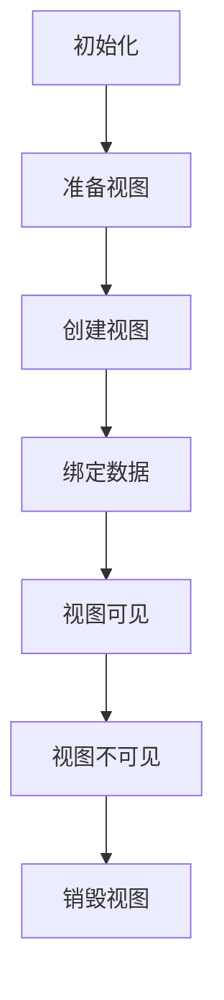
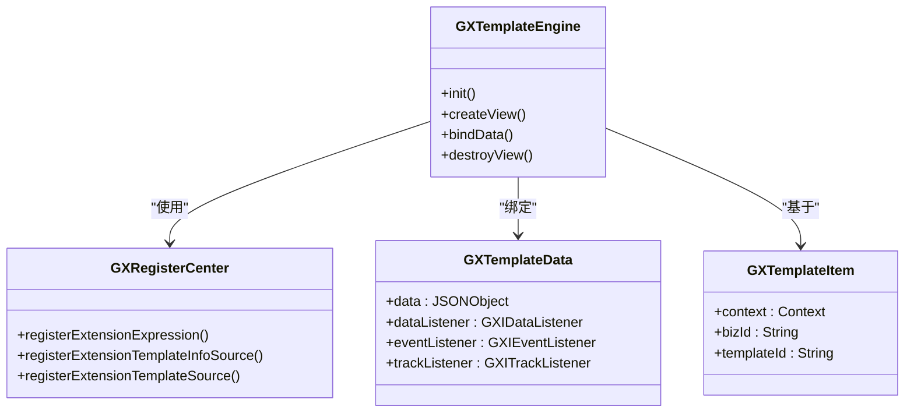
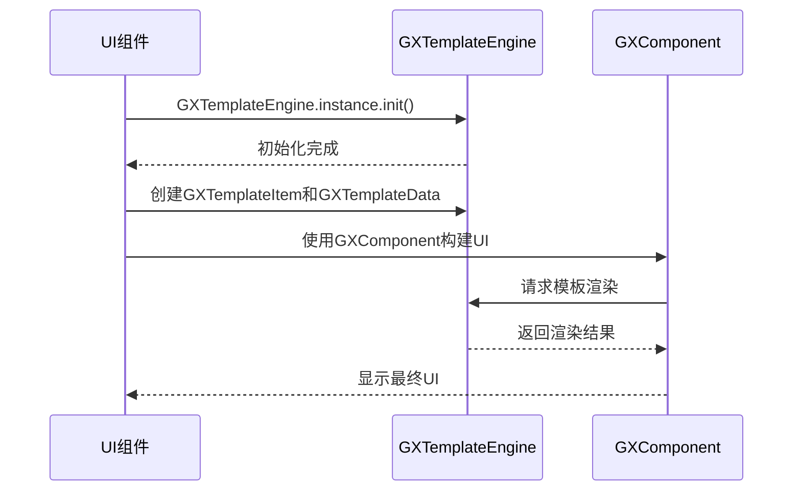

# API参考

<cite>
**本文档中引用的文件**   
- [GXTemplateEngine.kt](file://GaiaXAndroid/src/main/kotlin/com/alibaba/gaiax/GXTemplateEngine.kt)
- [GaiaXiOS.h](file://GaiaXiOS/GaiaXiOS/GaiaXiOS.h)
- [MainPage.ets](file://GaiaXHarmony/GaiaXCore/GaiaX/src/main/ets/components/mainpage/MainPage.ets)
</cite>

## 目录
1. [简介](#简介)
2. [核心API](#核心api)
3. [平台API](#平台api)
4. [扩展API](#扩展api)
5. [使用指南](#使用指南)
6. [错误处理与安全](#错误处理与安全)
7. [版本控制与迁移](#版本控制与迁移)

## 简介
GaiaX框架是一个轻量级的跨平台纯原生动态卡片解决方案，由阿里巴巴优酷技术团队开发。该框架旨在确保原生体验和性能的同时，帮助客户端实现低代码开发。GaiaX提供模板可视化构建工具GaiaStudio、模板示例和实时预览的Demo项目，支持创建模板、编辑模板、真机调试和实时预览。

**Section sources**
- [GXTemplateEngine.kt](file://GaiaXAndroid/src/main/kotlin/com/alibaba/gaiax/GXTemplateEngine.kt#L53-L76)

## 核心API
GaiaX的核心API主要围绕模板引擎的初始化、视图创建和数据绑定等基本操作。

### Android (Kotlin)
在Android平台上，`GXTemplateEngine`类是核心API的入口点，提供了模板渲染和管理的主要功能。

#### GXTemplateEngine 类方法
- **init(context: Context): GXTemplateEngine**  
  SDK初始化方法。  
  **参数**:  
  - `context`: Android上下文  
  **返回值**: GXTemplateEngine实例

- **createView(gxTemplateItem: GXTemplateItem, gxMeasureSize: GXMeasureSize, gxExtendParams: GXExtendParams? = null): View?**  
  根据模板信息和测量尺寸创建模板视图。  
  **参数**:  
  - `gxTemplateItem`: 模板信息，包含模板ID(templateId)和模板业务ID(bizId)  
  - `gxMeasureSize`: 模板测量尺寸，类似于绘图系统的视口，用于确定模板视图的大小  
  - `gxExtendParams`: 扩展参数，可选  
  **返回值**: 由模板生成的视图

- **bindData(gxView: View?, gxTemplateData: GXTemplateData, gxMeasureSize: GXMeasureSize? = null)**  
  绑定模板数据。  
  **参数**:  
  - `gxView`: 根视图  
  - `gxTemplateData`: 模板数据  
  - `gxMeasureSize`: 模板测量尺寸，可选

- **destroyView(targetView: View?)**  
  销毁视图并释放相关资源。  
  **参数**:  
  - `targetView`: 目标视图

- **prepareView(gxTemplateItem: GXTemplateItem, gxMeasureSize: GXMeasureSize, gxVisualTemplateNode: GXTemplateNode? = null)**  
  预准备视图，用于优化性能。  
  **参数**:  
  - `gxTemplateItem`: 模板信息  
  - `gxMeasureSize`: 模板测量尺寸  
  - `gxVisualTemplateNode`: 可视化模板节点，可选

- **getGXTemplateInfo(gxTemplateItem: GXTemplateItem): GXTemplateInfo**  
  获取模板信息。  
  **参数**:  
  - `gxTemplateItem`: 模板信息  
  **返回值**: GXTemplateInfo对象

- **clean()**  
  清理缓存和资源。

**Section sources**
- [GXTemplateEngine.kt](file://GaiaXAndroid/src/main/kotlin/com/alibaba/gaiax/GXTemplateEngine.kt#L889-L905)
- [GXTemplateEngine.kt](file://GaiaXAndroid/src/main/kotlin/com/alibaba/gaiax/GXTemplateEngine.kt#L557-L582)
- [GXTemplateEngine.kt](file://GaiaXAndroid/src/main/kotlin/com/alibaba/gaiax/GXTemplateEngine.kt#L592-L609)
- [GXTemplateEngine.kt](file://GaiaXAndroid/src/main/kotlin/com/alibaba/gaiax/GXTemplateEngine.kt#L626-L629)
- [GXTemplateEngine.kt](file://GaiaXAndroid/src/main/kotlin/com/alibaba/gaiax/GXTemplateEngine.kt#L512-L540)
- [GXTemplateEngine.kt](file://GaiaXAndroid/src/main/kotlin/com/alibaba/gaiax/GXTemplateEngine.kt#L545-L547)
- [GXTemplateEngine.kt](file://GaiaXAndroid/src/main/kotlin/com/alibaba/gaiax/GXTemplateEngine.kt#L916-L919)

### iOS (Objective-C)
在iOS平台上，GaiaX通过Objective-C头文件定义了核心接口。

#### GaiaXiOS.h 接口定义
```objc
#import <GaiaXiOS/GXTemplateEngine.h>
#import <GaiaXiOS/GXRegisterCenter.h>
#import <GaiaXiOS/GXTemplateData.h>
#import <GaiaXiOS/GXTemplateItem.h>

#import <GaiaXiOS/GXLottieAniamtionProtocal.h>
#import <GaiaXiOS/GXTemplateSourceProtocal.h>
#import <GaiaXiOS/GXFunctionExpressionProtocol.h>
#import <GaiaXiOS/GXBizServiceProtocol.h>
#import <GaiaXiOS/GXImageViewProtocal.h>
#import <GaiaXiOS/GXRootViewProtocal.h>

#import <GaiaXiOS/GXTrackProtocal.h>
#import <GaiaXiOS/GXEventProtocal.h>
#import <GaiaXiOS/GXDataProtocal.h>
```

这些导入语句定义了GaiaX框架的主要组件和协议，包括模板引擎、注册中心、模板数据、模板项以及各种功能协议。

**Diagram sources**
- [GaiaXiOS.h](file://GaiaXiOS/GaiaXiOS/GaiaXiOS.h#L30-L55)

### HarmonyOS (ArkTS)
在HarmonyOS平台上，GaiaX通过ArkTS文件提供了核心功能。

#### Index.ets 导出函数
```typescript
export { MainPage } from './src/main/ets/components/mainpage/MainPage'
```

#### MainPage.ets 主要功能
```typescript
@Preview
@Component
export struct MainPage {
  @State message: string = 'Hello World';
  templateItem = new GXTemplateItem('template', 'yk-topic-item', '0')
  templateData = new GXTemplateData();
  measureSize: Size<number> = new Size(NaN, NaN);
  cWidth = 0;

  async aboutToAppear() {
    GXTemplateEngine.instance.init()

    let sWidth = GXContext.shared().screenWidth;
    let sScale = GXContext.shared().screenScale;
    this.message = 'info.width = ' + sWidth;
    const scale = sScale ?? 1;

    this.templateItem = new GXTemplateItem('template', 'template_scroll_multi_type_two_item_show_one_item', '0')
    this.templateData.jsonData = await getJson(getContext().resourceManager, "data/template_scroll_multi_type_two_item_show_one_item.json")

    // size
    this.measureSize = new Size(sWidth / scale, NaN);
    this.cWidth = sWidth / scale;
  }

  build() {
    Column() {
      Text(this.message)
        .backgroundColor('red')
        .margin(12)
        .textAlign(TextAlign.Start)

      GXComponent({
        templateItem: this.templateItem,
        templateData: this.templateData,
        measureSize: this.measureSize
      })
        .backgroundColor('transparent')
    }
    .alignItems(HorizontalAlign.Start)
    .width('100%')
    .backgroundColor('green')
  }
}
```

**Section sources**
- [Index.ets](file://GaiaXHarmony/GaiaXCore/GaiaX/Index.ets#L1-L2)
- [MainPage.ets](file://GaiaXHarmony/GaiaXCore/GaiaX/src/main/ets/components/mainpage/MainPage.ets#L1-L85)

## 平台API
GaiaX为不同平台提供了特定的API，以充分利用各平台的特性。

### Android平台API
Android平台的API主要集中在`GXTemplateEngine`类中，提供了完整的模板生命周期管理。

#### 模板生命周期管理


**Diagram sources**
- [GXTemplateEngine.kt](file://GaiaXAndroid/src/main/kotlin/com/alibaba/gaiax/GXTemplateEngine.kt#L889-L905)
- [GXTemplateEngine.kt](file://GaiaXAndroid/src/main/kotlin/com/alibaba/gaiax/GXTemplateEngine.kt#L512-L540)
- [GXTemplateEngine.kt](file://GaiaXAndroid/src/main/kotlin/com/alibaba/gaiax/GXTemplateEngine.kt#L557-L582)
- [GXTemplateEngine.kt](file://GaiaXAndroid/src/main/kotlin/com/alibaba/gaiax/GXTemplateEngine.kt#L592-L609)
- [GXTemplateEngine.kt](file://GaiaXAndroid/src/main/kotlin/com/alibaba/gaiax/GXTemplateEngine.kt#L866-L873)
- [GXTemplateEngine.kt](file://GaiaXAndroid/src/main/kotlin/com/alibaba/gaiax/GXTemplateEngine.kt#L878-L884)
- [GXTemplateEngine.kt](file://GaiaXAndroid/src/main/kotlin/com/alibaba/gaiax/GXTemplateEngine.kt#L626-L629)

### iOS平台API
iOS平台的API通过Objective-C头文件组织，提供了模块化的接口设计。

#### 模块化接口设计


**Diagram sources**
- [GaiaXiOS.h](file://GaiaXiOS/GaiaXiOS/GaiaXiOS.h#L30-L55)

### HarmonyOS平台API
HarmonyOS平台的API采用ArkTS语法，与HarmonyOS的UI框架深度集成。

#### UI集成示例


**Diagram sources**
- [MainPage.ets](file://GaiaXHarmony/GaiaXCore/GaiaX/src/main/ets/components/mainpage/MainPage.ets#L40-L85)

## 扩展API
GaiaX提供了丰富的扩展API，允许开发者自定义功能。

### Android扩展API
```kotlin
interface GXIAdapter {
    fun init(context: Context)
}

interface GXIEventListener {
    fun onGestureEvent(gxGesture: GXGesture) {}
    fun onScrollEvent(gxScroll: GXScroll) {}
    fun onAnimationEvent(gxAnimation: GXAnimation) {}
}

interface GXITrackListener {
    fun onTrackEvent(gxTrack: GXTrack) {}
    fun onManualClickTrackEvent(gxTrack: GXTrack) {}
    fun onManualExposureTrackEvent(gxTrack: GXTrack) {}
}

interface GXIDataListener {
    fun onTextProcess(gxTextData: GXTextData): CharSequence? = null
}
```

这些接口允许开发者监听手势事件、滚动事件、动画事件、埋点事件和文本处理事件。

**Section sources**
- [GXTemplateEngine.kt](file://GaiaXAndroid/src/main/kotlin/com/alibaba/gaiax/GXTemplateEngine.kt#L96-L94)

### iOS扩展API
iOS平台的扩展API通过协议(Protocol)实现：

```objc
#import <GaiaXiOS/GXLottieAniamtionProtocal.h>
#import <GaiaXiOS/GXTemplateSourceProtocal.h>
#import <GaiaXiOS/GXFunctionExpressionProtocol.h>
#import <GaiaXiOS/GXBizServiceProtocol.h>
#import <GaiaXiOS/GXImageViewProtocal.h>
#import <GaiaXiOS/GXRootViewProtocal.h>

#import <GaiaXiOS/GXTrackProtocal.h>
#import <GaiaXiOS/GXEventProtocal.h>
#import <GaiaXiOS/GXDataProtocal.h>
```

这些协议分别对应Lottie动画、模板源、函数表达式、业务服务、图像视图、根视图、埋点、事件和数据处理等功能。

**Section sources**
- [GaiaXiOS.h](file://GaiaXiOS/GaiaXiOS/GaiaXiOS.h#L35-L44)

## 使用指南
本节提供GaiaX框架的基本使用指南和高级技术细节。

### 基本使用示例
```kotlin
// 初始化GXTemplateEngine
GXTemplateEngine.instance.init(activity)

// 构建模板参数
val params = GXTemplateEngine.GXTemplateItem(activity, "template biz", "template id")

// 构建测量尺寸
val size = GXTemplateEngine.GXMeasureSize(screenWidth, null)

// 构建模板数据
val templateData = GXTemplateEngine.GXTemplateData(jsonData)

// 创建视图
val view = GXTemplateEngine.instance.createView(params, size)

// 更新数据
GXTemplateEngine.instance.bindData(view, templateData)

// 注入视图到容器
findViewById<LinearLayoutCompat>(R.id.xxx).addView(view, 0)
```

**Section sources**
- [GXTemplateEngine.kt](file://GaiaXAndroid/src/main/kotlin/com/alibaba/gaiax/GXTemplateEngine.kt#L63-L76)

### 高级技术细节
#### GXMeasureSize说明
`GXMeasureSize`是一个限制性概念，它规定的是GaiaX模板内容的最大显示区域，并且是非必传的。有三种使用情况：

1. **固定的MeasureSize-Width和固定的MeasureSize-Height**  
   如果内部的模板超出了宽度和高度，那么内容不会被显示，最终产物View就是MeasureSize-Width和MeasureSize-height。

2. **固定的MeasureSize-Width，不确定的MeasureSize-Height（不传入）**  
   如果内部的模板实际宽度超出了MeasureSize-width，那么超出的部分不会被显示；如果内部模板的高度能够自我撑开（具备高度）；最终产物View的宽度就是MeasureSize-Width，而高度就是模板通过FlexBox计算后撑开的高度。

3. **不确定的MeasureSize-Width（不传入），确定的MeasureSize-Height**  
   这种情况下，如果内部的模板实际高度超出了MeasureSize-height，那么超出的部分不会被显示；如果内部模板的宽度能够自我撑开（具备宽度）；最终产物View的宽度就是是模板通过FlexBox计算后撑开的宽度，而高度就是Measure-Height。

**Section sources**
- [GXTemplateEngine.kt](file://GaiaXAndroid/src/main/kotlin/com/alibaba/gaiax/GXTemplateEngine.kt#L353-L368)

## 错误处理与安全
本节介绍GaiaX框架的错误处理策略、安全考虑、速率限制和版本控制信息。

### 错误处理策略
GaiaX框架在关键方法中使用了异常处理机制：

```kotlin
fun createView(
    gxTemplateItem: GXTemplateItem,
    gxMeasureSize: GXMeasureSize,
    gxExtendParams: GXExtendParams? = null
): View? {
    Log.runE(TAG) { "createView" }
    return try {
        prepareView(gxTemplateItem, gxMeasureSize)

        val gxTemplateContext = createViewOnlyNodeTree(
            gxTemplateItem, gxMeasureSize, gxExtendParams
        )
        if (gxTemplateContext != null) {
            createViewOnlyViewTree(gxTemplateContext)
        } else {
            null
        }
    } catch (e: Exception) {
        if (GXExceptionHelper.isException()) {
            GXExceptionHelper.exception(e)
            null
        } else {
            throw e
        }
    }
}
```

这种模式确保了在发生异常时，框架可以选择性地处理异常或将其向上抛出，取决于配置。

**Section sources**
- [GXTemplateEngine.kt](file://GaiaXAndroid/src/main/kotlin/com/alibaba/gaiax/GXTemplateEngine.kt#L557-L582)

### 安全考虑
GaiaX框架在设计时考虑了以下安全因素：
- 使用`applicationContext`而不是直接的Activity上下文，避免内存泄漏
- 通过`GXRegisterCenter`集中管理扩展功能，确保安全的插件机制
- 提供了数据监听器接口，允许在数据绑定前进行安全检查

## 版本控制与迁移
本节提供迁移指南和向后兼容性说明，确保开发者能够顺利升级。

### 版本控制
GaiaX框架通过语义化版本控制管理API变更：
- 主版本号变更表示不兼容的API变更
- 次版本号变更表示向后兼容的功能新增
- 修订号变更表示向后兼容的问题修正

### 迁移指南
当升级GaiaX框架时，请注意以下事项：
1. 检查`GXTemplateItem`类的`templateVersion`字段，虽然目前未使用，但未来可能用于版本兼容性检查
2. 确保`GXTemplateEngine.instance`的单例模式在升级后仍然正常工作
3. 验证所有扩展适配器（如`GXAdapter`）的兼容性

**Section sources**
- [GXTemplateEngine.kt](file://GaiaXAndroid/src/main/kotlin/com/alibaba/gaiax/GXTemplateEngine.kt#L440-L443)
- [GXTemplateEngine.kt](file://GaiaXAndroid/src/main/kotlin/com/alibaba/gaiax/GXTemplateEngine.kt#L923-L925)