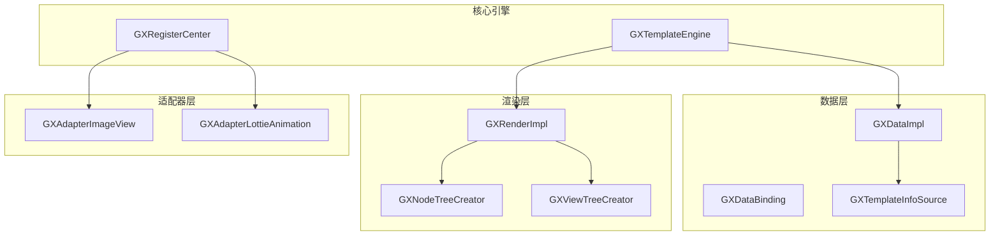
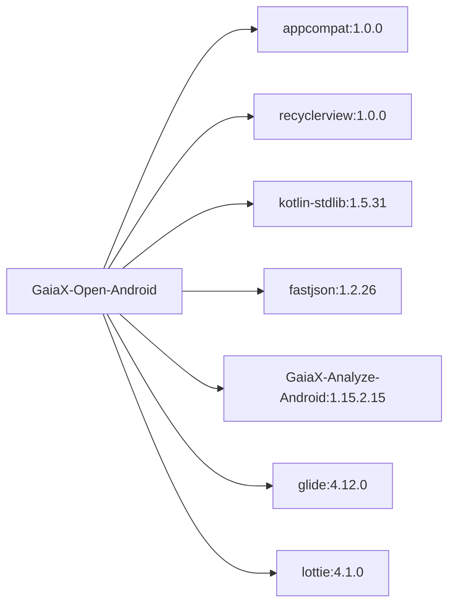

# Android API

<cite>
**本文档中引用的文件**   
- [GXTemplateEngine.kt](file://GaiaXAndroid/src/main/kotlin/com/alibaba/gaiax/GXTemplateEngine.kt)
- [GXDataImpl.kt](file://GaiaXAndroid/src/main/kotlin/com/alibaba/gaiax/data/GXDataImpl.kt)
- [GXDataBinding.kt](file://GaiaXAndroid/src/main/kotlin/com/alibaba/gaiax/template/GXDataBinding.kt)
- [GXRenderImpl.kt](file://GaiaXAndroid/src/main/kotlin/com/alibaba/gaiax/render/GXRenderImpl.kt)
- [GXAdapterImageView.kt](file://GaiaXAndroidAdapter/src/main/java/com/alibaba/gaiax/adapter/GXAdapterImageView.kt)
- [GXAdapterLottieAnimation.kt](file://GaiaXAndroidAdapter/src/main/java/com/alibaba/gaiax/adapter/GXAdapterLottieAnimation.kt)
- [build.gradle](file://GaiaXAndroid/build.gradle)
- [AndroidManifest.xml](file://GaiaXAndroid/src/main/AndroidManifest.xml)
</cite>

## 目录
1. [简介](#简介)
2. [项目结构](#项目结构)
3. [核心组件](#核心组件)
4. [架构概述](#架构概述)
5. [详细组件分析](#详细组件分析)
6. [依赖分析](#依赖分析)
7. [性能考虑](#性能考虑)
8. [故障排除指南](#故障排除指南)
9. [结论](#结论)

## 简介
GaiaX 是阿里巴巴优酷技术团队开发的轻量级跨平台纯原生动态卡片解决方案。该引擎旨在确保原生体验和性能的同时，帮助客户端实现低代码开发。除了客户端 SDK，还提供了模板可视化构建工具 GaiaStudio 和演示项目，支持创建模板、编辑模板、真机调试和实时预览。

## 项目结构
项目结构遵循标准的 Android 库模块组织方式，主要包含核心引擎、数据处理、渲染实现和适配器扩展等模块。核心功能集中在 GaiaXAndroid 模块中，而特定功能扩展则分布在独立的适配器模块中。

## 核心组件

### GXTemplateEngine 类
GXTemplateEngine 是 GaiaX 引擎的核心类，负责模板的初始化、视图创建、数据绑定和销毁等关键操作。

**初始化 (init)**
- 通过 `GXTemplateEngine.instance.init(context)` 方法进行初始化
- 需要传入 Android Context 对象
- 初始化过程会设置全局上下文并准备必要的资源

**创建视图 (create)**
- 使用 `createView(GXTemplateItem, GXMeasureSize)` 方法创建模板视图
- GXTemplateItem 包含模板业务ID(bizId)和模板ID(templateId)
- GXMeasureSize 定义模板的最大显示区域
- 返回创建的 View 对象，可用于添加到布局容器中

**绑定数据 (bindData)**
- 通过 `bindData(View, GXTemplateData)` 方法将数据绑定到已创建的视图
- GXTemplateData 包含需要绑定的 JSON 数据
- 支持事件监听器和数据处理监听器的设置
- 在数据更新时调用以刷新界面

**更新 (update)**
- 通过再次调用 `bindData` 方法实现视图更新
- 引擎会自动处理数据差异并更新相应的 UI 元素
- 支持 measure size 变化时的重新计算和布局调整

**销毁 (destroy)**
- 使用 `destroyView(View)` 方法销毁模板视图
- 释放相关资源，防止内存泄漏
- 清除模板上下文和缓存数据

**异常处理**
- 所有方法都包含异常捕获机制
- 当 `GXExceptionHelper.isException()` 为 true 时，会通过 `GXExceptionHelper.exception(e)` 处理异常
- 否则会抛出原始异常，便于调试

**Section sources**
- [GXTemplateEngine.kt](file://GaiaXAndroid/src/main/kotlin/com/alibaba/gaiax/GXTemplateEngine.kt#L78-L830)

### GXDataImpl 和 GXDataBinding
GXDataImpl 负责模板信息的获取和管理，通过模板项(GXTemplateItem)从注册中心获取模板信息源。GXDataBinding 则处理模板中的数据绑定逻辑，支持值、占位符、无障碍描述等属性的表达式计算。

**GXDataImpl 作用**
- 作为数据层实现，管理模板信息的获取
- 通过 `getTemplateInfo` 方法获取模板信息
- 支持优先级队列管理多个数据源

**GXDataBinding 作用**
- 处理节点级别的数据绑定
- 支持多种绑定类型：value、placeholder、accessibilityDesc 等
- 通过表达式工厂计算绑定值
- 返回包含所有绑定结果的 JSONObject

**Section sources**
- [GXDataImpl.kt](file://GaiaXAndroid/src/main/kotlin/com/alibaba/gaiax/data/GXDataImpl.kt#L29-L168)
- [GXDataBinding.kt](file://GaiaXAndroid/src/main/kotlin/com/alibaba/gaiax/template/GXDataBinding.kt#L27-L106)

### GXRenderImpl 渲染流程
GXRenderImpl 类负责视图的渲染流程，包括准备视图、创建节点树、创建视图树和数据绑定等阶段。

**渲染流程**
1. prepareView：准备视图，创建布局缓存
2. createViewOnlyNodeTree：创建虚拟节点树
3. createViewOnlyViewTree：基于节点树创建实际视图
4. bindViewDataOnlyNodeTree：绑定数据到节点树
5. bindViewDataOnlyViewTree：更新视图树

**关键方法**
- prepareView：为模板创建准备视图，计算并缓存布局
- createViewOnlyNodeTree：创建虚拟节点树，用于布局计算
- createViewOnlyViewTree：创建实际的视图层次结构
- bindViewDataOnlyNodeTree：更新节点树的数据和布局
- bindViewDataOnlyViewTree：更新视图树的样式和数据

**Section sources**
- [GXRenderImpl.kt](file://GaiaXAndroid/src/main/kotlin/com/alibaba/gaiax/render/GXRenderImpl.kt#L35-L105)

## 架构概述

**Diagram sources**
- [GXTemplateEngine.kt](file://GaiaXAndroid/src/main/kotlin/com/alibaba/gaiax/GXTemplateEngine.kt)
- [GXDataImpl.kt](file://GaiaXAndroid/src/main/kotlin/com/alibaba/gaiax/data/GXDataImpl.kt)
- [GXRenderImpl.kt](file://GaiaXAndroid/src/main/kotlin/com/alibaba/gaiax/render/GXRenderImpl.kt)

## 详细组件分析

### GXAdapter 系列适配器

#### GXAdapterImageView
GXAdapterImageView 是图像视图适配器，负责处理网络图片的加载和显示。

**使用方法**
- 继承自 GXImageView
- 使用 Glide 进行图片加载
- 支持占位图和加载监听
- 自动管理图片加载请求

**扩展点**
- 可以重写 `bindNetUri` 方法自定义图片加载逻辑
- 支持通过 RequestListener 监听加载状态
- 可以扩展支持其他图片格式或加载库

**Section sources**
- [GXAdapterImageView.kt](file://GaiaXAndroidAdapter/src/main/java/com/alibaba/gaiax/adapter/GXAdapterImageView.kt#L31-L79)

#### GXAdapterLottieAnimation
GXAdapterLottieAnimation 是 Lottie 动画适配器，负责处理 Lottie 动画的播放和控制。

**使用方法**
- 支持本地和远程 Lottie 文件播放
- 自动管理动画资源和监听器
- 支持循环播放和动画事件回调
- 处理动画加载和播放状态

**扩展点**
- 可以扩展支持更多动画格式
- 可以添加自定义动画效果
- 支持动画参数的动态配置

**Section sources**
- [GXAdapterLottieAnimation.kt](file://GaiaXAndroidAdapter/src/main/java/com/alibaba/gaiax/adapter/GXAdapterLottieAnimation.kt#L31-L207)

## 依赖分析

**Diagram sources**
- [build.gradle](file://GaiaXAndroid/build.gradle#L114-L134)

## 性能考虑
- 使用布局缓存减少重复计算
- 支持 measure size 变化时的增量更新
- 通过虚拟节点树优化布局性能
- 提供 trace 支持用于性能分析
- 支持视图复用以提高滚动性能

## 故障排除指南
- **内存泄漏防范**：确保在适当时候调用 destroyView 释放资源
- **线程调度**：所有 UI 操作都在主线程执行，异步任务通过回调处理
- **性能监控**：启用 trace 功能监控关键方法执行时间
- **常见问题**：检查模板数据格式是否正确，确保适配器已正确注册

**Section sources**
- [GXTemplateEngine.kt](file://GaiaXAndroid/src/main/kotlin/com/alibaba/gaiax/GXTemplateEngine.kt)
- [GXRenderImpl.kt](file://GaiaXAndroid/src/main/kotlin/com/alibaba/gaiax/render/GXRenderImpl.kt)

## 结论
GaiaX 提供了一套完整的动态模板解决方案，通过清晰的架构设计和模块化实现，支持高效的模板渲染和数据绑定。开发者可以根据需求进行定制扩展，同时享受原生性能和体验。