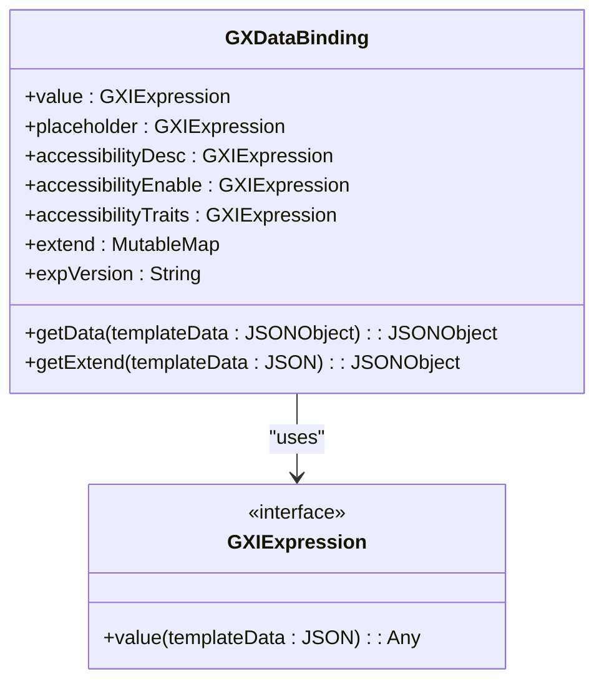
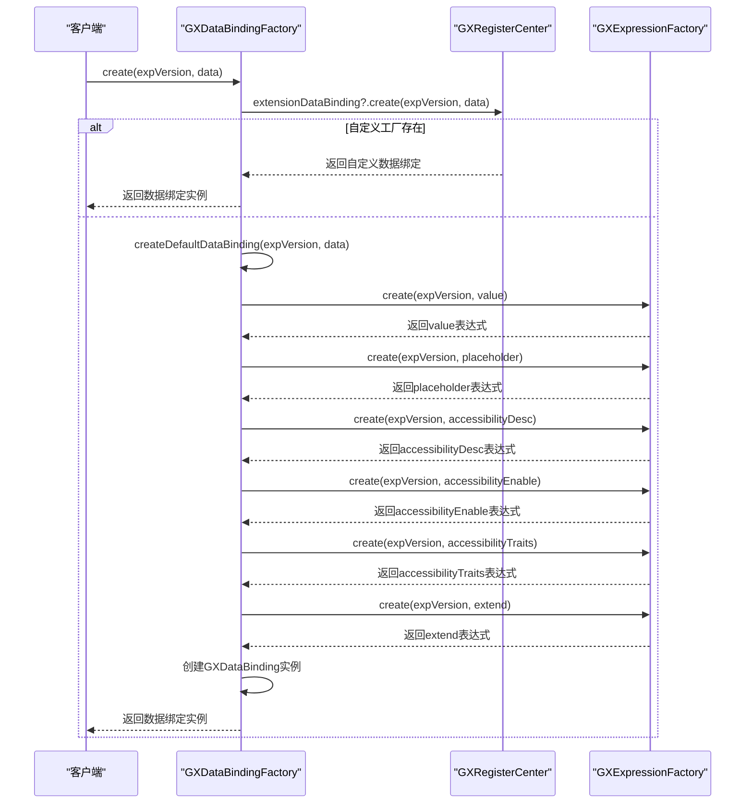

# 数据处理

<cite>
**本文档引用文件**   
- [GXDataImpl.kt](file://GaiaXAndroid/src/main/kotlin/com/alibaba/gaiax/data/GXDataImpl.kt)
- [GXDataBinding.kt](file://GaiaXAndroid/src/main/kotlin/com/alibaba/gaiax/template/GXDataBinding.kt)
- [GXDataBindingFactory.kt](file://GaiaXAndroid/src/main/kotlin/com/alibaba/gaiax/template/factory/GXDataBindingFactory.kt)
- [GXTemplateKey.kt](file://GaiaXAndroid/src/main/kotlin/com/alibaba/gaiax/template/GXTemplateKey.kt)
- [GXExpressionFactory.kt](file://GaiaXAndroid/src/main/kotlin/com/alibaba/gaiax/template/factory/GXExpressionFactory.kt)
</cite>

## 目录
1. [简介](#简介)
2. [数据解析流程](#数据解析流程)
3. [数据绑定机制](#数据绑定机制)
4. [数据绑定表达式语法](#数据绑定表达式语法)
5. [作用域管理与动态更新](#作用域管理与动态更新)
6. [GXDataBindingFactory 创建过程](#gxdatabindingfactory-创建过程)
7. [复杂数据结构绑定](#复杂数据结构绑定)
8. [数据变更通知与局部刷新](#数据变更通知与局部刷新)
9. [数据校验与错误恢复](#数据校验与错误恢复)

## 简介
本文档详细解析 GaiaX Android 平台中数据处理模块的核心机制，重点阐述 GXDataImpl 的数据解析流程和 GXDataBinding 的数据绑定机制。文档涵盖数据绑定表达式的语法格式、作用域管理、动态更新策略，以及 GXDataBindingFactory 的创建过程和扩展点。同时提供复杂数据结构（嵌套对象、数组）绑定的实现方法，数据变更通知和局部刷新机制，以及数据校验、默认值处理和错误恢复机制。

## 数据解析流程

GXDataImpl 类是 GaiaX 框架中负责数据解析的核心组件，它通过 GXTemplateInfoSource 和 GXTemplateSource 两个内部类来管理和获取模板信息和模板数据。该类通过优先级队列（PriorityQueue）管理多个数据源，确保高优先级的数据源优先被访问。当需要获取模板信息时，系统会按照优先级顺序遍历所有注册的数据源，直到找到匹配的模板信息为止。如果未找到匹配的数据源，则会抛出 IllegalArgumentException 异常。

**Section sources**
- [GXDataImpl.kt](file://GaiaXAndroid/src/main/kotlin/com/alibaba/gaiax/data/GXDataImpl.kt#L29-L167)

## 数据绑定机制

GXDataBinding 类是 GaiaX 框架中实现数据绑定的核心类，它定义了数据绑定的各种属性，包括 value、placeholder、accessibilityDesc、accessibilityEnable、accessibilityTraits 和 extend。这些属性通过 GXIExpression 接口进行表达式解析，最终生成可用于渲染的数据。GXDataBinding 类提供了 getData 和 getExtend 两个核心方法，分别用于获取数据绑定的计算结果和扩展数据。

**Diagram sources **
- [GXDataBinding.kt](file://GaiaXAndroid/src/main/kotlin/com/alibaba/gaiax/template/GXDataBinding.kt#L27-L105)

**Section sources**
- [GXDataBinding.kt](file://GaiaXAndroid/src/main/kotlin/com/alibaba/gaiax/template/GXDataBinding.kt#L27-L105)

## 数据绑定表达式语法

数据绑定表达式语法基于 GXTemplateKey 定义的常量，支持多种数据类型和操作符。表达式可以引用模板中的数据字段，如 GAIAX_VALUE、GAIAX_PLACEHOLDER、GAIAX_ACCESSIBILITY_DESC 等。表达式还可以包含条件判断、逻辑运算和算术运算等操作。例如，可以通过 ${value} 的形式引用数据字段，通过 ${value ? 'true' : 'false'} 的形式进行条件判断。

**Section sources**
- [GXTemplateKey.kt](file://GaiaXAndroid/src/main/kotlin/com/alibaba/gaiax/template/GXTemplateKey.kt#L375-L380)

## 作用域管理与动态更新

GXDataBinding 通过 expVersion 属性管理表达式的版本，确保在不同版本的模板中能够正确解析数据绑定表达式。当模板数据发生变化时，系统会自动触发数据绑定的重新计算，实现动态更新。此外，GXDataBinding 还支持嵌套模板的数据传递，通过 visualTemplateNode 的 getDataValue 方法将父模板的数据传递给子模板。

**Section sources**
- [GXDataBinding.kt](file://GaiaXAndroid/src/main/kotlin/com/alibaba/gaiax/template/GXDataBinding.kt#L36-L36)
- [GXNodeTreeUpdate.kt](file://GaiaXAndroid/src/main/kotlin/com/alibaba/gaiax/render/node/GXNodeTreeUpdate.kt#L203-L238)

## GXDataBindingFactory 创建过程

GXDataBindingFactory 是一个单例对象，负责创建 GXDataBinding 实例。它首先尝试通过 GXRegisterCenter 获取自定义的数据绑定工厂，如果存在则使用自定义工厂创建数据绑定实例；否则，使用默认的 createDefaultDataBinding 方法创建数据绑定实例。createDefaultDataBinding 方法会解析传入的数据对象，提取出 value、placeholder、accessibilityDesc、accessibilityEnable、accessibilityTraits 和 extend 等字段，并通过 GXExpressionFactory 创建相应的 GXIExpression 实例。

**Diagram sources **
- [GXDataBindingFactory.kt](file://GaiaXAndroid/src/main/kotlin/com/alibaba/gaiax/template/factory/GXDataBindingFactory.kt#L8-L74)

**Section sources**
- [GXDataBindingFactory.kt](file://GaiaXAndroid/src/main/kotlin/com/alibaba/gaiax/template/factory/GXDataBindingFactory.kt#L8-L74)

## 复杂数据结构绑定

对于复杂数据结构（如嵌套对象、数组），GXDataBinding 提供了灵活的绑定机制。通过 extend 字段，可以将复杂的 JSON 对象直接绑定到视图组件上。在 getExtend 方法中，系统会遍历 extend 字段中的所有键值对，递归地解析每个值，并将其添加到结果 JSON 对象中。这种方式使得开发者可以轻松地处理复杂的嵌套数据结构。

**Section sources**
- [GXDataBinding.kt](file://GaiaXAndroid/src/main/kotlin/com/alibaba/gaiax/template/GXDataBinding.kt#L90-L104)

## 数据变更通知与局部刷新

当模板数据发生变更时，系统会通过 GXNodeTreeUpdate 类的 nodeViewData 方法触发数据绑定的重新计算。该方法会检查 GXNode 的 dataBinding 是否存在，如果存在则调用相应的绑定方法（如 bindText、bindImage 等）更新视图组件的数据。通过这种方式，系统实现了数据变更的自动通知和局部刷新，提高了应用的性能和用户体验。

**Section sources**
- [GXNodeTreeUpdate.kt](file://GaiaXAndroid/src/main/kotlin/com/alibaba/gaiax/render/node/GXNodeTreeUpdate.kt#L960-L991)

## 数据校验与错误恢复

GXDataBinding 在解析数据绑定表达式时，会对输入数据进行严格的校验。如果数据类型不匹配或表达式语法错误，系统会返回 null 或抛出异常。为了提高系统的健壮性，GXDataBinding 还提供了默认值处理机制。当某个字段的值为 null 时，系统会使用默认值代替，避免因数据缺失导致应用崩溃。此外，GXDataBinding 还支持错误恢复机制，当解析失败时，系统会尝试使用备用方案继续执行，确保应用的正常运行。

**Section sources**
- [GXDataBinding.kt](file://GaiaXAndroid/src/main/kotlin/com/alibaba/gaiax/template/GXDataBinding.kt#L47-L88)
- [GXExpressionFactory.kt](file://GaiaXAndroid/src/main/kotlin/com/alibaba/gaiax/template/factory/GXExpressionFactory.kt#L25-L45)