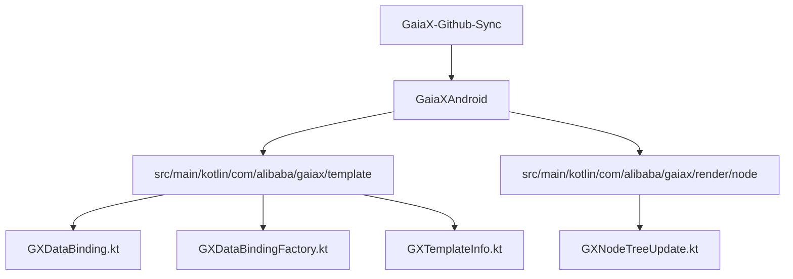
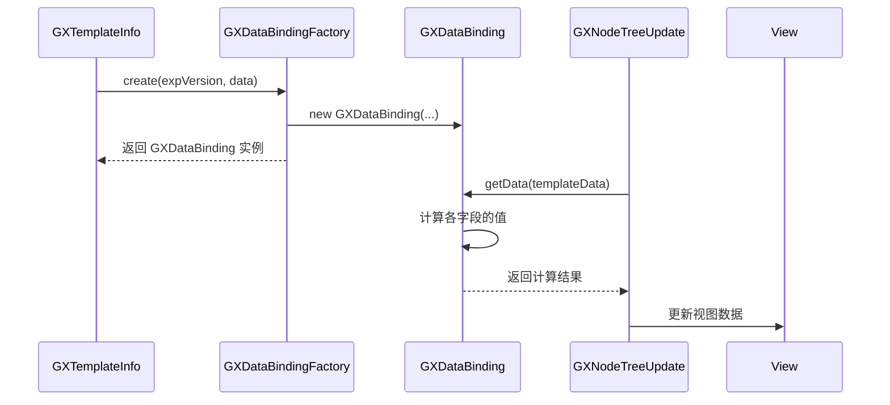
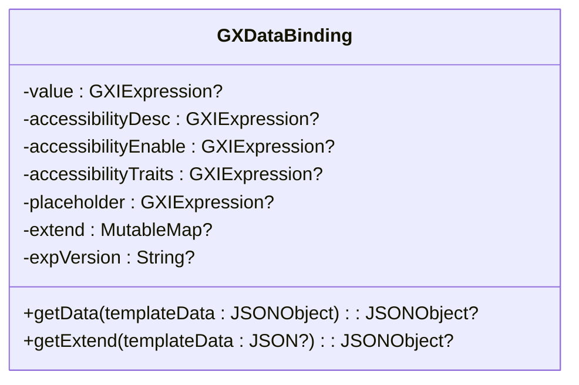
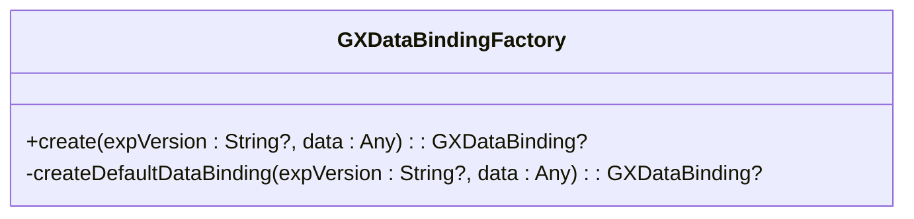
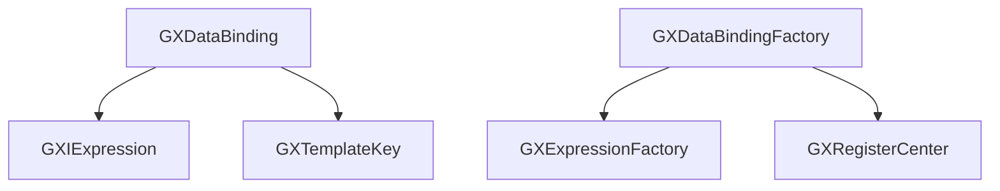

# 数据绑定

<cite>
**本文档引用的文件**
- [GXDataBinding.kt](file://GaiaXAndroid/src/main/kotlin/com/alibaba/gaiax/template/GXDataBinding.kt)
- [GXDataBindingFactory.kt](file://GaiaXAndroid/src/main/kotlin/com/alibaba/gaiax/template/factory/GXDataBindingFactory.kt)
- [GXTemplateInfo.kt](file://GaiaXAndroid/src/main/kotlin/com/alibaba/gaiax/template/GXTemplateInfo.kt)
- [GXNodeTreeUpdate.kt](file://GaiaXAndroid/src/main/kotlin/com/alibaba/gaiax/render/node/GXNodeTreeUpdate.kt)
</cite>

## 目录
1. [简介](#简介)
2. [项目结构](#项目结构)
3. [核心组件](#核心组件)
4. [架构概述](#架构概述)
5. [详细组件分析](#详细组件分析)
6. [依赖分析](#依赖分析)
7. [性能考虑](#性能考虑)
8. [故障排除指南](#故障排除指南)
9. [结论](#结论)

## 简介
本文档详细解析了 GaiaX 框架中 Android 平台的数据绑定机制，重点分析了 GXDataBinding 类的实现原理。文档涵盖了数据绑定表达式的语法格式、作用域管理、动态更新策略，以及 GXDataBindingFactory 的创建过程和扩展点。同时，文档还提供了复杂数据结构绑定、数据变更通知、局部刷新、数据校验、默认值处理和错误恢复机制的详细说明。

## 项目结构
GaiaX 项目是一个多平台的 UI 框架，包含 Android、iOS、HarmonyOS 等多个平台的实现。数据绑定的核心逻辑主要位于 `GaiaXAndroid` 模块中，具体在 `com.alibaba.gaiax.template` 包下。

**图示来源**
- [GXDataBinding.kt](file://GaiaXAndroid/src/main/kotlin/com/alibaba/gaiax/template/GXDataBinding.kt)
- [GXDataBindingFactory.kt](file://GaiaXAndroid/src/main/kotlin/com/alibaba/gaiax/template/factory/GXDataBindingFactory.kt)
- [GXTemplateInfo.kt](file://GaiaXAndroid/src/main/kotlin/com/alibaba/gaiax/template/GXTemplateInfo.kt)
- [GXNodeTreeUpdate.kt](file://GaiaXAndroid/src/main/kotlin/com/alibaba/gaiax/render/node/GXNodeTreeUpdate.kt)

**本节来源**
- [GXDataBinding.kt](file://GaiaXAndroid/src/main/kotlin/com/alibaba/gaiax/template/GXDataBinding.kt)
- [GXDataBindingFactory.kt](file://GaiaXAndroid/src/main/kotlin/com/alibaba/gaiax/template/factory/GXDataBindingFactory.kt)

## 核心组件
数据绑定机制的核心组件包括 `GXDataBinding` 类和 `GXDataBindingFactory` 工厂类。`GXDataBinding` 类负责定义数据绑定的结构和获取绑定数据，而 `GXDataBindingFactory` 负责根据模板数据创建 `GXDataBinding` 实例。

**本节来源**
- [GXDataBinding.kt](file://GaiaXAndroid/src/main/kotlin/com/alibaba/gaiax/template/GXDataBinding.kt)
- [GXDataBindingFactory.kt](file://GaiaXAndroid/src/main/kotlin/com/alibaba/gaiax/template/factory/GXDataBindingFactory.kt)

## 架构概述
数据绑定的流程如下：首先，`GXTemplateInfo` 在解析模板时，会调用 `GXDataBindingFactory.create` 方法，根据模板中的数据绑定配置创建 `GXDataBinding` 对象。然后，在渲染阶段，`GXNodeTreeUpdate` 会调用 `GXDataBinding.getData` 方法，传入当前的模板数据，计算出最终需要绑定到视图上的数据，并更新视图。

**图示来源**
- [GXTemplateInfo.kt](file://GaiaXAndroid/src/main/kotlin/com/alibaba/gaiax/template/GXTemplateInfo.kt#L280-L321)
- [GXDataBindingFactory.kt](file://GaiaXAndroid/src/main/kotlin/com/alibaba/gaiax/template/factory/GXDataBindingFactory.kt)
- [GXDataBinding.kt](file://GaiaXAndroid/src/main/kotlin/com/alibaba/gaiax/template/GXDataBinding.kt#L48-L88)
- [GXNodeTreeUpdate.kt](file://GaiaXAndroid/src/main/kotlin/com/alibaba/gaiax/render/node/GXNodeTreeUpdate.kt#L953-L984)

## 详细组件分析

### GXDataBinding 类分析
`GXDataBinding` 类是数据绑定的核心数据结构，它持有了多个 `GXIExpression` 表达式，这些表达式定义了如何从模板数据中提取最终的视图属性值。

**图示来源**
- [GXDataBinding.kt](file://GaiaXAndroid/src/main/kotlin/com/alibaba/gaiax/template/GXDataBinding.kt)

#### 数据绑定表达式语法
数据绑定表达式支持多种语法格式，主要包括：
- **取值表达式**：`${data}`，用于直接获取数据。
- **文本表达式**：`text + ${data}` 或 `${data} + text`，用于拼接文本和数据。
- **三元表达式**：`@{ ${data} ? b : c }`，用于条件判断。

**本节来源**
- [GXDataBinding.kt](file://GaiaXAndroid/src/main/kotlin/com/alibaba/gaiax/template/GXDataBinding.kt)
- [GaiaXYKExpression.kt](file://GaiaXAndroidDemo/app/src/main/kotlin/com/alibaba/gaiax/demo/utils/GaiaXYKExpression.kt)

#### 作用域与动态更新
`GXDataBinding` 的作用域由传入的 `templateData` 决定。当数据发生变化时，通过重新调用 `getData` 方法，可以动态地重新计算绑定值，实现视图的局部刷新。

**本节来源**
- [GXDataBinding.kt](file://GaiaXAndroid/src/main/kotlin/com/alibaba/gaiax/template/GXDataBinding.kt#L48-L88)
- [GXNodeTreeUpdate.kt](file://GaiaXAndroid/src/main/kotlin/com/alibaba/gaiax/render/node/GXNodeTreeUpdate.kt#L953-L984)

### GXDataBindingFactory 类分析
`GXDataBindingFactory` 是一个工厂对象，负责创建 `GXDataBinding` 实例。它首先尝试通过扩展点创建，如果失败，则使用默认的创建逻辑。

**图示来源**
- [GXDataBindingFactory.kt](file://GaiaXAndroid/src/main/kotlin/com/alibaba/gaiax/template/factory/GXDataBindingFactory.kt)

#### 自定义绑定规则
通过 `GXRegisterCenter.instance.extensionDataBinding`，可以注册自定义的 `GXDataBinding` 创建逻辑，从而实现自定义的绑定规则。

**本节来源**
- [GXDataBindingFactory.kt](file://GaiaXAndroid/src/main/kotlin/com/alibaba/gaiax/template/factory/GXDataBindingFactory.kt#L11-L15)

## 依赖分析
`GXDataBinding` 机制依赖于 `GXIExpression` 接口来执行表达式计算，并依赖于 `GXTemplateKey` 来定义数据绑定的键名。`GXDataBindingFactory` 依赖于 `GXExpressionFactory` 来创建表达式实例。

**图示来源**
- [GXDataBinding.kt](file://GaiaXAndroid/src/main/kotlin/com/alibaba/gaiax/template/GXDataBinding.kt)
- [GXDataBindingFactory.kt](file://GaiaXAndroid/src/main/kotlin/com/alibaba/gaiax/template/factory/GXDataBindingFactory.kt)

**本节来源**
- [GXDataBinding.kt](file://GaiaXAndroid/src/main/kotlin/com/alibaba/gaiax/template/GXDataBinding.kt)
- [GXDataBindingFactory.kt](file://GaiaXAndroid/src/main/kotlin/com/alibaba/gaiax/template/factory/GXDataBindingFactory.kt)

## 性能考虑
数据绑定的性能主要取决于表达式计算的复杂度。建议避免在表达式中进行复杂的计算或循环，以保证渲染性能。同时，合理的局部刷新策略可以减少不必要的视图更新。

## 故障排除指南
- **数据未更新**：检查 `templateData` 是否正确传递，以及 `getData` 方法是否被正确调用。
- **表达式解析错误**：检查表达式语法是否正确，确保符合支持的格式。
- **自定义绑定规则未生效**：检查是否正确注册了 `extensionDataBinding` 扩展点。

**本节来源**
- [GXDataBinding.kt](file://GaiaXAndroid/src/main/kotlin/com/alibaba/gaiax/template/GXDataBinding.kt)
- [GXDataBindingFactory.kt](file://GaiaXAndroid/src/main/kotlin/com/alibaba/gaiax/template/factory/GXDataBindingFactory.kt)

## 结论
GaiaX 的数据绑定机制通过 `GXDataBinding` 和 `GXDataBindingFactory` 提供了灵活且强大的数据绑定能力。通过理解其内部实现和使用方法，开发者可以高效地实现复杂的数据驱动 UI。