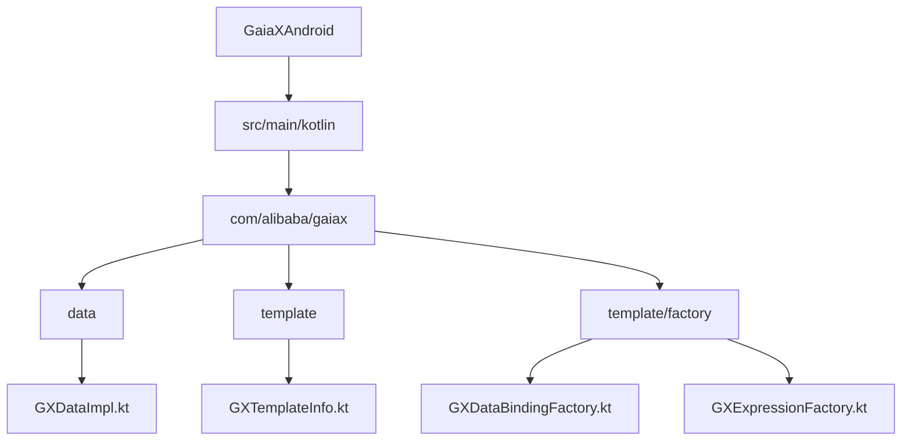
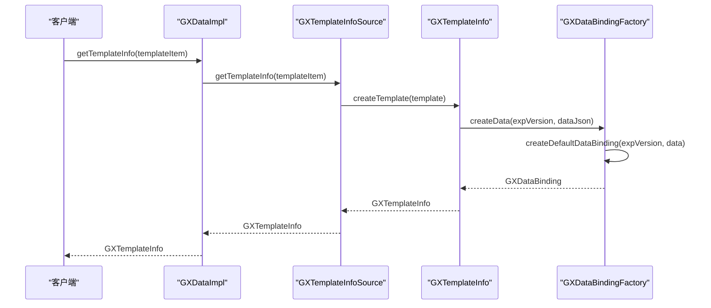
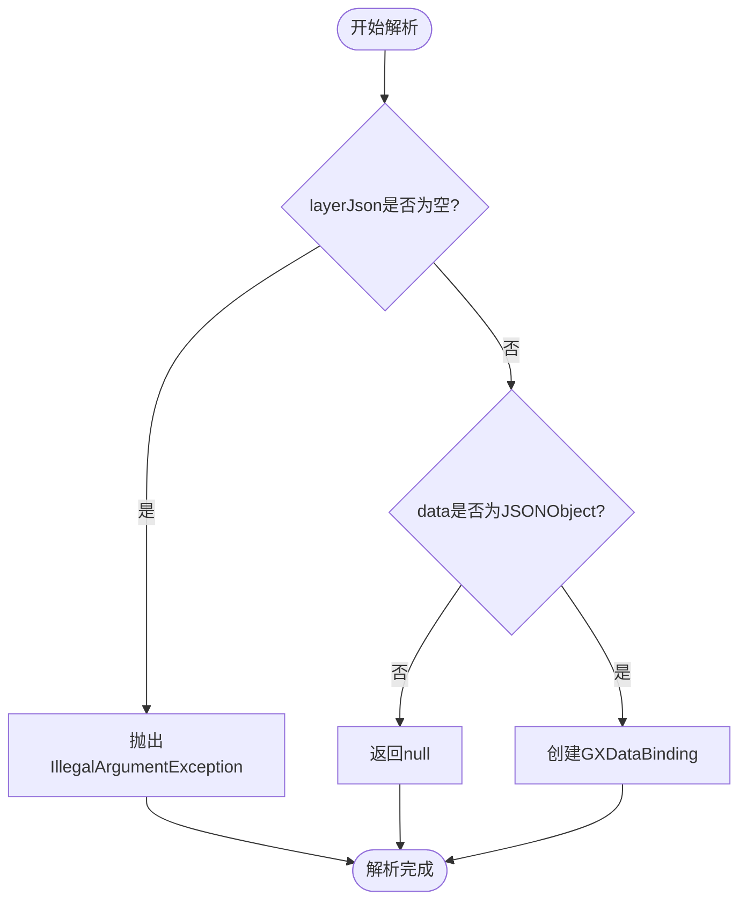
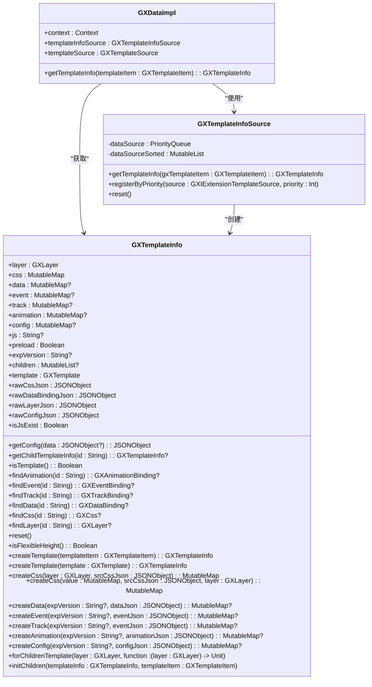
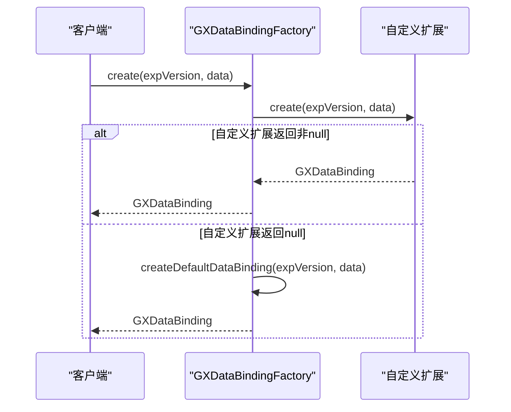
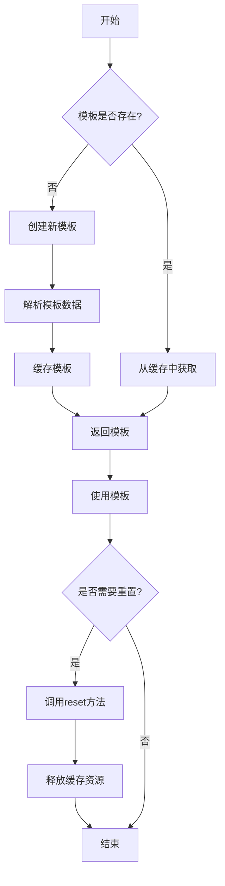

# 数据解析

<cite>
**本文档引用的文件**   
- [GXDataImpl.kt](file://GaiaXAndroid/src/main/kotlin/com/alibaba/gaiax/data/GXDataImpl.kt)
- [GXTemplateInfo.kt](file://GaiaXAndroid/src/main/kotlin/com/alibaba/gaiax/template/GXTemplateInfo.kt)
- [GXDataBindingFactory.kt](file://GaiaXAndroid/src/main/kotlin/com/alibaba/gaiax/template/factory/GXDataBindingFactory.kt)
- [GXExpressionFactory.kt](file://GaiaXAndroid/src/main/kotlin/com/alibaba/gaiax/template/factory/GXExpressionFactory.kt)
</cite>

## 目录
1. [简介](#简介)
2. [项目结构](#项目结构)
3. [核心组件](#核心组件)
4. [数据解析流程](#数据解析流程)
5. [异常处理策略](#异常处理策略)
6. [性能优化方法](#性能优化方法)
7. [自定义数据解析器扩展](#自定义数据解析器扩展)
8. [数据缓存与内存管理](#数据缓存与内存管理)
9. [结论](#结论)

## 简介
本文档详细解析了Android平台下GaiaX框架的数据解析模块，重点分析了GXDataImpl类的数据解析流程。文档涵盖了JSON数据到GXData对象的转换机制，包括基础类型（字符串、数字、布尔值）和复杂类型（对象、数组）的处理方式。同时，文档还说明了数据解析过程中的异常处理策略、性能优化方法、自定义数据解析器的扩展接口以及数据缓存和内存管理机制。

## 项目结构
GaiaX框架的Android数据解析模块主要位于GaiaXAndroid项目中，核心文件包括GXDataImpl.kt、GXTemplateInfo.kt、GXDataBindingFactory.kt和GXExpressionFactory.kt。这些文件共同构成了数据解析的核心逻辑，负责模板信息的获取、数据绑定的创建以及表达式的解析。

**Diagram sources**
- [GXDataImpl.kt](file://GaiaXAndroid/src/main/kotlin/com/alibaba/gaiax/data/GXDataImpl.kt)
- [GXTemplateInfo.kt](file://GaiaXAndroid/src/main/kotlin/com/alibaba/gaiax/template/GXTemplateInfo.kt)

## 核心组件
数据解析模块的核心组件包括GXDataImpl、GXTemplateInfo、GXDataBindingFactory和GXExpressionFactory。GXDataImpl负责模板信息的获取和管理，GXTemplateInfo存储模板的层次结构、样式、数据绑定等信息，GXDataBindingFactory负责创建数据绑定对象，GXExpressionFactory负责解析表达式。

**Section sources**
- [GXDataImpl.kt](file://GaiaXAndroid/src/main/kotlin/com/alibaba/gaiax/data/GXDataImpl.kt#L28-L167)
- [GXTemplateInfo.kt](file://GaiaXAndroid/src/main/kotlin/com/alibaba/gaiax/template/GXTemplateInfo.kt#L31-L415)

## 数据解析流程
数据解析流程从GXDataImpl类的getTemplateInfo方法开始，该方法通过GXTemplateInfoSource获取模板信息。GXTemplateInfo的创建过程包括解析层次结构数据、样式数据、数据绑定数据和JS代码内容。数据绑定的创建由GXDataBindingFactory完成，它根据JSON数据创建GXDataBinding对象。

**Diagram sources**
- [GXDataImpl.kt](file://GaiaXAndroid/src/main/kotlin/com/alibaba/gaiax/data/GXDataImpl.kt#L30-L33)
- [GXTemplateInfo.kt](file://GaiaXAndroid/src/main/kotlin/com/alibaba/gaiax/template/GXTemplateInfo.kt#L179-L248)
- [GXDataBindingFactory.kt](file://GaiaXAndroid/src/main/kotlin/com/alibaba/gaiax/template/factory/GXDataBindingFactory.kt#L18-L73)

## 异常处理策略
数据解析过程中采用了严格的异常处理策略。在GXTemplateInfo的创建过程中，如果核心数据无效（如层次结构数据为空），会直接抛出IllegalArgumentException异常。在数据绑定的创建过程中，如果输入数据不是JSONObject类型，会返回null而不是抛出异常，以保证解析过程的健壮性。

**Diagram sources**
- [GXTemplateInfo.kt](file://GaiaXAndroid/src/main/kotlin/com/alibaba/gaiax/template/GXTemplateInfo.kt#L186-L188)
- [GXDataBindingFactory.kt](file://GaiaXAndroid/src/main/kotlin/com/alibaba/gaiax/template/factory/GXDataBindingFactory.kt#L19-L20)

## 性能优化方法
数据解析模块采用了多种性能优化方法。首先，使用了PriorityQueue来管理数据源，确保高优先级的数据源优先被访问。其次，使用了ConcurrentHashMap来缓存模板信息，避免重复解析。最后，使用了lazy初始化来延迟创建对象，减少内存占用。

**Diagram sources**
- [GXDataImpl.kt](file://GaiaXAndroid/src/main/kotlin/com/alibaba/gaiax/data/GXDataImpl.kt#L28-L167)
- [GXTemplateInfoSource.kt](file://GaiaXAndroid/src/main/kotlin/com/alibaba/gaiax/data/cache/GXTemplateInfoSource.kt#L28-L58)
- [GXTemplateInfo.kt](file://GaiaXAndroid/src/main/kotlin/com/alibaba/gaiax/template/GXTemplateInfo.kt#L31-L415)

## 自定义数据解析器扩展
通过GXRegisterCenter的extensionDataBinding扩展点，可以实现自定义的数据解析器。自定义解析器需要实现create方法，该方法接收expVersion和data参数，返回GXDataBinding对象。如果自定义解析器返回非null值，则使用自定义解析器的结果；否则，使用默认的解析器。

**Diagram sources**
- [GXDataBindingFactory.kt](file://GaiaXAndroid/src/main/kotlin/com/alibaba/gaiax/template/factory/GXDataBindingFactory.kt#L11-L15)

## 数据缓存与内存管理
数据缓存通过GXTemplateInfoSource中的ConcurrentHashMap实现，以bizId和templateId为键缓存模板信息。内存管理方面，使用了lazy初始化和对象池技术来减少内存占用。此外，通过reset方法可以重置模板中的缓存，释放不再使用的资源。

**Diagram sources**
- [GXTemplateInfoSource.kt](file://GaiaXAndroid/src/main/kotlin/com/alibaba/gaiax/data/cache/GXTemplateInfoSource.kt#L28-L58)
- [GXTemplateInfo.kt](file://GaiaXAndroid/src/main/kotlin/com/alibaba/gaiax/template/GXTemplateInfo.kt#L139-L151)

## 结论
GaiaX框架的Android数据解析模块设计精巧，功能完整。通过GXDataImpl、GXTemplateInfo、GXDataBindingFactory和GXExpressionFactory等核心组件的协同工作，实现了高效、健壮的数据解析。模块支持自定义扩展，具有良好的可扩展性。同时，通过缓存和内存管理机制，保证了性能和资源使用的平衡。开发者可以根据具体需求，利用提供的扩展接口实现自定义的数据解析逻辑。