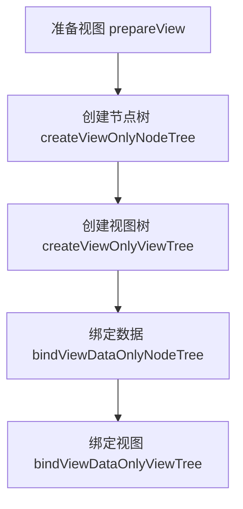
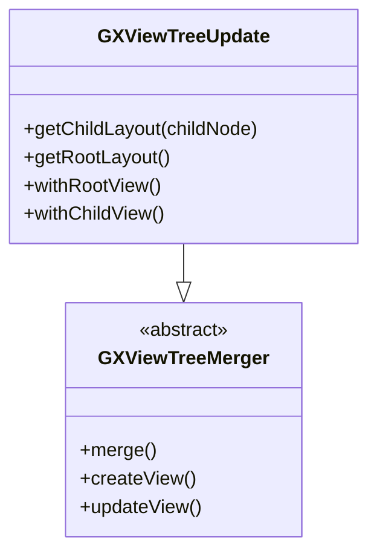
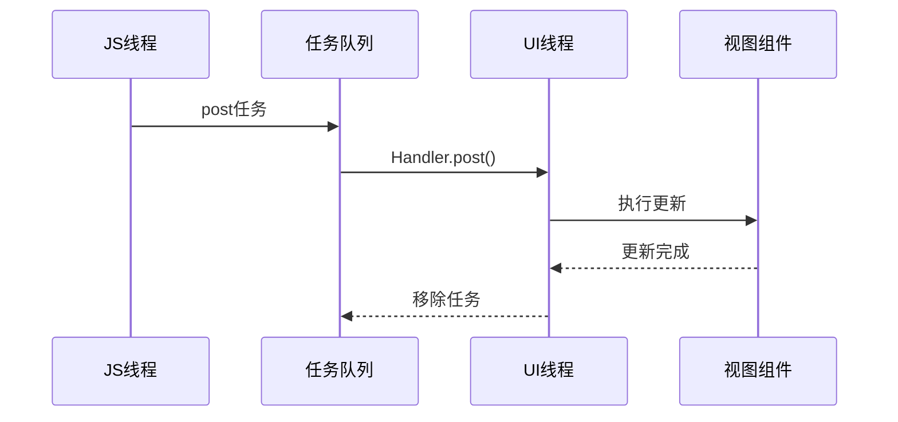

# 性能优化

<cite>
**本文档引用的文件**  
- [GXRenderImpl.kt](file://GaiaXAndroid/src/main/kotlin/com/alibaba/gaiax/render/GXRenderImpl.kt)
- [GXNodeTreeUpdate.kt](file://GaiaXAndroid/src/main/kotlin/com/alibaba/gaiax/render/node/GXNodeTreeUpdate.kt)
- [GXViewTreeUpdate.kt](file://GaiaXAndroid/src/main/kotlin/com/alibaba/gaiax/render/view/GXViewTreeUpdate.kt)
- [GXJSUiExecutor.kt](file://GaiaXAndroidJS/src/main/kotlin/com/alibaba/gaiax/js/utils/GXJSTaskQueue.kt)
- [UiExecutor.kt](file://GaiaXAndroidDemo/app/src/main/kotlin/com/alibaba/gaiax/demo/utils/UiExecutor.kt)
</cite>

## 目录
1. [引言](#引言)
2. [异步渲染管线与渲染调度](#异步渲染管线与渲染调度)
3. [视图回收池与内存管理](#视图回收池与内存管理)
4. [UI线程优化与批量更新](#ui线程优化与批量更新)
5. [帧率监控与性能分析](#帧率监控与性能分析)
6. [大数据量列表与复杂动画优化](#大数据量列表与复杂动画优化)
7. [低端设备适配与兼容性处理](#低端设备适配与兼容性处理)
8. [常见性能瓶颈与诊断方案](#常见性能瓶颈与诊断方案)
9. [总结与最佳实践](#总结与最佳实践)

## 引言
本文档全面介绍GaiaX Android渲染系统的性能优化策略，涵盖异步渲染、视图回收、内存泄漏防护、帧率监控等核心机制。重点解析GXRenderImpl的渲染调度算法、批量更新策略和UI线程优化技巧，提供性能分析工具使用方法和典型场景优化建议，帮助开发者提升复杂UI的渲染效率和用户体验。

## 异步渲染管线与渲染调度

GaiaX采用分阶段异步渲染管线，通过`GXRenderImpl`实现渲染流程的解耦与优化。该类作为核心渲染调度器，将渲染过程划分为准备、创建、绑定三个独立阶段，支持异步执行以避免阻塞UI线程。

**图示来源**  
- [GXRenderImpl.kt](file://GaiaXAndroid/src/main/kotlin/com/alibaba/gaiax/render/GXRenderImpl.kt#L42-L105)

**异步渲染优势**：
- **阶段解耦**：各阶段可独立异步执行，提升响应速度
- **预加载支持**：`prepareView`阶段可提前计算布局，减少首次渲染耗时
- **错误隔离**：任一阶段失败不影响其他阶段执行

**调度算法特点**：
- 采用`GXTemplateContext`作为上下文容器，贯穿整个渲染流程
- 通过`GXNodeTreePrepare`和`GXNodeTreeCreator`分离布局计算与节点创建
- 利用`GXGlobalCache`缓存预计算布局，避免重复计算

**Section sources**
- [GXRenderImpl.kt](file://GaiaXAndroid/src/main/kotlin/com/alibaba/gaiax/render/GXRenderImpl.kt#L42-L105)

## 视图回收池与内存管理

### 视图回收机制
GaiaX通过`GXViewTreeUpdate`实现高效的视图回收与复用。该类继承自`GXViewTreeMerger`，在更新视图树时智能复用现有视图实例，减少对象创建开销。

**图示来源**  
- [GXViewTreeUpdate.kt](file://GaiaXAndroid/src/main/kotlin/com/alibaba/gaiax/render/view/GXViewTreeUpdate.kt#L29-L83)

### 内存泄漏防护
系统通过以下机制防止内存泄漏：
1. **资源释放**：`GXNode`在`release()`方法中清理关联资源
2. **引用管理**：`GXTemplateContext`持有弱引用避免循环引用
3. **缓存清理**：`GXGlobalCache`实现LRU缓存策略，自动清理过期数据

**关键代码路径**：
- `GXNode.release()`：节点资源释放
- `GXTemplateContext`：上下文生命周期管理
- `GXGlobalCache.instance`：全局缓存管理

**Section sources**
- [GXViewTreeUpdate.kt](file://GaiaXAndroid/src/main/kotlin/com/alibaba/gaiax/render/view/GXViewTreeUpdate.kt#L29-L83)
- [GXNodeTreeUpdate.kt](file://GaiaXAndroid/src/main/kotlin/com/alibaba/gaiax/render/node/GXNodeTreeUpdate.kt#L114-L156)

## UI线程优化与批量更新

### UI线程调度
GaiaX通过`GXJSUiExecutor`和`UiExecutor`统一管理UI线程操作，确保所有视图更新都在主线程安全执行。

**图示来源**  
- [GXJSTaskQueue.kt](file://GaiaXAndroidJS/src/main/kotlin/com/alibaba/gaiax/js/utils/GXJSTaskQueue.kt#L89-L121)
- [UiExecutor.kt](file://GaiaXAndroidDemo/app/src/main/kotlin/com/alibaba/gaiax/demo/utils/UiExecutor.kt#L1-L26)

### 批量更新策略
系统采用批量更新机制减少UI重绘次数：
- **延迟更新**：当存在`flexGrow`布局时，文字自适应计算会延迟处理
- **脏标记机制**：通过`isDirty`标志位控制是否重新计算布局
- **合并操作**：连续的数据更新会合并为单次视图更新

**批量更新流程**：
1. 设置`gxTemplateContext.isDirty = false`
2. 调用`GXNodeTreeUpdate.buildNodeLayout()`
3. 检查`dirtyTexts`集合处理延迟计算
4. 执行最终布局计算

**Section sources**
- [GXJSTaskQueue.kt](file://GaiaXAndroidJS/src/main/kotlin/com/alibaba/gaiax/js/utils/GXJSTaskQueue.kt#L89-L121)
- [UiExecutor.kt](file://GaiaXAndroidDemo/app/src/main/kotlin/com/alibaba/gaiax/demo/utils/UiExecutor.kt#L1-L26)

## 帧率监控与性能分析

### 性能监控机制
GaiaX内置性能监控系统，通过日志标记关键渲染阶段耗时：
- `prepareView`：布局准备阶段
- `createViewOnlyNodeTree`：节点树创建
- `bindViewDataOnlyViewTree`：数据绑定

**监控指标**：
- 各阶段执行时间
- 布局计算次数
- 视图创建数量
- 内存占用变化

### 分析工具使用
1. **启用调试日志**：设置`Log.runE()`输出详细信息
2. **性能采样**：使用Android Profiler监控CPU和内存
3. **布局分析**：通过`GXNodeTreeUpdate`的`updateNodeTreeLayout`跟踪布局变化

**优化建议**：
- 避免在`fitContent`场景下使用`flexGrow`
- 合理设置`GXGlobalCache`大小
- 监控`dirtyTexts`集合大小

**Section sources**
- [GXNodeTreeUpdate.kt](file://GaiaXAndroid/src/main/kotlin/com/alibaba/gaiax/render/node/GXNodeTreeUpdate.kt#L77-L113)

## 大数据量列表与复杂动画优化

### 列表渲染优化
针对大数据量列表，采用以下策略：
- **懒加载**：`LazyForEach`实现按需渲染
- **缓存复用**：`cachedCount(3)`预加载相邻项
- **滚动优化**：`scroller`属性优化滚动性能

### 复杂动画处理
动画系统优化要点：
- **Lottie动画**：通过`GXLottieAnimation.create()`高效创建
- **属性动画**：使用`GXPropAnimationSet`批量管理
- **触发控制**：支持手动和自动触发模式

**动画性能建议**：
- 避免同时播放过多Lottie动画
- 合理设置动画缓存
- 使用硬件加速

**Section sources**
- [GXNodeTreeUpdate.kt](file://GaiaXAndroid/src/main/kotlin/com/alibaba/gaiax/render/node/GXNodeTreeUpdate.kt#L744-L800)

## 低端设备适配与兼容性处理

### 兼容性配置
系统提供多种兼容性开关：
- `isCompatibilityContainerDataPassSequence`：容器数据传递兼容
- `isCompatibilityLottieOldDataStructure`：Lottie旧数据结构兼容
- `isCompatibilityScrollComputeHeight`：滚动容器高度计算兼容

### 低端设备优化
1. **简化布局**：避免深层嵌套和复杂flex布局
2. **减少动画**：限制同时播放的动画数量
3. **图片优化**：使用合适尺寸的图片资源
4. **内存控制**：限制缓存大小和预加载数量

**适配策略**：
- 动态调整`cachedCount`
- 根据设备性能开关复杂特效
- 提供轻量级模板版本

**Section sources**
- [GXNodeTreeUpdate.kt](file://GaiaXAndroid/src/main/kotlin/com/alibaba/gaiax/render/node/GXNodeTreeUpdate.kt#L214-L227)

## 常见性能瓶颈与诊断方案

### 常见问题诊断
| 问题现象 | 可能原因 | 解决方案 |
|---------|--------|---------|
| 渲染卡顿 | 布局计算频繁 | 检查`isDirty`标志位 |
| 内存泄漏 | 上下文未释放 | 确保调用`release()` |
| 动画卡顿 | Lottie资源过大 | 优化Lottie文件 |
| 首屏慢 | 预加载不足 | 增加`prepareView`使用 |

### 诊断工具
1. **日志分析**：查看`GXRenderImpl`各阶段耗时
2. **内存分析**：使用Memory Profiler检查对象引用
3. **布局检查**：通过Layout Inspector分析视图层级
4. **性能监控**：集成Perfetto进行深度分析

**Section sources**
- [GXRenderImpl.kt](file://GaiaXAndroid/src/main/kotlin/com/alibaba/gaiax/render/GXRenderImpl.kt#L42-L105)

## 总结与最佳实践

### 核心优化原则
1. **异步优先**：尽可能将耗时操作移出UI线程
2. **批量处理**：合并连续的更新操作
3. **按需加载**：只渲染可见区域内容
4. **资源复用**：最大化利用视图回收池

### 最佳实践清单
- ✅ 使用`prepareView`预计算布局
- ✅ 合理配置`GXGlobalCache`大小
- ✅ 避免在`fitContent`中使用`flexGrow`
- ✅ 监控`dirtyTexts`集合防止内存泄漏
- ✅ 为低端设备提供简化版本
- ✅ 定期清理不再使用的`GXTemplateContext`

通过遵循这些优化策略和最佳实践，开发者可以显著提升GaiaX应用的渲染性能，为用户提供流畅的交互体验。

**Section sources**
- [GXRenderImpl.kt](file://GaiaXAndroid/src/main/kotlin/com/alibaba/gaiax/render/GXRenderImpl.kt#L42-L105)
- [GXNodeTreeUpdate.kt](file://GaiaXAndroid/src/main/kotlin/com/alibaba/gaiax/render/node/GXNodeTreeUpdate.kt#L73-L1322)
- [GXViewTreeUpdate.kt](file://GaiaXAndroid/src/main/kotlin/com/alibaba/gaiax/render/view/GXViewTreeUpdate.kt#L29-L83)