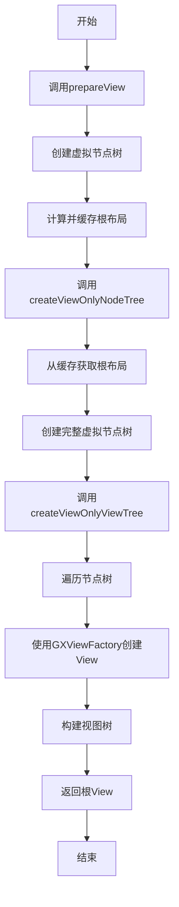
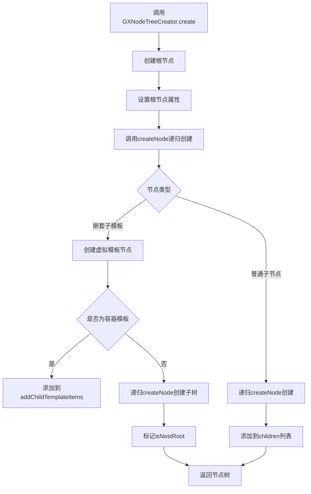
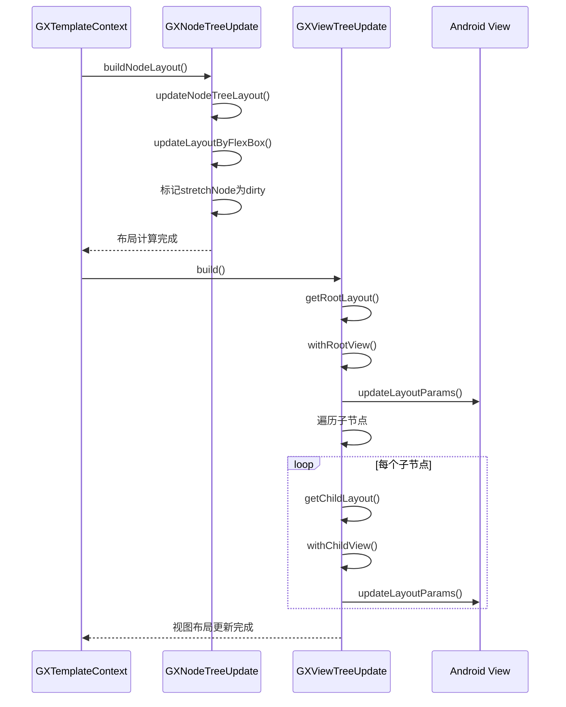

# 渲染系统

<cite>
**本文档引用的文件**  
- [GXRenderImpl.kt](file://GaiaXAndroid/src/main/kotlin/com/alibaba/gaiax/render/GXRenderImpl.kt)
- [GXViewFactory.kt](file://GaiaXAndroid/src/main/kotlin/com/alibaba/gaiax/render/view/GXViewFactory.kt)
- [GXNodeTreeCreator.kt](file://GaiaXAndroid/src/main/kotlin/com/alibaba/gaiax/render/node/GXNodeTreeCreator.kt)
- [GXNodeTreeUpdate.kt](file://GaiaXAndroid/src/main/kotlin/com/alibaba/gaiax/render/node/GXNodeTreeUpdate.kt)
- [GXViewTreeCreator.kt](file://GaiaXAndroid/src/main/kotlin/com/alibaba/gaiax/render/view/GXViewTreeCreator.kt)
- [GXViewTreeUpdate.kt](file://GaiaXAndroid/src/main/kotlin/com/alibaba/gaiax/render/view/GXViewTreeUpdate.kt)
- [GXRegisterCenter.kt](file://GaiaXAndroid/src/main/kotlin/com/alibaba/gaiax/GXRegisterCenter.kt)
</cite>

## 目录
1. [简介](#简介)
2. [渲染流程与GXRenderImpl](#渲染流程与gxrenderimpl)
3. [视图创建与GXViewFactory](#视图创建与gxviewfactory)
4. [节点树构建与GXNodeTreeCreator](#节点树构建与gxnodetreecreator)
5. [布局计算与更新机制](#布局计算与更新机制)
6. [高级主题](#高级主题)
7. [扩展接口与实现示例](#扩展接口与实现示例)

## 简介
GaiaX渲染系统是一个高性能、可扩展的跨平台UI渲染引擎，专为动态模板化界面设计。本系统通过虚拟节点树（Node Tree）和视图树（View Tree）的分离设计，实现了高效的布局计算、视图复用和异步渲染能力。核心组件包括GXRenderImpl（渲染控制器）、GXViewFactory（视图工厂）和GXNodeTreeCreator（节点树构建器），它们协同工作以完成从数据到UI的完整渲染流程。

## 渲染流程与GXRenderImpl

GXRenderImpl是GaiaX渲染系统的核心实现类，负责管理整个渲染流程的生命周期。其主要职责包括准备视图、创建节点树、创建视图树以及绑定数据。渲染流程分为两个主要阶段：`prepareView`阶段和`createView`阶段。

在`prepareView`阶段，系统通过`GXNodeTreePrepare.create`方法创建一个虚拟节点树，并计算出根节点的布局信息，然后将该布局缓存到`GXGlobalCache`中，为后续的视图创建提供依据。此阶段不创建实际的Android View，仅进行布局计算，从而实现异步渲染和性能优化。

在`createView`阶段，系统首先调用`createViewOnlyNodeTree`方法，利用预计算的布局信息创建完整的虚拟节点树（GXNode Tree）。随后，通过`createViewOnlyViewTree`方法，遍历节点树并使用`GXViewFactory`创建对应的Android View，最终构建出完整的视图树（View Tree）。整个流程通过`GXTemplateContext`上下文对象进行状态管理和数据传递。



**图示来源**
- [GXRenderImpl.kt](file://GaiaXAndroid/src/main/kotlin/com/alibaba/gaiax/render/GXRenderImpl.kt#L42-L74)

**本节来源**
- [GXRenderImpl.kt](file://GaiaXAndroid/src/main/kotlin/com/alibaba/gaiax/render/GXRenderImpl.kt#L42-L74)
- [GXTemplateEngine.kt](file://GaiaXAndroid/src/main/kotlin/com/alibaba/gaiax/GXTemplateEngine.kt#L513-L548)

## 视图创建与GXViewFactory

GXViewFactory是GaiaX系统的视图工厂，负责根据节点类型创建相应的Android View实例。它采用工厂模式和注册机制，支持内置视图和自定义视图的灵活扩展。

工厂内部维护一个`viewCreatorSupport`映射表，用于存储用户注册的自定义视图创建器。当创建视图时，系统首先检查该映射表中是否存在对应类型的创建器，如果存在则调用该创建器生成View。如果不存在，则根据内置的类型映射进行创建。支持的内置视图类型包括：`VIEW_TYPE_TEXT`（文本）、`VIEW_TYPE_IMAGE`（图片）、`VIEW_TYPE_CONTAINER_SCROLL`（滚动容器）等。

对于自定义视图，开发者可以通过`GXRegisterCenter`注册自定义的View创建逻辑。注册时需提供视图类型标识符和一个返回View实例的函数。在模板中，通过设置`customViewClass`属性来指定使用自定义视图。

```mermaid
classDiagram
class GXViewFactory {
+viewCreatorSupport : MutableMap<String, (Context) -> View>
+createView(context : Context, type : String, customViewClass : String?) : View
-newInstance(clazz : String, context : Context) : View
}
class GXRegisterCenter {
+registerExtensionViewSupport(viewType : String, viewCreator : (Context) -> View) : GXRegisterCenter
}
GXRegisterCenter --> GXViewFactory : "注册视图支持"
GXViewFactory ..> View : "创建"
```

**图示来源**
- [GXViewFactory.kt](file://GaiaXAndroid/src/main/kotlin/com/alibaba/gaiax/render/view/GXViewFactory.kt#L32-L61)
- [GXRegisterCenter.kt](file://GaiaXAndroid/src/main/kotlin/com/alibaba/gaiax/GXRegisterCenter.kt#L428-L433)

**本节来源**
- [GXViewFactory.kt](file://GaiaXAndroid/src/main/kotlin/com/alibaba/gaiax/render/view/GXViewFactory.kt#L32-L75)
- [GXRegisterCenter.kt](file://GaiaXAndroid/src/main/kotlin/com/alibaba/gaiax/GXRegisterCenter.kt#L428-L433)

## 节点树构建与GXNodeTreeCreator

GXNodeTreeCreator负责构建虚拟节点树（GXNode Tree），这是GaiaX渲染系统的核心数据结构。节点树的构建基于模板的层级信息（GXLayer）和数据绑定规则，采用递归方式从根节点开始逐层创建。

构建过程始于`create`方法，该方法接收`GXTemplateContext`和根布局信息作为参数。首先创建根节点，并将其标记为`isRoot = true`。然后调用`createNode`方法递归地创建子节点。在创建每个节点时，会初始化其ID、父节点引用、模板节点（GXTemplateNode）和伸缩布局节点（GXStretchNode）。

节点创建过程中会处理两种特殊类型：嵌套子模板和普通子节点。对于嵌套子模板（`isNestChildTemplateType`），系统会创建一个虚拟的模板节点，并根据其类型决定是作为容器模板的子项添加，还是作为普通模板的根节点递归创建。对于普通子节点，则直接递归创建并添加到父节点的子节点列表中。

节点树的构建与布局计算分离，使得系统可以在不创建实际View的情况下完成复杂的布局运算，为异步渲染和性能优化提供了基础。



**图示来源**
- [GXNodeTreeCreator.kt](file://GaiaXAndroid/src/main/kotlin/com/alibaba/gaiax/render/node/GXNodeTreeCreator.kt#L31-L136)

**本节来源**
- [GXNodeTreeCreator.kt](file://GaiaXAndroid/src/main/kotlin/com/alibaba/gaiax/render/node/GXNodeTreeCreator.kt#L31-L136)

## 布局计算与更新机制

GaiaX系统的布局计算基于Flexbox模型，通过`GXNodeTreeUpdate`和`GXViewTreeUpdate`两个核心组件实现。布局计算分为两个阶段：节点树布局更新和视图树布局更新。

在`bindViewDataOnlyNodeTree`阶段，系统调用`GXNodeTreeUpdate.buildNodeLayout`方法更新节点树的布局。该方法首先重置节点状态，然后根据节点类型（普通节点、容器节点、嵌套节点）分别调用相应的布局更新逻辑。布局更新的核心是`updateLayoutByFlexBox`方法，它将模板中的Flexbox样式（如`flexDirection`、`justifyContent`、`margin`等）映射到底层的Stretch布局引擎中，并标记节点为“脏”（dirty），触发重新计算。

在`bindViewDataOnlyViewTree`阶段，系统调用`GXViewTreeUpdate`的`build`方法，将节点树中计算好的布局信息应用到实际的Android View上。`GXViewTreeUpdate`继承自`GXViewTreeMerger`，通过`getChildLayout`和`getRootLayout`获取布局数据，并通过`withChildView`和`withRootView`方法更新View的`LayoutParams`，从而完成最终的UI布局。



**图示来源**
- [GXNodeTreeUpdate.kt](file://GaiaXAndroid/src/main/kotlin/com/alibaba/gaiax/render/node/GXNodeTreeUpdate.kt#L77-L154)
- [GXViewTreeUpdate.kt](file://GaiaXAndroid/src/main/kotlin/com/alibaba/gaiax/render/view/GXViewTreeUpdate.kt#L36-L44)

**本节来源**
- [GXNodeTreeUpdate.kt](file://GaiaXAndroid/src/main/kotlin/com/alibaba/gaiax/render/node/GXNodeTreeUpdate.kt#L77-L154)
- [GXViewTreeUpdate.kt](file://GaiaXAndroid/src/main/kotlin/com/alibaba/gaiax/render/view/GXViewTreeUpdate.kt#L36-L44)
- [GXRenderImpl.kt](file://GaiaXAndroid/src/main/kotlin/com/alibaba/gaiax/render/GXRenderImpl.kt#L77-L97)

## 高级主题

### 视图回收与内存管理
GaiaX系统通过`GXIRelease`接口实现视图的资源释放。所有可释放的视图组件都应实现此接口，并在`release()`方法中清理持有的资源，如Bitmap、动画、监听器等。系统在模板销毁或视图复用时，会自动调用该方法，防止内存泄漏。

### 异步渲染
通过将`prepareView`（布局计算）和`createView`（视图创建）分离，GaiaX实现了异步渲染。开发者可以在后台线程调用`prepareView`完成耗时的布局计算，然后在主线程快速创建视图，显著提升页面首屏渲染速度。

### 帧率监控
系统通过`GXPropUtils.isTrace()`和Android的`Trace`工具类，在关键渲染步骤（如`createViewOnlyNodeTree`）前后插入性能标记，开发者可通过Android Studio的Profiler工具分析渲染性能，定位性能瓶颈。

### 性能优化技巧
- **复用节点树**：对于滚动列表中的item，可通过`GXTemplateContext`的`scrollNodeCache`缓存已创建的节点树，实现快速复用。
- **延迟计算**：对于包含`fitContent`的文本节点，系统会延迟布局计算，直到所有`flexGrow`影响确定，确保布局精确。
- **扩展属性**：通过`GXRegisterCenter`注册`GXIExtensionDynamicProperty`，可在布局计算时动态修改样式，实现复杂交互。

**本节来源**
- [GXIRelease.kt](file://GaiaXAndroid/src/main/kotlin/com/alibaba/gaiax/render/view/GXIRelease.kt#L22-L24)
- [GXNodeTreeUpdate.kt](file://GaiaXAndroid/src/main/kotlin/com/alibaba/gaiax/render/node/GXNodeTreeUpdate.kt#L548-L558)
- [GXTemplateEngine.kt](file://GaiaXAndroid/src/main/kotlin/com/alibaba/gaiax/GXTemplateEngine.kt#L689-L732)

## 扩展接口与实现示例

GaiaX提供了丰富的扩展接口，允许开发者深度定制渲染行为。核心扩展点通过`GXRegisterCenter.instance`进行注册。

### 自定义视图注册
```kotlin
GXRegisterCenter.instance.registerExtensionViewSupport(
    "custom_button", 
    { context -> CustomButtonView(context) }
)
```
在模板中使用`"type": "custom_button"`即可创建自定义按钮。

### 自定义表达式
实现`GXIExtensionExpression`接口，可替换默认的表达式解析引擎，支持更复杂的逻辑运算。

### 自定义字体
通过`registerExtensionFontFamily`注册字体加载器，支持从Assets或网络加载自定义字体。

### 容器数据更新
实现`GXIExtensionContainerDataUpdate`接口，可在容器数据更新时插入自定义逻辑，如数据预处理或状态同步。

这些扩展机制使得GaiaX不仅是一个渲染引擎，更是一个可编程的UI框架，能够适应各种复杂的业务场景。

**本节来源**
- [GXRegisterCenter.kt](file://GaiaXAndroid/src/main/kotlin/com/alibaba/gaiax/GXRegisterCenter.kt#L428-L470)
- [GXViewFactoryTest.kt](file://GaiaXAndroid/src/androidTest/java/com/alibaba/gaiax/render/view/GXViewFactoryTest.kt#L70-L75)