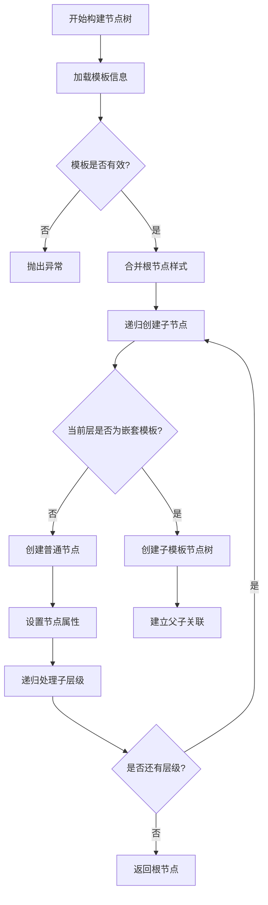
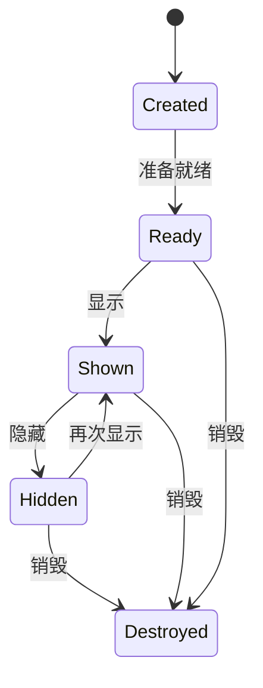
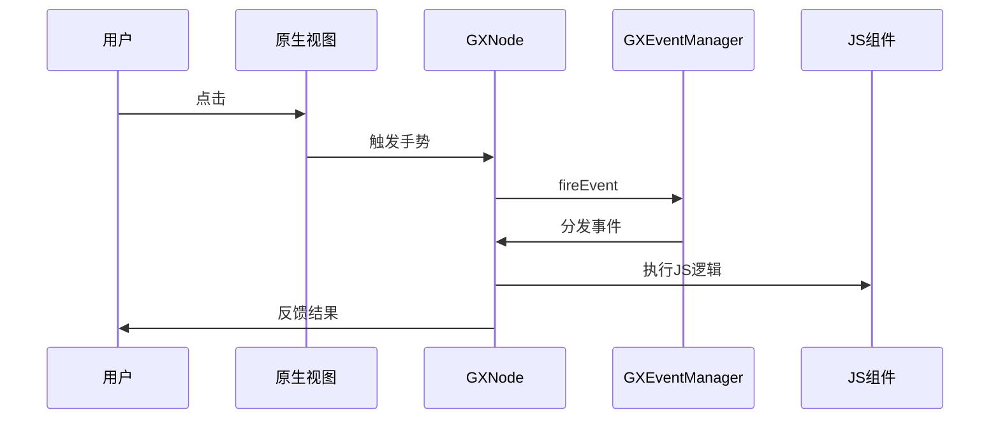
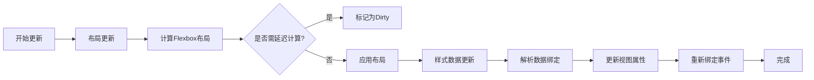

# 节点管理

<cite>
**本文档引用的文件**   
- [GXNodeTreeCreator.ets](file://GaiaXHarmony/GaiaXCore/GaiaX/src/main/ets/creator/GXNodeTreeCreator.ets)
- [GXNodeTreeCreator.m](file://GaiaXiOS/GaiaXiOS/Core/Creator/GXNodeTreeCreator.m)
- [GXNode.m](file://GaiaXiOS/GaiaXiOS/Core/StretchKit/Classes/GXNode.m)
- [GXEventManager.h](file://GaiaXiOS/GaiaXiOS/Binding/Event/GXEventManager.h)
- [GXNodeTreeUpdate.kt](file://GaiaXAndroid/src/main/kotlin/com/alibaba/gaiax/render/node/GXNodeTreeUpdate.kt)
- [GXNodeTreePrepare.kt](file://GaiaXAndroid/src/main/kotlin/com/alibaba/gaiax/render/node/GXNodeTreePrepare.kt)
- [GXNode.kt](file://GaiaXAndroid/src/main/kotlin/com/alibaba/gaiax/render/node/GXNode.kt)
- [GXDataManager.ets](file://GaiaXHarmony/GaiaXCore/GaiaX/src/main/ets/binding/GXDataManager.ets)
</cite>

## 目录
1. [节点树构建流程](#节点树构建流程)
2. [GXNode生命周期管理](#gxnode生命周期管理)
3. [事件分发体系](#事件分发体系)
4. [节点树更新机制](#节点树更新机制)
5. [高级特性](#高级特性)
6. [性能优化与调试](#性能优化与调试)

## 节点树构建流程

`GXNodeTreeCreator` 是负责构建节点树的核心组件，其主要职责是将模板信息转换为可渲染的节点树结构。该过程始于 `creatNodeTree` 方法，该方法接收 `templateItem` 和 `templateContext` 作为参数，首先通过 `GXTemplateManager` 加载模板内容，然后调用内部方法 `createTemplateNode` 开始构建。

构建过程遵循深度优先的递归策略。`recursionCreateNode` 方法是递归构建的核心，它遍历模板的层级信息（layers），为每个层级创建对应的 `GXNode` 实例。对于普通节点，会根据其类型（如文本、图片、容器等）和样式信息创建节点，并设置其数据绑定、事件、埋点等属性。对于嵌套模板节点，会创建一个新的 `GXTemplateItem`，并递归调用 `creatNodeTree` 来构建子模板的节点树，从而形成树状的层级结构。在构建过程中，根节点的样式会与外部传入的虚拟样式进行合并，以实现样式的覆盖和继承。

**Diagram sources**
- [GXNodeTreeCreator.ets](file://GaiaXHarmony/GaiaXCore/GaiaX/src/main/ets/creator/GXNodeTreeCreator.ets#L27-L216)

**Section sources**
- [GXNodeTreeCreator.ets](file://GaiaXHarmony/GaiaXCore/GaiaX/src/main/ets/creator/GXNodeTreeCreator.ets#L27-L216)
- [GXNodeTreeCreator.m](file://GaiaXiOS/GaiaXiOS/Core/Creator/GXNodeTreeCreator.m#L1-L280)

## GXNode生命周期管理

`GXNode` 对象的生命周期贯穿了从创建、渲染、展示到销毁的全过程。当节点树构建完成后，每个 `GXNode` 实例都处于待命状态。当需要渲染时，`GXNode` 会通过 `applyView` 方法创建或获取其对应的原生视图（UIView/View），并递归地将子节点的视图添加到其容器中。

节点的可见性状态由 `onShow` 和 `onHide` 方法管理。当一个节点进入可视区域时，`onShow` 被调用，它会触发JS组件的 `onShow` 回调，并向子节点广播此事件，同时触发曝光埋点。反之，当节点离开可视区域时，`onHide` 会被调用，用于清理资源和停止不必要的操作。节点的最终销毁由 `onDestroy` 触发，它会通知JS组件进行清理，并释放节点持有的原生视图和资源，防止内存泄漏。

**Diagram sources**
- [GXNode.m](file://GaiaXiOS/GaiaXiOS/Core/StretchKit/Classes/GXNode.m#L597-L647)

**Section sources**
- [GXNode.m](file://GaiaXiOS/GaiaXiOS/Core/StretchKit/Classes/GXNode.m#L597-L647)

## 事件分发体系

GaiaX 的事件分发体系以 `GXEventManager` 为核心。当一个事件（如点击、长按）被触发时，系统首先通过 `registerEvent` 将事件与特定的 `GXNode` 进行绑定。这通常在节点创建或数据绑定阶段完成。

当用户与视图交互时，原生的事件处理器（如 `UITapGestureRecognizer`）会被触发。`GXEventManager` 通过 `fireEvent` 方法接收事件，并将其分发给注册了该事件的 `GXNode`。`GXNode` 在接收到事件后，会根据事件类型执行相应的逻辑，例如执行JS脚本、触发埋点或通知上层业务。这种设计将事件的注册、分发和处理解耦，保证了事件流的清晰和可控。

**Diagram sources**
- [GXEventManager.h](file://GaiaXiOS/GaiaXiOS/Binding/Event/GXEventManager.h#L1-L55)
- [GXNode.m](file://GaiaXiOS/GaiaXiOS/Core/StretchKit/Classes/GXNode.m#L467-L492)

**Section sources**
- [GXEventManager.m](file://GaiaXiOS/GaiaXiOS/Binding/Event/GXEventManager.m#L57-L98)
- [GXNode.m](file://GaiaXiOS/GaiaXiOS/Core/StretchKit/Classes/GXNode.m#L467-L492)

## 节点树更新机制

节点树的更新分为布局更新和样式数据更新两个阶段。`GXNodeTreeUpdate` 类负责管理这一过程。

**布局更新 (Layout)**：此阶段主要计算每个节点在屏幕上的最终位置和尺寸。它通过 `updateNodeTreeLayout` 方法遍历节点树，根据Flexbox布局规则和节点的样式信息，利用底层的 `stretch` 引擎计算出布局。对于容器节点（如Scroll、Grid），会根据其数据源的长度动态计算容器高度。如果节点启用了 `fitContent`（文字自适应），且父节点使用了 `flexGrow`，则会将计算延迟到数据绑定之后，以确保计算结果的准确性。

**样式与数据更新 (Style & Data)**：此阶段通过 `updateNodeTreeStyleAndData` 方法，将最新的数据源绑定到节点上。它会解析数据绑定表达式，更新节点的样式、文本、图片等属性，并重新绑定事件和埋点。对于嵌套模板，会将数据传递给子模板的 `virtualData`，再由子模板内部进行数据绑定。

**Section sources**
- [GXNodeTreeUpdate.kt](file://GaiaXAndroid/src/main/kotlin/com/alibaba/gaiax/render/node/GXNodeTreeUpdate.kt#L70-L1322)

## 高级特性

### 节点合并与空节点过滤
在构建节点树时，系统会自动处理节点合并。当一个容器节点（如Scroll）包含多个子模板时，这些子模板的 `templateItem` 会被收集到父节点的 `childTemplateItems` 列表中，而不是直接作为子节点添加。这允许父容器在运行时根据数据动态地创建和管理这些子模板实例，实现高效的列表渲染。

### 嵌套模板处理
嵌套模板是实现组件化和复用的关键。当解析到一个嵌套模板节点时，系统会创建一个新的 `GXTemplateItem`，并递归调用 `creatNodeTree` 来构建其独立的节点树。父节点通过 `virtualData` 向子模板传递数据，子模板则通过 `extension.virtualExtend` 接收外部扩展属性。这种机制实现了父子模板之间的数据隔离和通信。

### 样式继承
样式继承主要通过 `mergeRootStyle` 方法实现。当外部需要覆盖某个模板的根节点样式时，可以将样式信息存入 `templateItem.virtualStyleInfo`。在构建节点树时，`GXNodeTreeCreator` 会将这些虚拟样式与模板内部的根节点样式进行合并，优先使用外部样式，从而实现主题定制和动态样式覆盖。

**Section sources**
- [GXNodeTreeCreator.ets](file://GaiaXHarmony/GaiaXCore/GaiaX/src/main/ets/creator/GXNodeTreeCreator.ets#L133-L151)
- [GXDataManager.ets](file://GaiaXHarmony/GaiaXCore/GaiaX/src/main/ets/binding/GXDataManager.ets#L37-L75)
- [GXNodeTreePrepare.kt](file://GaiaXAndroid/src/main/kotlin/com/alibaba/gaiax/render/node/GXNodeTreePrepare.kt#L84-L114)

## 性能优化与调试

### 性能优化
1.  **增量更新**：系统通过 `dirty` 标记来实现增量更新。只有当节点的布局或数据发生变化时，才会重新计算布局或重新渲染视图，避免了全量刷新的开销。
2.  **延迟计算**：对于 `fitContent` 场景，系统会延迟布局计算，直到所有数据绑定完成，确保一次计算得到最终结果，避免了多次重排。
3.  **资源复用**：`GXNode` 的 `onReuse` 回调允许JS组件在节点被复用时进行状态重置，而不是重新创建，显著提升了列表滚动的性能。

### 调试实践
1.  **节点查询**：可通过 `queryNodeByNodeId` 方法，根据节点ID在整个节点树中快速定位目标节点，便于检查其属性和状态。
2.  **日志开关**：通过系统属性 `debug.com.alibaba.gaiax.log.show_node_log` 可以开启详细的节点日志，输出节点的创建、销毁和属性信息，帮助排查问题。
3.  **DevTools集成**：支持与GaiaX DevTools集成，提供断点调试、模板热更新和性能监控等功能，极大地提升了开发和调试效率。

**Section sources**
- [GXNode.m](file://GaiaXiOS/GaiaXiOS/Core/StretchKit/Classes/GXNode.m#L126-L178)
- [GXPropUtils.kt](file://GaiaXAndroid/src/main/kotlin/com/alibaba/gaiax/utils/GXPropUtils.kt#L1-L44)
- [DevTools/GaiaXCommandCenter.m](file://GaiaXiOSDemo/GaiaXiOSDemo/Preview/DevTools/GaiaXCommandCenter.m#L39-L69)