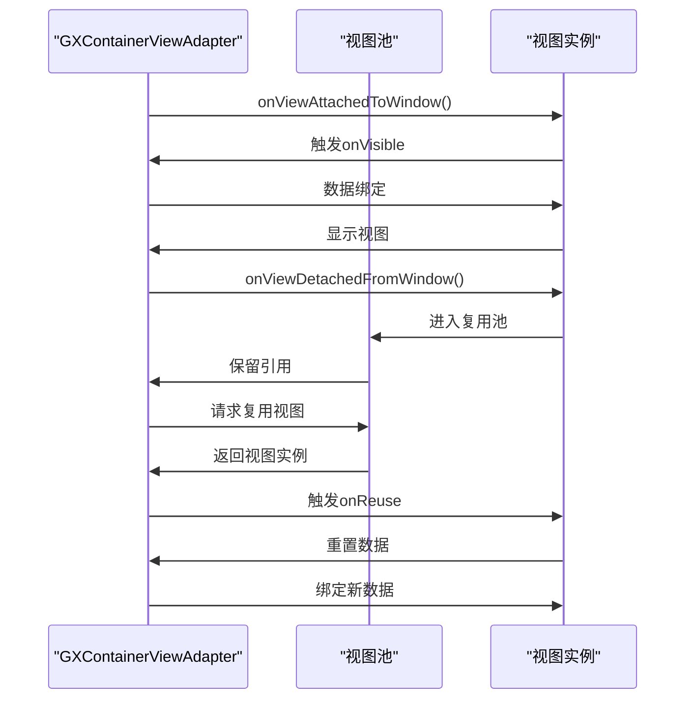
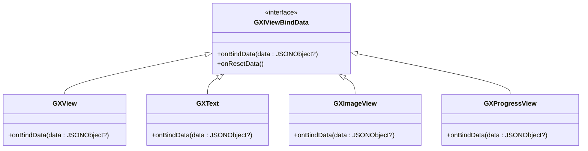
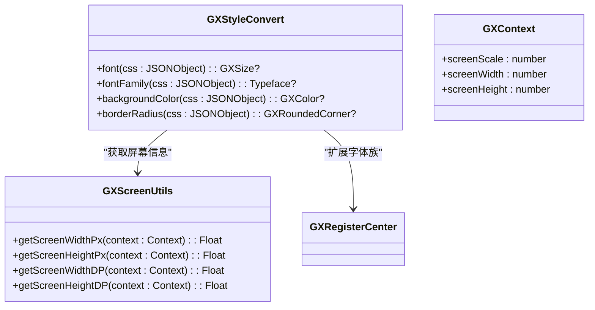
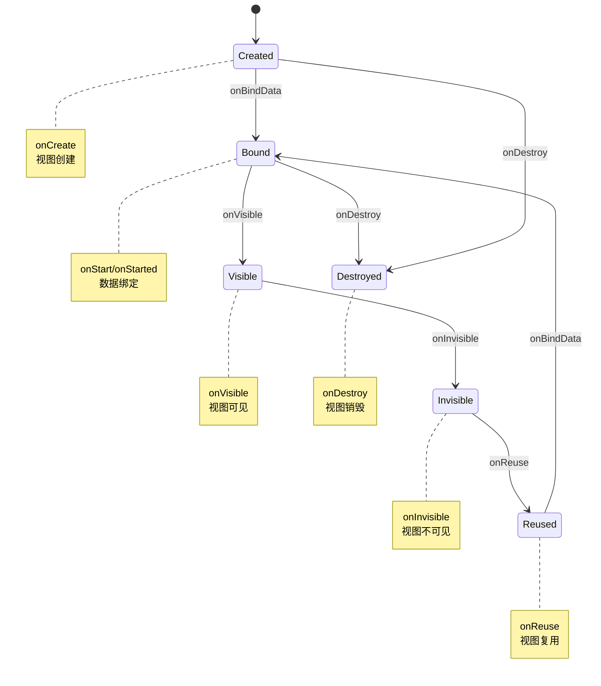

# 视图创建

<cite>
**本文档中引用的文件**   
- [GXViewFactory.kt](file://GaiaXAndroid/src/main/kotlin/com/alibaba/gaiax/render/view/GXViewFactory.kt)
- [GXRegisterCenter.kt](file://GaiaXAndroid/src/main/kotlin/com/alibaba/gaiax/GXRegisterCenter.kt)
- [GXIViewBindData.kt](file://GaiaXAndroid/src/main/kotlin/com/alibaba/gaiax/render/view/GXIViewBindData.kt)
- [GXImageView.kt](file://GaiaXAndroid/src/main/kotlin/com/alibaba/gaiax/render/view/basic/GXImageView.kt)
- [GXScreenUtils.kt](file://GaiaXAndroid/src/main/kotlin/com/alibaba/gaiax/utils/GXScreenUtils.kt)
- [GXStyleConvert.kt](file://GaiaXAndroid/src/main/kotlin/com/alibaba/gaiax/template/GXStyleConvert.kt)
</cite>

## 目录
1. [引言](#引言)
2. [视图类型映射系统](#视图类型映射系统)
3. [视图池管理与复用机制](#视图池管理与复用机制)
4. [数据绑定流程](#数据绑定流程)
5. [自定义视图扩展接口](#自定义视图扩展接口)
6. [屏幕适配与主题处理](#屏幕适配与主题处理)
7. [生命周期回调](#生命周期回调)
8. [结论](#结论)

## 引言
GaiaX框架在Android平台提供了一套完整的视图生成与管理机制，通过GXViewFactory实现视图的创建、数据绑定和扩展功能。该机制支持基础视图创建、数据绑定、自定义视图扩展以及视图复用等核心功能，为动态模板渲染提供了高效稳定的解决方案。

## 视图类型映射系统
GXViewFactory作为视图工厂类，负责根据类型标签生产对应的视图实例。系统内置了多种视图类型的映射关系，包括基础视图和容器视图。

```mermaid
classDiagram
class GXViewFactory {
+viewCreatorSupport : MutableMap<String, (Context) -> View>
+createView(context : Context, type : String, customViewClass : String?) : T
-newInstance(clazz : String?, context : Context) : T
}
class GXRegisterCenter {
+registerExtensionViewSupport(viewType : String, viewCreator : (Context) -> View) : GXRegisterCenter
}
GXRegisterCenter --> GXViewFactory : "注册扩展视图"
GXViewFactory --> GXView : "VIEW_TYPE_VIEW"
GXViewFactory --> GXText : "VIEW_TYPE_TEXT"
GXViewFactory --> GXImageView : "VIEW_TYPE_IMAGE"
GXViewFactory --> GXScrollView : "VIEW_TYPE_CONTAINER_SCROLL"
GXViewFactory --> GXGridView : "VIEW_TYPE_CONTAINER_GRID"
GXViewFactory --> GXSliderView : "VIEW_TYPE_CONTAINER_SLIDER"
```

**图示来源**
- [GXViewFactory.kt](file://GaiaXAndroid/src/main/kotlin/com/alibaba/gaiax/render/view/GXViewFactory.kt#L30-L60)
- [GXRegisterCenter.kt](file://GaiaXAndroid/src/main/kotlin/com/alibaba/gaiax/GXRegisterCenter.kt#L428-L432)

**视图类型映射说明：**
- 基础视图：VIEW、TEXT、IMAGE、ICON_FONT、PROGRESS
- 容器视图：SCROLL、GRID、SLIDER
- 特殊视图：GAIA_TEMPLATE、SHADOW_LAYOUT
- 自定义视图：通过VIEW_TYPE_CUSTOM类型支持

通过registerExtensionViewSupport方法可向viewCreatorSupport注册新的视图类型，实现视图系统的动态扩展。

## 视图池管理与复用机制
GaiaX通过容器适配器(GXContainerViewAdapter)实现视图的复用机制。当视图从窗口分离时触发onInvisible回调，进入复用池；当需要新视图时优先从池中获取并触发onReuse回调。



**图示来源**
- [GXRegisterCenter.kt](file://GaiaXAndroid/src/main/kotlin/com/alibaba/gaiax/GXRegisterCenter.kt#L82-L117)

视图复用机制有效减少了频繁创建和销毁视图带来的性能开销，特别适用于列表滚动等场景。

## 数据绑定流程
数据绑定通过GXIViewBindData接口实现，所有可绑定数据的视图都需要实现该接口。绑定流程在视图创建后执行，确保数据与视图状态同步。



**图示来源**
- [GXIViewBindData.kt](file://GaiaXAndroid/src/main/kotlin/com/alibaba/gaiax/render/view/GXIViewBindData.kt#L24-L28)
- [GXImageView.kt](file://GaiaXAndroid/src/main/kotlin/com/alibaba/gaiax/render/view/basic/GXImageView.kt#L89-L92)

数据绑定流程：
1. 调用onBindData方法传入JSON数据
2. 解析数据并更新视图属性
3. 处理特殊属性如图片URL、文本内容等
4. 触发视图重绘

## 自定义视图扩展接口
通过GXRegisterCenter.registerExtensionViewSupport方法可注册自定义视图类型，实现对特定视图类型的定制化处理。

```kotlin
GXRegisterCenter.instance.registerExtensionViewSupport("custom_type") { context ->
    CustomView(context)
}
```

**代码路径**
- [GXRegisterCenter.kt](file://GaiaXAndroid/src/main/kotlin/com/alibaba/gaiax/GXRegisterCenter.kt#L428-L432)
- [GXViewFactory.kt](file://GaiaXAndroid/src/main/kotlin/com/alibaba/gaiax/render/view/GXViewFactory.kt#L43-L45)

自定义视图需要：
1. 实现View的构造函数
2. 可选实现GXIViewBindData接口进行数据绑定
3. 可选实现其他扩展接口如GXIRelease等

## 屏幕适配与主题处理
系统通过GXScreenUtils和GXStyleConvert实现屏幕适配和样式转换功能。



**图示来源**
- [GXScreenUtils.kt](file://GaiaXAndroid/src/main/kotlin/com/alibaba/gaiax/utils/GXScreenUtils.kt#L42-L110)
- [GXStyleConvert.kt](file://GaiaXAndroid/src/main/kotlin/com/alibaba/gaiax/template/GXStyleConvert.kt#L210-L224)

屏幕适配策略：
1. 优先从DecorView获取尺寸
2. 多窗口模式下从Configuration获取
3. Activity窗口获取
4. Application上下文获取

主题样式处理通过GXStyleConvert将CSS样式转换为Android原生样式，支持字体、颜色、圆角等属性的转换。

## 生命周期回调
系统提供了一套完整的视图生命周期回调机制，便于监控视图状态变化。



**图示来源**
- [GXRegisterCenter.kt](file://GaiaXAndroid/src/main/kotlin/com/alibaba/gaiax/GXRegisterCenter.kt#L54-L75)

生命周期回调可用于：
- 性能监控
- 资源释放
- 数据埋点
- 动画控制

## 结论
GaiaX的视图生成机制通过GXViewFactory实现了灵活高效的视图创建与管理。系统具备完善的视图类型映射、数据绑定、复用机制和扩展接口，能够满足复杂动态模板的渲染需求。通过GXRegisterCenter的扩展机制，开发者可以轻松集成自定义视图组件，实现功能的灵活扩展。同时，系统对屏幕适配和主题样式的良好支持，确保了在不同设备上的显示一致性。