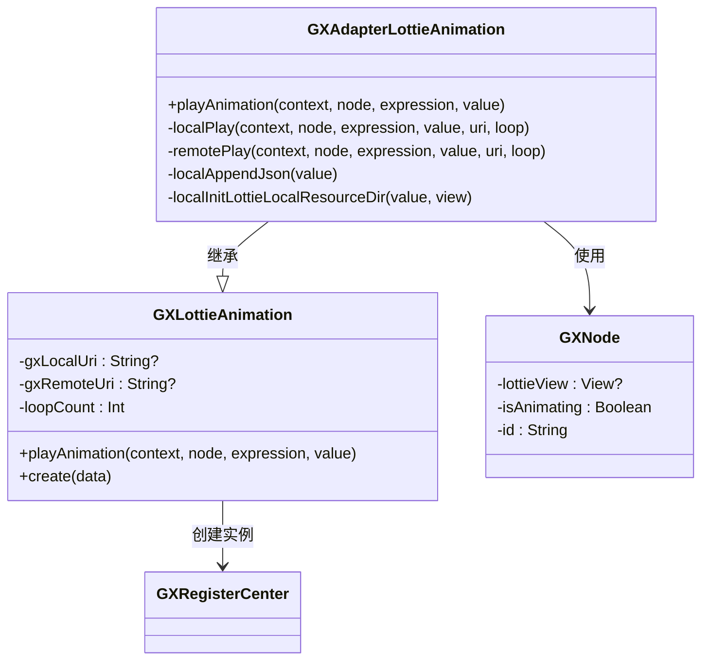
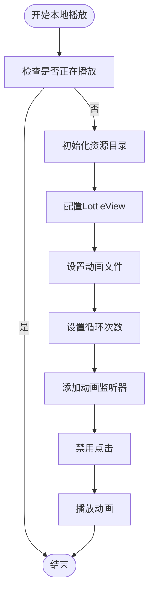
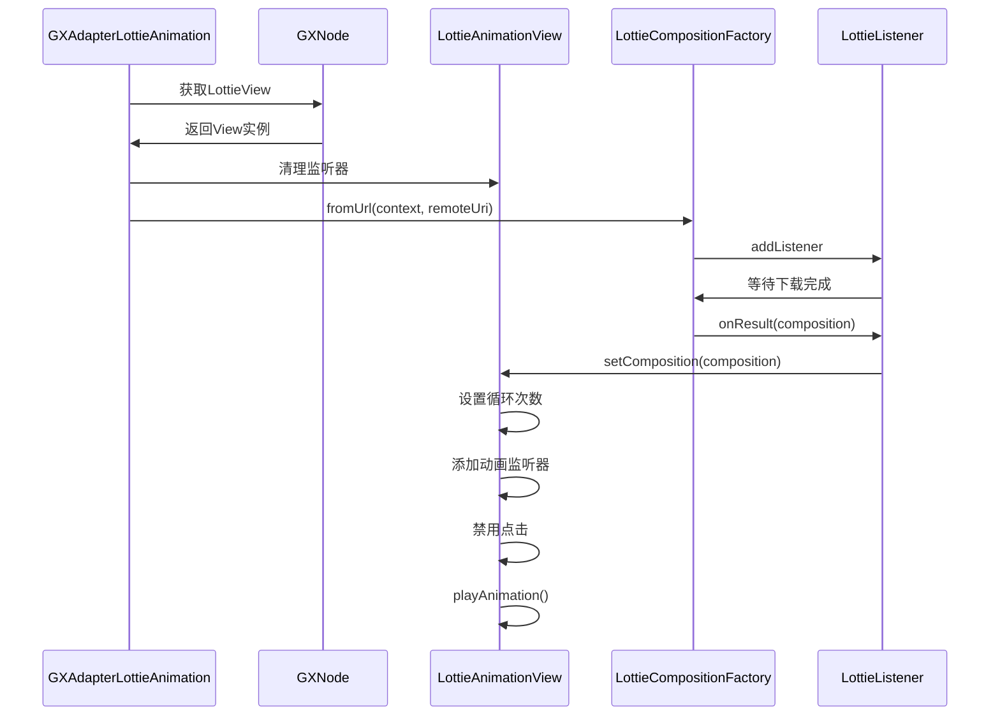
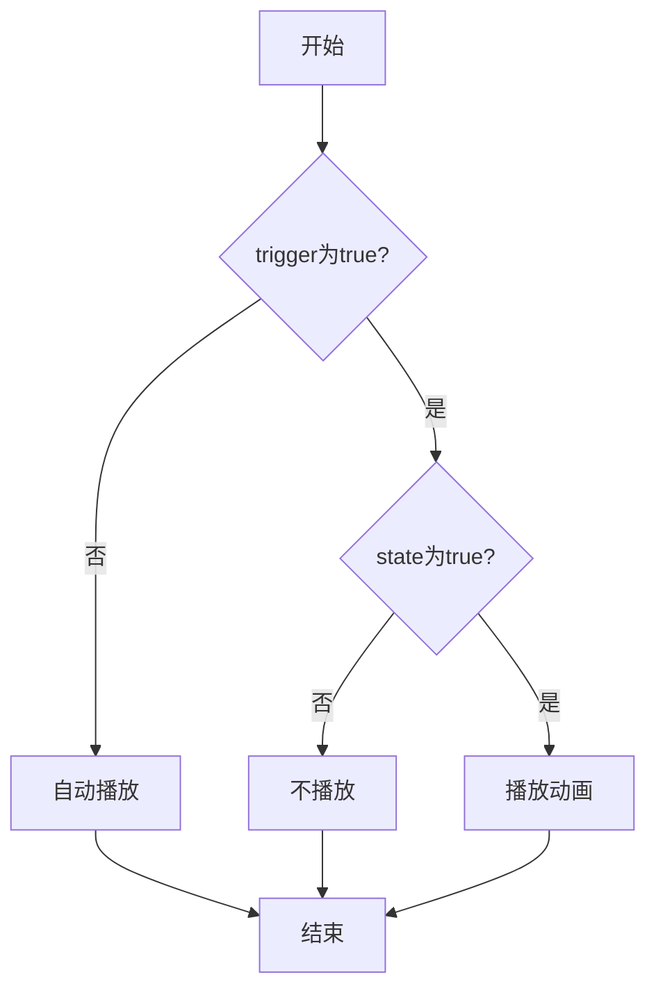

# Lottie动画适配器

<cite>
**本文档引用文件**   
- [GXAdapterLottieAnimation.kt](file://GaiaXAndroidAdapter/src/main/java/com/alibaba/gaiax/adapter/GXAdapterLottieAnimation.kt)
- [GXLottieAnimation.kt](file://GaiaXAndroid/src/main/kotlin/com/alibaba/gaiax/template/animation/GXLottieAnimation.kt)
- [GXNode.kt](file://GaiaXAndroid/src/main/kotlin/com/alibaba/gaiax/render/node/GXNode.kt)
- [GXTemplateContext.kt](file://GaiaXAndroid/src/main/kotlin/com/alibaba/gaiax/context/GXTemplateContext.kt)
- [GXAnimationBinding.kt](file://GaiaXAndroid/src/main/kotlin/com/alibaba/gaiax/template/animation/GXAnimationBinding.kt)
</cite>

## 目录
1. [简介](#简介)
2. [核心实现机制](#核心实现机制)
3. [动画加载与资源管理](#动画加载与资源管理)
4. [播放控制与API文档](#播放控制与api文档)
5. [数据绑定与表达式控制](#数据绑定与表达式控制)
6. [性能优化策略](#性能优化策略)
7. [缓存与内存管理](#缓存与内存管理)
8. [错误处理与事件回调](#错误处理与事件回调)
9. [总结](#总结)

## 简介
GXAdapterLottieAnimation是GaiaX框架中用于处理Lottie动画的核心适配器组件，负责管理Lottie动画的加载、播放控制、资源管理和性能优化。该适配器基于Airbnb的Lottie库实现，提供了本地和远程动画资源的统一处理机制，支持动画的循环播放、进度控制和事件监听等高级功能。通过与GaiaX模板引擎的深度集成，实现了动画与模板数据的动态绑定，为开发者提供了灵活的动画控制能力。

## 核心实现机制

GXAdapterLottieAnimation作为GXLottieAnimation的实现类，通过继承和重写父类方法来实现具体的动画播放逻辑。该适配器采用策略模式，根据动画资源的来源（本地或远程）选择不同的播放策略。核心实现包括动画资源的加载、播放控制、事件监听和资源清理等关键功能。

适配器通过GXNode获取LottieAnimationView实例，并在其上执行动画操作。在播放前会进行状态检查，确保动画不会重复播放。同时，适配器实现了完整的资源清理机制，在动画播放结束或异常时及时移除所有监听器，防止内存泄漏。



**图表来源**
- [GXAdapterLottieAnimation.kt](file://GaiaXAndroidAdapter/src/main/java/com/alibaba/gaiax/adapter/GXAdapterLottieAnimation.kt#L31-L206)
- [GXLottieAnimation.kt](file://GaiaXAndroid/src/main/kotlin/com/alibaba/gaiax/template/animation/GXLottieAnimation.kt#L23-L69)
- [GXNode.kt](file://GaiaXAndroid/src/main/kotlin/com/alibaba/gaiax/render/node/GXNode.kt#L74-L75)

**本节来源**
- [GXAdapterLottieAnimation.kt](file://GaiaXAndroidAdapter/src/main/java/com/alibaba/gaiax/adapter/GXAdapterLottieAnimation.kt#L31-L206)
- [GXLottieAnimation.kt](file://GaiaXAndroid/src/main/kotlin/com/alibaba/gaiax/template/animation/GXLottieAnimation.kt#L23-L69)

## 动画加载与资源管理

### 本地动画加载
本地动画加载通过`localPlay`方法实现，支持从assets目录加载JSON格式的Lottie动画文件。适配器会自动处理文件路径，确保文件扩展名为.json。对于包含图片资源的动画，需要在路径中指定资源目录，系统会自动设置`imageAssetsFolder`属性。



**图表来源**
- [GXAdapterLottieAnimation.kt](file://GaiaXAndroidAdapter/src/main/java/com/alibaba/gaiax/adapter/GXAdapterLottieAnimation.kt#L80-L134)

### 远程动画加载
远程动画加载通过`remotePlay`方法实现，使用LottieCompositionFactory从URL异步下载动画资源。系统会先检查动画状态，然后创建下载任务并添加结果监听器。下载完成后，将Composition设置到LottieView并开始播放。



**图表来源**
- [GXAdapterLottieAnimation.kt](file://GaiaXAndroidAdapter/src/main/java/com/alibaba/gaiax/adapter/GXAdapterLottieAnimation.kt#L136-L205)

**本节来源**
- [GXAdapterLottieAnimation.kt](file://GaiaXAndroidAdapter/src/main/java/com/alibaba/gaiax/adapter/GXAdapterLottieAnimation.kt#L80-L205)

## 播放控制与API文档

### 播放控制API
GXAdapterLottieAnimation提供了完整的播放控制接口，包括播放、暂停、停止等基本操作。这些操作通过LottieAnimationView的原生方法实现，确保了与Lottie库的兼容性。

| 方法 | 参数 | 描述 |
|------|------|------|
| playAnimation | context, node, expression, value | 主要入口方法，根据配置选择本地或远程播放 |
| localPlay | context, node, expression, value, uri, loop | 播放本地动画资源 |
| remotePlay | context, node, expression, value, uri, loop | 播放远程动画资源 |
| localAppendJson | value | 确保文件路径以.json结尾 |
| localInitLottieLocalResourceDir | value, view | 初始化本地资源目录 |

### 循环模式设置
循环模式通过`loopCount`属性控制，支持两种配置方式：
- `loop: true`：无限循环播放
- `loopCount: n`：指定循环次数

系统在创建动画实例时解析这些配置，并设置到LottieView的`repeatCount`属性。

### 进度控制
虽然适配器本身不直接提供进度控制方法，但可以通过获取LottieView实例来实现：
```kotlin
val lottieView = gxNode.lottieView as? LottieAnimationView
lottieView?.progress = 0.5f // 设置播放进度为50%
lottieView?.speed = 2.0f // 设置播放速度为2倍
```

**本节来源**
- [GXAdapterLottieAnimation.kt](file://GaiaXAndroidAdapter/src/main/java/com/alibaba/gaiax/adapter/GXAdapterLottieAnimation.kt#L31-L206)
- [GXLottieAnimation.kt](file://GaiaXAndroid/src/main/kotlin/com/alibaba/gaiax/template/animation/GXLottieAnimation.kt#L62-L66)

## 数据绑定与表达式控制

### 动画数据绑定
动画配置通过GXAnimationBinding进行数据绑定，使用标准的JSON结构定义动画参数：

```json
{
  "type": "lottie",
  "lottieAnimator": {
    "value": "animation.json",
    "loop": true
  }
}
```

系统通过GXExpressionFactory解析表达式，实现动态数据绑定。

### 表达式控制
表达式控制通过`trigger`和`state`字段实现条件播放：

```json
{
  "type": "lottie",
  "trigger": true,
  "state": "${data.showAnimation}",
  "lottieAnimator": {
    "value": "animation.json"
  }
}
```

当`trigger`为true时，系统会评估`state`表达式的值，只有当其为true时才触发动画播放。



**图表来源**
- [GXAnimationBinding.kt](file://GaiaXAndroid/src/main/kotlin/com/alibaba/gaiax/template/animation/GXAnimationBinding.kt#L33-L37)
- [GXNodeTreeUpdate.kt](file://GaiaXAndroid/src/main/kotlin/com/alibaba/gaiax/render/node/GXNodeTreeUpdate.kt#L774-L773)

**本节来源**
- [GXAnimationBinding.kt](file://GaiaXAndroid/src/main/kotlin/com/alibaba/gaiax/template/animation/GXAnimationBinding.kt#L33-L48)
- [GXNodeTreeUpdate.kt](file://GaiaXAndroid/src/main/kotlin/com/alibaba/gaiax/render/node/GXNodeTreeUpdate.kt#L745-L773)

## 性能优化策略

### 动画复用
系统通过GXNode的`isAnimating`标志位防止动画重复播放，避免了不必要的资源消耗。在播放前会检查当前状态，确保同一动画不会被多次触发。

### 资源预加载
对于远程动画，系统采用异步加载机制，避免阻塞UI线程。同时，在动画播放结束后及时清理监听器，减少内存占用。

### 帧率控制
虽然适配器本身不直接控制帧率，但可以通过LottieView的`setRenderMode`方法优化渲染性能：

```kotlin
lottieView.renderMode = RenderMode.SOFTWARE
```

### 离屏渲染
系统建议在复杂场景中使用离屏渲染来提高性能，特别是在列表滚动时播放动画的场景。

**本节来源**
- [GXAdapterLottieAnimation.kt](file://GaiaXAndroidAdapter/src/main/java/com/alibaba/gaiax/adapter/GXAdapterLottieAnimation.kt#L89-L90)
- [GXNode.kt](file://GaiaXAndroid/src/main/kotlin/com/alibaba/gaiax/render/node/GXNode.kt#L44-L45)

## 缓存与内存管理

### 缓存策略
系统采用多层缓存机制：
1. Lottie库内置的Composition缓存
2. Android系统的资源缓存
3. 应用层的动画配置缓存

对于远程动画，LottieCompositionFactory会自动缓存下载的资源，避免重复下载。

### 内存管理
适配器实现了严格的内存管理机制：
- 在播放前清理所有监听器
- 动画结束后重置`isAnimating`标志位
- 及时释放Composition资源
- 防止Activity泄漏

```kotlin
lottieView.removeAllAnimatorListeners()
lottieView.removeAllUpdateListeners()
lottieView.removeAllLottieOnCompositionLoadedListener()
```

这些清理操作确保了动画资源的正确释放，防止内存泄漏。

**本节来源**
- [GXAdapterLottieAnimation.kt](file://GaiaXAndroidAdapter/src/main/java/com/alibaba/gaiax/adapter/GXAdapterLottieAnimation.kt#L99-L101)
- [GXNode.kt](file://GaiaXAndroid/src/main/kotlin/com/alibaba/gaiax/render/node/GXNode.kt#L44-L45)

## 错误处理与事件回调

### 事件回调机制
系统通过onAnimationEvent回调通知动画状态变化：

```kotlin
gxTemplateContext.templateData?.eventListener?.onAnimationEvent(
    GXTemplateEngine.GXAnimation().apply {
        this.state = "START"
        this.nodeId = gxNode.id
        this.view = lottieView
        this.animationParams = gxAnimationValue
    })
```

支持的状态包括"START"和"END"，开发者可以通过事件监听器响应动画状态变化。

### 错误处理
系统实现了完善的错误处理：
- 空值检查：确保LottieView不为空
- 状态检查：防止重复播放
- 异常捕获：通过try-catch处理潜在异常
- 资源验证：检查动画文件是否存在

当下载失败或资源无效时，系统会重置`isAnimating`标志位并清理资源。

**本节来源**
- [GXAdapterLottieAnimation.kt](file://GaiaXAndroidAdapter/src/main/java/com/alibaba/gaiax/adapter/GXAdapterLottieAnimation.kt#L107-L119)
- [GXAdapterLottieAnimation.kt](file://GaiaXAndroidAdapter/src/main/java/com/alibaba/gaiax/adapter/GXAdapterLottieAnimation.kt#L171-L186)

## 总结
GXAdapterLottieAnimation提供了一套完整的Lottie动画解决方案，涵盖了从加载、播放到性能优化的各个方面。通过清晰的架构设计和严谨的资源管理，确保了动画播放的流畅性和稳定性。开发者可以基于这套API实现丰富的动画效果，同时通过表达式控制实现动态交互。建议在实际使用中注意内存管理，合理使用缓存机制，以获得最佳的性能表现。

**本节来源**
- [GXAdapterLottieAnimation.kt](file://GaiaXAndroidAdapter/src/main/java/com/alibaba/gaiax/adapter/GXAdapterLottieAnimation.kt#L31-L206)
- [GXLottieAnimation.kt](file://GaiaXAndroid/src/main/kotlin/com/alibaba/gaiax/template/animation/GXLottieAnimation.kt#L23-L69)