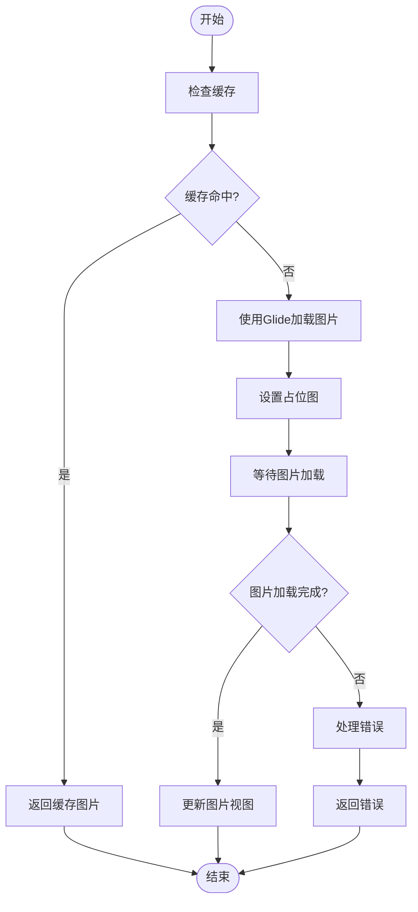
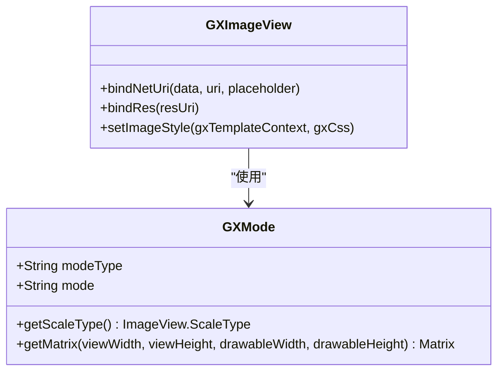
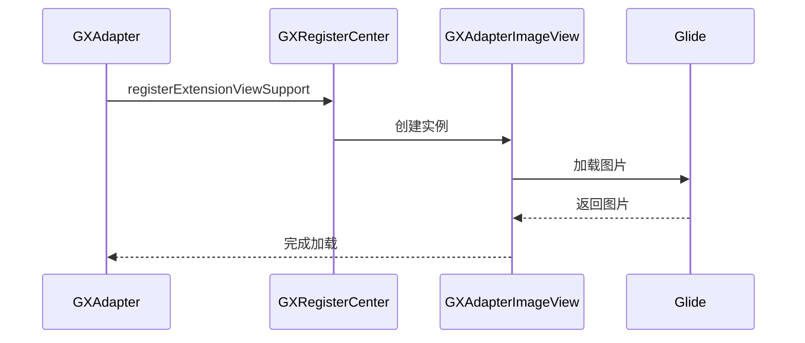

# 图片适配器

<cite>
**本文档引用的文件**   
- [GXAdapterImageView.kt](file://GaiaXAndroidAdapter/src/main/java/com/alibaba/gaiax/adapter/GXAdapterImageView.kt)
- [GXImageView.kt](file://GaiaXAndroid/src/main/kotlin/com/alibaba/gaiax/render/view/basic/GXImageView.kt)
- [GXMode.kt](file://GaiaXAndroid/src/main/kotlin/com/alibaba/gaiax/template/GXMode.kt)
- [GXTemplateKey.kt](file://GaiaXAndroid/src/main/kotlin/com/alibaba/gaiax/template/GXTemplateKey.kt)
- [GXAdapter.kt](file://GaiaXAndroidAdapter/src/main/java/com/alibaba/gaiax/adapter/GXAdapter.kt)
</cite>

## 目录
1. [简介](#简介)
2. [核心组件](#核心组件)
3. [图片加载流程](#图片加载流程)
4. [缓存策略](#缓存策略)
5. [占位图处理](#占位图处理)
6. [错误状态管理](#错误状态管理)
7. [图片尺寸计算与缩放模式](#图片尺寸计算与缩放模式)
8. [裁剪策略](#裁剪策略)
9. [集成自定义图片库](#集成自定义图片库)
10. [图片资源管理最佳实践](#图片资源管理最佳实践)
11. [结论](#结论)

## 简介
本文档详细说明了 GaiaX 框架中 Android 图片适配器 GXAdapterImageView 的实现原理和使用方法。重点文档化了图片加载流程、缓存策略、占位图处理和错误状态管理。同时，说明了如何将自定义图片库（如 Glide、Picasso）集成到适配器中，包括图片加载器的替换方法和配置选项。此外，还提供了图片资源管理的最佳实践，包括内存优化、网络请求控制和图片格式支持。

## 核心组件

GXAdapterImageView 是 GaiaX 框架中用于处理图片显示的核心组件。它继承自 GXImageView，并通过 Glide 实现了网络图片的加载和缓存功能。GXImageView 提供了基本的图片显示功能，包括本地图片和网络图片的加载，以及图片的缩放和裁剪。

**Section sources**
- [GXAdapterImageView.kt](file://GaiaXAndroidAdapter/src/main/java/com/alibaba/gaiax/adapter/GXAdapterImageView.kt#L1-L79)
- [GXImageView.kt](file://GaiaXAndroid/src/main/kotlin/com/alibaba/gaiax/render/view/basic/GXImageView.kt#L1-L250)

## 图片加载流程

GXAdapterImageView 的图片加载流程如下：
1. 当需要加载网络图片时，调用 `bindNetUri` 方法。
2. 检查要加载的 URI 是否与缓存中的 URI 一致，如果一致则跳过此次加载逻辑。
3. 使用 Glide 加载图片，并设置占位图。
4. 图片加载完成后，更新图片视图。

**Diagram sources**
- [GXAdapterImageView.kt](file://GaiaXAndroidAdapter/src/main/java/com/alibaba/gaiax/adapter/GXAdapterImageView.kt#L60-L78)

## 缓存策略

GXAdapterImageView 使用 Glide 的缓存机制来提高图片加载效率。Glide 会自动缓存已加载的图片，当再次请求相同 URI 的图片时，直接从缓存中读取，避免重复网络请求。

**Section sources**
- [GXAdapterImageView.kt](file://GaiaXAndroidAdapter/src/main/java/com/alibaba/gaiax/adapter/GXAdapterImageView.kt#L39-L57)

## 占位图处理

占位图仅对网络图片生效。在调用 `bindNetUri` 方法时，可以指定占位图的资源 ID。Glide 会在图片加载完成前显示占位图。

**Section sources**
- [GXAdapterImageView.kt](file://GaiaXAndroidAdapter/src/main/java/com/alibaba/gaiax/adapter/GXAdapterImageView.kt#L70-L74)

## 错误状态管理

GXAdapterImageView 通过 Glide 的 `RequestListener` 来监听图片加载的状态。当图片加载失败时，`onLoadFailed` 方法会被调用，可以在此方法中处理错误状态。

**Section sources**
- [GXAdapterImageView.kt](file://GaiaXAndroidAdapter/src/main/java/com/alibaba/gaiax/adapter/GXAdapterImageView.kt#L53-L57)

## 图片尺寸计算与缩放模式

GXImageView 支持多种图片缩放模式，包括 `scaleToFill`、`aspectFit` 和 `aspectFill`。这些模式通过 `GXMode` 类来实现。`GXMode` 类根据不同的模式返回相应的 `ImageView.ScaleType`。

**Diagram sources**
- [GXMode.kt](file://GaiaXAndroid/src/main/kotlin/com/alibaba/gaiax/template/GXMode.kt#L19-L48)
- [GXImageView.kt](file://GaiaXAndroid/src/main/kotlin/com/alibaba/gaiax/render/view/basic/GXImageView.kt#L175-L185)

## 裁剪策略

GXImageView 支持多种图片裁剪模式，包括 `left`、`right`、`top`、`bottom` 等。这些模式通过 `GXMode` 类的 `getMatrix` 方法来实现。`getMatrix` 方法根据不同的模式返回相应的 `Matrix` 对象，用于裁剪图片。

**Section sources**
- [GXMode.kt](file://GaiaXAndroid/src/main/kotlin/com/alibaba/gaiax/template/GXMode.kt#L51-L67)

## 集成自定义图片库

可以通过继承 `GXTemplateEngine.GXIAdapter` 接口来集成自定义图片库。在 `init` 方法中注册自定义的图片加载器。

**Diagram sources**
- [GXAdapter.kt](file://GaiaXAndroidAdapter/src/main/java/com/alibaba/gaiax/adapter/GXAdapter.kt#L31-L61)

## 图片资源管理最佳实践

1. **内存优化**：使用 Glide 的缓存机制，避免重复加载相同的图片。
2. **网络请求控制**：合理设置图片的尺寸和格式，减少网络传输的数据量。
3. **图片格式支持**：支持多种图片格式，如 JPEG、PNG、WebP 等。

**Section sources**
- [GXAdapterImageView.kt](file://GaiaXAndroidAdapter/src/main/java/com/alibaba/gaiax/adapter/GXAdapterImageView.kt#L75-L76)

## 结论

GXAdapterImageView 是一个功能强大的图片适配器，支持多种图片加载、缓存、占位图处理和错误状态管理功能。通过集成自定义图片库，可以进一步扩展其功能。合理的图片资源管理可以显著提升应用的性能和用户体验。