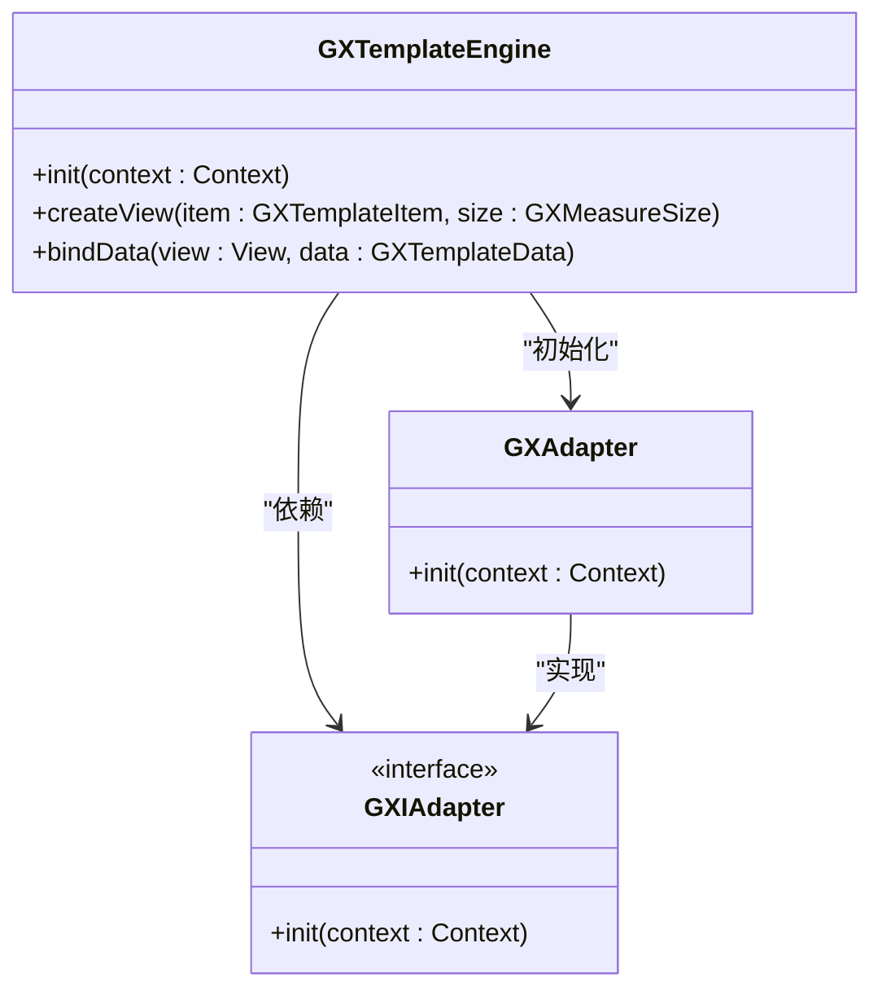
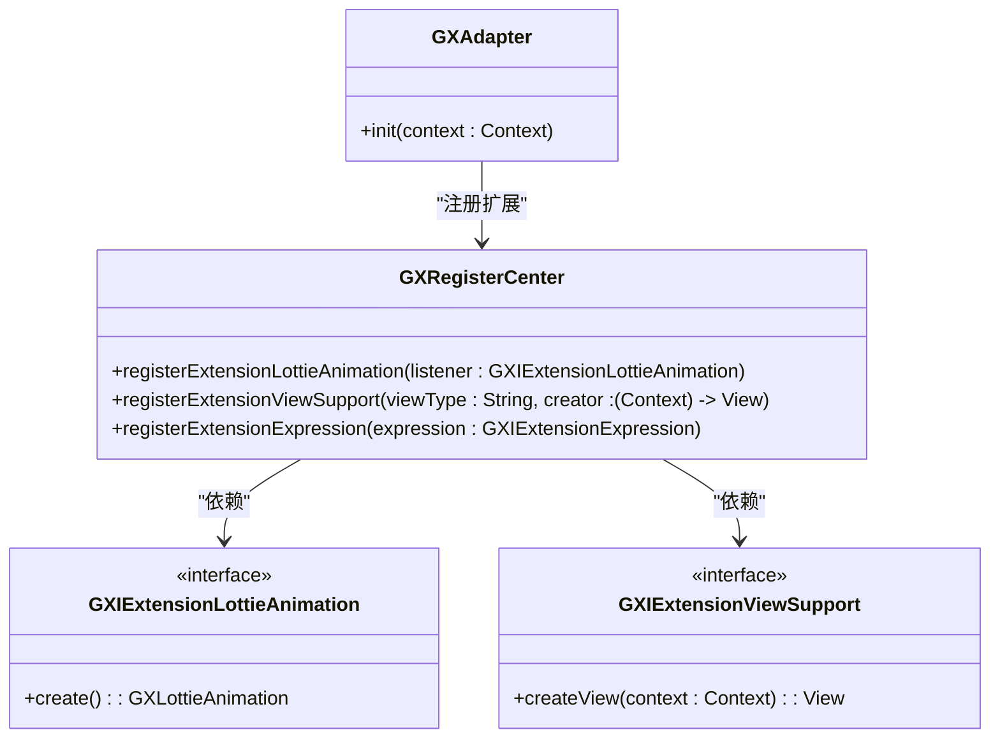
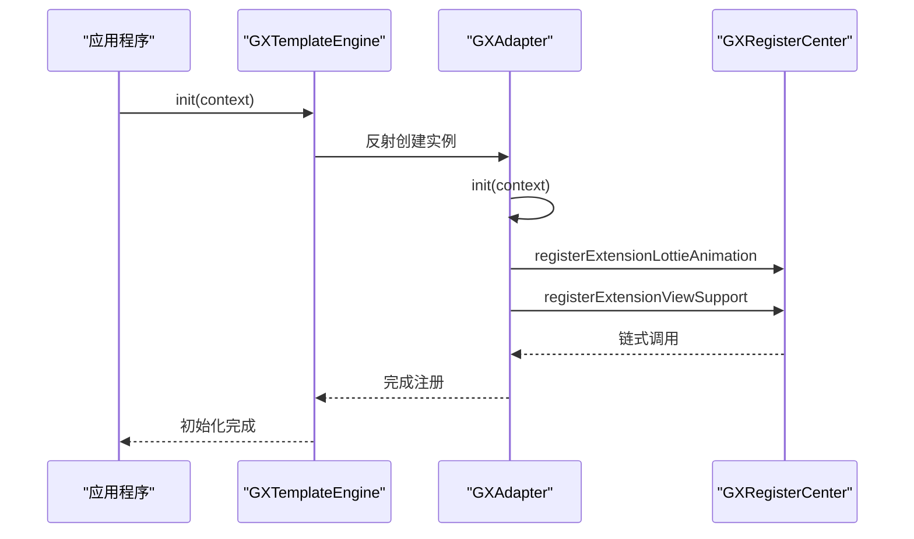
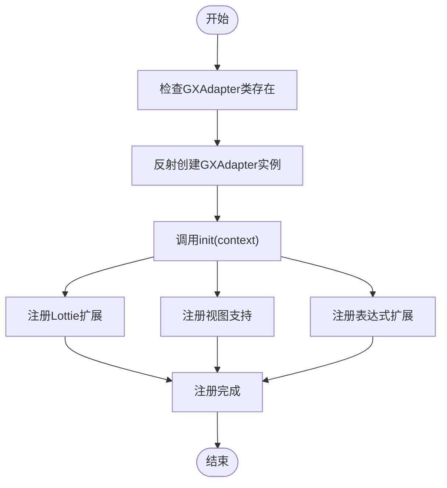
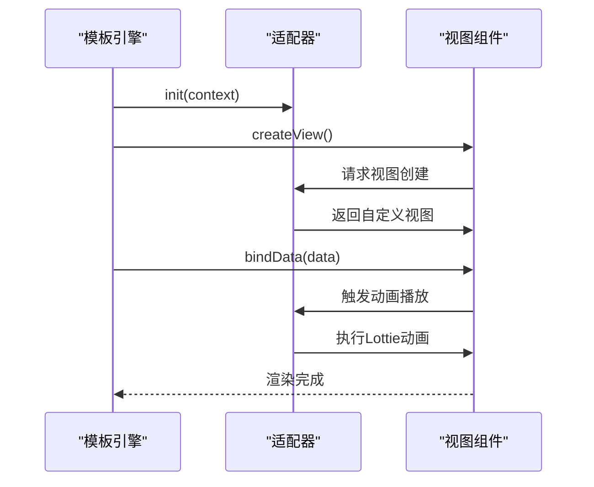

# 基础适配器

<cite>
**本文档引用文件**  
- [GXAdapter.kt](file://GaiaXAndroidAdapter/src/main/java/com/alibaba/gaiax/adapter/GXAdapter.kt)
- [GXTemplateEngine.kt](file://GaiaXAndroid/src/main/kotlin/com/alibaba/gaiax/GXTemplateEngine.kt)
- [GXRegisterCenter.kt](file://GaiaXAndroid/src/main/kotlin/com/alibaba/gaiax/GXRegisterCenter.kt)
- [GXLottieAnimation.kt](file://GaiaXAndroid/src/main/kotlin/com/alibaba/gaiax/template/animation/GXLottieAnimation.kt)
- [GXViewKey.kt](file://GaiaXAndroid/src/main/kotlin/com/alibaba/gaiax/render/view/GXViewKey.kt)
- [GXAdapterImageView.kt](file://GaiaXAndroidAdapter/src/main/java/com/alibaba/gaiax/adapter/GXAdapterImageView.kt)
- [GXAdapterLottieAnimation.kt](file://GaiaXAndroidAdapter/src/main/java/com/alibaba/gaiax/adapter/GXAdapterLottieAnimation.kt)
</cite>

## 目录
1. [简介](#简介)
2. [适配器模式在GaiaX中的应用](#适配器模式在gaiax中的应用)
3. [GXAdapter抽象基类设计](#gxadapter抽象基类设计)
4. [核心方法调用时机与实现要求](#核心方法调用时机与实现要求)
5. [自定义适配器开发指南](#自定义适配器开发指南)
6. [适配器与模板引擎交互机制](#适配器与模板引擎交互机制)
7. [错误处理与生命周期管理](#错误处理与生命周期管理)
8. [扩展点与注册流程](#扩展点与注册流程)

## 简介
GaiaX框架中的基础适配器模块为Android平台提供了动态模板渲染的核心扩展能力。通过适配器模式，开发者可以灵活地集成自定义组件、动画和视图支持，实现跨平台一致的UI表现。本文档详细说明了`GXAdapter`抽象基类的设计原理、使用规范以及与模板引擎的交互机制。

**Section sources**
- [GXAdapter.kt](file://GaiaXAndroidAdapter/src/main/java/com/alibaba/gaiax/adapter/GXAdapter.kt#L1-L62)

## 适配器模式在GaiaX中的应用
适配器模式在GaiaX框架中用于解耦核心引擎与具体实现，允许通过注册机制动态扩展功能。`GXTemplateEngine`定义了`GXIAdapter`接口作为适配器契约，所有扩展功能（如Lottie动画、自定义视图）均通过此接口注入。

该模式实现了以下关键优势：
- **功能解耦**：核心引擎不依赖具体实现，便于维护和升级
- **动态扩展**：运行时可注册新功能，无需修改核心代码
- **平台一致性**：统一的接口规范确保跨平台行为一致



**Diagram sources**
- [GXTemplateEngine.kt](file://GaiaXAndroid/src/main/kotlin/com/alibaba/gaiax/GXTemplateEngine.kt#L78-L927)
- [GXAdapter.kt](file://GaiaXAndroidAdapter/src/main/java/com/alibaba/gaiax/adapter/GXAdapter.kt#L33-L62)

## GXAdapter抽象基类设计
`GXAdapter`作为抽象基类，实现了`GXIAdapter`接口，提供了一套标准化的扩展注册机制。其核心设计包含三个关键扩展点：

1. **Lottie动画扩展**：通过`registerExtensionLottieAnimation`注册自定义动画实现
2. **视图支持扩展**：通过`registerExtensionViewSupport`注册特定类型的视图创建逻辑
3. **表达式扩展**：支持动态表达式解析（未在当前实现中展示）

该设计采用建造者模式，链式调用注册方法，提高了代码可读性和扩展性。



**Diagram sources**
- [GXAdapter.kt](file://GaiaXAndroidAdapter/src/main/java/com/alibaba/gaiax/adapter/GXAdapter.kt#L33-L62)
- [GXRegisterCenter.kt](file://GaiaXAndroid/src/main/kotlin/com/alibaba/gaiax/GXRegisterCenter.kt#L47-L513)

**Section sources**
- [GXAdapter.kt](file://GaiaXAndroidAdapter/src/main/java/com/alibaba/gaiax/adapter/GXAdapter.kt#L33-L62)
- [GXRegisterCenter.kt](file://GaiaXAndroid/src/main/kotlin/com/alibaba/gaiax/GXRegisterCenter.kt#L277-L280)

## 核心方法调用时机与实现要求
### init方法
`init`方法在`GXTemplateEngine`初始化时被调用，是注册所有扩展功能的入口点。必须在应用启动早期完成注册，确保后续模板渲染能正确使用扩展功能。

#### 调用流程


**Diagram sources**
- [GXAdapter.kt](file://GaiaXAndroidAdapter/src/main/java/com/alibaba/gaiax/adapter/GXAdapter.kt#L36-L61)
- [GXTemplateEngine.kt](file://GaiaXAndroid/src/main/kotlin/com/alibaba/gaiax/GXTemplateEngine.kt#L950-L960)

### createView与updateView
虽然`GXAdapter`本身不直接提供`createView`和`updateView`方法，但通过注册的视图支持工厂，间接控制了视图的创建和更新过程：

- **createView时机**：模板解析阶段，根据节点类型调用对应的视图创建器
- **updateView时机**：数据绑定阶段，通过`bindData`触发视图更新

**Section sources**
- [GXAdapter.kt](file://GaiaXAndroidAdapter/src/main/java/com/alibaba/gaiax/adapter/GXAdapter.kt#L46-L59)
- [GXTemplateEngine.kt](file://GaiaXAndroid/src/main/kotlin/com/alibaba/gaiax/GXTemplateEngine.kt#L558-L583)

## 自定义适配器开发指南
### 继承GXAdapter基类
创建自定义适配器需继承`GXAdapter`并重写`init`方法：

```kotlin
class CustomAdapter : GXAdapter() {
    override fun init(context: Context) {
        super.init(context)
        // 注册自定义扩展
    }
}
```

### 重写必要方法
必须实现`init`方法，在其中完成所有扩展注册：

1. **Lottie动画扩展**：
```kotlin
registerExtensionLottieAnimation(object : GXIExtensionLottieAnimation {
    override fun create(): GXLottieAnimation {
        return CustomLottieAnimation()
    }
})
```

2. **自定义视图扩展**：
```kotlin
registerExtensionViewSupport("custom-view") { context ->
    CustomView(context)
}
```

### 注册流程
1. 确保`GXAdapter`类在classpath中
2. `GXTemplateEngine.init()`会自动通过反射发现并初始化适配器
3. 在`init`方法中完成所有扩展注册



**Diagram sources**
- [GXAdapter.kt](file://GaiaXAndroidAdapter/src/main/java/com/alibaba/gaiax/adapter/GXAdapter.kt#L36-L61)
- [GXTemplateEngine.kt](file://GaiaXAndroid/src/main/kotlin/com/alibaba/gaiax/GXTemplateEngine.kt#L950-L960)

**Section sources**
- [GXAdapter.kt](file://GaiaXAndroidAdapter/src/main/java/com/alibaba/gaiax/adapter/GXAdapter.kt#L33-L62)
- [GXTemplateEngine.kt](file://GaiaXAndroid/src/main/kotlin/com/alibaba/gaiax/GXTemplateEngine.kt#L950-L960)

## 适配器与模板引擎交互机制
### 数据传递方式
适配器通过`GXRegisterCenter`单例与模板引擎通信，采用回调机制传递数据：

- **上下文传递**：`GXTemplateContext`包含模板渲染所需的所有上下文信息
- **节点数据**：`GXNode`对象封装了节点的样式、数据和状态
- **事件回调**：通过`GXIEventListener`接收用户交互事件

### 交互时序


**Diagram sources**
- [GXAdapter.kt](file://GaiaXAndroidAdapter/src/main/java/com/alibaba/gaiax/adapter/GXAdapter.kt#L36-L61)
- [GXTemplateEngine.kt](file://GaiaXAndroid/src/main/kotlin/com/alibaba/gaiax/GXTemplateEngine.kt#L558-L583)

**Section sources**
- [GXAdapter.kt](file://GaiaXAndroidAdapter/src/main/java/com/alibaba/gaiax/adapter/GXAdapter.kt#L33-L62)
- [GXTemplateEngine.kt](file://GaiaXAndroid/src/main/kotlin/com/alibaba/gaiax/GXTemplateEngine.kt#L558-L583)

## 错误处理与生命周期管理
### 错误处理机制
适配器通过`GXExceptionHelper`统一处理异常，确保不会因扩展功能错误导致应用崩溃：

- **异常捕获**：所有核心方法均包含try-catch块
- **降级策略**：异常时返回null或默认值
- **日志记录**：通过`Log`组件输出调试信息

### 生命周期管理
适配器的生命周期与`GXTemplateEngine`完全同步：

1. **初始化**：`init`方法被调用时
2. **运行时**：处理视图创建和数据绑定
3. **销毁**：随引擎销毁而终止

```mermaid
stateDiagram-v2
[*] --> 初始化
初始化 --> 运行中 : init()调用
运行中 --> 销毁 : destroyView()
销毁 --> [*]
state 运行中 {
[*] --> 视图创建
[*] --> 数据绑定
[*] --> 动画播放
视图创建 --> 运行中
数据绑定 --> 运行中
动画播放 --> 运行中
}
```

**Diagram sources**
- [GXAdapter.kt](file://GaiaXAndroidAdapter/src/main/java/com/alibaba/gaiax/adapter/GXAdapter.kt#L36-L61)
- [GXTemplateEngine.kt](file://GaiaXAndroid/src/main/kotlin/com/alibaba/gaiax/GXTemplateEngine.kt#L627-L630)

**Section sources**
- [GXAdapter.kt](file://GaiaXAndroidAdapter/src/main/java/com/alibaba/gaiax/adapter/GXAdapter.kt#L33-L62)
- [GXTemplateEngine.kt](file://GaiaXAndroid/src/main/kotlin/com/alibaba/gaiax/GXTemplateEngine.kt#L627-L630)

## 扩展点与注册流程
### 主要扩展点
| 扩展点 | 接口 | 用途 |
|-------|------|------|
| Lottie动画 | GXIExtensionLottieAnimation | 自定义Lottie动画行为 |
| 视图支持 | GXIExtensionViewSupport | 注册自定义视图类型 |
| 表达式解析 | GXIExtensionExpression | 扩展动态表达式能力 |
| 数据绑定 | GXIExtensionDataBinding | 自定义数据绑定逻辑 |

### 注册优先级
注册支持优先级设置，数字越小优先级越高：

```kotlin
registerExtensionTemplateSource(source, priority = 0)
```

这允许开发者覆盖默认实现，实现功能定制。

**Section sources**
- [GXRegisterCenter.kt](file://GaiaXAndroid/src/main/kotlin/com/alibaba/gaiax/GXRegisterCenter.kt#L370-L375)
- [GXAdapter.kt](file://GaiaXAndroidAdapter/src/main/java/com/alibaba/gaiax/adapter/GXAdapter.kt#L39-L59)