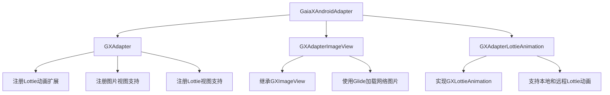
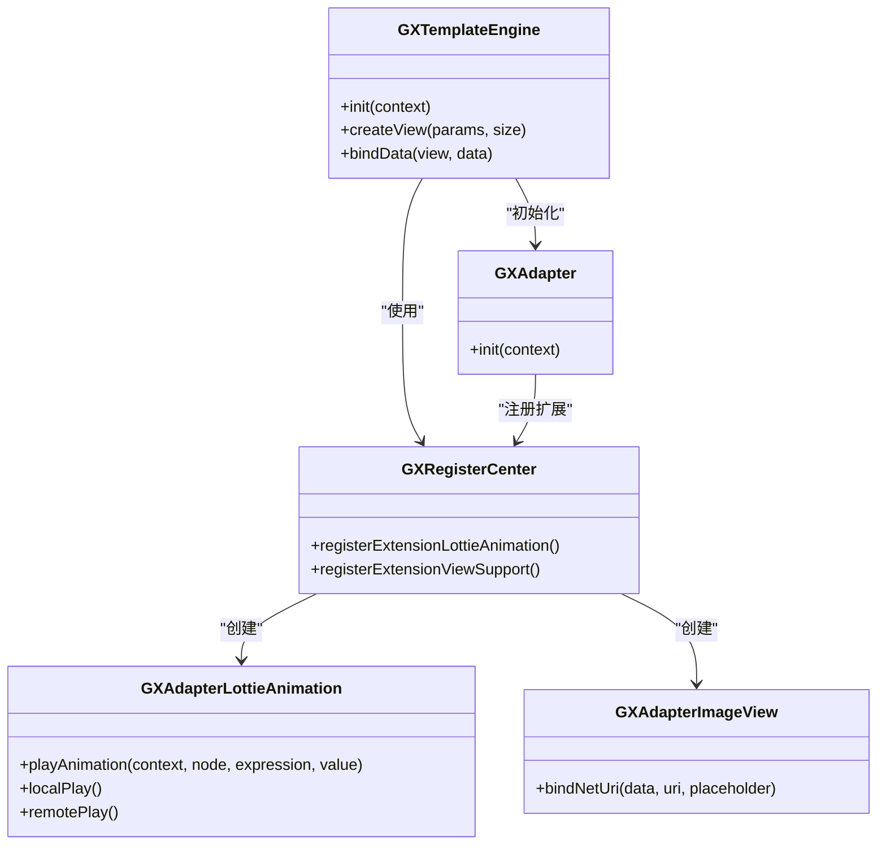
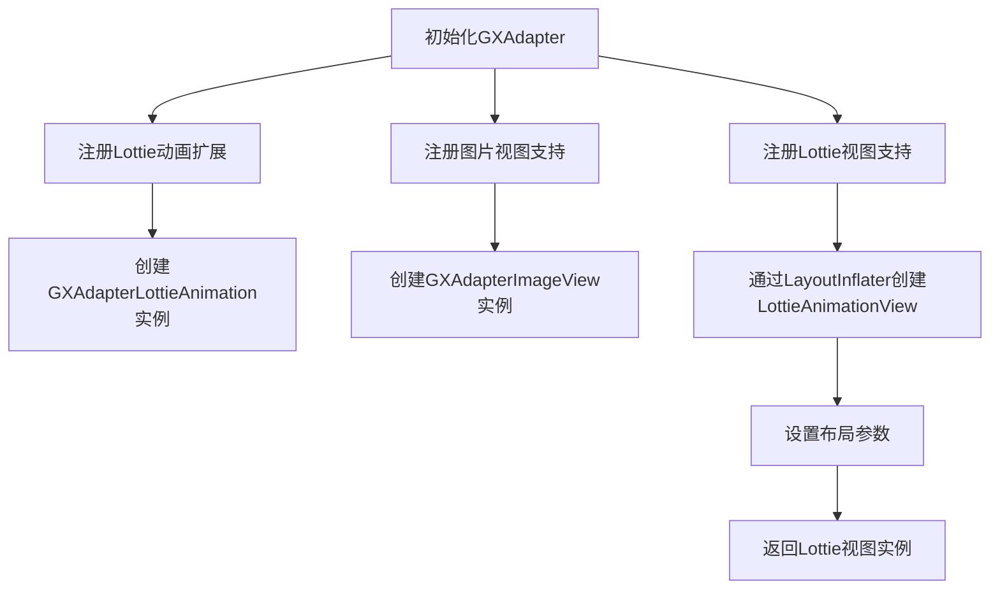
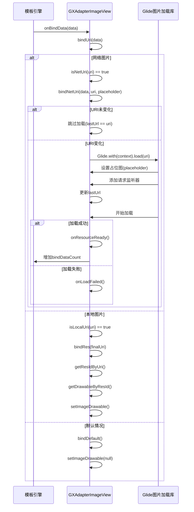
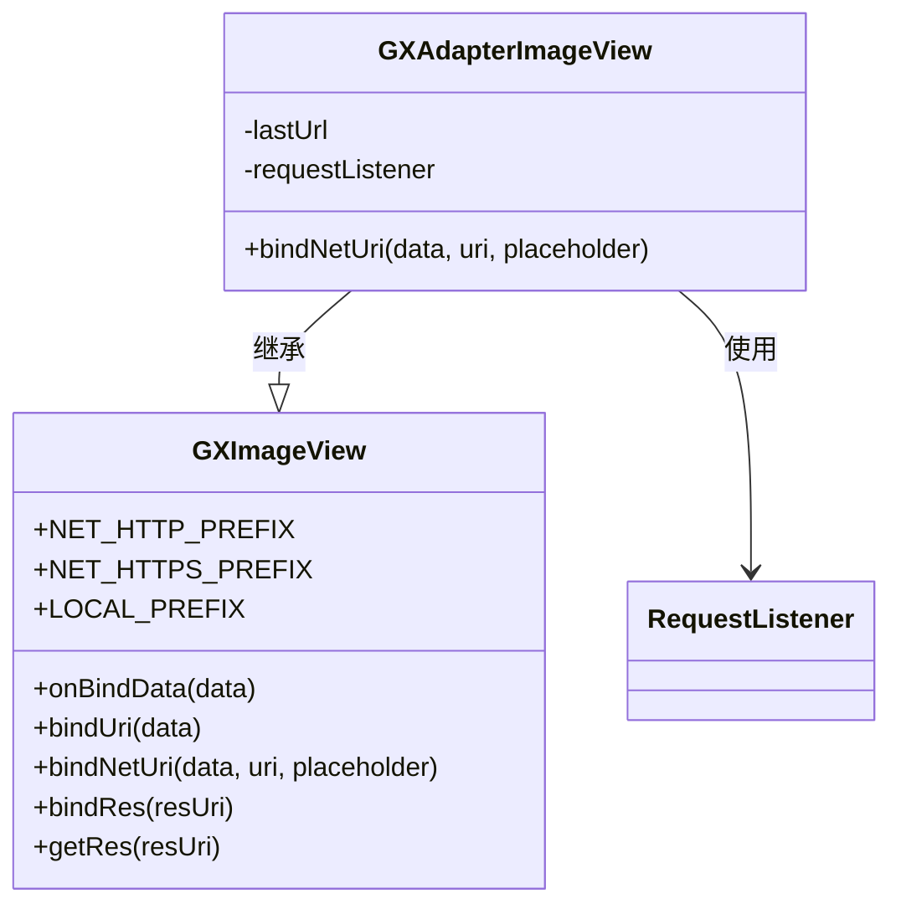
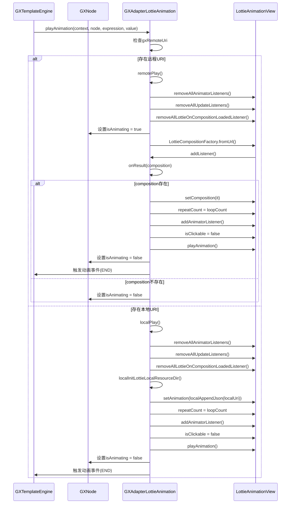
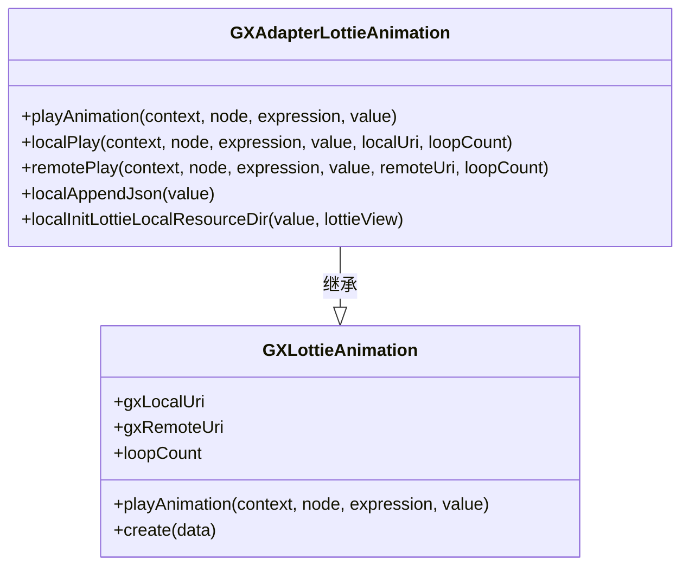
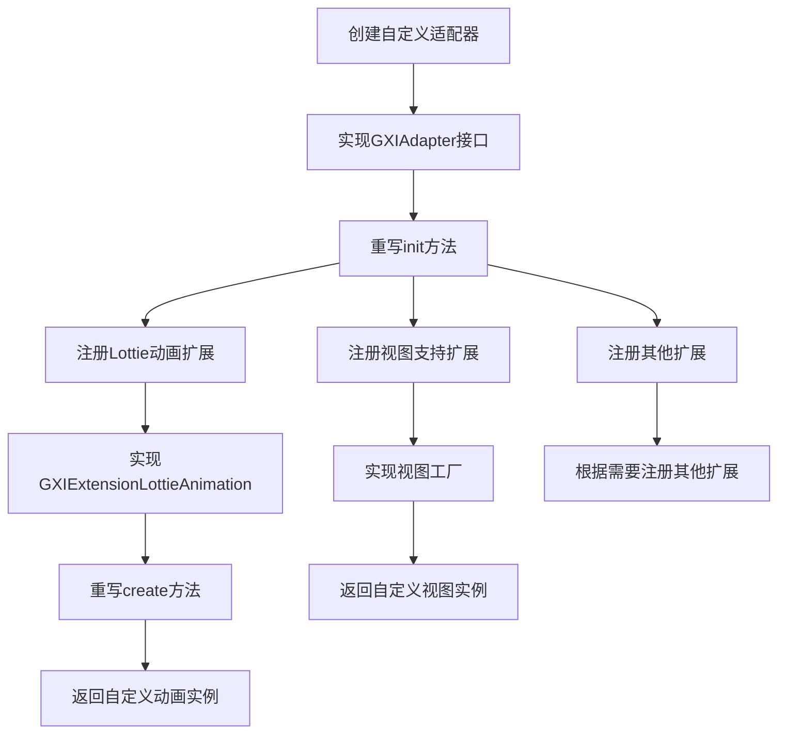
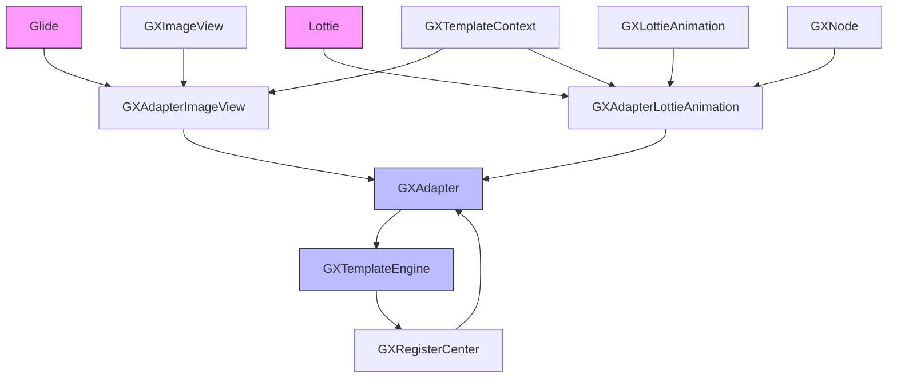

# 适配器

<cite>
**本文档引用文件**   
- [GXAdapter.kt](file://GaiaXAndroidAdapter/src/main/java/com/alibaba/gaiax/adapter/GXAdapter.kt)
- [GXAdapterImageView.kt](file://GaiaXAndroidAdapter/src/main/java/com/alibaba/gaiax/adapter/GXAdapterImageView.kt)
- [GXAdapterLottieAnimation.kt](file://GaiaXAndroidAdapter/src/main/java/com/alibaba/gaiax/adapter/GXAdapterLottieAnimation.kt)
- [GXImageView.kt](file://GaiaXAndroid/src/main/kotlin/com/alibaba/gaiax/render/view/basic/GXImageView.kt)
- [GXLottieAnimation.kt](file://GaiaXAndroid/src/main/kotlin/com/alibaba/gaiax/template/animation/GXLottieAnimation.kt)
- [GXTemplateEngine.kt](file://GaiaXAndroid/src/main/kotlin/com/alibaba/gaiax/GXTemplateEngine.kt)
</cite>

## 目录
1. [简介](#简介)
2. [项目结构](#项目结构)
3. [核心组件](#核心组件)
4. [架构概述](#架构概述)
5. [详细组件分析](#详细组件分析)
6. [依赖分析](#依赖分析)
7. [性能考虑](#性能考虑)
8. [故障排除指南](#故障排除指南)
9. [结论](#结论)

## 简介
本文档详细说明了GaiaX Android适配器模块的设计与实现，重点介绍GXAdapter基类的设计模式和使用规范。文档涵盖了GXAdapterImageView的图片加载流程、缓存策略和自定义图片库集成方法，以及GXAdapterLottieAnimation的Lottie动画播放控制、资源管理和性能优化技巧。同时提供了自定义适配器的开发指南，包括接口定义、生命周期管理和错误处理机制。

## 项目结构
GaiaXAndroidAdapter模块是GaiaX框架的Android适配器实现，主要负责图片和Lottie动画等特定组件的渲染适配。该模块通过GXAdapter类注册扩展功能，为GXTemplateEngine提供具体的视图支持和动画实现。

**图示来源**
- [GXAdapter.kt](file://GaiaXAndroidAdapter/src/main/java/com/alibaba/gaiax/adapter/GXAdapter.kt)
- [GXAdapterImageView.kt](file://GaiaXAndroidAdapter/src/main/java/com/alibaba/gaiax/adapter/GXAdapterImageView.kt)
- [GXAdapterLottieAnimation.kt](file://GaiaXAndroidAdapter/src/main/java/com/alibaba/gaiax/adapter/GXAdapterLottieAnimation.kt)

**本节来源**
- [GXAdapter.kt](file://GaiaXAndroidAdapter/src/main/java/com/alibaba/gaiax/adapter/GXAdapter.kt)
- [GXAdapterImageView.kt](file://GaiaXAndroidAdapter/src/main/java/com/alibaba/gaiax/adapter/GXAdapterImageView.kt)
- [GXAdapterLottieAnimation.kt](file://GaiaXAndroidAdapter/src/main/java/com/alibaba/gaiax/adapter/GXAdapterLottieAnimation.kt)

## 核心组件
适配器模块的核心组件包括GXAdapter基类、GXAdapterImageView图片适配器和GXAdapterLottieAnimation Lottie动画适配器。这些组件通过GXTemplateEngine的扩展机制进行注册和调用，实现了特定功能的定制化渲染。

**本节来源**
- [GXAdapter.kt](file://GaiaXAndroidAdapter/src/main/java/com/alibaba/gaiax/adapter/GXAdapter.kt)
- [GXAdapterImageView.kt](file://GaiaXAndroidAdapter/src/main/java/com/alibaba/gaiax/adapter/GXAdapterImageView.kt)
- [GXAdapterLottieAnimation.kt](file://GaiaXAndroidAdapter/src/main/java/com/alibaba/gaiax/adapter/GXAdapterLottieAnimation.kt)

## 架构概述
适配器模块的架构基于扩展注册模式，通过GXRegisterCenter注册各种扩展功能。GXAdapter作为适配器入口，在初始化时注册Lottie动画、图片视图和Lottie视图的支持，使GXTemplateEngine能够使用这些定制化组件。

**图示来源**
- [GXAdapter.kt](file://GaiaXAndroidAdapter/src/main/java/com/alibaba/gaiax/adapter/GXAdapter.kt)
- [GXTemplateEngine.kt](file://GaiaXAndroid/src/main/kotlin/com/alibaba/gaiax/GXTemplateEngine.kt)

## 详细组件分析

### GXAdapter基类分析
GXAdapter是适配器模块的入口类，实现了GXTemplateEngine.GXIAdapter接口。在初始化过程中，它通过GXRegisterCenter注册了Lottie动画、图片视图和Lottie视图的支持，为GaiaX模板引擎提供了必要的组件实现。

**图示来源**
- [GXAdapter.kt](file://GaiaXAndroidAdapter/src/main/java/com/alibaba/gaiax/adapter/GXAdapter.kt)

**本节来源**
- [GXAdapter.kt](file://GaiaXAndroidAdapter/src/main/java/com/alibaba/gaiax/adapter/GXAdapter.kt)

### GXAdapterImageView分析
GXAdapterImageView是图片组件的适配器实现，继承自GXImageView并重写了图片加载逻辑。它使用Glide库处理网络图片加载，实现了缓存策略和占位图功能。

#### 图片加载流程

**图示来源**
- [GXAdapterImageView.kt](file://GaiaXAndroidAdapter/src/main/java/com/alibaba/gaiax/adapter/GXAdapterImageView.kt)
- [GXImageView.kt](file://GaiaXAndroid/src/main/kotlin/com/alibaba/gaiax/render/view/basic/GXImageView.kt)

#### 缓存策略与自定义图片库集成
GXAdapterImageView实现了智能缓存策略，通过lastUrl字段记录最近加载的URL，避免重复加载相同的网络图片。当请求的URI与缓存一致时，直接跳过加载逻辑。

对于自定义图片库的集成，开发者可以通过继承GXAdapterImageView并重写bindNetUri方法来实现。适配器提供了getRes方法用于获取资源ID，方便处理占位图和其他资源引用。

**图示来源**
- [GXAdapterImageView.kt](file://GaiaXAndroidAdapter/src/main/java/com/alibaba/gaiax/adapter/GXAdapterImageView.kt)
- [GXImageView.kt](file://GaiaXAndroid/src/main/kotlin/com/alibaba/gaiax/render/view/basic/GXImageView.kt)

**本节来源**
- [GXAdapterImageView.kt](file://GaiaXAndroidAdapter/src/main/java/com/alibaba/gaiax/adapter/GXAdapterImageView.kt)
- [GXImageView.kt](file://GaiaXAndroid/src/main/kotlin/com/alibaba/gaiax/render/view/basic/GXImageView.kt)

### GXAdapterLottieAnimation分析
GXAdapterLottieAnimation是Lottie动画组件的适配器实现，继承自GXLottieAnimation并重写了动画播放逻辑。它支持本地和远程Lottie动画文件的播放，提供了完整的动画控制和资源管理功能。

#### Lottie动画播放控制

**图示来源**
- [GXAdapterLottieAnimation.kt](file://GaiaXAndroidAdapter/src/main/java/com/alibaba/gaiax/adapter/GXAdapterLottieAnimation.kt)
- [GXLottieAnimation.kt](file://GaiaXAndroid/src/main/kotlin/com/alibaba/gaiax/template/animation/GXLottieAnimation.kt)

#### 资源管理与性能优化
GXAdapterLottieAnimation实现了完善的资源管理机制，包括：

1. **资源路径处理**：通过localAppendJson方法确保本地资源路径以.json结尾
2. **资源目录设置**：通过localInitLottieLocalResourceDir方法设置Lottie动画的资源目录
3. **内存管理**：在播放前移除所有监听器，避免内存泄漏
4. **循环播放控制**：根据loopCount参数设置重复次数

性能优化技巧包括：
- 使用缓存避免重复加载相同的动画
- 在动画结束时清理所有监听器
- 支持本地和远程动画的异步加载
- 提供动画开始和结束的事件回调

**图示来源**
- [GXAdapterLottieAnimation.kt](file://GaiaXAndroidAdapter/src/main/java/com/alibaba/gaiax/adapter/GXAdapterLottieAnimation.kt)
- [GXLottieAnimation.kt](file://GaiaXAndroid/src/main/kotlin/com/alibaba/gaiax/template/animation/GXLottieAnimation.kt)

**本节来源**
- [GXAdapterLottieAnimation.kt](file://GaiaXAndroidAdapter/src/main/java/com/alibaba/gaiax/adapter/GXAdapterLottieAnimation.kt)
- [GXLottieAnimation.kt](file://GaiaXAndroid/src/main/kotlin/com/alibaba/gaiax/template/animation/GXLottieAnimation.kt)

### 自定义适配器开发指南
开发自定义适配器需要遵循以下步骤和规范：

#### 接口定义
自定义适配器需要实现GXTemplateEngine.GXIAdapter接口，并在init方法中注册所需的扩展功能。主要的扩展点包括：
- Lottie动画扩展：GXRegisterCenter.GXIExtensionLottieAnimation
- 视图支持扩展：通过registerExtensionViewSupport注册自定义视图
- 其他功能扩展：根据需要注册表达式、模板源等扩展

#### 生命周期管理
适配器的生命周期与GXTemplateEngine的初始化过程紧密相关：
1. GXTemplateEngine初始化时调用适配器的init方法
2. 适配器在init方法中注册各种扩展功能
3. 当模板不再需要时，通过destroyView方法清理资源

#### 错误处理机制
适配器应实现健壮的错误处理机制：
- 在图片加载失败时提供默认处理
- 在动画加载失败时避免崩溃
- 记录关键操作的日志以便调试
- 使用try-catch块保护可能出错的代码

**本节来源**
- [GXAdapter.kt](file://GaiaXAndroidAdapter/src/main/java/com/alibaba/gaiax/adapter/GXAdapter.kt)
- [GXTemplateEngine.kt](file://GaiaXAndroid/src/main/kotlin/com/alibaba/gaiax/GXTemplateEngine.kt)

## 依赖分析
适配器模块依赖于多个外部库和内部组件，形成了完整的依赖关系网络。

**图示来源**
- [GXAdapter.kt](file://GaiaXAndroidAdapter/src/main/java/com/alibaba/gaiax/adapter/GXAdapter.kt)
- [GXAdapterImageView.kt](file://GaiaXAndroidAdapter/src/main/java/com/alibaba/gaiax/adapter/GXAdapterImageView.kt)
- [GXAdapterLottieAnimation.kt](file://GaiaXAndroidAdapter/src/main/java/com/alibaba/gaiax/adapter/GXAdapterLottieAnimation.kt)

**本节来源**
- [GXAdapter.kt](file://GaiaXAndroidAdapter/src/main/java/com/alibaba/gaiax/adapter/GXAdapter.kt)
- [GXAdapterImageView.kt](file://GaiaXAndroidAdapter/src/main/java/com/alibaba/gaiax/adapter/GXAdapterImageView.kt)
- [GXAdapterLottieAnimation.kt](file://GaiaXAndroidAdapter/src/main/java/com/alibaba/gaiax/adapter/GXAdapterLottieAnimation.kt)

## 性能考虑
适配器模块在设计时充分考虑了性能优化，主要体现在以下几个方面：

1. **图片加载优化**：通过lastUrl缓存避免重复加载相同的网络图片
2. **内存管理**：在动画播放前后清理所有监听器，防止内存泄漏
3. **异步加载**：远程Lottie动画采用异步加载，避免阻塞主线程
4. **资源复用**：支持本地和远程资源的高效加载和缓存

## 故障排除指南
在使用适配器模块时可能遇到的常见问题及解决方案：

1. **图片不显示**：检查URI格式是否正确，确保网络图片以http:或https:开头，本地图片以local:开头
2. **Lottie动画不播放**：确认动画文件路径正确，检查资源目录设置
3. **内存泄漏**：确保在适当的时候调用destroyView清理资源
4. **性能问题**：避免在短时间内频繁创建和销毁大量适配器实例

**本节来源**
- [GXAdapterImageView.kt](file://GaiaXAndroidAdapter/src/main/java/com/alibaba/gaiax/adapter/GXAdapterImageView.kt)
- [GXAdapterLottieAnimation.kt](file://GaiaXAndroidAdapter/src/main/java/com/alibaba/gaiax/adapter/GXAdapterLottieAnimation.kt)

## 结论
GaiaX Android适配器模块通过GXAdapter基类提供了灵活的扩展机制，实现了GXAdapterImageView和GXAdapterLottieAnimation等具体组件的定制化渲染。该模块设计合理，具有良好的可扩展性和性能表现，为开发者提供了完整的自定义适配器开发指南，能够满足各种复杂的UI渲染需求。