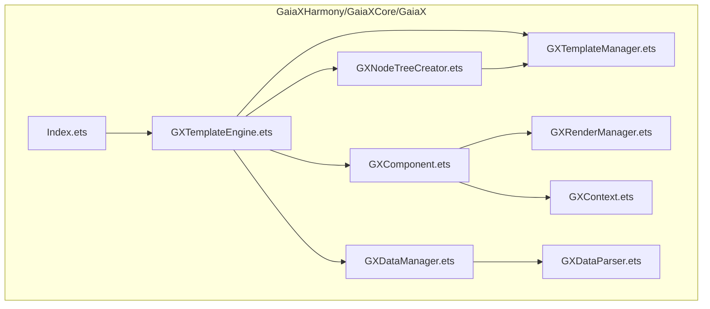
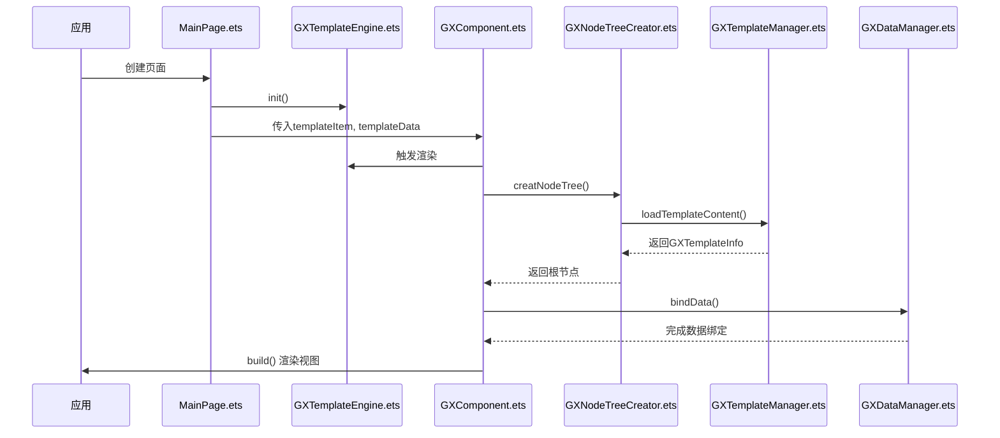
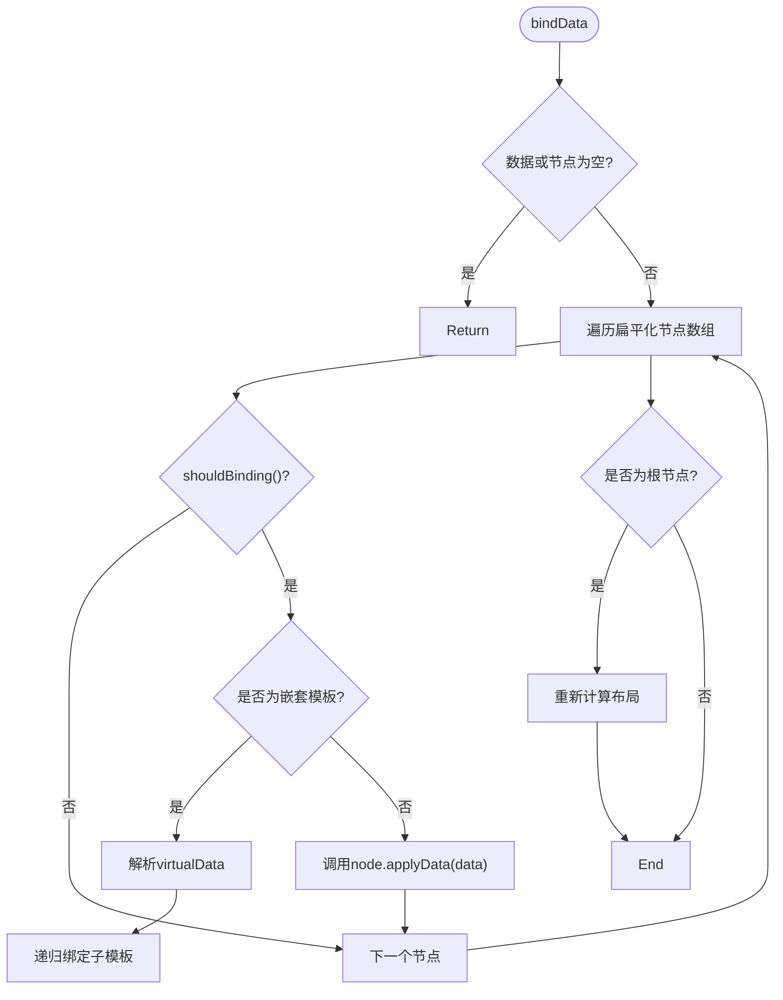
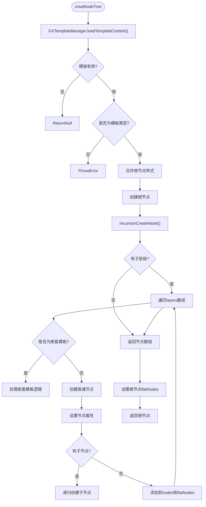
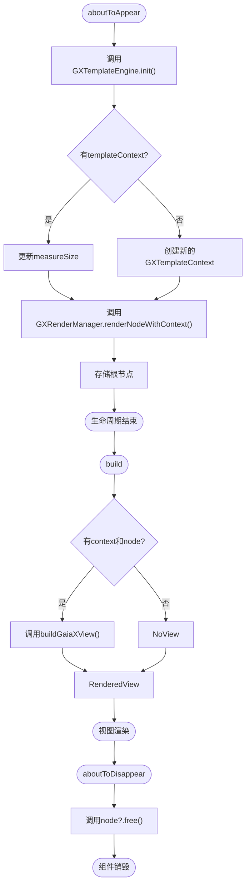
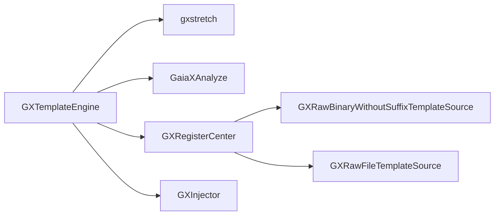

# HarmonyOS API

<cite>
**本文档引用文件**  
- [Index.ets](file://GaiaXHarmony/GaiaXCore/GaiaX/Index.ets)
- [GXTemplateEngine.ets](file://GaiaXHarmony/GaiaXCore/GaiaX/src/main/ets/GXTemplateEngine.ets)
- [GXDataManager.ets](file://GaiaXHarmony/GaiaXCore/GaiaX/src/main/ets/binding/GXDataManager.ets)
- [GXNodeTreeCreator.ets](file://GaiaXHarmony/GaiaXCore/GaiaX/src/main/ets/creator/GXNodeTreeCreator.ets)
- [GXComponent.ets](file://GaiaXHarmony/GaiaXCore/GaiaX/src/main/ets/components/GXComponent.ets)
- [MainPage.ets](file://GaiaXHarmony/GaiaXCore/GaiaX/src/main/ets/components/mainpage/MainPage.ets)
- [GXTemplateManager.ets](file://GaiaXHarmony/GaiaXCore/GaiaX/src/main/ets/template/GXTemplateManager.ets)
- [GXContext.ets](file://GaiaXHarmony/GaiaXCore/GaiaX/src/main/ets/utils/GXContext.ets)
- [hvigorfile.ts](file://GaiaXHarmony/GaiaXCore/GaiaX/hvigorfile.ts)
</cite>

## 目录
1. [简介](#简介)
2. [项目结构](#项目结构)
3. [核心组件](#核心组件)
4. [架构概述](#架构概述)
5. [详细组件分析](#详细组件分析)
6. [依赖分析](#依赖分析)
7. [性能考虑](#性能考虑)
8. [故障排除指南](#故障排除指南)
9. [结论](#结论)

## 简介
本文档旨在为HarmonyOS开发者提供GaiaX框架的全面API参考，重点围绕ArkTS语言的集成与使用。文档以`Index.ets`文件的导出接口为核心，深入解析GXTemplateEngine的初始化、模板加载与渲染流程，GXDataManager的数据绑定机制，以及GXNodeTreeCreator的节点创建逻辑。同时涵盖ArkTS模块导入、hvigor构建系统配置、页面生命周期管理、状态更新、类型系统交互及性能优化建议，为开发者提供从项目创建到调试部署的全流程指导。

## 项目结构
GaiaX-Github-Sync仓库是一个多平台的UI动态化框架，其中`GaiaXHarmony`目录专为HarmonyOS平台构建。其核心模块`GaiaXCore`遵循清晰的分层架构，主要包含以下部分：
- **src/main/ets**: ArkTS源码目录，包含所有核心逻辑。
- **binding**: 数据绑定与渲染管理。
- **components**: UI组件定义，如`GXComponent`和`MainPage`。
- **context**: 模板上下文与数据模型。
- **creator**: 节点树创建与管理。
- **template**: 模板加载与缓存。
- **utils**: 工具类，如`GXContext`用于获取设备信息。
- **GXTemplateEngine.ets**: 引擎入口，负责初始化和协调各模块。
- **Index.ets**: 模块导出入口，对外暴露`MainPage`等组件。
- **hvigorfile.ts**: hvigor构建配置文件。



**Diagram sources**
- [Index.ets](file://GaiaXHarmony/GaiaXCore/GaiaX/Index.ets)
- [GXTemplateEngine.ets](file://GaiaXHarmony/GaiaXCore/GaiaX/src/main/ets/GXTemplateEngine.ets)
- [GXComponent.ets](file://GaiaXHarmony/GaiaXCore/GaiaX/src/main/ets/components/GXComponent.ets)
- [GXDataManager.ets](file://GaiaXHarmony/GaiaXCore/GaiaX/src/main/ets/binding/GXDataManager.ets)
- [GXNodeTreeCreator.ets](file://GaiaXHarmony/GaiaXCore/GaiaX/src/main/ets/creator/GXNodeTreeCreator.ets)
- [GXTemplateManager.ets](file://GaiaXHarmony/GaiaXCore/GaiaX/src/main/ets/template/GXTemplateManager.ets)
- [GXContext.ets](file://GaiaXHarmony/GaiaXCore/GaiaX/src/main/ets/utils/GXContext.ets)

**Section sources**
- [Index.ets](file://GaiaXHarmony/GaiaXCore/GaiaX/Index.ets)
- [GXTemplateEngine.ets](file://GaiaXHarmony/GaiaXCore/GaiaX/src/main/ets/GXTemplateEngine.ets)
- [project_structure](file://project_structure)

## 核心组件
核心组件包括`GXTemplateEngine`、`GXDataManager`和`GXNodeTreeCreator`。`GXTemplateEngine`是整个框架的入口和协调中心，负责引擎的初始化、模板的创建与渲染。`GXDataManager`专注于数据绑定逻辑，将JSON数据源与节点树进行关联。`GXNodeTreeCreator`则负责解析模板的JSON结构，并创建相应的节点树。`GXComponent`是一个可复用的ArkTS组件，封装了模板渲染的完整生命周期。

**Section sources**
- [GXTemplateEngine.ets](file://GaiaXHarmony/GaiaXCore/GaiaX/src/main/ets/GXTemplateEngine.ets)
- [GXDataManager.ets](file://GaiaXHarmony/GaiaXCore/GaiaX/src/main/ets/binding/GXDataManager.ets)
- [GXNodeTreeCreator.ets](file://GaiaXHarmony/GaiaXCore/GaiaX/src/main/ets/creator/GXNodeTreeCreator.ets)
- [GXComponent.ets](file://GaiaXHarmony/GaiaXCore/GaiaX/src/main/ets/components/GXComponent.ets)

## 架构概述
GaiaX for HarmonyOS的架构遵循典型的MVC模式，以`GXTemplateEngine`为核心驱动。应用通过`Index.ets`导入`MainPage`，`MainPage`在`aboutToAppear`生命周期中调用`GXTemplateEngine.instance.init()`进行初始化。随后，通过`GXComponent`传入`templateItem`和`templateData`，触发节点树的创建与渲染。`GXNodeTreeCreator`从`GXTemplateManager`加载模板内容，构建节点树；`GXDataManager`将数据绑定到节点上；最终由`GXComponent`的`build`方法完成视图的渲染。



**Diagram sources**
- [MainPage.ets](file://GaiaXHarmony/GaiaXCore/GaiaX/src/main/ets/components/mainpage/MainPage.ets)
- [GXTemplateEngine.ets](file://GaiaXHarmony/GaiaXCore/GaiaX/src/main/ets/GXTemplateEngine.ets)
- [GXComponent.ets](file://GaiaXHarmony/GaiaXCore/GaiaX/src/main/ets/components/GXComponent.ets)
- [GXNodeTreeCreator.ets](file://GaiaXHarmony/GaiaXCore/GaiaX/src/main/ets/creator/GXNodeTreeCreator.ets)
- [GXTemplateManager.ets](file://GaiaXHarmony/GaiaXCore/GaiaX/src/main/ets/template/GXTemplateManager.ets)
- [GXDataManager.ets](file://GaiaXHarmony/GaiaXCore/GaiaX/src/main/ets/binding/GXDataManager.ets)

## 详细组件分析

### GXTemplateEngine分析
`GXTemplateEngine`是单例类，通过`static instance = new GXTemplateEngine()`实现。其`init()`方法是使用框架的第一步，负责初始化底层依赖。

#### 初始化方法
```mermaid
flowchart TD
Start([init()]) --> CheckInit{"isInit?"}
CheckInit --> |否| InitStretch["Stretch.init()"]
CheckInit --> |是| End([已初始化])
InitStretch --> InitAnalyze["configAnalyzeIfNeeded()"]
InitAnalyze --> RegisterSource["注册模板数据源"]
RegisterSource --> SetInit["isInit = true"]
SetInit --> End
```

**Diagram sources**
- [GXTemplateEngine.ets](file://GaiaXHarmony/GaiaXCore/GaiaX/src/main/ets/GXTemplateEngine.ets#L28-L38)

**Section sources**
- [GXTemplateEngine.ets](file://GaiaXHarmony/GaiaXCore/GaiaX/src/main/ets/GXTemplateEngine.ets)

### GXDataManager分析
`GXDataManager`负责将`GXTemplateData`中的JSON数据绑定到由`GXNodeTreeCreator`创建的节点树上。

#### 数据绑定流程


**Diagram sources**
- [GXDataManager.ets](file://GaiaXHarmony/GaiaXCore/GaiaX/src/main/ets/binding/GXDataManager.ets#L29-L94)

**Section sources**
- [GXDataManager.ets](file://GaiaXHarmony/GaiaXCore/GaiaX/src/main/ets/binding/GXDataManager.ets)

### GXNodeTreeCreator分析
`GXNodeTreeCreator`是节点树的构建器，它递归地解析模板的JSON结构，创建相应的`GXNode`实例。

#### 节点创建流程


**Diagram sources**
- [GXNodeTreeCreator.ets](file://GaiaXHarmony/GaiaXCore/GaiaX/src/main/ets/creator/GXNodeTreeCreator.ets#L34-L216)

**Section sources**
- [GXNodeTreeCreator.ets](file://GaiaXHarmony/GaiaXCore/GaiaX/src/main/ets/creator/GXNodeTreeCreator.ets)

### GXComponent分析
`GXComponent`是ArkTS侧的UI组件，它将GaiaX的渲染逻辑封装为一个可直接在页面中使用的`@Component`。

#### 组件生命周期


**Diagram sources**
- [GXComponent.ets](file://GaiaXHarmony/GaiaXCore/GaiaX/src/main/ets/components/GXComponent.ets#L39-L65)

**Section sources**
- [GXComponent.ets](file://GaiaXHarmony/GaiaXCore/GaiaX/src/main/ets/components/GXComponent.ets)

## 依赖分析
GaiaX for HarmonyOS的核心依赖通过`GXTemplateEngine`的`init()`方法进行注册。主要依赖包括：
- **gxstretch**: 由`import { Stretch } from 'gxstretch';`导入，负责Flexbox布局计算，通过`Stretch.init()`初始化。
- **GaiaXAnalyze**: 由`import { configAnalyzeIfNeeded } from 'GaiaXAnalyze';`导入，负责表达式解析。
- **模板数据源**: 通过`GXRegisterCenter`注册，如`GXRawBinaryWithoutSuffixTemplateSource`和`GXRawFileTemplateSource`，用于从不同位置加载模板。
- **图像注入器**: 通过`registerImage`方法注册自定义的图像构建器，实现图片加载的定制化。



**Diagram sources**
- [GXTemplateEngine.ets](file://GaiaXHarmony/GaiaXCore/GaiaX/src/main/ets/GXTemplateEngine.ets#L28-L38)
- [GXRegisterCenter.ets](file://GaiaXHarmony/GaiaXCore/GaiaX/src/main/ets/GXRegisterCenter.ets)

**Section sources**
- [GXTemplateEngine.ets](file://GaiaXHarmony/GaiaXCore/GaiaX/src/main/ets/GXTemplateEngine.ets)
- [GXRegisterCenter.ets](file://GaiaXHarmony/GaiaXCore/GaiaX/src/main/ets/GXRegisterCenter.ets)

## 性能考虑
- **模板缓存**: `GXTemplateManager`内置了`GXTemplateLRUCache`，避免重复加载和解析模板，显著提升性能。
- **节点复用**: 在列表滚动等场景下，可通过`GXExtendParams`传递缓存的节点，实现节点复用，减少创建开销。
- **按需加载**: `GXMeasureSize`允许指定视口大小，框架会根据此大小进行布局计算，避免不必要的渲染。
- **初始化时机**: `GXTemplateEngine`的`init()`方法应尽早调用，最好在应用启动时完成，避免在页面渲染时产生延迟。

## 故障排除指南
- **模板无法加载**: 检查`GXTemplateItem`的`bizId`和`templateId`是否正确，确认模板文件已正确打包到应用资源中，并检查`GXTemplateManager`的`templateSources`是否已正确注册。
- **数据未绑定**: 确认`GXTemplateData.jsonData`已正确赋值，且JSON数据的路径与模板中的绑定表达式匹配。
- **布局错乱**: 检查`measureSize`的设置，特别是宽度，确保其与父容器的宽度一致。确认`gxstretch`已正确初始化。
- **图像不显示**: 如果使用了自定义图像加载，检查`GXInjector.registerImage()`是否已正确调用，并确保图像构建器逻辑无误。
- **构建失败**: 检查`hvigorfile.ts`的配置，确保`@ohos/hvigor-ohos-plugin`已正确导入，且`system`字段指向`harTasks`。

**Section sources**
- [GXTemplateManager.ets](file://GaiaXHarmony/GaiaXCore/GaiaX/src/main/ets/template/GXTemplateManager.ets)
- [GXDataManager.ets](file://GaiaXHarmony/GaiaXCore/GaiaX/src/main/ets/binding/GXDataManager.ets)
- [GXContext.ets](file://GaiaXHarmony/GaiaXCore/GaiaX/src/main/ets/utils/GXContext.ets)
- [hvigorfile.ts](file://GaiaXHarmony/GaiaXCore/GaiaX/hvigorfile.ts)

## 结论
本文档详细阐述了HarmonyOS平台下GaiaX框架的ArkTS API使用方法。通过`Index.ets`导出的`MainPage`作为入口，开发者可以利用`GXTemplateEngine`完成引擎初始化，通过`GXNodeTreeCreator`加载和创建模板节点树，并由`GXDataManager`实现数据绑定。`GXComponent`组件简化了在ArkTS页面中的集成。结合hvigor构建系统，开发者可以高效地构建高性能、动态化的HarmonyOS应用。遵循本文档的指导，可以有效避免常见问题，充分发挥GaiaX框架的优势。