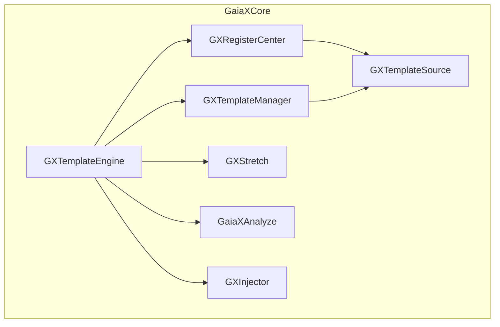
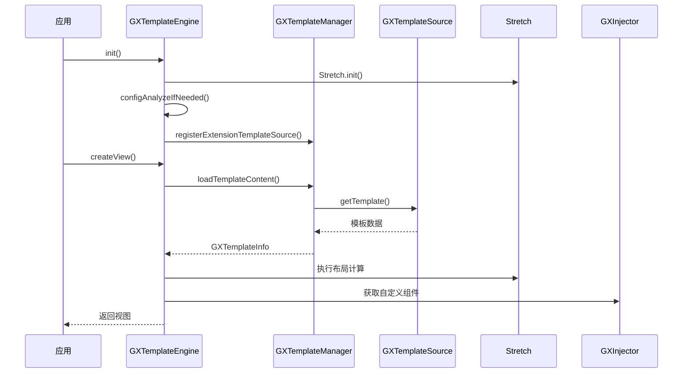
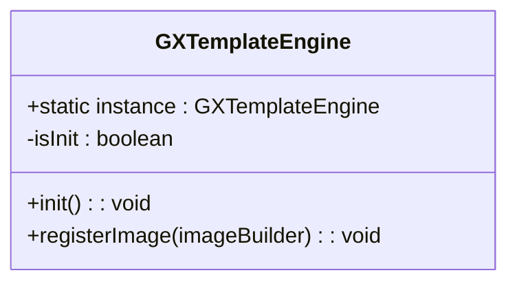
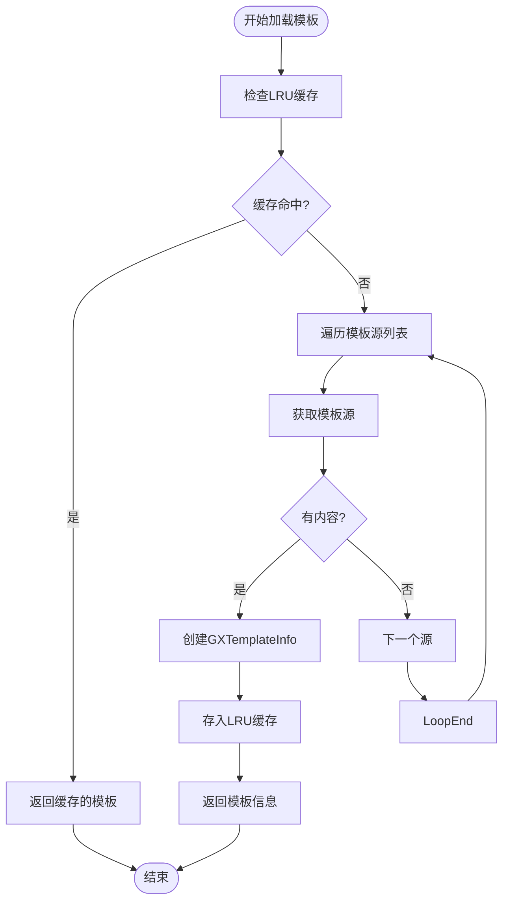
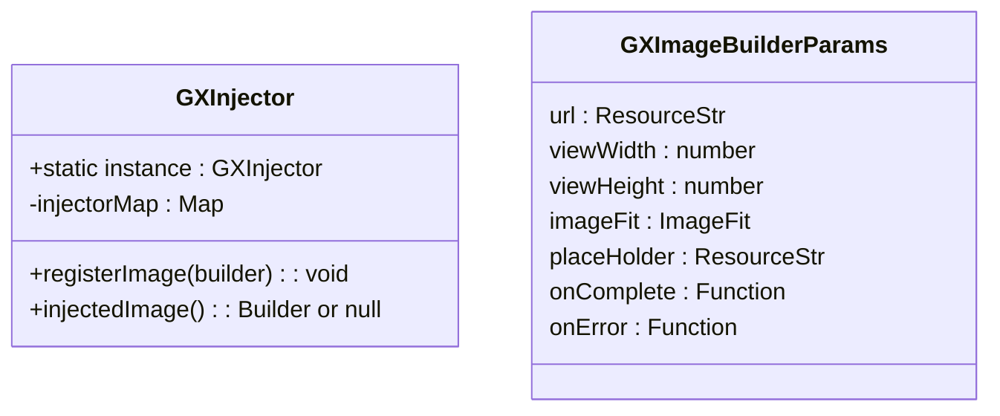
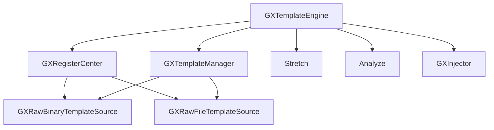

# 引擎入口

<cite>
**本文档引用文件**  
- [GXTemplateEngine.ets](file://GaiaXHarmony/GaiaXCore/GaiaX/src/main/ets/GXTemplateEngine.ets)
- [GXRegisterCenter.ets](file://GaiaXHarmony/GaiaXCore/GaiaX/src/main/ets/GXRegisterCenter.ets)
- [GXRawBinaryWithouSuffixTemplateSource.ets](file://GaiaXHarmony/GaiaXCore/GaiaX/src/main/ets/source/GXRawBinaryWithouSuffixTemplateSource.ets)
- [GXRawFileTemplateSource.ets](file://GaiaXHarmony/GaiaXCore/GaiaX/src/main/ets/source/GXRawFileTemplateSource.ets)
- [GXInjector.ets](file://GaiaXHarmony/GaiaXCore/GaiaX/src/main/ets/components/injector/GXInjector.ets)
- [GXTemplateManager.ets](file://GaiaXHarmony/GaiaXCore/GaiaX/src/main/ets/template/GXTemplateManager.ets)
- [GXTemplateHelper.ets](file://GaiaXHarmony/GaiaXCore/GaiaX/src/main/ets/template/GXTemplateHelper.ets)
- [Index.ets](file://GaiaXHarmony/GaiaXCore/GaiaX/Index.ets)
- [Index.ets](file://GaiaXHarmony/GaiaXAnalyze/GaiaXAnalyzeHarmony/GaiaXAnalyze/Index.ets)
</cite>

## 目录
1. [简介](#简介)
2. [项目结构](#项目结构)
3. [核心组件](#核心组件)
4. [架构概述](#架构概述)
5. [详细组件分析](#详细组件分析)
6. [依赖分析](#依赖分析)
7. [性能考虑](#性能考虑)
8. [故障排除指南](#故障排除指南)
9. [结论](#结论)

## 简介
本文件详细说明了HarmonyOS引擎入口API，重点介绍`Index.ets`中导出的`GXTemplateEngine`类的初始化方法、单例模式实现和核心功能入口。文档涵盖引擎的配置选项、生命周期管理以及与HarmonyOS应用框架的集成方式。同时提供引擎初始化的最佳实践，包括线程安全考虑和性能优化建议。此外，解释`GXTemplateEngine`如何协调模板解析、数据绑定和视图渲染等子系统的工作流程，并为开发者提供错误处理和异常恢复的指导方案。

## 项目结构
GaiaX-Harmony项目为HarmonyOS平台提供了一套完整的模板渲染引擎，其核心位于`GaiaXCore`模块。该模块采用分层架构设计，包含模板管理、数据绑定、节点创建、样式处理、组件注入等多个子系统，通过清晰的模块划分实现高内聚低耦合。

**图表来源**
- [GXTemplateEngine.ets](file://GaiaXHarmony/GaiaXCore/GaiaX/src/main/ets/GXTemplateEngine.ets)
- [GXRegisterCenter.ets](file://GaiaXHarmony/GaiaXCore/GaiaX/src/main/ets/GXRegisterCenter.ets)
- [GXTemplateManager.ets](file://GaiaXHarmony/GaiaXCore/GaiaX/src/main/ets/template/GXTemplateManager.ets)
- [GXRawBinaryWithouSuffixTemplateSource.ets](file://GaiaXHarmony/GaiaXCore/GaiaX/src/main/ets/source/GXRawBinaryWithouSuffixTemplateSource.ets)
- [GXRawFileTemplateSource.ets](file://GaiaXHarmony/GaiaXCore/GaiaX/src/main/ets/source/GXRawFileTemplateSource.ets)
- [GXInjector.ets](file://GaiaXHarmony/GaiaXCore/GaiaX/src/main/ets/components/injector/GXInjector.ets)

**章节来源**
- [GXTemplateEngine.ets](file://GaiaXHarmony/GaiaXCore/GaiaX/src/main/ets/GXTemplateEngine.ets)
- [GXRegisterCenter.ets](file://GaiaXHarmony/GaiaXCore/GaiaX/src/main/ets/GXRegisterCenter.ets)

## 核心组件
`GXTemplateEngine`是整个引擎的入口和核心控制器，采用单例模式实现，负责协调模板解析、数据绑定和视图渲染等子系统的工作。其主要职责包括引擎初始化、模板上下文创建、视图生命周期管理以及对外提供统一的API接口。

**章节来源**
- [GXTemplateEngine.ets](file://GaiaXHarmony/GaiaXCore/GaiaX/src/main/ets/GXTemplateEngine.ets)

## 架构概述
`GXTemplateEngine`通过调用底层子系统来完成模板渲染的整个流程。初始化时，它会启动布局引擎`Stretch`和表达式分析引擎`GaiaXAnalyze`，并注册模板数据源。当创建视图时，引擎通过`GXTemplateManager`获取模板内容，利用`Stretch`进行布局计算，并通过`GXInjector`注入自定义组件，最终生成可交互的UI视图。

**图表来源**
- [GXTemplateEngine.ets](file://GaiaXHarmony/GaiaXCore/GaiaX/src/main/ets/GXTemplateEngine.ets)
- [GXTemplateManager.ets](file://GaiaXHarmony/GaiaXCore/GaiaX/src/main/ets/template/GXTemplateManager.ets)
- [GXRawBinaryWithouSuffixTemplateSource.ets](file://GaiaXHarmony/GaiaXCore/GaiaX/src/main/ets/source/GXRawBinaryWithouSuffixTemplateSource.ets)
- [GXRawFileTemplateSource.ets](file://GaiaXHarmony/GaiaXCore/GaiaX/src/main/ets/source/GXRawFileTemplateSource.ets)
- [GXInjector.ets](file://GaiaXHarmony/GaiaXCore/GaiaX/src/main/ets/components/injector/GXInjector.ets)
- [Index.ets](file://GaiaXHarmony/GXStretchBinding/GXStretch/Index.ets)
- [Index.ets](file://GaiaXHarmony/GaiaXAnalyze/GaiaXAnalyzeHarmony/GaiaXAnalyze/Index.ets)

## 详细组件分析

### GXTemplateEngine 分析
`GXTemplateEngine`作为引擎的门面，封装了复杂的内部逻辑，为开发者提供简洁的API。

#### 初始化与单例模式
`GXTemplateEngine`通过静态属性`instance`实现单例模式，确保全局只有一个引擎实例。其`init`方法负责初始化所有依赖的子系统。

**图表来源**
- [GXTemplateEngine.ets](file://GaiaXHarmony/GaiaXCore/GaiaX/src/main/ets/GXTemplateEngine.ets)

**章节来源**
- [GXTemplateEngine.ets](file://GaiaXHarmony/GaiaXCore/GaiaX/src/main/ets/GXTemplateEngine.ets)

#### 核心功能入口
`GXTemplateEngine`的核心功能是创建和管理模板视图，其主要方法包括`init`用于初始化引擎，`registerImage`用于注册自定义图片组件。

**章节来源**
- [GXTemplateEngine.ets](file://GaiaXHarmony/GaiaXCore/GaiaX/src/main/ets/GXTemplateEngine.ets)

### 模板管理分析
`GXTemplateManager`负责模板的加载和缓存，通过`GXTemplateSource`接口从不同来源（二进制或JSON文件）获取模板数据。

**图表来源**
- [GXTemplateManager.ets](file://GaiaXHarmony/GaiaXCore/GaiaX/src/main/ets/template/GXTemplateManager.ets)
- [GXTemplateHelper.ets](file://GaiaXHarmony/GaiaXCore/GaiaX/src/main/ets/template/GXTemplateHelper.ets)

**章节来源**
- [GXTemplateManager.ets](file://GaiaXHarmony/GaiaXCore/GaiaX/src/main/ets/template/GXTemplateManager.ets)

### 组件注入分析
`GXInjector`允许开发者注册自定义的UI组件，如图片加载器，从而实现功能扩展。

**图表来源**
- [GXInjector.ets](file://GaiaXHarmony/GaiaXCore/GaiaX/src/main/ets/components/injector/GXInjector.ets)

**章节来源**
- [GXInjector.ets](file://GaiaXHarmony/GaiaXCore/GaiaX/src/main/ets/components/injector/GXInjector.ets)

## 依赖分析
`GXTemplateEngine`的依赖关系清晰，它直接依赖于`GXRegisterCenter`、`GXTemplateManager`、`Stretch`布局引擎和`GaiaXAnalyze`表达式分析引擎。`GXRegisterCenter`则依赖于具体的`GXTemplateSource`实现来获取模板数据。

**图表来源**
- [GXTemplateEngine.ets](file://GaiaXHarmony/GaiaXCore/GaiaX/src/main/ets/GXTemplateEngine.ets)
- [GXRegisterCenter.ets](file://GaiaXHarmony/GaiaXCore/GaiaX/src/main/ets/GXRegisterCenter.ets)
- [GXTemplateManager.ets](file://GaiaXHarmony/GaiaXCore/GaiaX/src/main/ets/template/GXTemplateManager.ets)
- [GXRawBinaryWithouSuffixTemplateSource.ets](file://GaiaXHarmony/GaiaXCore/GaiaX/src/main/ets/source/GXRawBinaryWithouSuffixTemplateSource.ets)
- [GXRawFileTemplateSource.ets](file://GaiaXHarmony/GaiaXCore/GaiaX/src/main/ets/source/GXRawFileTemplateSource.ets)
- [GXInjector.ets](file://GaiaXHarmony/GaiaXCore/GaiaX/src/main/ets/components/injector/GXInjector.ets)

**章节来源**
- [GXTemplateEngine.ets](file://GaiaXHarmony/GaiaXCore/GaiaX/src/main/ets/GXTemplateEngine.ets)
- [GXRegisterCenter.ets](file://GaiaXHarmony/GaiaXCore/GaiaX/src/main/ets/GXRegisterCenter.ets)

## 性能考虑
引擎通过多种机制优化性能：
1.  **LRU缓存**：`GXTemplateManager`使用LRU缓存存储已解析的模板，避免重复解析。
2.  **异步加载**：模板文件的读取和解析在后台线程进行，防止阻塞UI。
3.  **增量更新**：支持对已创建视图的数据绑定进行局部更新，而非重建整个视图树。

## 故障排除指南
- **模板加载失败**：检查模板文件是否正确放置在`resources/rawfile`目录下，并确认`bizId`和`templateId`拼接的路径是否正确。
- **表达式解析错误**：确保`configAnalyzeIfNeeded`已在`init`方法中被调用。
- **自定义组件不显示**：确认已通过`registerImage`方法正确注册了组件构建器。

**章节来源**
- [GXTemplateEngine.ets](file://GaiaXHarmony/GaiaXCore/GaiaX/src/main/ets/GXTemplateEngine.ets)
- [GXTemplateHelper.ets](file://GaiaXHarmony/GaiaXCore/GaiaX/src/main/ets/template/GXTemplateHelper.ets)

## 结论
`GXTemplateEngine`为HarmonyOS应用提供了一个强大且灵活的模板渲染解决方案。通过单例模式保证了全局状态的一致性，通过清晰的模块划分和依赖注入实现了高可扩展性。开发者可以轻松地集成该引擎，并通过注册自定义组件来满足特定的业务需求。