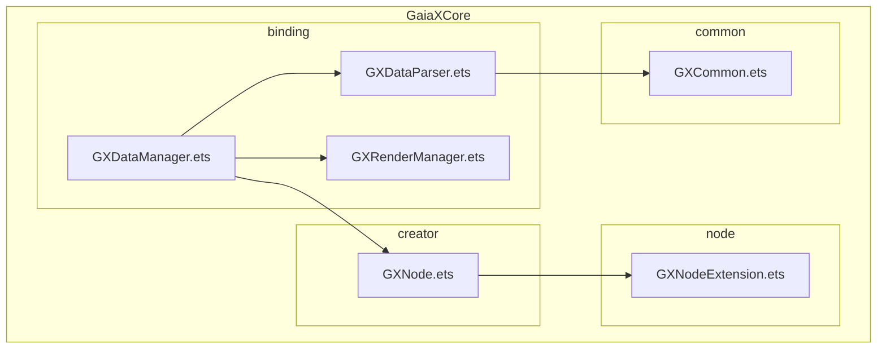
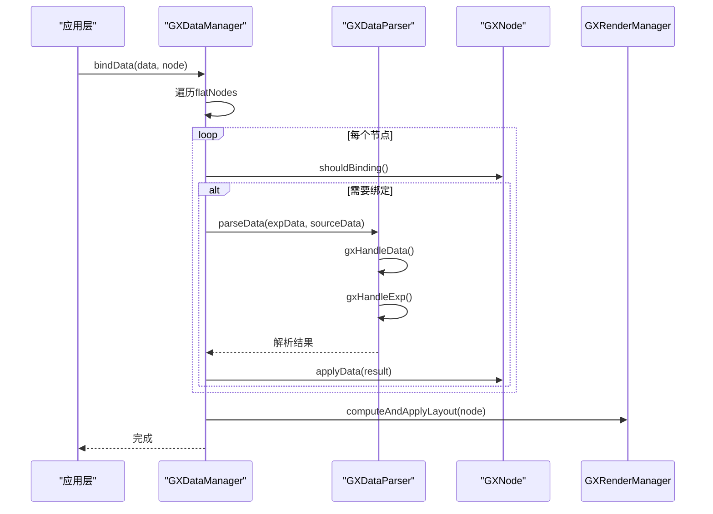
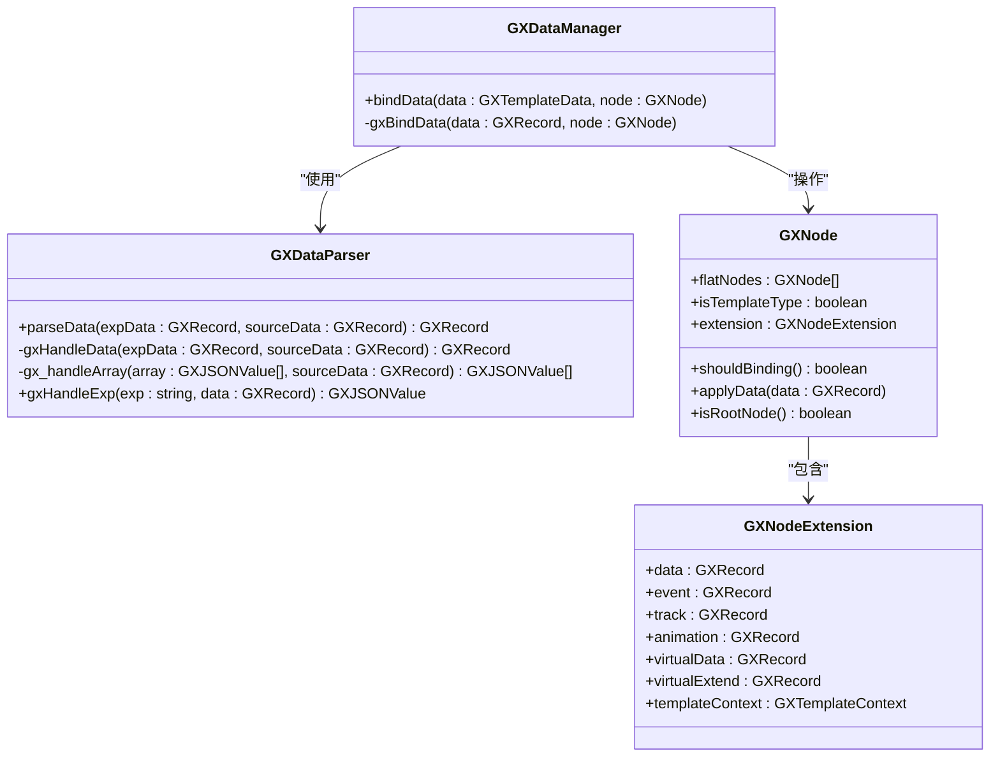
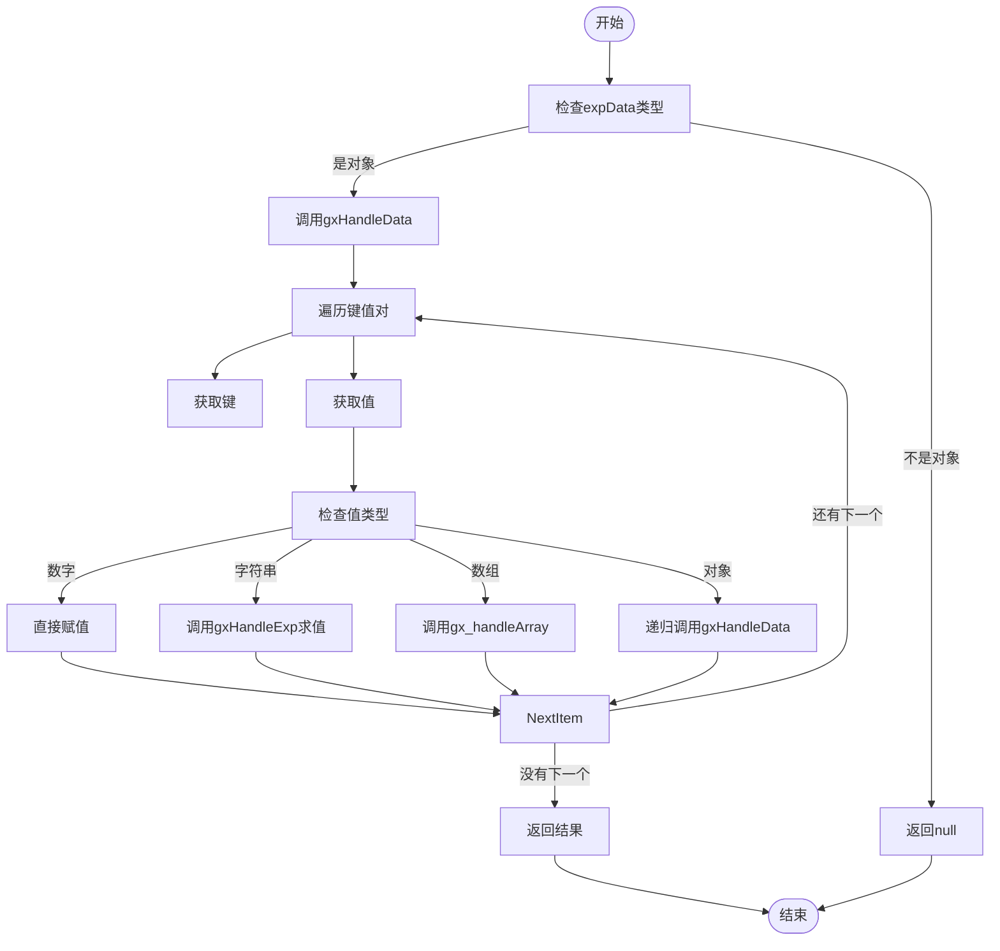
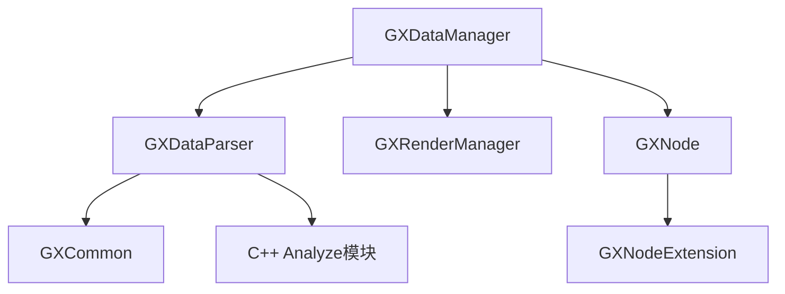

# 数据绑定

<cite>
**本文档引用的文件**  
- [GXDataManager.ets](file://GaiaXHarmony/GaiaXCore/GaiaX/src/main/ets/binding/GXDataManager.ets)
- [GXDataParser.ets](file://GaiaXHarmony/GaiaXCore/GaiaX/src/main/ets/binding/GXDataParser.ets)
- [GXNode.ets](file://GaiaXHarmony/GaiaXCore/GaiaX/src/main/ets/creator/GXNode.ets)
- [GXRenderManager.ets](file://GaiaXHarmony/GaiaXCore/GaiaX/src/main/ets/binding/GXRenderManager.ets)
- [GXCommon.ets](file://GaiaXHarmony/GaiaXCore/GaiaX/src/main/ets/common/GXCommon.ets)
- [GXNodeExtension.ets](file://GaiaXHarmony/GaiaXCore/GaiaX/src/main/ets/node/GXNodeExtension.ets)
</cite>

## 目录
1. [简介](#简介)
2. [项目结构](#项目结构)
3. [核心组件](#核心组件)
4. [架构概述](#架构概述)
5. [详细组件分析](#详细组件分析)
6. [依赖分析](#依赖分析)
7. [性能考虑](#性能考虑)
8. [故障排除指南](#故障排除指南)
9. [结论](#结论)

## 简介
本文档深入解析HarmonyOS平台下GaiaX框架的数据绑定机制，重点阐述GXDataManager的架构设计与实现细节。文档涵盖数据绑定的生命周期、更新策略、性能优化机制，以及GXDataManager与GXDataParser的协作关系。同时，说明如何处理不同类型的数据源和数据转换，提供复杂数据结构处理、异步数据更新和错误处理的最佳实践示例，并解释响应式数据绑定的实现原理和实际应用模式。

## 项目结构
GaiaX框架在HarmonyOS平台的实现位于`GaiaXHarmony`目录下，其核心功能模块`GaiaXCore`包含了数据绑定、节点管理、布局计算等关键组件。数据绑定相关的逻辑主要集中在`binding`包中，由`GXDataManager`和`GXDataParser`两个核心类协同工作。

**图示来源**
- [GXDataManager.ets](file://GaiaXHarmony/GaiaXCore/GaiaX/src/main/ets/binding/GXDataManager.ets)
- [GXDataParser.ets](file://GaiaXHarmony/GaiaXCore/GaiaX/src/main/ets/binding/GXDataParser.ets)
- [GXNode.ets](file://GaiaXHarmony/GaiaXCore/GaiaX/src/main/ets/creator/GXNode.ets)

**本节来源**
- [GXDataManager.ets](file://GaiaXHarmony/GaiaXCore/GaiaX/src/main/ets/binding/GXDataManager.ets)
- [GXDataParser.ets](file://GaiaXHarmony/GaiaXCore/GaiaX/src/main/ets/binding/GXDataParser.ets)

## 核心组件
本节分析数据绑定机制中的两个核心组件：`GXDataManager`和`GXDataParser`。`GXDataManager`是数据绑定的总控中心，负责协调数据的分发和绑定流程。`GXDataParser`则是数据解析引擎，负责将模板中的表达式与真实数据源进行匹配和计算。

**本节来源**
- [GXDataManager.ets](file://GaiaXHarmony/GaiaXCore/GaiaX/src/main/ets/binding/GXDataManager.ets)
- [GXDataParser.ets](file://GaiaXHarmony/GaiaXCore/GaiaX/src/main/ets/binding/GXDataParser.ets)

## 架构概述
GaiaX的数据绑定机制采用分层架构，`GXDataManager`作为顶层协调者，`GXDataParser`作为底层解析器。当外部调用`bindData`方法时，`GXDataManager`会遍历整个节点树，对每个需要绑定数据的节点，调用`GXDataParser`进行数据解析，并将解析结果应用到节点上。

**图示来源**
- [GXDataManager.ets](file://GaiaXHarmony/GaiaXCore/GaiaX/src/main/ets/binding/GXDataManager.ets#L29-L94)
- [GXDataParser.ets](file://GaiaXHarmony/GaiaXCore/GaiaX/src/main/ets/binding/GXDataParser.ets#L29-L124)
- [GXNode.ets](file://GaiaXHarmony/GaiaXCore/GaiaX/src/main/ets/creator/GXNode.ets#L95-L128)

## 详细组件分析
本节将深入分析`GXDataManager`和`GXDataParser`的内部实现细节。

### GXDataManager 分析
`GXDataManager`是数据绑定的核心管理类，其主要职责是协调数据绑定的整个流程。

#### 类图

**图示来源**
- [GXDataManager.ets](file://GaiaXHarmony/GaiaXCore/GaiaX/src/main/ets/binding/GXDataManager.ets)
- [GXDataParser.ets](file://GaiaXHarmony/GaiaXCore/GaiaX/src/main/ets/binding/GXDataParser.ets)
- [GXNode.ets](file://GaiaXHarmony/GaiaXCore/GaiaX/src/main/ets/creator/GXNode.ets)
- [GXNodeExtension.ets](file://GaiaXHarmony/GaiaXCore/GaiaX/src/main/ets/node/GXNodeExtension.ets)

#### 数据绑定流程
`GXDataManager`的`bindData`方法是数据绑定的入口。它首先检查输入参数的有效性，然后调用私有方法`gxBindData`执行实际的绑定操作。

`gxBindData`方法的核心逻辑是遍历节点的`flatNodes`（拍平的节点列表）。对于每个节点，它首先检查`shouldBinding()`方法的返回值，以确定该节点是否需要进行数据绑定。如果需要绑定，会根据节点类型进行不同的处理：
- 对于嵌套模板节点，会先解析其`virtualData`，然后递归地对子模板进行数据绑定。
- 对于普通节点，则直接调用`applyData`方法进行数据绑定。

数据绑定完成后，如果当前节点是根节点且需要重新布局，`GXDataManager`会调用`GXRenderManager`来重新计算和应用布局。

**本节来源**
- [GXDataManager.ets](file://GaiaXHarmony/GaiaXCore/GaiaX/src/main/ets/binding/GXDataManager.ets#L29-L94)

### GXDataParser 分析
`GXDataParser`是数据解析的核心引擎，负责将模板中定义的表达式与真实的数据源进行匹配和计算。

#### 数据解析流程
`GXDataParser`的`parseData`方法是解析的入口。它接收两个参数：`expData`（表达式数据）和`sourceData`（真实数据源）。该方法首先检查`expData`是否为对象，然后调用`gxHandleData`进行具体处理。

`gxHandleData`方法会遍历`expData`中的每一个键值对，根据值的类型进行不同的处理：
- **数字类型**：直接保留原值。
- **字符串类型**：将其视为表达式，调用`gxHandleExp`进行求值。
- **数组类型**：调用`gx_handleArray`对数组中的每个元素进行递归解析。
- **对象类型**：递归调用`gxHandleData`进行处理。

`gxHandleExp`方法是表达式求值的关键，它通过调用`analyzeGetValue`（一个来自C++模块的原生函数）来计算表达式的最终值。

**图示来源**
- [GXDataParser.ets](file://GaiaXHarmony/GaiaXCore/GaiaX/src/main/ets/binding/GXDataParser.ets#L29-L124)

**本节来源**
- [GXDataParser.ets](file://GaiaXHarmony/GaiaXCore/GaiaX/src/main/ets/binding/GXDataParser.ets#L29-L124)

## 依赖分析
`GXDataManager`和`GXDataParser`构成了一个紧密协作的系统。`GXDataManager`依赖`GXDataParser`来完成具体的数据解析工作，而`GXDataParser`则依赖`GXCommon`中定义的类型（如`GXRecord`）和`analyzeGetValue`这个来自C++模块的原生函数。

**图示来源**
- [GXDataManager.ets](file://GaiaXHarmony/GaiaXCore/GaiaX/src/main/ets/binding/GXDataManager.ets)
- [GXDataParser.ets](file://GaiaXHarmony/GaiaXCore/GaiaX/src/main/ets/binding/GXDataParser.ets)
- [GXCommon.ets](file://GaiaXHarmony/GaiaXCore/GaiaX/src/main/ets/common/GXCommon.ets)

**本节来源**
- [GXDataManager.ets](file://GaiaXHarmony/GaiaXCore/GaiaX/src/main/ets/binding/GXDataManager.ets)
- [GXDataParser.ets](file://GaiaXHarmony/GaiaXCore/GaiaX/src/main/ets/binding/GXDataParser.ets)

## 性能考虑
数据绑定机制在设计上考虑了性能优化：
1. **节点拍平**：`GXNode`的`flatNodes`属性允许`GXDataManager`以线性方式遍历所有节点，避免了深度递归带来的性能开销。
2. **条件绑定**：`shouldBinding()`方法可以快速判断一个节点是否需要绑定数据，避免了对不需要绑定的节点进行不必要的处理。
3. **布局优化**：数据绑定完成后，仅在根节点且`isNeedLayout`为`true`时才触发重新布局，减少了不必要的计算。

## 故障排除指南
在使用数据绑定时，可能遇到以下问题：
- **数据未更新**：请检查`GXNode`的`shouldBinding()`方法返回值，确保节点的`extension`中包含了需要绑定的数据（如`data`、`event`等）。
- **表达式求值失败**：检查表达式语法是否正确，并确保`sourceData`中包含表达式所引用的所有字段。
- **布局错乱**：在数据绑定后，如果布局没有正确更新，请检查`GXTemplateContext`的`isNeedLayout`标志位是否被正确设置。

**本节来源**
- [GXDataManager.ets](file://GaiaXHarmony/GaiaXCore/GaiaX/src/main/ets/binding/GXDataManager.ets#L77-L93)
- [GXNode.ets](file://GaiaXHarmony/GaiaXCore/GaiaX/src/main/ets/creator/GXNode.ets#L62-L71)

## 结论
GaiaX框架在HarmonyOS平台上的数据绑定机制设计精巧，通过`GXDataManager`和`GXDataParser`的分工协作，实现了高效、灵活的数据绑定。`GXDataManager`负责宏观的流程控制和节点管理，而`GXDataParser`则专注于微观的表达式解析。这种分层架构不仅提高了代码的可维护性，也为性能优化提供了空间。开发者在使用时，应充分理解其生命周期和更新策略，以充分发挥其响应式数据绑定的优势。