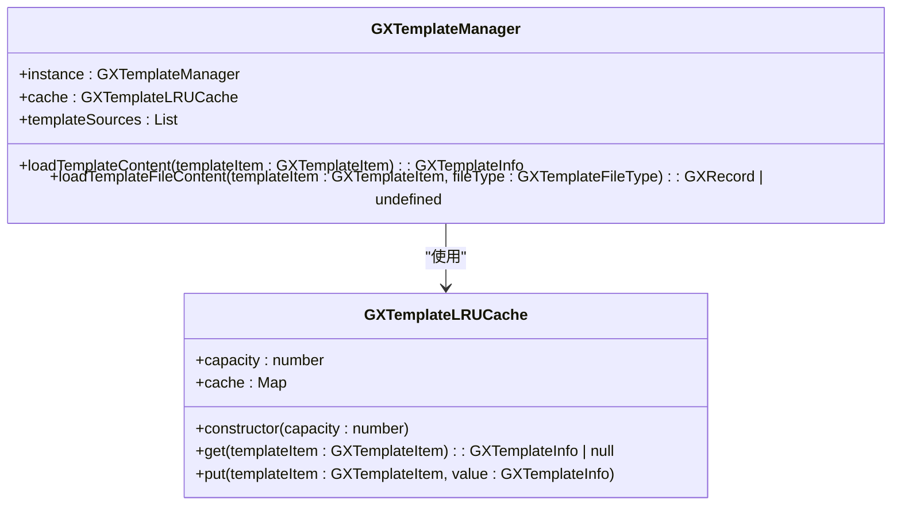
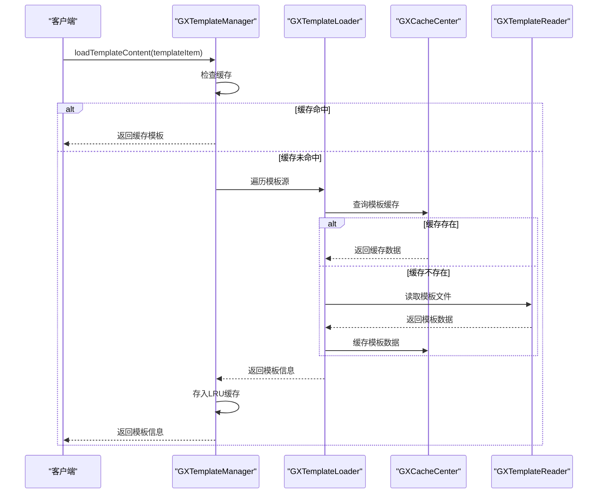
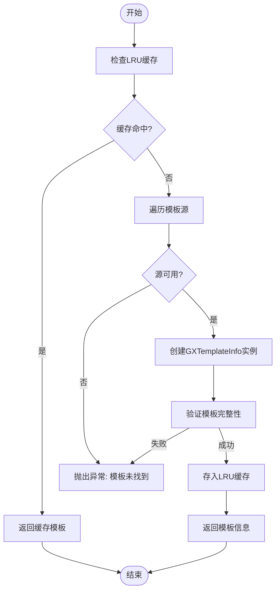

# 模板管理

<cite>
**本文档引用文件**  
- [GXTemplateManager.ets](file://GaiaXHarmony/GaiaXCore/GaiaX/src/main/ets/template/GXTemplateManager.ets)
- [GXTemplateLRUCache.ets](file://GaiaXHarmony/GaiaXCore/GaiaX/src/main/ets/template/GXTemplateLRUCache.ets)
- [GXTemplateInfo.ets](file://GaiaXHarmony/GaiaXCore/GaiaX/src/main/ets/template/GXTemplateInfo.ets)
- [GXTemplateItem.ets](file://GaiaXHarmony/GaiaXCore/GaiaX/src/main/ets/context/GXTemplateItem.ets)
- [GXTemplateLoader.h](file://GaiaXiOS/GaiaXiOS/Template/Loader/GXTemplateLoader.h)
- [GXTemplateLoader.m](file://GaiaXiOS/GaiaXiOS/Template/Loader/GXTemplateLoader.m)
- [GXTemplateManager.h](file://GaiaXiOS/GaiaXiOS/Template/Loader/GXTemplateManager.h)
- [GXTemplateManager.m](file://GaiaXiOS/GaiaXiOS/Template/Loader/GXTemplateManager.m)
- [GXCacheCenter.h](file://GaiaXiOS/GaiaXiOS/Template/Cache/GXCacheCenter.h)
- [GXCacheCenter.m](file://GaiaXiOS/GaiaXiOS/Template/Cache/GXCacheCenter.m)
</cite>

## 目录
1. [简介](#简介)
2. [核心组件](#核心组件)
3. [模板缓存策略](#模板缓存策略)
4. [模板加载机制](#模板加载机制)
5. [模板生命周期管理](#模板生命周期管理)
6. [模板解析流程](#模板解析流程)
7. [GXTemplateManager与GXTemplateLoader协作关系](#gxtemplatemanager与gxtemplateloader协作关系)
8. [本地与远程模板资源处理](#本地与远程模板资源处理)
9. [最佳实践](#最佳实践)
10. [模板版本控制与热更新](#模板版本控制与热更新)

## 简介
本文档全面解析HarmonyOS模板管理系统中GXTemplateManager的核心机制，包括模板缓存策略、加载机制和生命周期管理。详细说明模板解析流程、缓存策略配置、错误处理和性能监控等关键方面，为开发者提供完整的模板管理技术指导。

## 核心组件

GXTemplateManager是GaiaX框架中的核心组件，负责模板的加载、缓存和管理。该组件通过与GXTemplateLoader协同工作，实现了高效的模板资源管理机制。GXTemplateInfo封装了模板的完整信息，包括层级结构、样式和数据绑定等内容。

**本节来源**  
- [GXTemplateManager.ets](file://GaiaXHarmony/GaiaXCore/GaiaX/src/main/ets/template/GXTemplateManager.ets#L24-L71)
- [GXTemplateInfo.ets](file://GaiaXHarmony/GaiaXCore/GaiaX/src/main/ets/template/GXTemplateInfo.ets#L21-L62)

## 模板缓存策略

GXTemplateManager采用LRU（最近最少使用）缓存算法来管理模板资源。缓存容量默认设置为256个模板项，通过GXTemplateLRUCache类实现。缓存键由模板ID、版本号和业务ID组合生成，确保不同版本的模板能够被正确区分和管理。

当缓存达到容量上限时，系统会自动移除最久未使用的模板项，为新模板腾出空间。每次访问缓存中的模板时，该模板会被重新插入到缓存的末尾，确保最近使用的模板始终保持在缓存中。



**图表来源**  
- [GXTemplateLRUCache.ets](file://GaiaXHarmony/GaiaXCore/GaiaX/src/main/ets/template/GXTemplateLRUCache.ets#L20-L71)
- [GXTemplateManager.ets](file://GaiaXHarmony/GaiaXCore/GaiaX/src/main/ets/template/GXTemplateManager.ets#L24-L71)

**本节来源**  
- [GXTemplateLRUCache.ets](file://GaiaXHarmony/GaiaXCore/GaiaX/src/main/ets/template/GXTemplateLRUCache.ets#L20-L71)

## 模板加载机制

模板加载机制采用多级优先级策略，首先尝试从缓存中获取模板，如果缓存中不存在，则依次从注册的模板源中查找。GXTemplateManager维护一个模板源列表，按照后进先出的顺序进行遍历查询，确保最新的模板源具有最高优先级。

加载过程支持同步和异步两种模式，异步加载通过专用的并发队列执行，避免阻塞主线程。GXTemplateLoader作为底层加载器，负责具体的文件读取和缓存操作，与GXCacheCenter协同工作，实现高效的模板资源管理。



**图表来源**  
- [GXTemplateManager.ets](file://GaiaXHarmony/GaiaXCore/GaiaX/src/main/ets/template/GXTemplateManager.ets#L30-L47)
- [GXTemplateLoader.m](file://GaiaXiOS/GaiaXiOS/Template/Loader/GXTemplateLoader.m#L108-L137)

**本节来源**  
- [GXTemplateManager.ets](file://GaiaXHarmony/GaiaXCore/GaiaX/src/main/ets/template/GXTemplateManager.ets#L30-L47)
- [GXTemplateLoader.m](file://GaiaXiOS/GaiaXiOS/Template/Loader/GXTemplateLoader.m#L108-L137)

## 模板生命周期管理

模板的生命周期从加载开始，经过解析、渲染，直到最终被销毁。GXTemplateManager通过引用计数和LRU机制共同管理模板的生命周期。当模板被频繁使用时，会保持在缓存中；当长时间未被访问时，会根据LRU策略被自动清理。

系统还提供了显式的缓存清理接口，允许开发者根据业务需求主动清除特定模板或全部缓存。这种灵活的生命周期管理机制既保证了性能优化，又提供了足够的控制能力。

**本节来源**  
- [GXTemplateManager.ets](file://GaiaXHarmony/GaiaXCore/GaiaX/src/main/ets/template/GXTemplateManager.ets#L30-L47)
- [GXTemplateLRUCache.ets](file://GaiaXHarmony/GaiaXCore/GaiaX/src/main/ets/template/GXTemplateLRUCache.ets#L51-L71)

## 模板解析流程

模板解析流程始于GXTemplateManager的loadTemplateContent方法调用。系统首先生成唯一的缓存键，然后检查LRU缓存中是否存在对应的模板信息。如果缓存命中，则直接返回缓存的GXTemplateInfo对象。

若缓存未命中，系统会遍历注册的模板源，尝试获取原始模板数据。成功获取后，会创建新的GXTemplateInfo实例，并将其存入缓存。GXTemplateInfo的构造函数会验证必要的模板文件（层级和样式）是否存在，确保模板的完整性。



**图表来源**  
- [GXTemplateManager.ets](file://GaiaXHarmony/GaiaXCore/GaiaX/src/main/ets/template/GXTemplateManager.ets#L30-L47)
- [GXTemplateInfo.ets](file://GaiaXHarmony/GaiaXCore/GaiaX/src/main/ets/template/GXTemplateInfo.ets#L37-L60)

**本节来源**  
- [GXTemplateManager.ets](file://GaiaXHarmony/GaiaXCore/GaiaX/src/main/ets/template/GXTemplateManager.ets#L30-L47)
- [GXTemplateInfo.ets](file://GaiaXHarmony/GaiaXCore/GaiaX/src/main/ets/template/GXTemplateInfo.ets#L37-L60)

## GXTemplateManager与GXTemplateLoader协作关系

GXTemplateManager与GXTemplateLoader形成典型的门面模式，GXTemplateManager作为高层接口向外部提供模板管理服务，而GXTemplateLoader则负责底层的具体实现。这种分层架构实现了关注点分离，提高了系统的可维护性和扩展性。

GXTemplateManager通过调用GXTemplateLoader的接口来完成实际的加载和缓存操作，同时添加了LRU缓存层和模板源管理功能。GXCacheCenter作为缓存中心，为多个组件提供统一的缓存服务，包括模板缓存、表达式缓存和正则缓存等。

```mermaid
graph TB
subgraph "高层接口"
Manager[GXTemplateManager]
end
subgraph "中间层"
Loader[GXTemplateLoader]
CacheCenter[GXCacheCenter]
end
subgraph "底层实现"
Reader[GXTemplateReader]
Sources[模板源列表]
end
Manager --> Loader : "调用"
Manager --> CacheCenter : "直接访问"
Loader --> CacheCenter : "依赖"
Loader --> Reader : "委托"
Reader --> Sources : "读取"
```

**图表来源**  
- [GXTemplateManager.ets](file://GaiaXHarmony/GaiaXCore/GaiaX/src/main/ets/template/GXTemplateManager.ets#L24-L71)
- [GXTemplateLoader.m](file://GaiaXiOS/GaiaXiOS/Template/Loader/GXTemplateLoader.m#L35-L37)
- [GXCacheCenter.h](file://GaiaXiOS/GaiaXiOS/Template/Cache/GXCacheCenter.h#L25-L35)

**本节来源**  
- [GXTemplateManager.ets](file://GaiaXHarmony/GaiaXCore/GaiaX/src/main/ets/template/GXTemplateManager.ets#L24-L71)
- [GXTemplateLoader.m](file://GaiaXiOS/GaiaXiOS/Template/Loader/GXTemplateLoader.m#L35-L37)

## 本地与远程模板资源处理

系统通过模板源（Template Source）机制统一处理本地和远程模板资源。不同类型的模板源（本地、远程、预览等）被注册到GXTemplateManager中，形成一个优先级队列。当加载模板时，系统会按照优先级顺序尝试从各个源获取资源。

对于本地模板，系统直接从应用bundle或指定路径读取文件；对于远程模板，则通过网络请求获取。所有获取到的模板都会经过相同的解析和缓存流程，确保本地和远程模板在使用上的一致性。

**本节来源**  
- [GXTemplateManager.ets](file://GaiaXHarmony/GaiaXCore/GaiaX/src/main/ets/template/GXTemplateManager.ets#L37-L45)
- [GXTemplateManager.m](file://GaiaXiOS/GaiaXiOS/Template/Loader/GXTemplateManager.m#L82-L100)

## 最佳实践

### 缓存策略配置
建议根据应用的内存使用情况和模板使用频率合理配置LRU缓存容量。对于模板使用频繁的应用，可以适当增加缓存容量以提高性能；对于内存敏感的应用，则应控制缓存大小。

### 错误处理
在模板加载过程中，应妥善处理各种异常情况，如网络错误、文件不存在、解析失败等。建议实现统一的错误处理机制，并提供有意义的错误信息用于调试。

### 性能监控
建议监控模板加载的耗时、缓存命中率等关键指标，及时发现性能瓶颈。可以通过埋点统计分析模板的使用模式，优化缓存策略和加载逻辑。

**本节来源**  
- [GXTemplateManager.ets](file://GaiaXHarmony/GaiaXCore/GaiaX/src/main/ets/template/GXTemplateManager.ets#L30-L47)
- [GXTemplateLoader.m](file://GaiaXiOS/GaiaXiOS/Template/Loader/GXTemplateLoader.m#L108-L137)

## 模板版本控制与热更新

模板版本控制通过templateVersion字段实现，允许同一模板ID的不同版本共存。系统在生成缓存键时会包含版本信息，确保版本升级时能够正确加载新版本模板。

热更新机制基于模板源的优先级设计，远程模板源通常具有较高优先级。当有新版本模板发布时，系统会优先加载远程版本，实现无需应用更新的模板热替换。旧版本模板会随着LRU策略逐渐被淘汰，完成平滑的版本过渡。

**本节来源**  
- [GXTemplateItem.ets](file://GaiaXHarmony/GaiaXCore/GaiaX/src/main/ets/context/GXTemplateItem.ets#L19-L34)
- [GXTemplateLRUCache.ets](file://GaiaXHarmony/GaiaXCore/GaiaX/src/main/ets/template/GXTemplateLRUCache.ets#L31-L36)