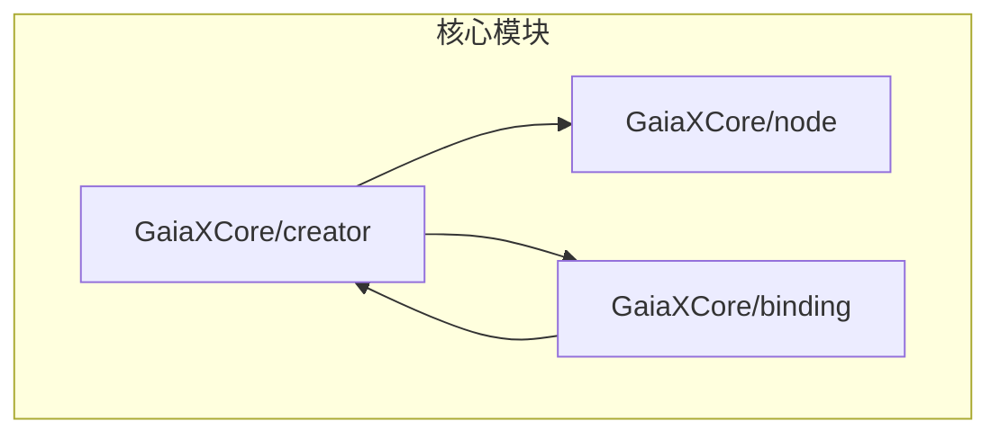
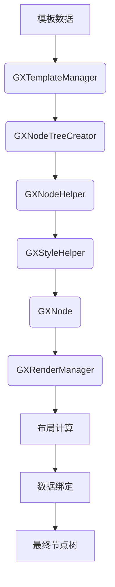
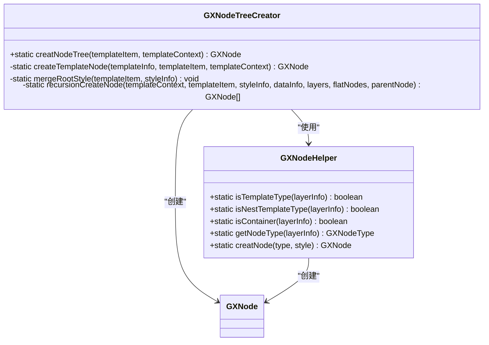
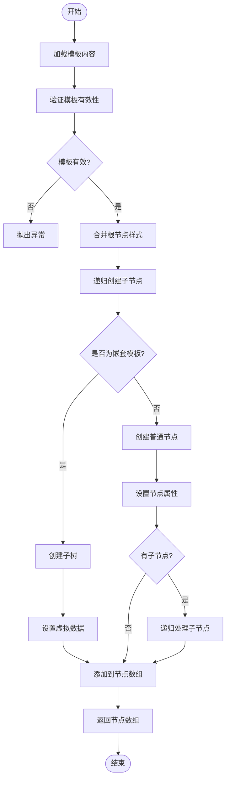
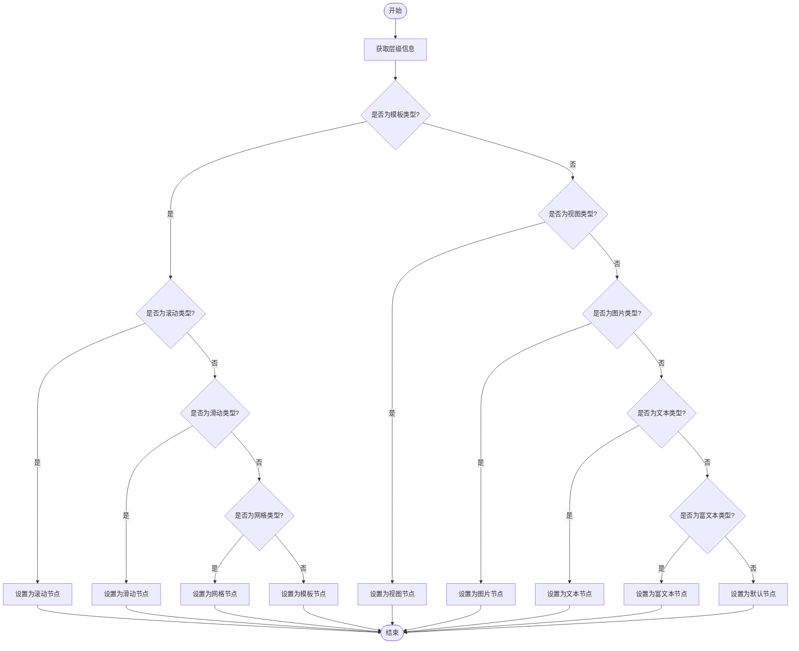
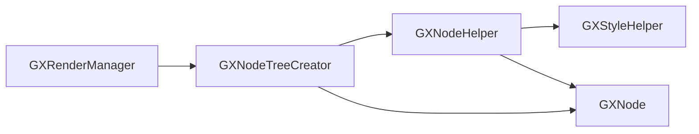

# 节点创建

<cite>
**本文档引用的文件**  
- [GXNodeTreeCreator.ets](file://GaiaXHarmony/GaiaXCore/GaiaX/src/main/ets/creator/GXNodeTreeCreator.ets)
- [GXNodeHelper.ets](file://GaiaXHarmony/GaiaXCore/GaiaX/src/main/ets/creator/GXNodeHelper.ets)
- [GXNode.ets](file://GaiaXHarmony/GaiaXCore/GaiaX/src/main/ets/creator/GXNode.ets)
- [GXStyleHelper.ets](file://GaiaXHarmony/GaiaXCore/GaiaX/src/main/ets/creator/GXStyleHelper.ets)
- [GXRenderManager.ets](file://GaiaXHarmony/GaiaXCore/GaiaX/src/main/ets/binding/GXRenderManager.ets)
- [GXRootNode.ets](file://GaiaXHarmony/GaiaXCore/GaiaX/src/main/ets/node/GXRootNode.ets)
</cite>

## 目录
1. [简介](#简介)
2. [项目结构](#项目结构)
3. [核心组件](#核心组件)
4. [架构概述](#架构概述)
5. [详细组件分析](#详细组件分析)
6. [依赖分析](#依赖分析)
7. [性能考虑](#性能考虑)
8. [故障排除指南](#故障排除指南)
9. [结论](#结论)

## 简介
本文档深入解析HarmonyOS节点创建系统，重点阐述GXNodeTreeCreator的树形结构构建算法和节点管理机制。文档详细说明节点创建流程、节点类型识别、节点属性设置，以及GXNodeTreeCreator与GXNodeHelper的协作关系。同时涵盖嵌套模板处理、动态节点更新、性能优化策略及与HarmonyOS UI框架的集成方式。

## 项目结构
项目采用模块化设计，核心节点创建功能位于`GaiaXHarmony/GaiaXCore/GaiaX/src/main/ets/`目录下。主要模块包括`creator`（节点创建）、`node`（节点定义）、`binding`（数据绑定）等，通过清晰的职责划分实现高内聚低耦合。

**图表来源**  
- [GXNodeTreeCreator.ets](file://GaiaXHarmony/GaiaXCore/GaiaX/src/main/ets/creator/GXNodeTreeCreator.ets)
- [GXNode.ets](file://GaiaXHarmony/GaiaXCore/GaiaX/src/main/ets/creator/GXNode.ets)
- [GXRenderManager.ets](file://GaiaXHarmony/GaiaXCore/GaiaX/src/main/ets/binding/GXRenderManager.ets)

**章节来源**  
- [GXNodeTreeCreator.ets](file://GaiaXHarmony/GaiaXCore/GaiaX/src/main/ets/creator/GXNodeTreeCreator.ets)
- [GXNode.ets](file://GaiaXHarmony/GaiaXCore/GaiaX/src/main/ets/creator/GXNode.ets)

## 核心组件
GXNodeTreeCreator是节点创建系统的核心，负责解析模板信息并构建完整的节点树。GXNodeHelper提供节点类型识别和创建的辅助功能，两者协同工作实现高效的节点管理。

**章节来源**  
- [GXNodeTreeCreator.ets](file://GaiaXHarmony/GaiaXCore/GaiaX/src/main/ets/creator/GXNodeTreeCreator.ets)
- [GXNodeHelper.ets](file://GaiaXHarmony/GaiaXCore/GaiaX/src/main/ets/creator/GXNodeHelper.ets)

## 架构概述
系统采用分层架构，从模板解析到节点树构建，再到布局计算和数据绑定，形成完整的渲染流水线。GXRenderManager作为协调者，整合各组件功能，提供统一的渲染接口。

**图表来源**  
- [GXNodeTreeCreator.ets](file://GaiaXHarmony/GaiaXCore/GaiaX/src/main/ets/creator/GXNodeTreeCreator.ets)
- [GXNodeHelper.ets](file://GaiaXHarmony/GaiaXCore/GaiaX/src/main/ets/creator/GXNodeHelper.ets)
- [GXStyleHelper.ets](file://GaiaXHarmony/GaiaXCore/GaiaX/src/main/ets/creator/GXStyleHelper.ets)
- [GXRenderManager.ets](file://GaiaXHarmony/GaiaXCore/GaiaX/src/main/ets/binding/GXRenderManager.ets)

## 详细组件分析

### GXNodeTreeCreator分析
GXNodeTreeCreator通过递归算法构建节点树，处理普通节点和嵌套模板，确保节点树的完整性和正确性。

#### 类图

**图表来源**  
- [GXNodeTreeCreator.ets](file://GaiaXHarmony/GaiaXCore/GaiaX/src/main/ets/creator/GXNodeTreeCreator.ets)
- [GXNodeHelper.ets](file://GaiaXHarmony/GaiaXCore/GaiaX/src/main/ets/creator/GXNodeHelper.ets)
- [GXNode.ets](file://GaiaXHarmony/GaiaXCore/GaiaX/src/main/ets/creator/GXNode.ets)

#### 节点创建流程

**图表来源**  
- [GXNodeTreeCreator.ets](file://GaiaXHarmony/GaiaXCore/GaiaX/src/main/ets/creator/GXNodeTreeCreator.ets)

**章节来源**  
- [GXNodeTreeCreator.ets](file://GaiaXHarmony/GaiaXCore/GaiaX/src/main/ets/creator/GXNodeTreeCreator.ets)

### GXNodeHelper分析
GXNodeHelper负责节点类型识别和创建，通过类型判断和工厂模式实现灵活的节点管理。

#### 节点类型识别流程

**图表来源**  
- [GXNodeHelper.ets](file://GaiaXHarmony/GaiaXCore/GaiaX/src/main/ets/creator/GXNodeHelper.ets)

**章节来源**  
- [GXNodeHelper.ets](file://GaiaXHarmony/GaiaXCore/GaiaX/src/main/ets/creator/GXNodeHelper.ets)

## 依赖分析
系统各组件间存在明确的依赖关系，GXNodeTreeCreator依赖GXNodeHelper进行节点创建，GXRenderManager依赖GXNodeTreeCreator构建节点树，形成清晰的调用链。

**图表来源**  
- [GXNodeTreeCreator.ets](file://GaiaXHarmony/GaiaXCore/GaiaX/src/main/ets/creator/GXNodeTreeCreator.ets)
- [GXNodeHelper.ets](file://GaiaXHarmony/GaiaXCore/GaiaX/src/main/ets/creator/GXNodeHelper.ets)
- [GXStyleHelper.ets](file://GaiaXHarmony/GaiaXCore/GaiaX/src/main/ets/creator/GXStyleHelper.ets)
- [GXRenderManager.ets](file://GaiaXHarmony/GaiaXCore/GaiaX/src/main/ets/binding/GXRenderManager.ets)

**章节来源**  
- [GXNodeTreeCreator.ets](file://GaiaXHarmony/GaiaXCore/GaiaX/src/main/ets/creator/GXNodeTreeCreator.ets)
- [GXNodeHelper.ets](file://GaiaXHarmony/GaiaXCore/GaiaX/src/main/ets/creator/GXNodeHelper.ets)
- [GXStyleHelper.ets](file://GaiaXHarmony/GaiaXCore/GaiaX/src/main/ets/creator/GXStyleHelper.ets)
- [GXRenderManager.ets](file://GaiaXHarmony/GaiaXCore/GaiaX/src/main/ets/binding/GXRenderManager.ets)

## 性能考虑
系统通过节点复用、延迟加载和内存优化策略提升性能。节点树构建过程中避免不必要的对象创建，样式计算采用缓存机制，确保高效渲染。

## 故障排除指南
常见问题包括模板解析失败、节点类型识别错误和样式应用异常。建议检查模板数据完整性、节点类型定义正确性及样式属性合法性。

**章节来源**  
- [GXNodeTreeCreator.ets](file://GaiaXHarmony/GaiaXCore/GaiaX/src/main/ets/creator/GXNodeTreeCreator.ets)
- [GXNodeHelper.ets](file://GaiaXHarmony/GaiaXCore/GaiaX/src/main/ets/creator/GXNodeHelper.ets)

## 结论
GXNodeTreeCreator实现了高效、灵活的节点创建系统，通过清晰的架构设计和优化的算法，确保了HarmonyOS应用的流畅渲染。系统具备良好的扩展性和维护性，为复杂UI的构建提供了坚实基础。