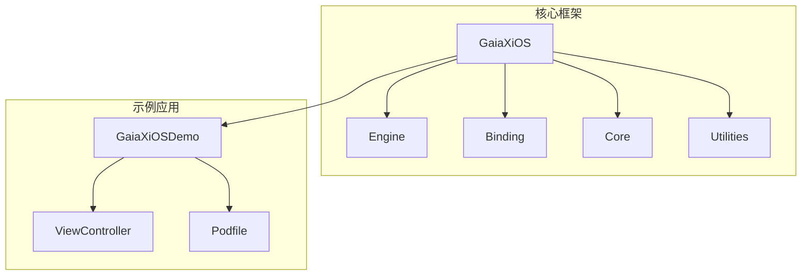
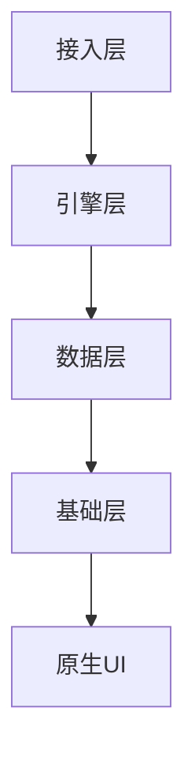
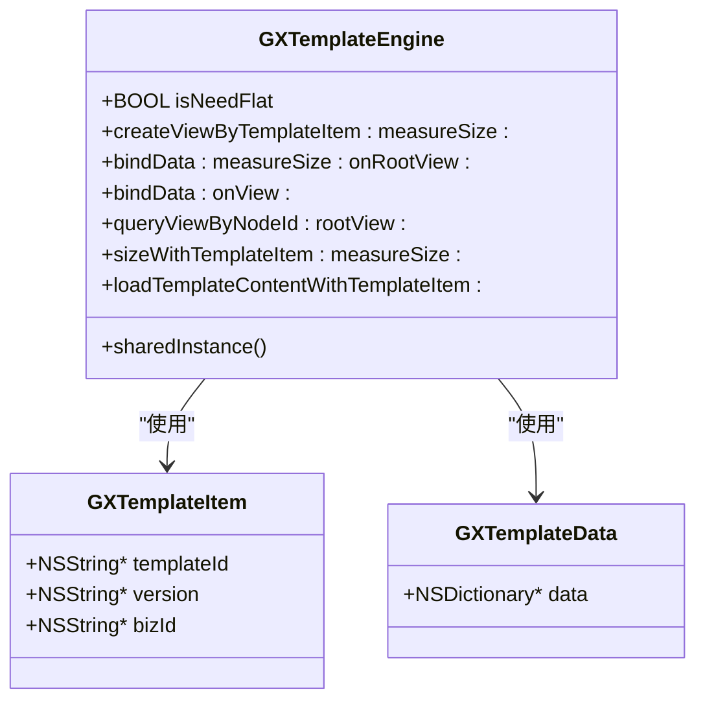
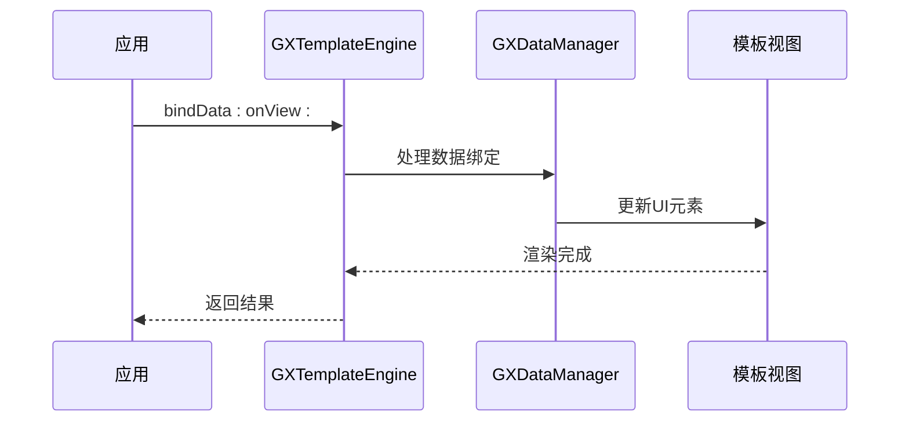
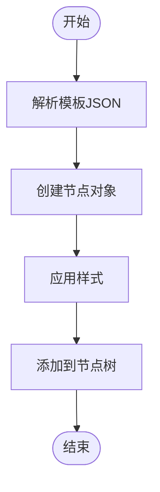
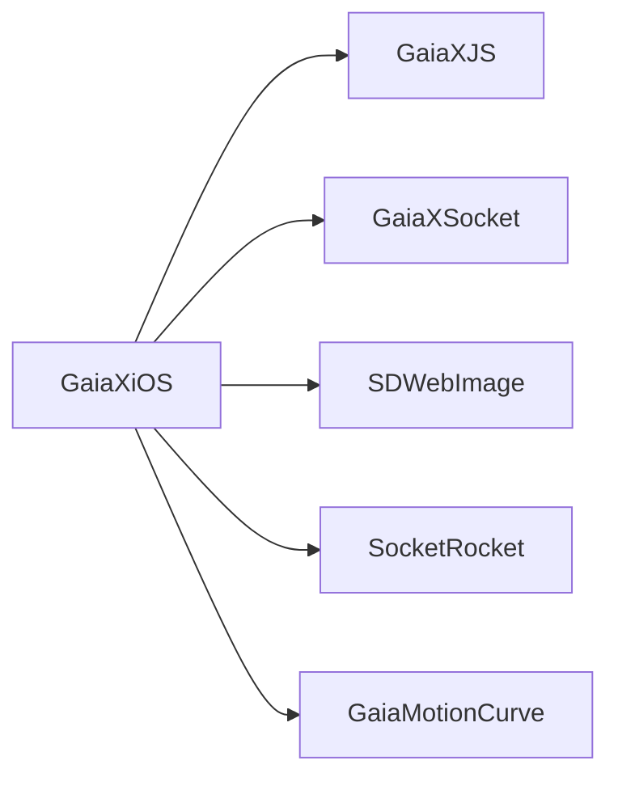

# iOS API

<cite>
**本文档中引用的文件**
- [GaiaXiOS.h](file://GaiaXiOS/GaiaXiOS/GaiaXiOS.h)
- [GXTemplateEngine.h](file://GaiaXiOS/GaiaXiOS/Engine/GXTemplateEngine.h)
- [GXDataManager.h](file://GaiaXiOS/GaiaXiOS/Binding/Data/GXDataManager.h)
- [GXNodeTreeCreator.h](file://GaiaXiOS/GaiaXiOS/Core/Creator/GXNodeTreeCreator.h)
- [GXUtils.h](file://GaiaXiOS/GaiaXiOS/Utilities/GXUtils.h)
- [ViewController.h](file://GaiaXiOSDemo/GaiaXiOSDemo/ViewController.h)
- [ViewController.m](file://GaiaXiOSDemo/GaiaXiOSDemo/ViewController.m)
- [Podfile](file://GaiaXiOSDemo/Podfile)
</cite>

## 目录
1. [简介](#简介)
2. [项目结构](#项目结构)
3. [核心组件](#核心组件)
4. [架构概述](#架构概述)
5. [详细组件分析](#详细组件分析)
6. [依赖分析](#依赖分析)
7. [性能考虑](#性能考虑)
8. [故障排除指南](#故障排除指南)
9. [结论](#结论)

## 简介
本文档旨在为iOS开发者提供GaiaX框架的全面API参考，重点围绕`GaiaXiOS.h`头文件展开。文档详细说明了模板引擎的初始化、模板加载与渲染流程，数据绑定接口，节点创建机制，以及在Swift项目中的桥接使用方法。同时涵盖CocoaPods集成、内存管理、事件回调、线程安全等最佳实践，并提供常见问题的解决方案。

## 项目结构
GaiaX iOS项目采用模块化设计，核心功能分散在不同子目录中。`GaiaXiOS`为主框架，包含引擎、绑定、核心逻辑等；`GaiaXiOSDemo`为示例工程，用于展示集成方式和使用场景。

**图示来源**
- [GaiaXiOS.h](file://GaiaXiOS/GaiaXiOS/GaiaXiOS.h)
- [ViewController.h](file://GaiaXiOSDemo/GaiaXiOSDemo/ViewController.h)

**节来源**
- [GaiaXiOS.h](file://GaiaXiOS/GaiaXiOS/GaiaXiOS.h)
- [ViewController.h](file://GaiaXiOSDemo/GaiaXiOSDemo/ViewController.h)

## 核心组件
核心组件包括模板引擎`GXTemplateEngine`、数据管理器`GXDataManager`、节点树创建器`GXNodeTreeCreator`以及工具类`GXUtils`。这些组件协同工作，实现动态模板的解析、渲染与交互。

**节来源**
- [GXTemplateEngine.h](file://GaiaXiOS/GaiaXiOS/Engine/GXTemplateEngine.h)
- [GXDataManager.h](file://GaiaXiOS/GaiaXiOS/Binding/Data/GXDataManager.h)
- [GXNodeTreeCreator.h](file://GaiaXiOS/GaiaXiOS/Core/Creator/GXNodeTreeCreator.h)

## 架构概述
GaiaX iOS架构分为四层：接入层负责与宿主应用通信；引擎层处理模板解析与渲染；数据层实现数据绑定与状态管理；基础层提供通用工具与跨平台支持。

**图示来源**
- [GXTemplateEngine.h](file://GaiaXiOS/GaiaXiOS/Engine/GXTemplateEngine.h)
- [GXDataManager.h](file://GaiaXiOS/GaiaXiOS/Binding/Data/GXDataManager.h)

## 详细组件分析

### GXTemplateEngine 分析
`GXTemplateEngine`是模板渲染的核心类，采用单例模式提供服务。它负责创建视图、绑定数据、查询节点及计算尺寸。

#### 类图

**图示来源**
- [GXTemplateEngine.h](file://GaiaXiOS/GaiaXiOS/Engine/GXTemplateEngine.h)

**节来源**
- [GXTemplateEngine.h](file://GaiaXiOS/GaiaXiOS/Engine/GXTemplateEngine.h)

### GXDataManager 分析
`GXDataManager`负责模板数据的绑定与更新，确保UI与数据状态同步。

#### 序列图

**图示来源**
- [GXDataManager.h](file://GaiaXiOS/GaiaXiOS/Binding/Data/GXDataManager.h)

**节来源**
- [GXDataManager.h](file://GaiaXiOS/GaiaXiOS/Binding/Data/GXDataManager.h)

### GXNodeTreeCreator 分析
`GXNodeTreeCreator`负责将模板JSON结构转换为原生视图节点树，是渲染流程的关键环节。

#### 流程图

**图示来源**
- [GXNodeTreeCreator.h](file://GaiaXiOS/GaiaXiOS/Core/Creator/GXNodeTreeCreator.h)

**节来源**
- [GXNodeTreeCreator.h](file://GaiaXiOS/GaiaXiOS/Core/Creator/GXNodeTreeCreator.h)

## 依赖分析
GaiaX iOS依赖多个内部和外部组件，通过CocoaPods进行管理。

**图示来源**
- [Podfile](file://GaiaXiOSDemo/Podfile)

**节来源**
- [Podfile](file://GaiaXiOSDemo/Podfile)

## 性能考虑
- 启用节点扁平化以减少视图层级
- 复用模板实例避免重复解析
- 在后台线程加载大型模板
- 使用`bindData:onView:`避免不必要的尺寸计算

## 故障排除指南
常见问题包括符号冲突、架构不兼容、模板加载失败等。建议检查Podfile配置、确保bitcode关闭、验证模板路径正确性。

**节来源**
- [ViewController.m](file://GaiaXiOSDemo/GaiaXiOSDemo/ViewController.m)
- [Podfile](file://GaiaXiOSDemo/Podfile)

## 结论
GaiaX iOS提供了一套完整的动态化UI解决方案，通过清晰的API设计和模块化架构，帮助开发者高效集成动态模板功能。结合最佳实践可显著提升应用灵活性与用户体验。