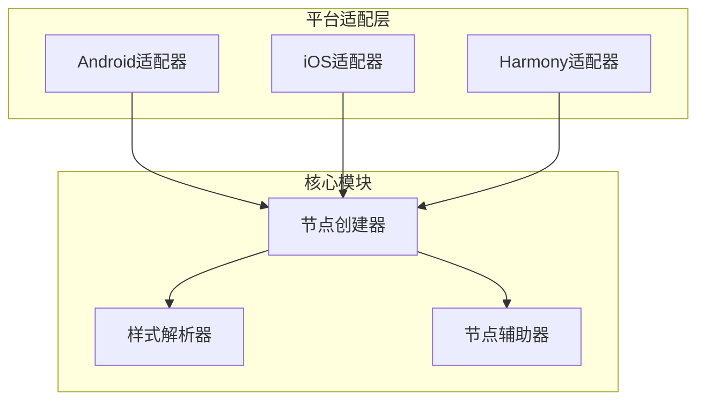
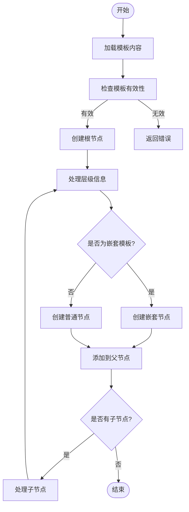
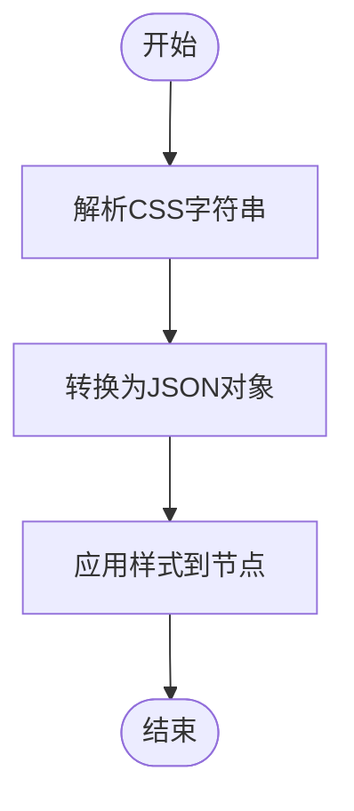
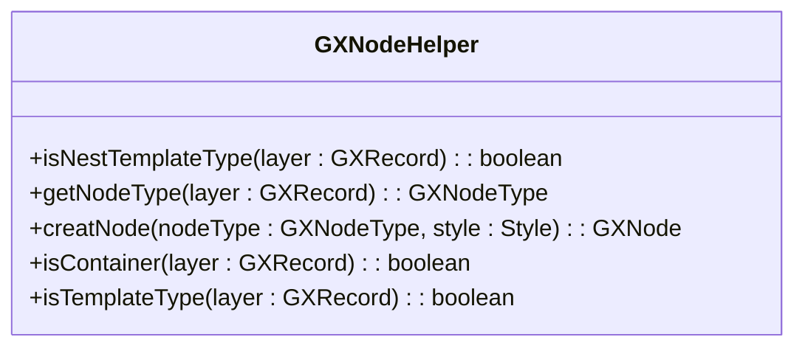
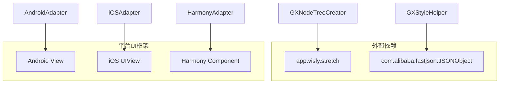

# 创建器

<cite>
**本文档引用的文件**
- [GXNodeTreeCreator.kt](file://GaiaXAndroid/src/main/kotlin/com/alibaba/gaiax/render/node/GXNodeTreeCreator.kt)
- [GXNodeTreeCreator.ets](file://GaiaXHarmony/GaiaXCore/GaiaX/src/main/ets/creator/GXNodeTreeCreator.ets)
- [GXNodeTreeCreator.m](file://GaiaXiOS/GaiaXiOS/Core/Creator/GXNodeTreeCreator.m)
- [GXCssFileParserUtils.kt](file://GaiaXAndroid/src/main/kotlin/com/alibaba/gaiax/template/utils/GXCssFileParserUtils.kt)
- [GXStyleHelper.ets](file://GaiaXHarmony/GaiaXCore/GaiaX/src/main/ets/creator/GXStyleHelper.ets)
- [transform.ts](file://GaiaXHarmony/GaiaXCore/GaiaX/src/main/ets/template/transform.ts)
- [GXNodeHelper.ets](file://GaiaXHarmony/GaiaXCore/GaiaX/src/main/ets/creator/GXNodeHelper.ets)
</cite>

## 目录
1. [简介](#简介)
2. [项目结构](#项目结构)
3. [核心组件](#核心组件)
4. [架构概述](#架构概述)
5. [详细组件分析](#详细组件分析)
6. [依赖分析](#依赖分析)
7. [性能考虑](#性能考虑)
8. [故障排除指南](#故障排除指南)
9. [结论](#结论)

## 简介
本文档详细说明了从模板JSON到视图树的转换过程，重点介绍GXNodeTreeCreator的节点创建流程。文档涵盖了GXStyleHelper的样式解析机制和GXNodeHelper的节点辅助功能，解释了CSS样式优先级计算、继承规则和布局属性转换。此外，还提供了自定义样式解析器的扩展方法和性能优化建议，以及在复杂模板场景下的处理策略，如嵌套滚动、动态布局和条件渲染。针对创建器性能瓶颈、样式解析错误和节点创建失败等问题，提供了调试指南和解决方案。

## 项目结构
项目结构清晰，主要分为多个模块，包括Android、iOS、HarmonyOS等平台的实现。核心功能集中在`GaiaXCore`模块中，而平台特定的实现则分布在各自的目录下。`GXNodeTreeCreator`、`GXStyleHelper`和`GXNodeHelper`等关键类位于`creator`包中，负责节点创建、样式解析和节点辅助功能。

**Section sources**
- [GXNodeTreeCreator.kt](file://GaiaXAndroid/src/main/kotlin/com/alibaba/gaiax/render/node/GXNodeTreeCreator.kt)
- [GXNodeTreeCreator.ets](file://GaiaXHarmony/GaiaXCore/GaiaX/src/main/ets/creator/GXNodeTreeCreator.ets)
- [GXNodeTreeCreator.m](file://GaiaXiOS/GaiaXiOS/Core/Creator/GXNodeTreeCreator.m)

## 核心组件
### GXNodeTreeCreator
`GXNodeTreeCreator`是负责从模板JSON创建视图树的核心类。它通过递归遍历模板层级信息，创建相应的节点，并处理嵌套模板和普通节点。

### GXStyleHelper
`GXStyleHelper`负责解析和转换CSS样式，支持多种布局属性的转换，如`flex-direction`、`align-items`、`justify-content`等。它还处理样式优先级和继承规则。

### GXNodeHelper
`GXNodeHelper`提供了一系列辅助方法，用于判断节点类型、创建节点实例和处理节点属性。

**Section sources**
- [GXNodeTreeCreator.kt](file://GaiaXAndroid/src/main/kotlin/com/alibaba/gaiax/render/node/GXNodeTreeCreator.kt)
- [GXStyleHelper.ets](file://GaiaXHarmony/GaiaXCore/GaiaX/src/main/ets/creator/GXStyleHelper.ets)
- [GXNodeHelper.ets](file://GaiaXHarmony/GaiaXCore/GaiaX/src/main/ets/creator/GXNodeHelper.ets)

## 架构概述
系统架构采用分层设计，核心逻辑集中在`GaiaXCore`模块中，平台特定的实现则通过适配层与核心逻辑交互。`GXNodeTreeCreator`负责创建视图树，`GXStyleHelper`负责样式解析，`GXNodeHelper`提供节点辅助功能。

**Diagram sources**
- [GXNodeTreeCreator.kt](file://GaiaXAndroid/src/main/kotlin/com/alibaba/gaiax/render/node/GXNodeTreeCreator.kt)
- [GXStyleHelper.ets](file://GaiaXHarmony/GaiaXCore/GaiaX/src/main/ets/creator/GXStyleHelper.ets)
- [GXNodeHelper.ets](file://GaiaXHarmony/GaiaXCore/GaiaX/src/main/ets/creator/GXNodeHelper.ets)

## 详细组件分析
### GXNodeTreeCreator 分析
`GXNodeTreeCreator`通过`creatNodeTree`方法创建视图树。该方法首先加载模板内容，然后递归创建子节点。对于嵌套模板，会创建新的`GXTemplateItem`并递归调用`creatNodeTree`。

#### 节点创建流程

**Diagram sources**
- [GXNodeTreeCreator.kt](file://GaiaXAndroid/src/main/kotlin/com/alibaba/gaiax/render/node/GXNodeTreeCreator.kt)
- [GXNodeTreeCreator.ets](file://GaiaXHarmony/GaiaXCore/GaiaX/src/main/ets/creator/GXNodeTreeCreator.ets)
- [GXNodeTreeCreator.m](file://GaiaXiOS/GaiaXiOS/Core/Creator/GXNodeTreeCreator.m)

### GXStyleHelper 分析
`GXStyleHelper`通过`creatStyle`方法创建样式对象，并通过`updateStyle`方法更新样式属性。它支持多种布局属性的转换，如`flex-direction`、`align-items`、`justify-content`等。

#### 样式解析流程

**Diagram sources**
- [GXCssFileParserUtils.kt](file://GaiaXAndroid/src/main/kotlin/com/alibaba/gaiax/template/utils/GXCssFileParserUtils.kt)
- [transform.ts](file://GaiaXHarmony/GaiaXCore/GaiaX/src/main/ets/template/transform.ts)
- [GXStyleHelper.ets](file://GaiaXHarmony/GaiaXCore/GaiaX/src/main/ets/creator/GXStyleHelper.ets)

### GXNodeHelper 分析
`GXNodeHelper`提供了一系列辅助方法，用于判断节点类型、创建节点实例和处理节点属性。例如，`isNestTemplateType`方法用于判断节点是否为嵌套模板类型。

#### 节点辅助功能

**Diagram sources**
- [GXNodeHelper.ets](file://GaiaXHarmony/GaiaXCore/GaiaX/src/main/ets/creator/GXNodeHelper.ets)

## 依赖分析
系统依赖于多个外部库和模块，如`app.visly.stretch`用于布局计算，`com.alibaba.fastjson.JSONObject`用于JSON解析。平台特定的实现依赖于各自的UI框架，如Android的`View`、iOS的`UIView`和HarmonyOS的`Component`。

**Diagram sources**
- [GXNodeTreeCreator.kt](file://GaiaXAndroid/src/main/kotlin/com/alibaba/gaiax/render/node/GXNodeTreeCreator.kt)
- [GXStyleHelper.ets](file://GaiaXHarmony/GaiaXCore/GaiaX/src/main/ets/creator/GXStyleHelper.ets)

## 性能考虑
为了提高性能，系统采用了多种优化策略，如缓存模板内容、复用节点实例和异步加载资源。此外，还提供了性能监控工具，帮助开发者识别和解决性能瓶颈。

## 故障排除指南
### 性能瓶颈
- **问题**: 节点创建速度慢
- **解决方案**: 检查模板复杂度，减少嵌套层级，优化CSS样式

### 样式解析错误
- **问题**: 样式未正确应用
- **解决方案**: 检查CSS语法，确保样式属性名称正确，使用`GXStyleHelper`的调试工具

### 节点创建失败
- **问题**: 节点创建失败
- **解决方案**: 检查模板JSON格式，确保节点ID唯一，使用`GXNodeHelper`的验证方法

**Section sources**
- [GXNodeTreeCreator.kt](file://GaiaXAndroid/src/main/kotlin/com/alibaba/gaiax/render/node/GXNodeTreeCreator.kt)
- [GXStyleHelper.ets](file://GaiaXHarmony/GaiaXCore/GaiaX/src/main/ets/creator/GXStyleHelper.ets)
- [GXNodeHelper.ets](file://GaiaXHarmony/GaiaXCore/GaiaX/src/main/ets/creator/GXNodeHelper.ets)

## 结论
本文档详细介绍了GXNodeTreeCreator的节点创建流程、GXStyleHelper的样式解析机制和GXNodeHelper的节点辅助功能。通过这些组件，系统能够高效地从模板JSON创建视图树，并支持复杂的布局和样式需求。未来的工作将集中在进一步优化性能和扩展功能上。