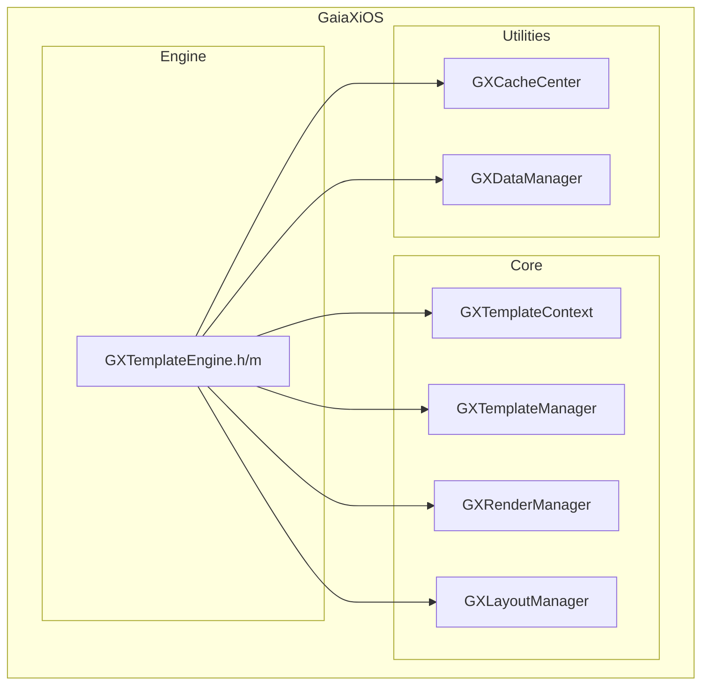
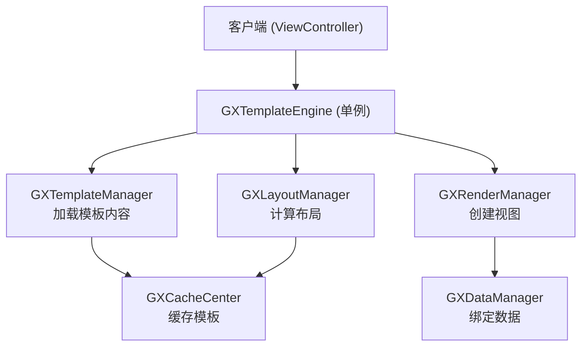
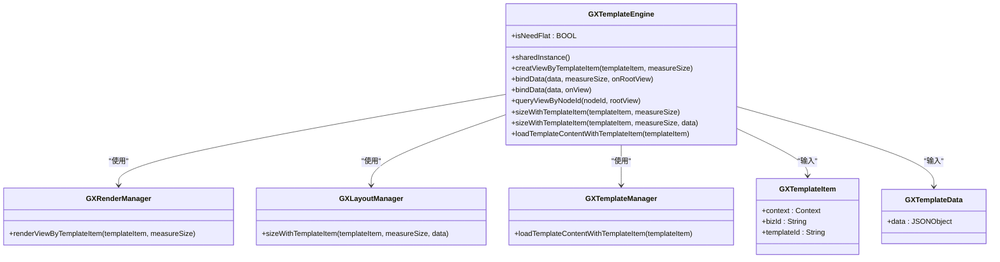
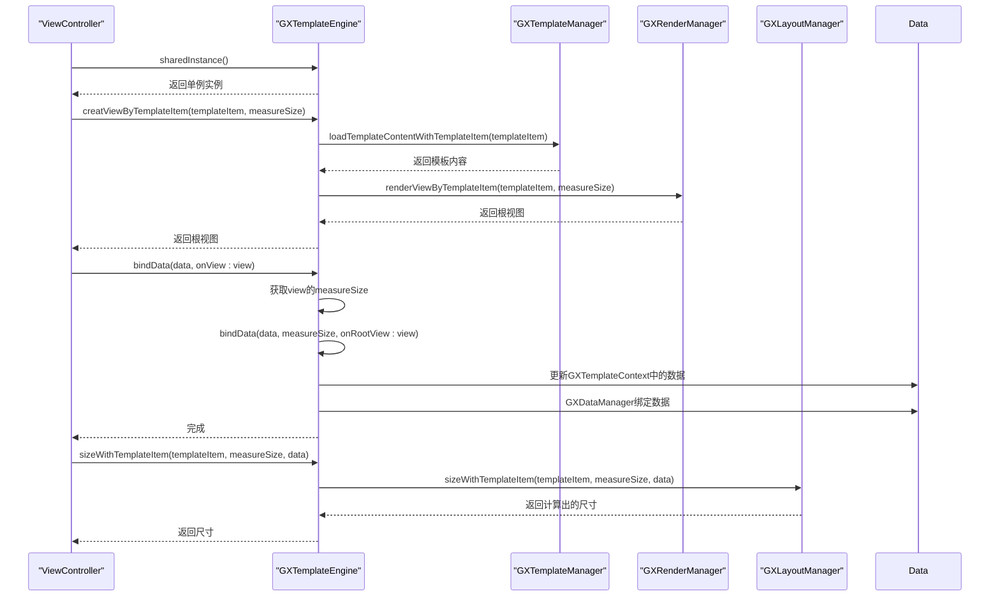
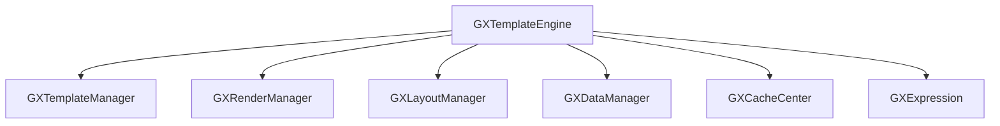

# 引擎入口

<cite>
**本文档引用文件**  
- [GXTemplateEngine.h](file://GaiaXiOS/GaiaXiOS/Engine/GXTemplateEngine.h)
- [GXTemplateEngine.m](file://GaiaXiOS/GaiaXiOS/Engine/GXTemplateEngine.m)
</cite>

## 目录
1. [简介](#简介)
2. [项目结构](#项目结构)
3. [核心组件](#核心组件)
4. [架构概述](#架构概述)
5. [详细组件分析](#详细组件分析)
6. [依赖分析](#依赖分析)
7. [性能考量](#性能考量)
8. [故障排除指南](#故障排除指南)
9. [结论](#结论)

## 简介
本文件旨在为iOS平台上的GXTemplateEngine提供详尽的API文档。文档涵盖模板引擎的初始化、模板加载与渲染方法，详细说明单例模式的使用方式、引擎配置参数及生命周期管理。同时解释模板缓存机制、异步加载策略和错误处理回调，并提供Objective-C和Swift双语示例代码，展示在ViewController中创建模板视图的完整流程。文档还涵盖线程安全设计以确保UI渲染在主线程进行，包含性能监控接口和调试模式配置，并针对初始化失败、模板加载超时和内存泄漏等常见问题提供解决方案。

## 项目结构
GaiaX项目是一个跨平台的模板渲染引擎，支持iOS、Android、HarmonyOS等多个平台。iOS部分主要位于`GaiaXiOS`目录下，其核心引擎实现位于`Engine`子目录中。`GXTemplateEngine.h`和`GXTemplateEngine.m`是iOS平台模板引擎的入口文件，定义了所有对外暴露的API。

**图示来源**
- [GXTemplateEngine.h](file://GaiaXiOS/GaiaXiOS/Engine/GXTemplateEngine.h)
- [GXTemplateEngine.m](file://GaiaXiOS/GaiaXiOS/Engine/GXTemplateEngine.m)

**本节来源**
- [GXTemplateEngine.h](file://GaiaXiOS/GaiaXiOS/Engine/GXTemplateEngine.h)
- [GXTemplateEngine.m](file://GaiaXiOS/GaiaXiOS/Engine/GXTemplateEngine.m)

## 核心组件
`GXTemplateEngine`是整个iOS平台GaiaX框架的核心，采用单例模式设计，通过`sharedInstance`方法获取全局唯一实例。该引擎负责协调模板加载、数据绑定、视图创建和布局计算等核心功能。其主要职责包括：通过`creatViewByTemplateItem:measureSize:`方法创建模板视图；通过`bindData:onView:`方法进行数据绑定；通过`queryViewByNodeId:rootView:`方法根据节点ID查询视图；以及通过`sizeWithTemplateItem:measureSize:`等方法计算模板的真实尺寸。

**本节来源**
- [GXTemplateEngine.h](file://GaiaXiOS/GaiaXiOS/Engine/GXTemplateEngine.h#L30-L65)
- [GXTemplateEngine.m](file://GaiaXiOS/GaiaXiOS/Engine/GXTemplateEngine.m#L38-L49)

## 架构概述
GXTemplateEngine的架构设计遵循职责分离原则，将复杂的模板渲染过程分解为多个独立的管理器。`GXTemplateManager`负责模板内容的加载与缓存，`GXRenderManager`负责视图的创建与渲染，`GXLayoutManager`负责布局计算。引擎本身作为协调者，接收外部调用并调度这些管理器完成具体工作。这种设计提高了代码的可维护性和可测试性。

**图示来源**
- [GXTemplateEngine.h](file://GaiaXiOS/GaiaXiOS/Engine/GXTemplateEngine.h)
- [GXTemplateEngine.m](file://GaiaXiOS/GaiaXiOS/Engine/GXTemplateEngine.m)

## 详细组件分析
### GXTemplateEngine 分析
`GXTemplateEngine`类是iOS平台GaiaX模板引擎的入口点，其设计和实现是理解整个系统的关键。

#### 对象导向组件

**图示来源**
- [GXTemplateEngine.h](file://GaiaXiOS/GaiaXiOS/Engine/GXTemplateEngine.h)
- [GXTemplateEngine.m](file://GaiaXiOS/GaiaXiOS/Engine/GXTemplateEngine.m)

#### API/服务组件

**图示来源**
- [GXTemplateEngine.h](file://GaiaXiOS/GaiaXiOS/Engine/GXTemplateEngine.h)
- [GXTemplateEngine.m](file://GaiaXiOS/GaiaXiOS/Engine/GXTemplateEngine.m)

**本节来源**
- [GXTemplateEngine.h](file://GaiaXiOS/GaiaXiOS/Engine/GXTemplateEngine.h)
- [GXTemplateEngine.m](file://GaiaXiOS/GaiaXiOS/Engine/GXTemplateEngine.m)

## 依赖分析
`GXTemplateEngine`与多个核心组件存在直接依赖关系。它依赖`GXTemplateManager`来加载和解析模板内容，依赖`GXRenderManager`来创建和渲染视图，依赖`GXLayoutManager`来计算布局尺寸。此外，它还依赖`GXDataManager`进行数据绑定操作，并通过`GXCacheCenter`实现模板内容的缓存，以提高性能。这些依赖关系通过懒加载的方式在`GXTemplateEngine`的私有属性中实现，确保了资源的按需加载。

**图示来源**
- [GXTemplateEngine.m](file://GaiaXiOS/GaiaXiOS/Engine/GXTemplateEngine.m#L30-L34)

**本节来源**
- [GXTemplateEngine.m](file://GaiaXiOS/GaiaXiOS/Engine/GXTemplateEngine.m#L19-L28)

## 性能考量
`GXTemplateEngine`的设计充分考虑了性能因素。首先，通过单例模式避免了重复创建引擎实例的开销。其次，利用`GXCacheCenter`对已加载的模板内容进行缓存，避免了重复的I/O操作。在布局计算方面，`GXLayoutManager`会缓存计算结果，当`measureSize`未发生变化时可直接复用，显著提升了数据绑定的效率。此外，引擎在初始化时会预先设置`GXExpression`环境，减少了运行时的初始化延迟。

## 故障排除指南
在使用`GXTemplateEngine`时，可能会遇到以下常见问题：

1.  **初始化失败**：确保在调用任何引擎方法前，已通过`[GXTemplateEngine sharedInstance]`正确获取了实例。该方法使用`dispatch_once`保证线程安全的单例创建。
2.  **模板加载超时**：检查`GXTemplateItem`中的`bizId`和`templateId`是否正确，以及模板资源是否已正确打包到应用中。`GXTemplateManager`会从应用的bundle中加载模板。
3.  **内存泄漏**：`GXTemplateEngine`本身是单例，不会造成内存泄漏。但需注意，由引擎创建的视图（`UIView`）应由调用方（如`ViewController`）负责管理其生命周期。当视图不再需要时，应将其从视图层级中移除并置为`nil`。

**本节来源**
- [GXTemplateEngine.h](file://GaiaXiOS/GaiaXiOS/Engine/GXTemplateEngine.h#L40-L48)
- [GXTemplateEngine.m](file://GaiaXiOS/GaiaXiOS/Engine/GXTemplateEngine.m#L40-L48)

## 结论
`GXTemplateEngine`为iOS平台提供了一个强大且高效的模板渲染解决方案。其清晰的API设计、模块化的架构和对性能的优化，使其能够满足复杂动态UI的渲染需求。通过单例模式保证了全局状态的一致性，通过分离关注点的设计提高了代码的可维护性。开发者可以方便地集成该引擎，快速实现数据驱动的UI渲染。