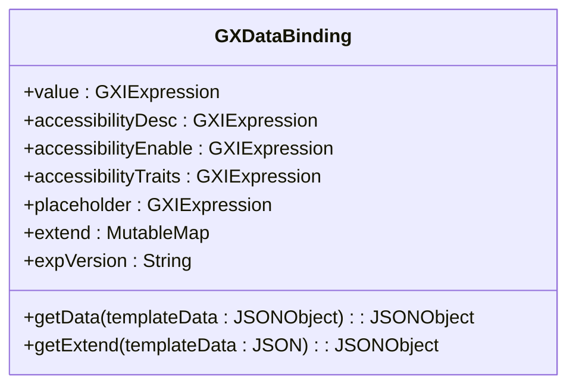
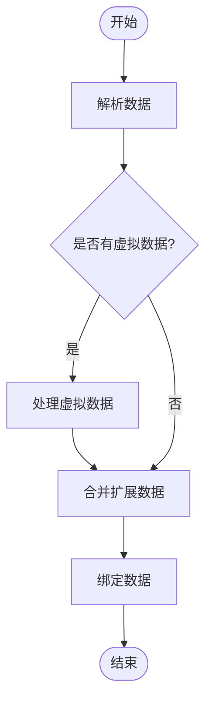
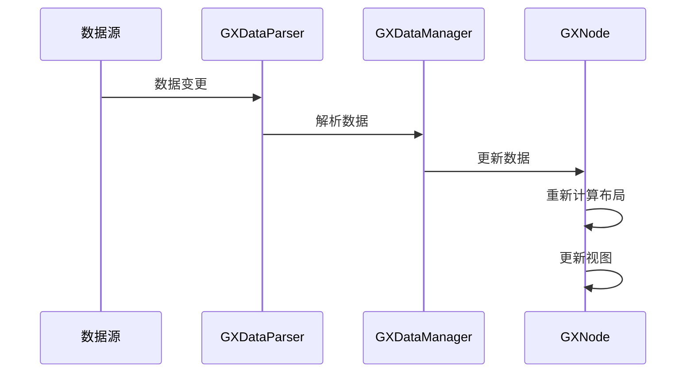
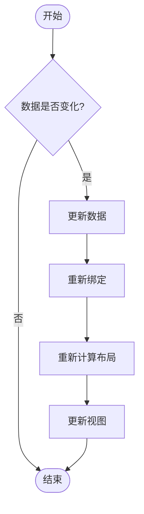
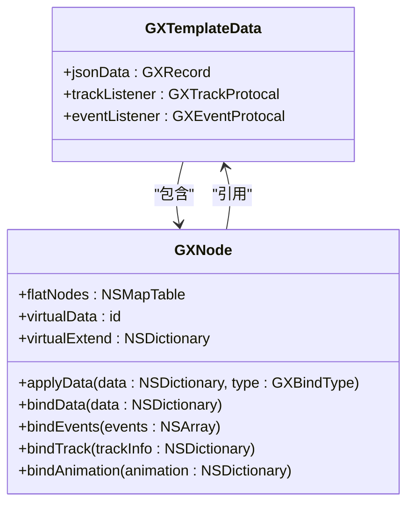
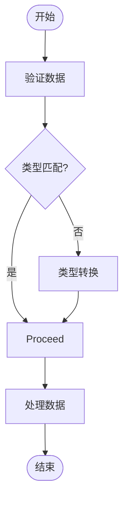
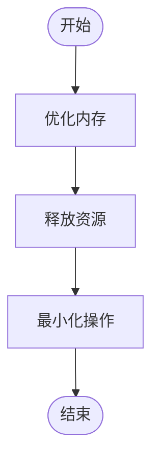
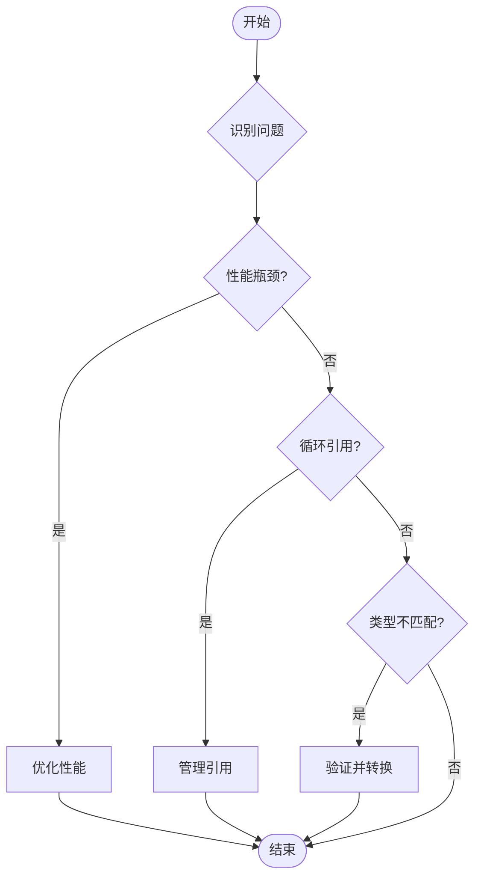

# 数据管理

<cite>
**本文档引用的文件**  
- [GXDataBinding.kt](file://GaiaXAndroid/src/main/kotlin/com/alibaba/gaiax/template/GXDataBinding.kt)
- [GXDataBindingFactory.kt](file://GaiaXAndroid/src/main/kotlin/com/alibaba/gaiax/template/factory/GXDataBindingFactory.kt)
- [GXDataImpl.kt](file://GaiaXAndroid/src/main/kotlin/com/alibaba/gaiax/data/GXDataImpl.kt)
- [GXDataManager.ets](file://GaiaXHarmony/GaiaXCore/GaiaX/src/main/ets/binding/GXDataManager.ets)
- [GXNode.m](file://GaiaXiOS/GaiaXiOS/Core/StretchKit/Classes/GXNode.m)
- [GXJSDelegateImplManager.m](file://GaiaXiOS/GaiaXiOS/Binding/JS/GXJSDelegateImplManager.m)
- [ComponentScriptStrategy.kt](file://GaiaXAndroidJS/src/main/kotlin/com/alibaba/gaiax/js/support/script/ComponentScriptStrategy.kt)
- [GXDataBinding.tsx](file://GaiaXTaro/packages/gaiax-taro/src/gaiax/GXDataBinding.tsx)
</cite>

## 目录
1. [简介](#简介)
2. [数据绑定接口](#数据绑定接口)
3. [数据解析与处理](#数据解析与处理)
4. [数据变更通知与依赖追踪](#数据变更通知与依赖追踪)
5. [动态数据更新与增量绑定](#动态数据更新与增量绑定)
6. [复杂对象映射](#复杂对象映射)
7. [数据验证与类型转换](#数据验证与类型转换)
8. [内存管理与性能优化](#内存管理与性能优化)
9. [常见问题与解决方案](#常见问题与解决方案)
10. [结论](#结论)

## 简介
本文档详细说明了 GaiaX 框架中 GXDataManager 的数据绑定接口，涵盖数据解析、绑定和更新机制。文档化了 GXDataParser 的 JSON 数据处理流程和 GXData 的值类型封装，解释了数据变更通知机制和依赖追踪系统。提供了动态数据更新、增量绑定和复杂对象映射的代码示例，并说明了数据验证规则、类型转换策略和内存管理最佳实践。针对数据绑定性能瓶颈、循环引用和类型不匹配等常见问题提供了解决方案和优化建议。

## 数据绑定接口
GXDataManager 的数据绑定接口负责将数据源与 UI 组件进行绑定，确保数据的正确显示和更新。数据绑定的核心是 GXDataBinding 类，它定义了数据绑定的计算结果结构。

**Diagram sources**
- [GXDataBinding.kt](file://GaiaXAndroid/src/main/kotlin/com/alibaba/gaiax/template/GXDataBinding.kt)

**Section sources**
- [GXDataBinding.kt](file://GaiaXAndroid/src/main/kotlin/com/alibaba/gaiax/template/GXDataBinding.kt)

## 数据解析与处理
GXDataParser 负责解析 JSON 数据并将其转换为适合 UI 组件使用的格式。数据解析过程包括从数据源中提取数据、处理嵌套模板的外部数据源以及合并扩展数据。

**Diagram sources**
- [GXDataManager.ets](file://GaiaXHarmony/GaiaXCore/GaiaX/src/main/ets/binding/GXDataManager.ets)
- [GXNode.m](file://GaiaXiOS/GaiaXiOS/Core/StretchKit/Classes/GXNode.m)

**Section sources**
- [GXDataManager.ets](file://GaiaXHarmony/GaiaXCore/GaiaX/src/main/ets/binding/GXDataManager.ets)
- [GXNode.m](file://GaiaXiOS/GaiaXiOS/Core/StretchKit/Classes/GXNode.m)

## 数据变更通知与依赖追踪
数据变更通知机制确保当数据源发生变化时，UI 组件能够及时更新。依赖追踪系统通过监听数据源的变化来触发相应的更新操作。

**Diagram sources**
- [GXDataManager.ets](file://GaiaXHarmony/GaiaXCore/GaiaX/src/main/ets/binding/GXDataManager.ets)
- [GXNode.m](file://GaiaXiOS/GaiaXiOS/Core/StretchKit/Classes/GXNode.m)

**Section sources**
- [GXDataManager.ets](file://GaiaXHarmony/GaiaXCore/GaiaX/src/main/ets/binding/GXDataManager.ets)
- [GXNode.m](file://GaiaXiOS/GaiaXiOS/Core/StretchKit/Classes/GXNode.m)

## 动态数据更新与增量绑定
动态数据更新允许在运行时修改数据源，而增量绑定则只更新发生变化的部分，提高性能。

**Diagram sources**
- [GXJSDelegateImplManager.m](file://GaiaXiOS/GaiaXiOS/Binding/JS/GXJSDelegateImplManager.m)
- [GXNode.m](file://GaiaXiOS/GaiaXiOS/Core/StretchKit/Classes/GXNode.m)

**Section sources**
- [GXJSDelegateImplManager.m](file://GaiaXiOS/GaiaXiOS/Binding/JS/GXJSDelegateImplManager.m)
- [GXNode.m](file://GaiaXiOS/GaiaXiOS/Core/StretchKit/Classes/GXNode.m)

## 复杂对象映射
复杂对象映射涉及将嵌套的数据结构映射到 UI 组件上，处理嵌套模板的外部数据源和扩展数据。

**Diagram sources**
- [GXDataManager.ets](file://GaiaXHarmony/GaiaXCore/GaiaX/src/main/ets/binding/GXDataManager.ets)
- [GXNode.m](file://GaiaXiOS/GaiaXiOS/Core/StretchKit/Classes/GXNode.m)

**Section sources**
- [GXDataManager.ets](file://GaiaXHarmony/GaiaXCore/GaiaX/src/main/ets/binding/GXDataManager.ets)
- [GXNode.m](file://GaiaXiOS/GaiaXiOS/Core/StretchKit/Classes/GXNode.m)

## 数据验证与类型转换
数据验证规则确保数据的完整性和正确性，类型转换策略则处理不同数据类型之间的转换。

**Diagram sources**
- [StandardTypeAdapters.java](file://GaiaXAndroidQuickJS/src/main/java/com/alibaba/gaiax/quickjs/adapter/StandardTypeAdapters.java)
- [JSDataConvert.kt](file://GaiaXAndroidJS/src/main/kotlin/com/alibaba/gaiax/js/support/JSDataConvert.kt)

**Section sources**
- [StandardTypeAdapters.java](file://GaiaXAndroidQuickJS/src/main/java/com/alibaba/gaiax/quickjs/adapter/StandardTypeAdapters.java)
- [JSDataConvert.kt](file://GaiaXAndroidJS/src/main/kotlin/com/alibaba/gaiax/js/support/JSDataConvert.kt)

## 内存管理与性能优化
内存管理最佳实践包括及时释放不再使用的资源，性能优化建议包括减少不必要的数据解析和绑定操作。

**Diagram sources**
- [GXDataImpl.kt](file://GaiaXAndroid/src/main/kotlin/com/alibaba/gaiax/data/GXDataImpl.kt)
- [GXNode.m](file://GaiaXiOS/GaiaXiOS/Core/StretchKit/Classes/GXNode.m)

**Section sources**
- [GXDataImpl.kt](file://GaiaXAndroid/src/main/kotlin/com/alibaba/gaiax/data/GXDataImpl.kt)
- [GXNode.m](file://GaiaXiOS/GaiaXiOS/Core/StretchKit/Classes/GXNode.m)

## 常见问题与解决方案
针对数据绑定性能瓶颈、循环引用和类型不匹配等常见问题，提供以下解决方案和优化建议：

1. **性能瓶颈**：通过增量绑定和缓存机制减少不必要的数据解析和绑定操作。
2. **循环引用**：使用弱引用或手动管理引用关系，避免内存泄漏。
3. **类型不匹配**：在数据解析阶段进行严格的类型检查和转换，确保数据的一致性。

**Diagram sources**
- [GXDataImpl.kt](file://GaiaXAndroid/src/main/kotlin/com/alibaba/gaiax/data/GXDataImpl.kt)
- [GXNode.m](file://GaiaXiOS/GaiaXiOS/Core/StretchKit/Classes/GXNode.m)

**Section sources**
- [GXDataImpl.kt](file://GaiaXAndroid/src/main/kotlin/com/alibaba/gaiax/data/GXDataImpl.kt)
- [GXNode.m](file://GaiaXiOS/GaiaXiOS/Core/StretchKit/Classes/GXNode.m)

## 结论
本文档详细说明了 GaiaX 框架中 GXDataManager 的数据绑定接口，涵盖了数据解析、绑定和更新机制。通过文档化 GXDataParser 的 JSON 数据处理流程和 GXData 的值类型封装，解释了数据变更通知机制和依赖追踪系统。提供了动态数据更新、增量绑定和复杂对象映射的代码示例，并说明了数据验证规则、类型转换策略和内存管理最佳实践。针对数据绑定性能瓶颈、循环引用和类型不匹配等常见问题提供了解决方案和优化建议。