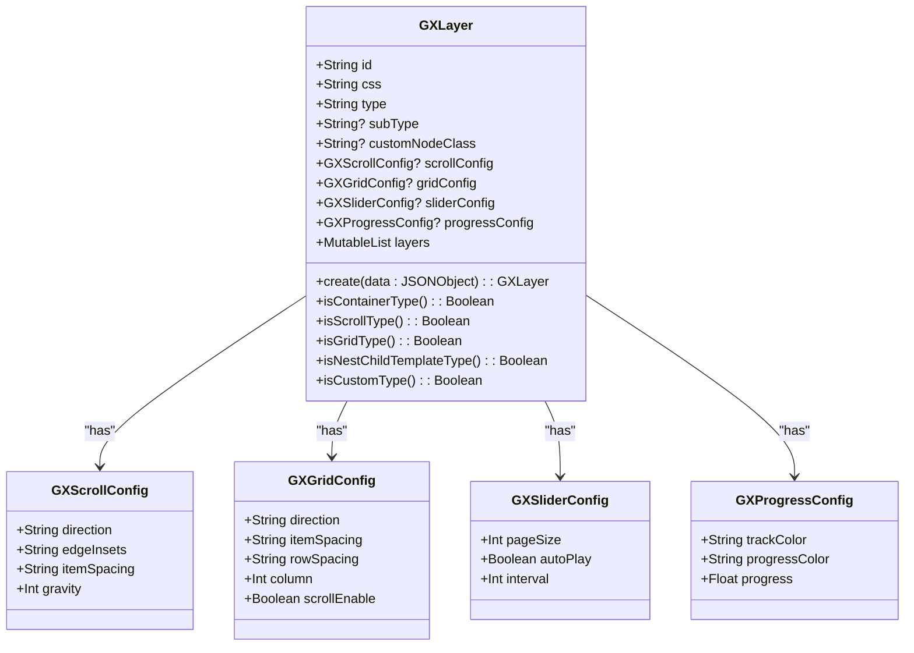
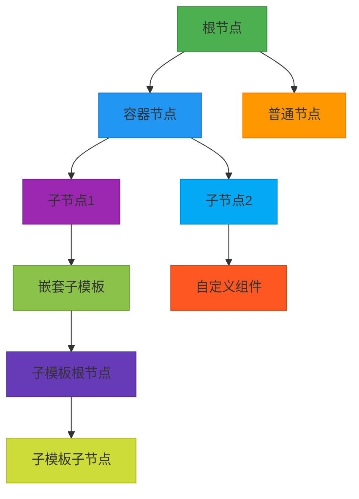
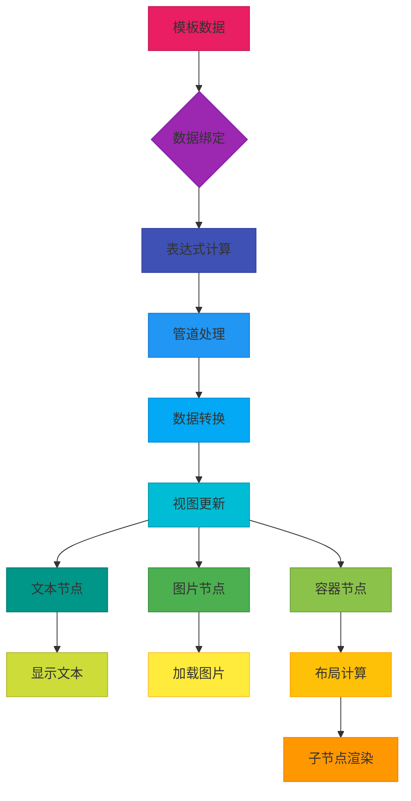
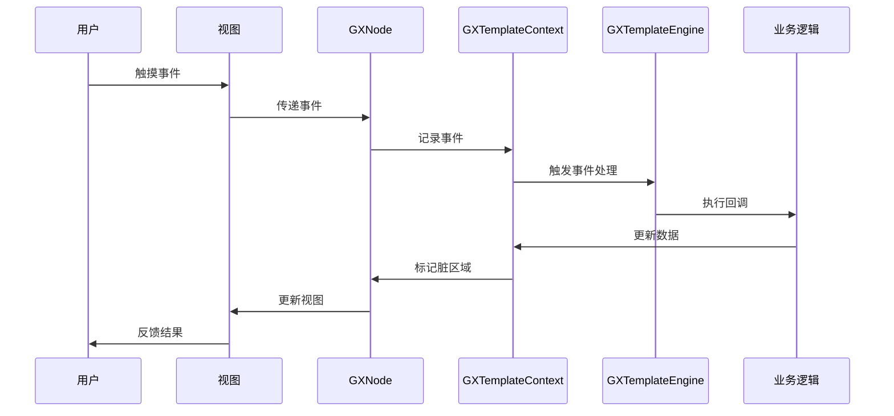
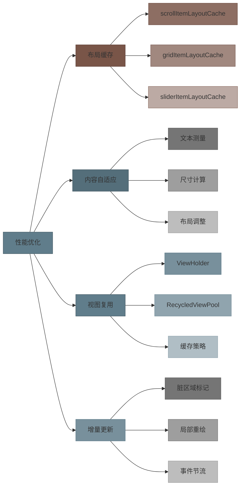

# 层级结构

<cite>
**Referenced Files in This Document**   
- [GXLayer.kt](file://GaiaXAndroid/src/main/kotlin/com/alibaba/gaiax/template/GXLayer.kt)
- [GXTemplateNode.kt](file://GaiaXAndroid/src/main/kotlin/com/alibaba/gaiax/render/node/GXTemplateNode.kt)
- [GXNodeTreeCreator.kt](file://GaiaXAndroid/src/main/kotlin/com/alibaba/gaiax/render/node/GXNodeTreeCreator.kt)
- [GXNodeTreeUpdate.kt](file://GaiaXAndroid/src/main/kotlin/com/alibaba/gaiax/render/node/GXNodeTreeUpdate.kt)
- [GXTemplateContext.kt](file://GaiaXAndroid/src/main/kotlin/com/alibaba/gaiax/context/GXTemplateContext.kt)
- [GXNodeExt.kt](file://GaiaXAndroid/src/main/kotlin/com/alibaba/gaiax/render/node/GXNodeExt.kt)
</cite>

## 目录
1. [介绍](#介绍)
2. [层级结构构建](#层级结构构建)
3. [节点关系与遍历](#节点关系与遍历)
4. [视图树与数据绑定映射](#视图树与数据绑定映射)
5. [动态更新与事件处理](#动态更新与事件处理)
6. [性能优化应用](#性能优化应用)
7. [调试与分析工具](#调试与分析工具)
8. [最佳实践](#最佳实践)

## 介绍
GaiaX的层级结构是模板解析和渲染的核心基础，它通过GXLayer类定义了模板的节点结构。层级结构不仅描述了模板的视觉布局，还承载了数据绑定、事件处理和动画等关键功能。GXLayer作为层级结构的基本单元，通过类型系统区分不同类型的节点，包括容器节点、文本节点、图片节点等，并支持嵌套子模板和自定义组件。这种设计使得模板能够灵活地表达复杂的UI结构，同时保持高效的渲染性能。

**Section sources**
- [GXLayer.kt](file://GaiaXAndroid/src/main/kotlin/com/alibaba/gaiax/template/GXLayer.kt#L27-L309)

## 层级结构构建
层级结构的构建始于模板解析阶段，通过GXLayer类的create方法将JSON格式的模板数据转换为内存中的对象结构。构建过程采用递归方式，从根节点开始逐层解析子节点，形成树状结构。每个GXLayer实例包含节点ID、样式ID、节点类型等基本信息，并通过layers字段维护子节点列表。对于容器类型节点（如Scroll、Grid），还会包含特定的配置信息，如滚动方向、间距等。构建过程中，系统会根据节点类型进行分类处理，确保不同类型节点的特有属性被正确解析和存储。

**Diagram sources**
- [GXLayer.kt](file://GaiaXAndroid/src/main/kotlin/com/alibaba/gaiax/template/GXLayer.kt#L27-L309)

**Section sources**
- [GXLayer.kt](file://GaiaXAndroid/src/main/kotlin/com/alibaba/gaiax/template/GXLayer.kt#L80-L82)
- [GXLayer.kt](file://GaiaXAndroid/src/main/kotlin/com/alibaba/gaiax/template/GXLayer.kt#L96-L180)

## 节点关系与遍历
层级结构中的节点通过父子关系形成树状拓扑，GXNode类作为运行时节点的封装，维护了parentNode和children引用，实现了双向导航能力。系统提供了多种遍历方法，包括深度优先遍历和广度优先遍历，用于执行布局计算、样式应用和数据绑定等操作。findNodeById和findViewById等工具方法支持通过节点ID快速定位特定节点，提高了查询效率。对于容器节点，系统还维护了childTemplateItems列表，用于管理嵌套子模板的实例化信息，确保容器与子模板之间的正确关联。

**Diagram sources**
- [GXNodeTreeCreator.kt](file://GaiaXAndroid/src/main/kotlin/com/alibaba/gaiax/render/node/GXNodeTreeCreator.kt#L52-L134)
- [GXNodeExt.kt](file://GaiaXAndroid/src/main/kotlin/com/alibaba/gaiax/render/node/GXNodeExt.kt#L55-L66)

**Section sources**
- [GXNodeTreeCreator.kt](file://GaiaXAndroid/src/main/kotlin/com/alibaba/gaiax/render/node/GXNodeTreeCreator.kt#L52-L134)
- [GXNodeExt.kt](file://GaiaXAndroid/src/main/kotlin/com/alibaba/gaiax/render/node/GXNodeExt.kt#L55-L66)

## 视图树与数据绑定映射
层级结构与视图树之间存在紧密的映射关系，GXTemplateNode类作为连接两者的桥梁，封装了节点的样式、数据绑定和事件配置信息。在渲染过程中，系统根据GXLayer定义的层级结构创建对应的视图节点，并通过GXTemplateNode中的dataBinding字段建立数据绑定关系。数据绑定支持表达式计算和管道处理，能够实现复杂的数据转换逻辑。当数据更新时，系统通过遍历层级结构，定位受影响的节点并触发相应的更新操作，确保视图与数据的一致性。

**Diagram sources**
- [GXTemplateNode.kt](file://GaiaXAndroid/src/main/kotlin/com/alibaba/gaiax/render/node/GXTemplateNode.kt#L39-L331)
- [GXNodeTreeUpdate.kt](file://GaiaXAndroid/src/main/kotlin/com/alibaba/gaiax/render/node/GXNodeTreeUpdate.kt#L960-L991)

**Section sources**
- [GXTemplateNode.kt](file://GaiaXAndroid/src/main/kotlin/com/alibaba/gaiax/render/node/GXTemplateNode.kt#L39-L331)
- [GXNodeTreeUpdate.kt](file://GaiaXAndroid/src/main/kotlin/com/alibaba/gaiax/render/node/GXNodeTreeUpdate.kt#L960-L991)

## 动态更新与事件处理
层级结构支持高效的动态更新机制，通过标记脏区域和增量更新策略，最小化重绘范围。GXTemplateContext类维护了dirtyTexts集合，记录需要更新的文本节点，避免全量遍历。事件处理系统通过eventBinding字段将用户交互与业务逻辑关联，支持点击、长按、滚动等多种事件类型。对于容器节点，系统还提供了专门的滚动索引更新机制，确保滚动位置与数据状态同步。这种设计既保证了交互的实时性，又避免了不必要的性能开销。

**Diagram sources**
- [GXNodeTreeUpdate.kt](file://GaiaXAndroid/src/main/kotlin/com/alibaba/gaiax/render/node/GXNodeTreeUpdate.kt#L848-L910)
- [GXTemplateContext.kt](file://GaiaXAndroid/src/main/kotlin/com/alibaba/gaiax/context/GXTemplateContext.kt#L101-L101)

**Section sources**
- [GXNodeTreeUpdate.kt](file://GaiaXAndroid/src/main/kotlin/com/alibaba/gaiax/render/node/GXNodeTreeUpdate.kt#L848-L910)
- [GXTemplateContext.kt](file://GaiaXAndroid/src/main/kotlin/com/alibaba/gaiax/context/GXTemplateContext.kt#L101-L101)

## 性能优化应用
层级结构的设计充分考虑了性能优化需求，通过多种机制提升渲染效率。系统采用布局缓存策略，对容器节点的子项布局进行预计算和缓存，避免重复计算。对于文本节点，支持内容自适应布局（fit content），通过测量文本尺寸动态调整节点大小。GXNodeUtils类提供了多种优化工具方法，如computeScrollItemLayout和computeGridItemLayout，用于高效计算容器子项的布局信息。此外，系统还支持视图复用机制，在列表滚动等场景下显著降低内存占用和创建开销。

**Diagram sources**
- [GXNodeUtils.kt](file://GaiaXAndroid/src/main/kotlin/com/alibaba/gaiax/render/node/GXNodeUtils.kt#L523-L542)
- [GXTemplateContext.kt](file://GaiaXAndroid/src/main/kotlin/com/alibaba/gaiax/context/GXTemplateContext.kt#L114-L116)

**Section sources**
- [GXNodeUtils.kt](file://GaiaXAndroid/src/main/kotlin/com/alibaba/gaiax/render/node/GXNodeUtils.kt#L523-L542)
- [GXTemplateContext.kt](file://GaiaXAndroid/src/main/kotlin/com/alibaba/gaiax/context/GXTemplateContext.kt#L114-L116)

## 调试与分析工具
系统提供了丰富的调试和分析工具，帮助开发者理解和优化层级结构。通过GXTemplateContext的debug模式，可以输出详细的布局计算日志，追踪节点的创建和更新过程。GXNodeTreeCreator和GXNodeTreeUpdate类中的关键方法都包含详细的日志记录，便于定位性能瓶颈。开发者还可以通过可视化工具查看层级结构的树状关系，分析节点的布局属性和样式继承。这些工具共同构成了完整的调试体系，显著提升了开发效率和问题排查能力。

**Section sources**
- [GXNodeTreeCreator.kt](file://GaiaXAndroid/src/main/kotlin/com/alibaba/gaiax/render/node/GXNodeTreeCreator.kt#L52-L134)
- [GXNodeTreeUpdate.kt](file://GaiaXAndroid/src/main/kotlin/com/alibaba/gaiax/render/node/GXNodeTreeUpdate.kt#L288-L383)

## 最佳实践
在使用层级结构时，应遵循以下最佳实践：首先，合理设计模板结构，避免过深的嵌套层次，以降低布局计算复杂度；其次，充分利用容器节点的配置能力，通过scrollConfig和gridConfig等属性精确控制布局行为；再次，优化数据绑定表达式，避免复杂的计算逻辑影响渲染性能；最后，善用调试工具，在开发阶段及时发现和解决潜在问题。通过遵循这些实践，可以构建出高性能、易维护的模板系统。

**Section sources**
- [GXLayer.kt](file://GaiaXAndroid/src/main/kotlin/com/alibaba/gaiax/template/GXLayer.kt#L27-L309)
- [GXNodeTreeUpdate.kt](file://GaiaXAndroid/src/main/kotlin/com/alibaba/gaiax/render/node/GXNodeTreeUpdate.kt#L960-L991)