# 样式转换

<cite>
**本文档引用文件**   
- [GXStyleConvert.kt](file://GaiaXAndroid/src/main/kotlin/com/alibaba/gaiax/template/GXStyleConvert.kt)
- [GXStyleConvertTest.kt](file://GaiaXAndroid/src/androidTest/java/com/alibaba/gaiax/template/GXStyleConvertTest.kt)
- [GXStyleHelper.ets](file://GaiaXHarmony/GaiaXCore/GaiaX/src/main/ets/creator/GXStyleHelper.ets)
- [GXBaseNode.ets](file://GaiaXHarmony/GaiaXCore/GaiaX/src/main/ets/node/GXBaseNode.ets)
- [GXBaseNode.m](file://GaiaXiOS/GaiaXiOS/Component/Node/GXBaseNode.m)
- [GXCssConvertStyle.tsx](file://GaiaXTaro/packages/gaiax-taro/src/gaiax/GXCssConvertStyle.tsx)
</cite>

## 目录
1. [简介](#简介)
2. [核心组件](#核心组件)
3. [样式转换规则](#样式转换规则)
4. [扩展点与自定义转换](#扩展点与自定义转换)
5. [性能特征与缓存机制](#性能特征与缓存机制)
6. [调试工具与常见问题](#调试工具与常见问题)

## 简介
GaiaX样式转换系统负责将CSS样式转换为原生平台的样式属性。该系统通过GXStyleConvert类实现，支持多种样式属性的转换，包括颜色、尺寸、阴影、圆角等。系统设计注重兼容性和性能，提供扩展点以支持自定义转换逻辑。

**Section sources**
- [GXStyleConvert.kt](file://GaiaXAndroid/src/main/kotlin/com/alibaba/gaiax/template/GXStyleConvert.kt#L1-L508)

## 核心组件

### GXStyleConvert类
GXStyleConvert是样式转换的核心类，负责将CSS样式转换为原生样式属性。该类采用单例模式，通过companion object的instance属性提供全局访问点。

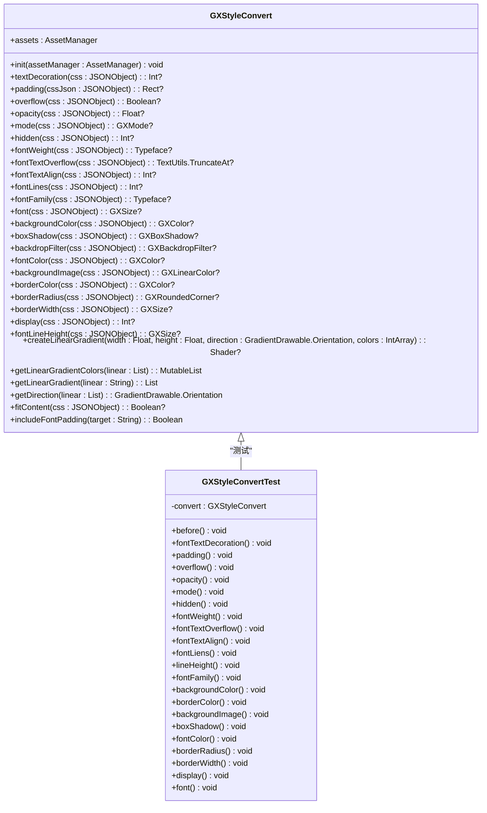

**Diagram sources**
- [GXStyleConvert.kt](file://GaiaXAndroid/src/main/kotlin/com/alibaba/gaiax/template/GXStyleConvert.kt#L40-L505)
- [GXStyleConvertTest.kt](file://GaiaXAndroid/src/androidTest/java/com/alibaba/gaiax/template/GXStyleConvertTest.kt#L39-L717)

### 初始化
GXStyleConvert类的初始化通过init方法完成，需要传入AssetManager实例。该方法设置类的assets属性，为后续的资源加载做准备。

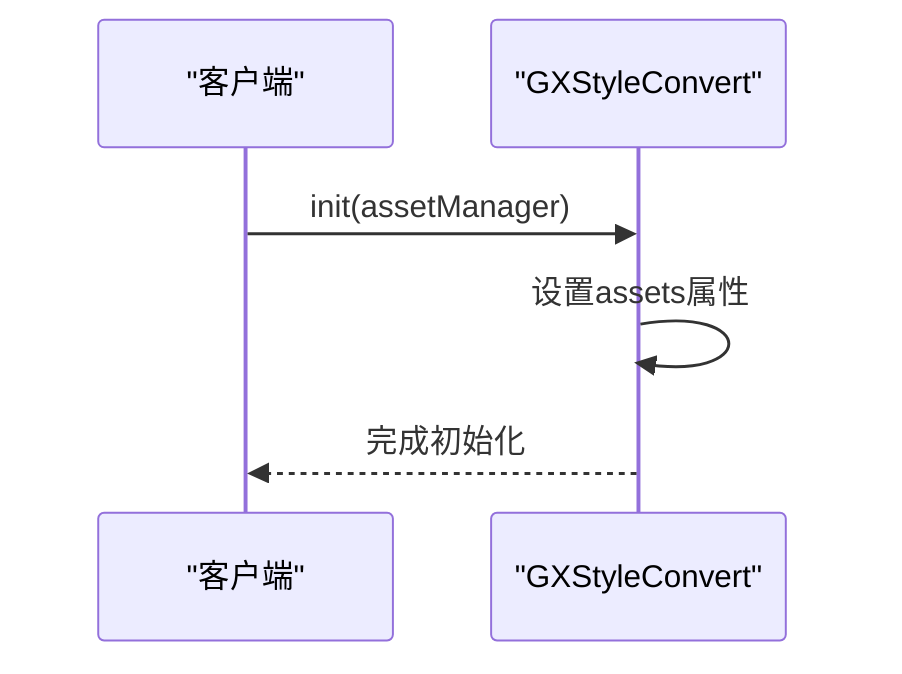

**Diagram sources**
- [GXStyleConvert.kt](file://GaiaXAndroid/src/main/kotlin/com/alibaba/gaiax/template/GXStyleConvert.kt#L44-L47)

**Section sources**
- [GXStyleConvert.kt](file://GaiaXAndroid/src/main/kotlin/com/alibaba/gaiax/template/GXStyleConvert.kt#L43-L47)

## 样式转换规则

### 颜色转换
颜色转换支持十六进制、RGB、RGBA等格式，通过GXColor.create方法实现。

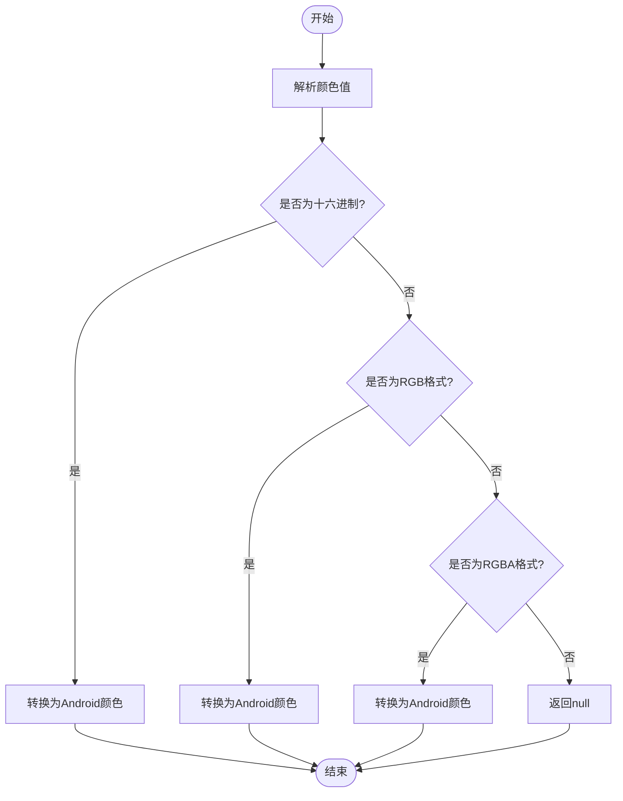

**Diagram sources**
- [GXStyleConvert.kt](file://GaiaXAndroid/src/main/kotlin/com/alibaba/gaiax/template/GXStyleConvert.kt#L235-L236)
- [GXStyleConvert.kt](file://GaiaXAndroid/src/main/kotlin/com/alibaba/gaiax/template/GXStyleConvert.kt#L301-L301)

**Section sources**
- [GXStyleConvert.kt](file://GaiaXAndroid/src/main/kotlin/com/alibaba/gaiax/template/GXStyleConvert.kt#L232-L236)
- [GXStyleConvert.kt](file://GaiaXAndroid/src/main/kotlin/com/alibaba/gaiax/template/GXStyleConvert.kt#L298-L302)

### 尺寸转换
尺寸转换支持px、pt等单位，通过GXSize.create方法实现单位处理。

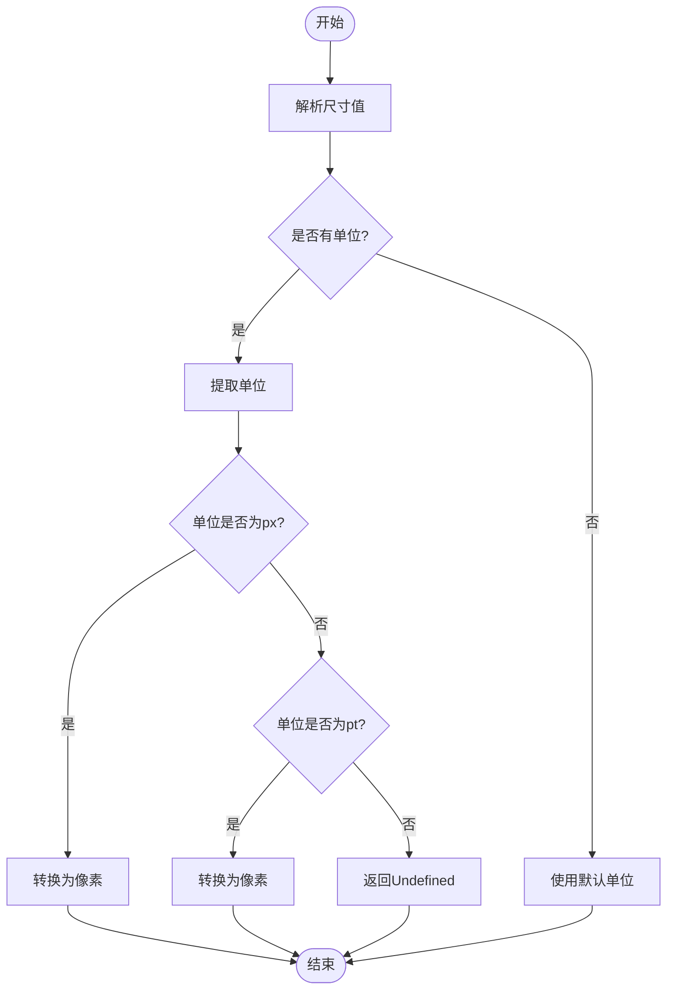

**Diagram sources**
- [GXStyleConvert.kt](file://GaiaXAndroid/src/main/kotlin/com/alibaba/gaiax/template/GXStyleConvert.kt#L229-L230)
- [GXStyleConvert.kt](file://GaiaXAndroid/src/main/kotlin/com/alibaba/gaiax/template/GXStyleConvert.kt#L343-L344)

**Section sources**
- [GXStyleConvert.kt](file://GaiaXAndroid/src/main/kotlin/com/alibaba/gaiax/template/GXStyleConvert.kt#L227-L230)
- [GXStyleConvert.kt](file://GaiaXAndroid/src/main/kotlin/com/alibaba/gaiax/template/GXStyleConvert.kt#L341-L344)

### 阴影转换
阴影转换支持box-shadow属性，解析为x偏移、y偏移、模糊半径、扩展半径和颜色五个部分。

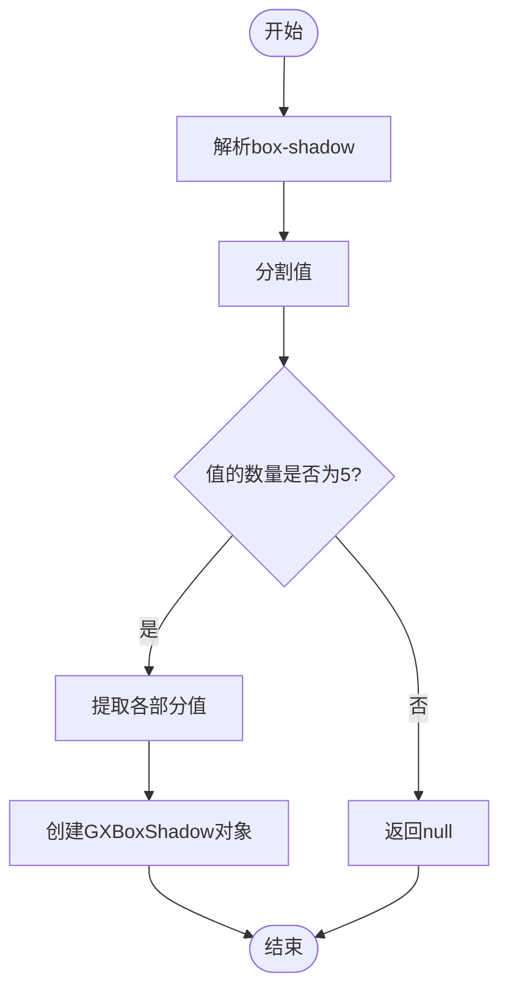

**Diagram sources**
- [GXStyleConvert.kt](file://GaiaXAndroid/src/main/kotlin/com/alibaba/gaiax/template/GXStyleConvert.kt#L243-L260)

**Section sources**
- [GXStyleConvert.kt](file://GaiaXAndroid/src/main/kotlin/com/alibaba/gaiax/template/GXStyleConvert.kt#L237-L241)

### 圆角转换
圆角转换支持border-radius及其四个方向的变体，优先级为单个方向 > 整体圆角。

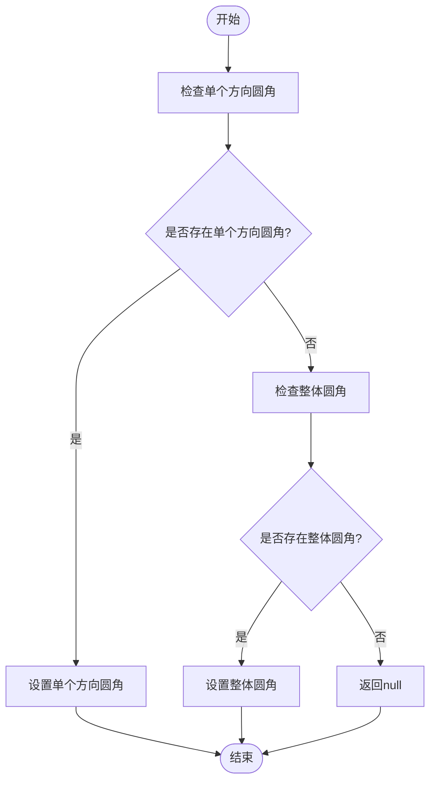

**Diagram sources**
- [GXStyleConvert.kt](file://GaiaXAndroid/src/main/kotlin/com/alibaba/gaiax/template/GXStyleConvert.kt#L303-L338)
- [GXBaseNode.ets](file://GaiaXHarmony/GaiaXCore/GaiaX/src/main/ets/node/GXBaseNode.ets#L133-L164)
- [GXBaseNode.m](file://GaiaXiOS/GaiaXiOS/Component/Node/GXBaseNode.m#L386-L435)

**Section sources**
- [GXStyleConvert.kt](file://GaiaXAndroid/src/main/kotlin/com/alibaba/gaiax/template/GXStyleConvert.kt#L304-L338)

### 线性渐变转换
线性渐变转换支持linear-gradient语法，解析方向和颜色停止点。

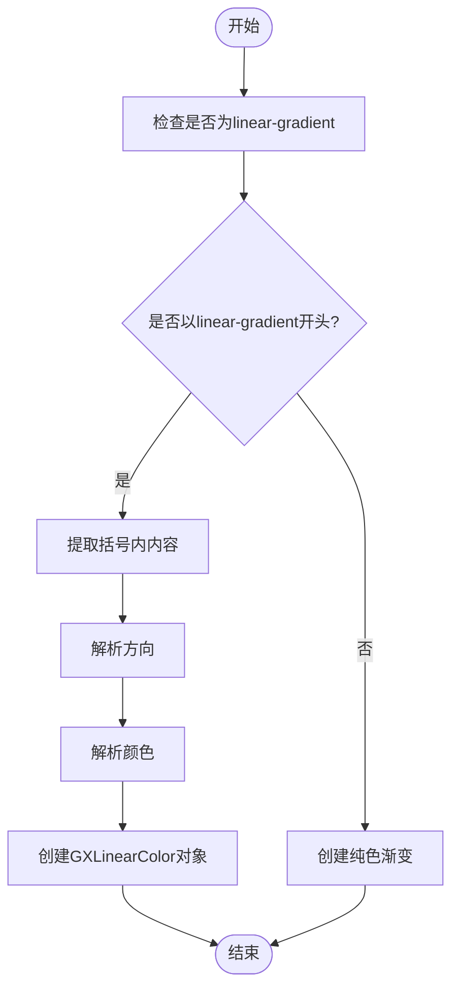

**Diagram sources**
- [GXStyleConvert.kt](file://GaiaXAndroid/src/main/kotlin/com/alibaba/gaiax/template/GXStyleConvert.kt#L277-L295)
- [GXStyleConvert.kt](file://GaiaXAndroid/src/main/kotlin/com/alibaba/gaiax/template/GXStyleConvert.kt#L415-L456)
- [GXStyleConvert.kt](file://GaiaXAndroid/src/main/kotlin/com/alibaba/gaiax/template/GXStyleConvert.kt#L398-L413)

**Section sources**
- [GXStyleConvert.kt](file://GaiaXAndroid/src/main/kotlin/com/alibaba/gaiax/template/GXStyleConvert.kt#L277-L295)

## 扩展点与自定义转换

### 扩展机制
通过GXRegisterCenter注册扩展，支持自定义字体、颜色等属性的转换。

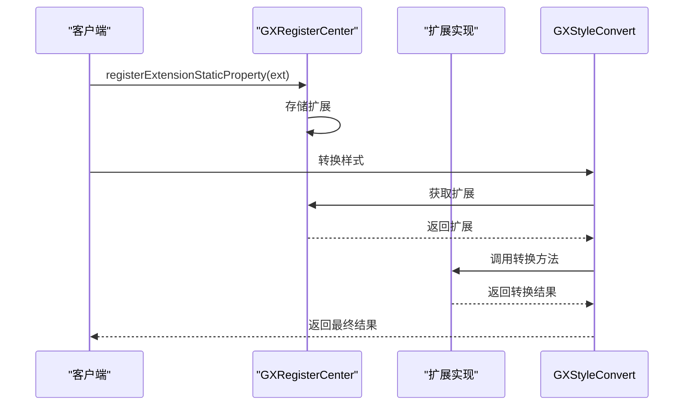

**Diagram sources**
- [GXStyleConvert.kt](file://GaiaXAndroid/src/main/kotlin/com/alibaba/gaiax/template/GXStyleConvert.kt#L214-L224)
- [GXStyleConvert.kt](file://GaiaXAndroid/src/main/kotlin/com/alibaba/gaiax/template/GXStyleConvert.kt#L180-L193)
- [GXRegisterCenter.kt](file://GaiaXAndroid/src/main/kotlin/com/alibaba/gaiax/GXRegisterCenter.kt#L338-L375)

**Section sources**
- [GXStyleConvert.kt](file://GaiaXAndroid/src/main/kotlin/com/alibaba/gaiax/template/GXStyleConvert.kt#L210-L224)

### 兼容性策略
针对不同平台和版本的兼容性问题，系统提供特殊的处理逻辑。

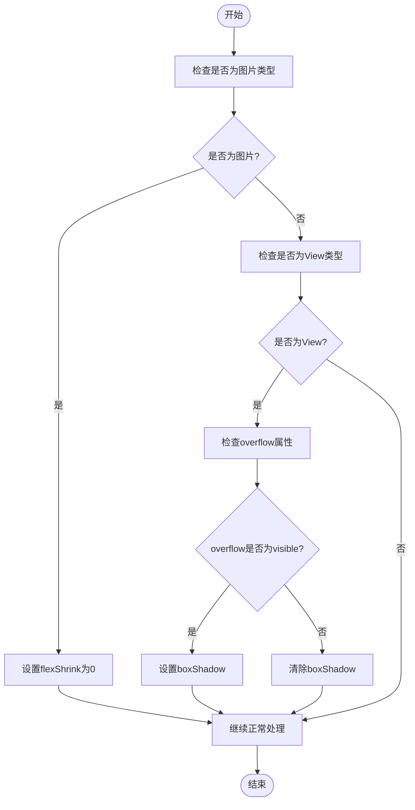

**Diagram sources**
- [GXCssConvertStyle.tsx](file://GaiaXTaro/packages/gaiax-taro/src/gaiax/GXCssConvertStyle.tsx#L417-L456)

**Section sources**
- [GXCssConvertStyle.tsx](file://GaiaXTaro/packages/gaiax-taro/src/gaiax/GXCssConvertStyle.tsx#L417-L456)

## 性能特征与缓存机制

### 性能优化
系统通过多种方式优化性能，包括对象复用、缓存机制等。

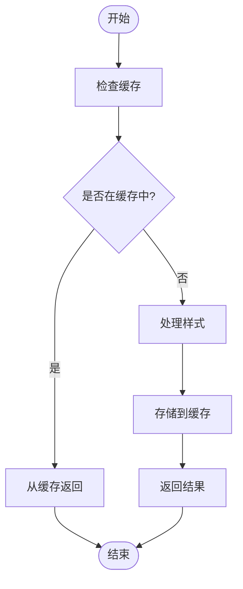

**Section sources**
- [GXStyleConvert.kt](file://GaiaXAndroid/src/main/kotlin/com/alibaba/gaiax/template/GXStyleConvert.kt#L49-L53)

### 缓存机制
GXStyleConvert采用单例模式，通过companion object的instance属性实现全局唯一实例，避免重复创建。

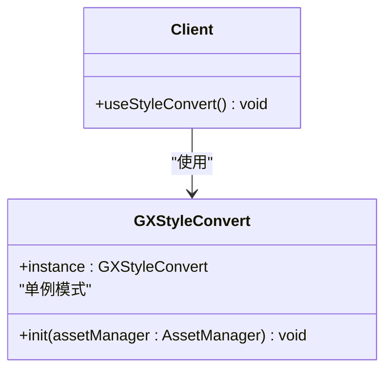

**Diagram sources**
- [GXStyleConvert.kt](file://GaiaXAndroid/src/main/kotlin/com/alibaba/gaiax/template/GXStyleConvert.kt#L49-L53)

**Section sources**
- [GXStyleConvert.kt](file://GaiaXAndroid/src/main/kotlin/com/alibaba/gaiax/template/GXStyleConvert.kt#L49-L53)

## 调试工具与常见问题

### 调试工具
系统提供测试类GXStyleConvertTest，用于验证样式转换的正确性。

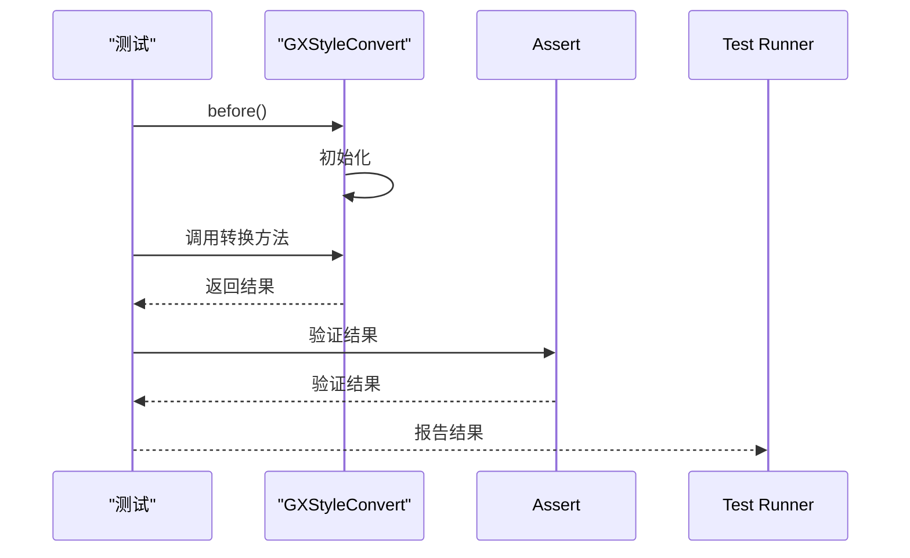

**Diagram sources**
- [GXStyleConvertTest.kt](file://GaiaXAndroid/src/androidTest/java/com/alibaba/gaiax/template/GXStyleConvertTest.kt#L41-L45)

**Section sources**
- [GXStyleConvertTest.kt](file://GaiaXAndroid/src/androidTest/java/com/alibaba/gaiax/template/GXStyleConvertTest.kt#L39-L45)

### 常见问题
#### 1. 颜色转换失败
可能原因：颜色格式不正确或不支持。

#### 2. 渐变方向解析错误
可能原因：方向语法不正确或拼写错误。

#### 3. 单位转换精度问题
可能原因：px与pt之间的转换比率设置不正确。

#### 4. 圆角设置不生效
可能原因：平台兼容性问题或CSS属性优先级问题。

**Section sources**
- [GXStyleConvert.kt](file://GaiaXAndroid/src/main/kotlin/com/alibaba/gaiax/template/GXStyleConvert.kt#L235-L236)
- [GXStyleConvert.kt](file://GaiaXAndroid/src/main/kotlin/com/alibaba/gaiax/template/GXStyleConvert.kt#L458-L488)
- [GXStyleConvert.kt](file://GaiaXAndroid/src/main/kotlin/com/alibaba/gaiax/template/GXStyleConvert.kt#L229-L230)