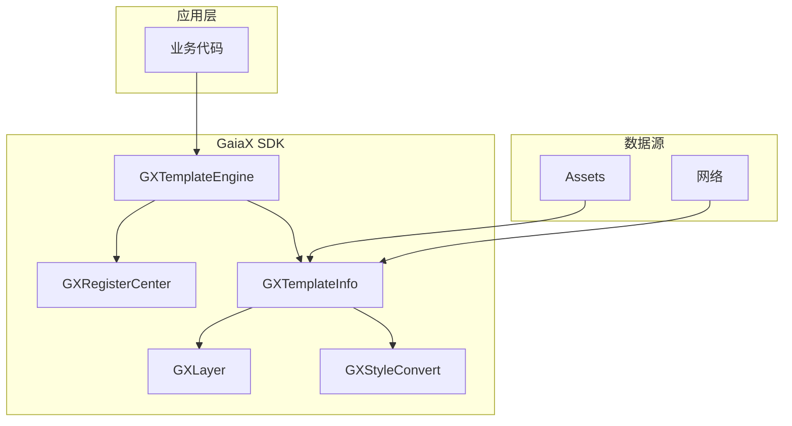
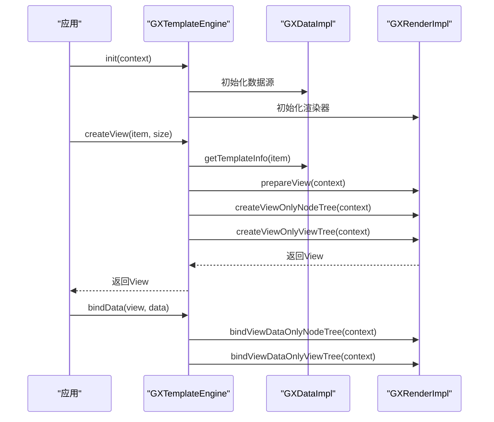
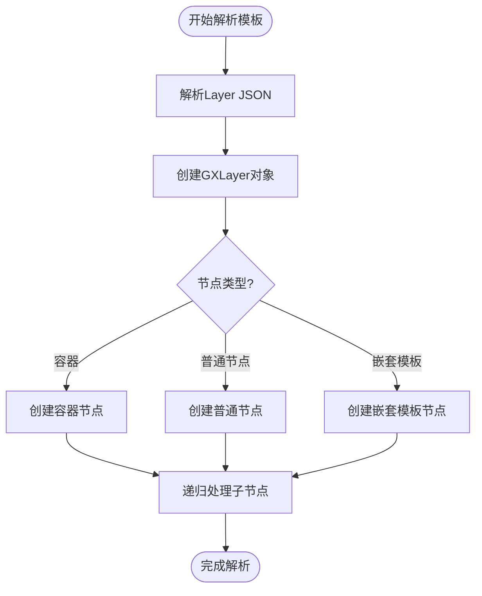
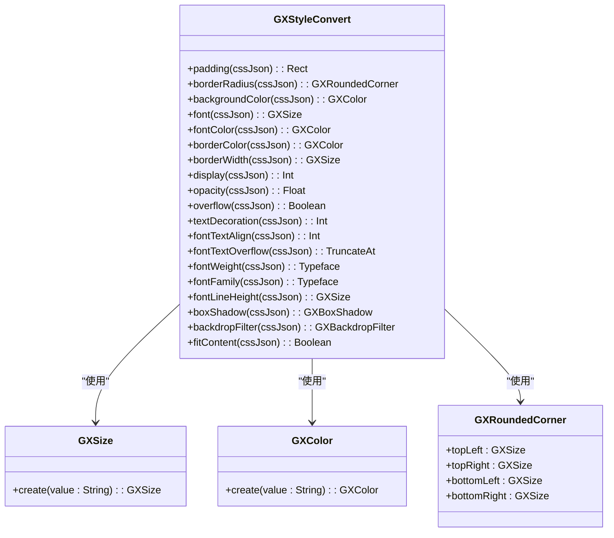
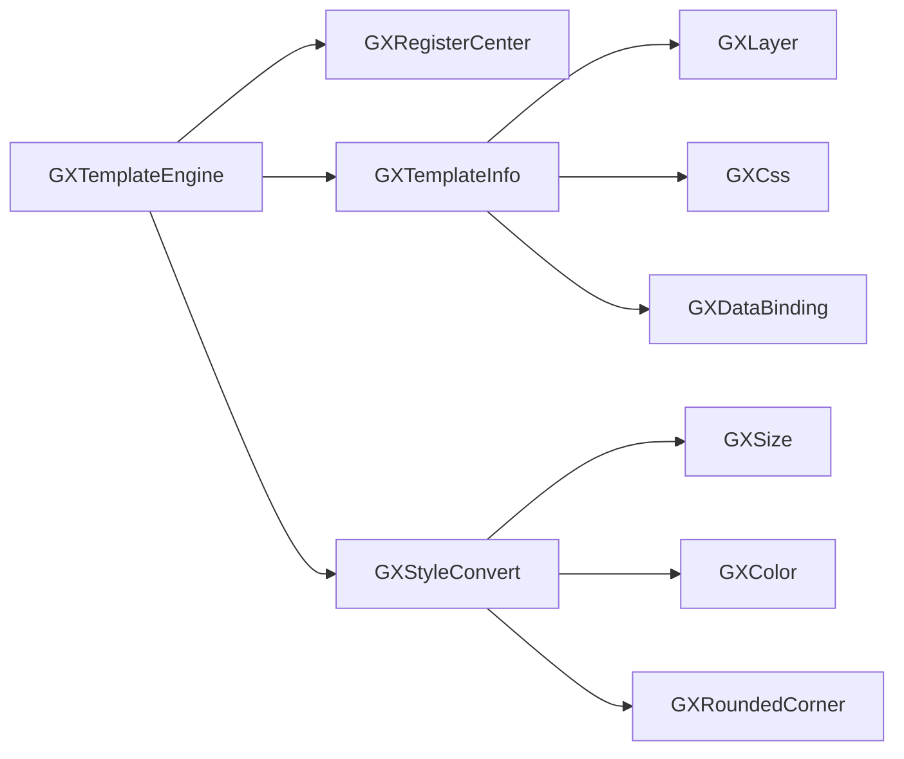

# 核心API

<cite>
**本文档引用的文件**   
- [GXTemplateEngine.kt](file://GaiaXAndroid/src/main/kotlin/com/alibaba/gaiax/GXTemplateEngine.kt)
- [GXRegisterCenter.kt](file://GaiaXAndroid/src/main/kotlin/com/alibaba/gaiax/GXRegisterCenter.kt)
- [GXTemplateInfo.kt](file://GaiaXAndroid/src/main/kotlin/com/alibaba/gaiax/template/GXTemplateInfo.kt)
- [GXLayer.kt](file://GaiaXAndroid/src/main/kotlin/com/alibaba/gaiax/template/GXLayer.kt)
- [GXStyleConvert.kt](file://GaiaXAndroid/src/main/kotlin/com/alibaba/gaiax/template/GXStyleConvert.kt)
</cite>

## 目录
1. [简介](#简介)
2. [项目结构](#项目结构)
3. [核心组件](#核心组件)
4. [架构概述](#架构概述)
5. [详细组件分析](#详细组件分析)
6. [依赖分析](#依赖分析)
7. [性能考虑](#性能考虑)
8. [故障排除指南](#故障排除指南)
9. [结论](#结论)

## 简介
GaiaX框架是一套轻量级的纯原生动态化卡片跨端解决方案，旨在保证原生体验与性能的同时，帮助客户端开发实现低代码。本文档重点介绍其核心API，特别是主入口类`GXTemplateEngine`的全生命周期方法，以及`GXRegisterCenter`的扩展注册机制。

## 项目结构
项目结构遵循典型的Android库模块设计，核心功能位于`GaiaXAndroid`模块中，包含模板引擎、注册中心、模板信息解析等关键组件。模板资源通常存放在`assets`目录下，按业务ID和模板ID进行组织。

**Section sources**
- [GXTemplateEngine.kt](file://GaiaXAndroid/src/main/kotlin/com/alibaba/gaiax/GXTemplateEngine.kt#L53-L76)

## 核心组件

`GXTemplateEngine`作为框架的主入口类，提供了模板的初始化、加载、解析、渲染和销毁等全生命周期管理方法。`GXRegisterCenter`则负责扩展功能的注册，如自定义组件、适配器和功能模块。

**Section sources**
- [GXTemplateEngine.kt](file://GaiaXAndroid/src/main/kotlin/com/alibaba/gaiax/GXTemplateEngine.kt#L77-L927)
- [GXRegisterCenter.kt](file://GaiaXAndroid/src/main/kotlin/com/alibaba/gaiax/GXRegisterCenter.kt#L47-L513)

## 架构概述



**Diagram sources **
- [GXTemplateEngine.kt](file://GaiaXAndroid/src/main/kotlin/com/alibaba/gaiax/GXTemplateEngine.kt#L77-L927)
- [GXRegisterCenter.kt](file://GaiaXAndroid/src/main/kotlin/com/alibaba/gaiax/GXRegisterCenter.kt#L47-L513)
- [GXTemplateInfo.kt](file://GaiaXAndroid/src/main/kotlin/com/alibaba/gaiax/template/GXTemplateInfo.kt#L31-L415)
- [GXLayer.kt](file://GaiaXAndroid/src/main/kotlin/com/alibaba/gaiax/template/GXLayer.kt#L27-L309)
- [GXStyleConvert.kt](file://GaiaXAndroid/src/main/kotlin/com/alibaba/gaiax/template/GXStyleConvert.kt#L40-L505)

## 详细组件分析

### GXTemplateEngine 分析
`GXTemplateEngine`是单例类，通过`instance`属性获取实例。其核心方法包括`init`用于初始化引擎，`createView`用于创建模板视图，`bindData`用于绑定数据，`destroyView`用于销毁视图。

#### 核心方法调用序列图


**Diagram sources **
- [GXTemplateEngine.kt](file://GaiaXAndroid/src/main/kotlin/com/alibaba/gaiax/GXTemplateEngine.kt#L77-L927)

**Section sources**
- [GXTemplateEngine.kt](file://GaiaXAndroid/src/main/kotlin/com/alibaba/gaiax/GXTemplateEngine.kt#L77-L927)

### GXRegisterCenter 分析
`GXRegisterCenter`采用注册中心模式，允许开发者注册各种扩展功能。通过`registerExtensionXXX`系列方法，可以注册自定义组件、表达式、数据绑定等。

#### 扩展注册机制类图
```mermaid
classDiagram
class GXRegisterCenter {
+registerExtensionLottieAnimation(ext)
+registerExtensionExpression(ext)
+registerExtensionViewSupport(type, clazz)
+registerExtensionTemplateSource(source, priority)
+registerExtensionTemplateInfoSource(source, priority)
}
interface GXIExtensionLottieAnimation {
+create() : GXLottieAnimation
}
interface GXIExtensionExpression {
+create(expVersion, key, value) : GXIExpression
+isTrue(expVersion, key, value) : Boolean
}
interface GXIExtensionTemplateSource {
+getTemplate(item) : GXTemplate
}
interface GXIExtensionTemplateInfoSource {
+getTemplateInfo(item) : GXTemplateInfo
}
GXRegisterCenter --> GXIExtensionLottieAnimation : "依赖"
GXRegisterCenter --> GXIExtensionExpression : "依赖"
GXRegisterCenter --> GXIExtensionTemplateSource : "依赖"
GXRegisterCenter --> GXIExtensionTemplateInfoSource : "依赖"
```

**Diagram sources **
- [GXRegisterCenter.kt](file://GaiaXAndroid/src/main/kotlin/com/alibaba/gaiax/GXRegisterCenter.kt#L47-L513)

**Section sources**
- [GXRegisterCenter.kt](file://GaiaXAndroid/src/main/kotlin/com/alibaba/gaiax/GXRegisterCenter.kt#L47-L513)

### GXTemplateInfo 与 GXLayer 分析
`GXTemplateInfo`封装了模板的完整信息，包括层级结构、样式、数据绑定等。`GXLayer`则表示模板的单个节点，包含节点ID、样式ID、类型等信息。

#### 模板结构解析流程图


**Diagram sources **
- [GXTemplateInfo.kt](file://GaiaXAndroid/src/main/kotlin/com/alibaba/gaiax/template/GXTemplateInfo.kt#L31-L415)
- [GXLayer.kt](file://GaiaXAndroid/src/main/kotlin/com/alibaba/gaiax/template/GXLayer.kt#L27-L309)

**Section sources**
- [GXTemplateInfo.kt](file://GaiaXAndroid/src/main/kotlin/com/alibaba/gaiax/template/GXTemplateInfo.kt#L31-L415)
- [GXLayer.kt](file://GaiaXAndroid/src/main/kotlin/com/alibaba/gaiax/template/GXLayer.kt#L27-L309)

### GXStyleConvert 分析
`GXStyleConvert`负责将CSS样式转换为Android平台的样式值。它实现了多种样式的转换方法，如`padding`、`borderRadius`、`backgroundColor`等。

#### 样式转换实现细节


**Diagram sources **
- [GXStyleConvert.kt](file://GaiaXAndroid/src/main/kotlin/com/alibaba/gaiax/template/GXStyleConvert.kt#L40-L505)

**Section sources**
- [GXStyleConvert.kt](file://GaiaXAndroid/src/main/kotlin/com/alibaba/gaiax/template/GXStyleConvert.kt#L40-L505)

## 依赖分析



**Diagram sources **
- [GXTemplateEngine.kt](file://GaiaXAndroid/src/main/kotlin/com/alibaba/gaiax/GXTemplateEngine.kt#L77-L927)
- [GXRegisterCenter.kt](file://GaiaXAndroid/src/main/kotlin/com/alibaba/gaiax/GXRegisterCenter.kt#L47-L513)
- [GXTemplateInfo.kt](file://GaiaXAndroid/src/main/kotlin/com/alibaba/gaiax/template/GXTemplateInfo.kt#L31-L415)
- [GXLayer.kt](file://GaiaXAndroid/src/main/kotlin/com/alibaba/gaiax/template/GXLayer.kt#L27-L309)
- [GXStyleConvert.kt](file://GaiaXAndroid/src/main/kotlin/com/alibaba/gaiax/template/GXStyleConvert.kt#L40-L505)

**Section sources**
- [GXTemplateEngine.kt](file://GaiaXAndroid/src/main/kotlin/com/alibaba/gaiax/GXTemplateEngine.kt#L77-L927)
- [GXRegisterCenter.kt](file://GaiaXAndroid/src/main/kotlin/com/alibaba/gaiax/GXRegisterCenter.kt#L47-L513)
- [GXTemplateInfo.kt](file://GaiaXAndroid/src/main/kotlin/com/alibaba/gaiax/template/GXTemplateInfo.kt#L31-L415)
- [GXLayer.kt](file://GaiaXAndroid/src/main/kotlin/com/alibaba/gaiax/template/GXLayer.kt#L27-L309)
- [GXStyleConvert.kt](file://GaiaXAndroid/src/main/kotlin/com/alibaba/gaiax/template/GXStyleConvert.kt#L40-L505)

## 性能考虑
- `GXTemplateEngine`采用单例模式，避免重复初始化开销。
- `GXTemplateInfo`缓存机制减少重复解析模板的开销。
- `GXStyleConvert`的转换方法应尽量避免频繁创建对象，可考虑使用对象池。
- 模板视图的复用机制可以显著提升列表滚动性能。

## 故障排除指南
- **模板无法加载**：检查模板文件路径是否正确，确保模板资源已正确打包到APK中。
- **样式不生效**：检查CSS样式名是否正确，确认`GXStyleConvert`是否支持该样式属性。
- **数据绑定失败**：检查数据绑定表达式是否正确，确认数据源是否已正确注册。
- **性能问题**：使用`GXPropUtils.isTrace()`开启性能追踪，定位耗时操作。

**Section sources**
- [GXTemplateEngine.kt](file://GaiaXAndroid/src/main/kotlin/com/alibaba/gaiax/GXTemplateEngine.kt#L77-L927)
- [GXRegisterCenter.kt](file://GaiaXAndroid/src/main/kotlin/com/alibaba/gaiax/GXRegisterCenter.kt#L47-L513)

## 结论
GaiaX框架的核心API设计合理，通过`GXTemplateEngine`统一管理模板的全生命周期，`GXRegisterCenter`提供灵活的扩展机制，`GXTemplateInfo`和`GXLayer`清晰地表示模板结构，`GXStyleConvert`高效地完成样式转换。开发者可以基于这些API快速构建高性能的动态化卡片。