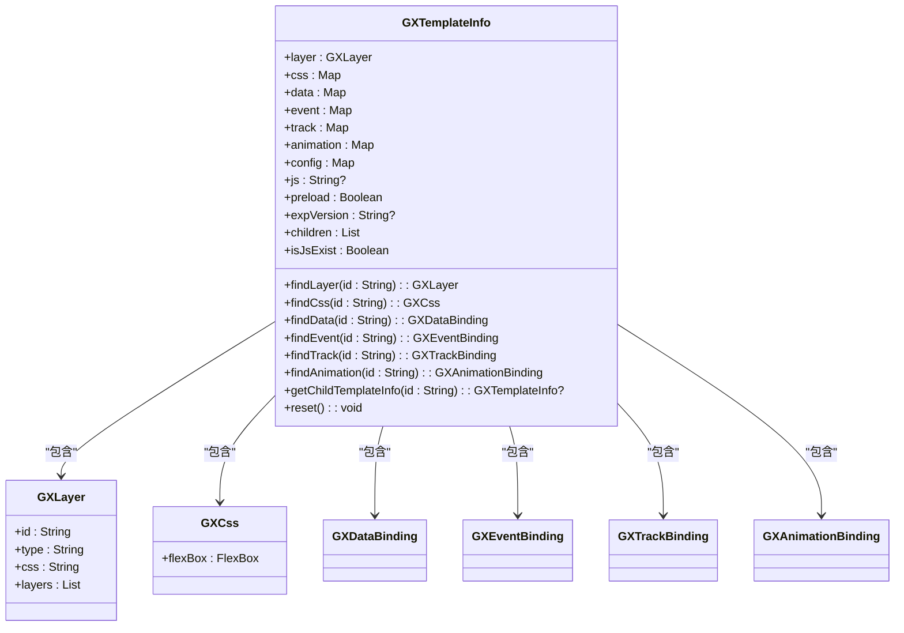
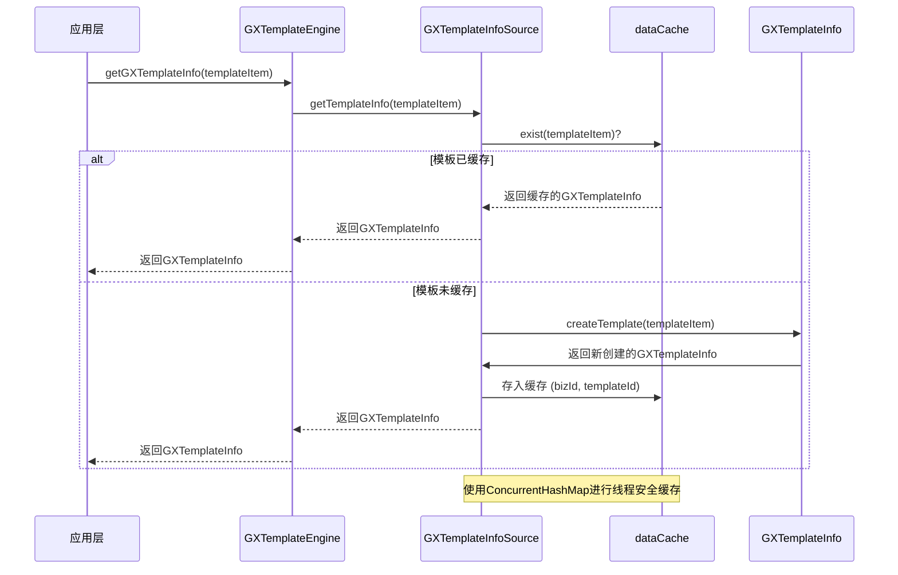
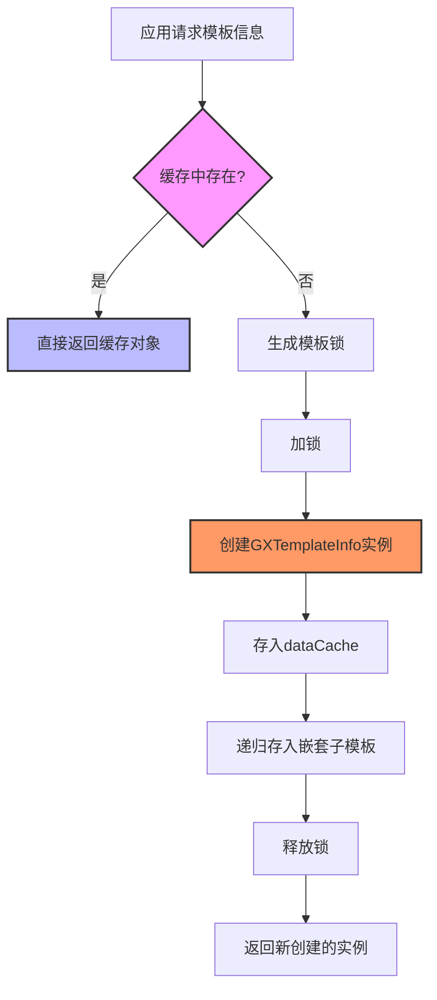
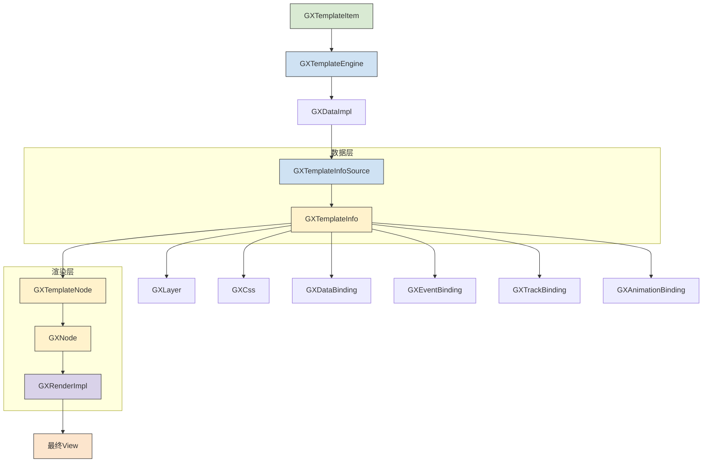

# 模板信息

<cite>
**本文档引用文件**   
- [GXTemplateInfo.kt](file://GaiaXAndroid/src/main/kotlin/com/alibaba/gaiax/template/GXTemplateInfo.kt)
- [GXTemplateInfoSource.kt](file://GaiaXAndroid/src/main/kotlin/com/alibaba/gaiax/data/cache/GXTemplateInfoSource.kt)
- [GXTemplateLRUCache.ets](file://GaiaXHarmony/GaiaXCore/GaiaX/src/main/ets/template/GXTemplateLRUCache.ets)
- [GXTemplateEngine.kt](file://GaiaXAndroid/src/main/kotlin/com/alibaba/gaiax/GXTemplateEngine.kt)
- [GXCacheCenter.m](file://GaiaXiOS/GaiaXiOS/Template/Cache/GXCacheCenter.m)
- [GXTemplateItem.ets](file://GaiaXHarmony/GaiaXCore/GaiaX/src/main/ets/context/GXTemplateItem.ets)
</cite>

## 目录
1. [简介](#简介)
2. [核心组件](#核心组件)
3. [架构概述](#架构概述)
4. [详细组件分析](#详细组件分析)
5. [依赖分析](#依赖分析)
6. [性能考虑](#性能考虑)
7. [故障排除指南](#故障排除指南)
8. [结论](#结论)

## 简介
本API文档详细介绍了GaiaX模板引擎中的`GXTemplateInfo`类，该类是模板解析过程中的核心数据结构。文档将深入探讨模板信息的获取方式、缓存机制、数据结构组成，以及其在模板解析、数据绑定和渲染流程中的关键作用。开发者将学习如何通过`GXTemplateItem`获取模板信息，理解模板元数据的含义，并掌握模板信息的调试、验证方法及最佳实践。

**Section sources**
- [GXTemplateInfo.kt](file://GaiaXAndroid/src/main/kotlin/com/alibaba/gaiax/template/GXTemplateInfo.kt#L1-L50)
- [GXTemplateEngine.kt](file://GaiaXAndroid/src/main/kotlin/com/alibaba/gaiax/GXTemplateEngine.kt#L543-L548)

## 核心组件
`GXTemplateInfo`类封装了从原始模板数据（JSON）解析后得到的所有信息，是模板渲染流程的基石。它包含了模板的层级结构（layer）、样式（css）、数据绑定表达式（data）、事件（event）、埋点（track）、动画（animation）、配置（config）以及可选的JavaScript代码（js）。该类还提供了丰富的工具方法，用于在渲染过程中快速查找和访问这些信息。

**Diagram sources **
- [GXTemplateInfo.kt](file://GaiaXAndroid/src/main/kotlin/com/alibaba/gaiax/template/GXTemplateInfo.kt#L31-L415)

**Section sources**
- [GXTemplateInfo.kt](file://GaiaXAndroid/src/main/kotlin/com/alibaba/gaiax/template/GXTemplateInfo.kt#L31-L100)

## 架构概述
模板信息的生命周期始于`GXTemplateEngine`，它通过`GXTemplateItem`（包含`bizId`, `templateId`等元数据）作为输入，协调数据源获取原始模板数据。随后，`GXTemplateInfo`的`createTemplate`方法被调用，负责将JSON数据解析并构建成一个完整的`GXTemplateInfo`对象。为了提升性能，系统使用了多级缓存机制，包括基于`ConcurrentHashMap`的内存缓存和LRU缓存，确保模板信息可以被高效地重复利用。

**Diagram sources **
- [GXTemplateEngine.kt](file://GaiaXAndroid/src/main/kotlin/com/alibaba/gaiax/GXTemplateEngine.kt#L543-L548)
- [GXTemplateInfoSource.kt](file://GaiaXAndroid/src/main/kotlin/com/alibaba/gaiax/data/cache/GXTemplateInfoSource.kt#L28-L58)
- [GXTemplateInfo.kt](file://GaiaXAndroid/src/main/kotlin/com/alibaba/gaiax/template/GXTemplateInfo.kt#L173-L177)

## 详细组件分析

### GXTemplateInfo 类分析
`GXTemplateInfo`是一个数据类，其主要职责是存储和提供对解析后的模板数据的访问。

#### 数据结构组成
`GXTemplateInfo`的构造函数定义了其核心数据结构：
- **layer**: `GXLayer`类型，代表模板的视图层级结构，是一个树形结构。
- **css**: `MutableMap<String, GXCss>`类型，存储所有样式信息，键为CSS选择器（如`#id`或`.class`）。
- **data, event, track, animation, config**: 均为`MutableMap<String, *>`类型，分别存储数据绑定、事件、埋点、动画和配置相关的表达式或数据。
- **js**: `String?`类型，可选的JavaScript代码字符串。
- **preload**: `Boolean`类型，指示模板是否需要预加载。
- **expVersion**: `String?`类型，表达式引擎的版本。
- **children**: `MutableList<GXTemplateInfo>?`类型，用于存储嵌套子模板的`GXTemplateInfo`。

此外，该类还持有一些`lateinit var`字段，如`template`（原始模板对象）、`rawLayerJson`（原始JSON数据）等，用于在需要时回溯原始数据。

#### 关键方法
- **`findLayer(id: String)`**: 通过视图ID递归查找对应的`GXLayer`对象。该方法使用了一个`findLayerCache`缓存来避免重复查找，提升性能。
- **`findCss(id: String)`**: 通过视图ID查找对应的`GXCss`对象。
- **`findData(id: String)`**: 通过视图ID查找对应的数据绑定表达式。
- **`getChildTemplateInfo(id: String)`**: 通过子模板ID查找其`GXTemplateInfo`，用于处理模板嵌套。
- **`isJsExist`**: 一个惰性求值的属性，检查当前模板或其任何子模板中是否包含JavaScript代码。
- **`reset()`**: 重置模板中的缓存状态，通常在模板复用时调用。

**Section sources**
- [GXTemplateInfo.kt](file://GaiaXAndroid/src/main/kotlin/com/alibaba/gaiax/template/GXTemplateInfo.kt#L31-L415)

### 模板信息获取与缓存机制分析
模板信息的获取和缓存是通过`GXTemplateInfoSource`类实现的，它实现了`GXIExtensionTemplateInfoSource`接口。

#### 获取流程
1.  当调用`GXTemplateEngine.getGXTemplateInfo()`时，请求被转发到`GXDataImpl`，最终由`GXTemplateInfoSource`处理。
2.  `GXTemplateInfoSource`首先检查`dataCache`中是否已存在对应`bizId`和`templateId`的`GXTemplateInfo`。
3.  如果存在，则直接返回缓存对象。
4.  如果不存在，则会创建一个基于`bizId`和`templateId`的锁对象，以确保在多线程环境下，同一个模板不会被重复加载。
5.  在锁的保护下，调用`GXTemplateInfo.createTemplate(templateItem)`方法创建新的`GXTemplateInfo`实例。
6.  创建成功后，将新实例存入`dataCache`，并调用`collectionNestTemplate`方法将所有嵌套子模板的信息也一并存入缓存，以便通过`bizId`直接访问。

#### 缓存机制
- **内存缓存**: 使用`ConcurrentHashMap<String, ConcurrentHashMap<String, GXTemplateInfo>>`作为主缓存，以`bizId`为一级键，`templateId`为二级键进行存储，保证了线程安全和高效的读写性能。
- **LRU缓存**: 在Harmony平台的实现中，使用了`GXTemplateLRUCache`类，它基于`Map`实现了LRU（最近最少使用）算法，用于限制缓存的容量，防止内存无限增长。
- **iOS缓存**: 在iOS平台，`GXCacheCenter`提供了`templateCahche`、`expressionCahche`等不同用途的缓存实例，其中`templateCahche`的容量被设置为0，意味着它可能依赖于其他机制或用于特定场景。

**Diagram sources **
- [GXTemplateInfoSource.kt](file://GaiaXAndroid/src/main/kotlin/com/alibaba/gaiax/data/cache/GXTemplateInfoSource.kt#L28-L58)
- [GXTemplateLRUCache.ets](file://GaiaXHarmony/GaiaXCore/GaiaX/src/main/ets/template/GXTemplateLRUCache.ets#L1-L71)
- [GXCacheCenter.m](file://GaiaXiOS/GaiaXiOS/Template/Cache/GXCacheCenter.m#L1-L55)

**Section sources**
- [GXTemplateInfoSource.kt](file://GaiaXAndroid/src/main/kotlin/com/alibaba/gaiax/data/cache/GXTemplateInfoSource.kt#L10-L75)

## 依赖分析
`GXTemplateInfo`类与多个核心组件紧密耦合，形成了一个完整的模板处理链。

**Diagram sources **
- [GXTemplateEngine.kt](file://GaiaXAndroid/src/main/kotlin/com/alibaba/gaiax/GXTemplateEngine.kt#L417-L488)
- [GXTemplateItem.ets](file://GaiaXHarmony/GaiaXCore/GaiaX/src/main/ets/context/GXTemplateItem.ets#L1-L34)
- [GXTemplateInfo.kt](file://GaiaXAndroid/src/main/kotlin/com/alibaba/gaiax/template/GXTemplateInfo.kt#L31-L415)
- [GXTemplateNode.kt](file://GaiaXAndroid/src/main/kotlin/com/alibaba/gaiax/render/node/GXTemplateNode.kt#L186-L205)

## 性能考虑
- **缓存机制**: 多级缓存（内存缓存、LRU缓存）是性能优化的核心，避免了重复的网络请求和JSON解析开销。
- **线程安全**: `GXTemplateInfoSource`使用`ConcurrentHashMap`和`synchronized`块确保了在高并发场景下的数据一致性。
- **惰性求值**: `isJsExist`属性使用`by lazy`，只有在首次访问时才进行计算，减少了不必要的开销。
- **查找优化**: `findLayer`方法使用内部缓存，避免了每次查找都进行递归遍历。

## 故障排除指南
- **模板信息为空**: 检查`GXTemplateItem`中的`bizId`和`templateId`是否正确，并确认数据源（如网络、本地文件）是否返回了有效的模板数据。
- **样式或数据未生效**: 使用`findCss`和`findData`等方法检查`GXTemplateInfo`中是否正确解析了相关数据。确认CSS选择器（如`#id`）与模板中的`id`属性匹配。
- **缓存问题**: 如果遇到模板更新后UI未刷新，可能是缓存未失效。可以尝试调用`GXTemplateInfoSource`的`clean()`方法清除缓存。
- **嵌套模板加载失败**: 检查`getChildTemplateInfo`返回是否为`null`，确保子模板的`id`在父模板的`layer`结构中正确定义。

**Section sources**
- [GXTemplateInfo.kt](file://GaiaXAndroid/src/main/kotlin/com/alibaba/gaiax/template/GXTemplateInfo.kt#L67-L74)
- [GXTemplateInfoSource.kt](file://GaiaXAndroid/src/main/kotlin/com/alibaba/gaiax/data/cache/GXTemplateInfoSource.kt#L71-L74)

## 结论
`GXTemplateInfo`是GaiaX模板引擎中至关重要的数据容器，它将原始的JSON模板数据转化为一个结构化、易于访问的对象。其设计充分考虑了性能和可维护性，通过高效的缓存机制和清晰的API，为模板的解析、数据绑定和最终渲染提供了坚实的基础。开发者应深入理解其数据结构和工作流程，以便更好地利用GaiaX框架构建高性能的动态化界面。