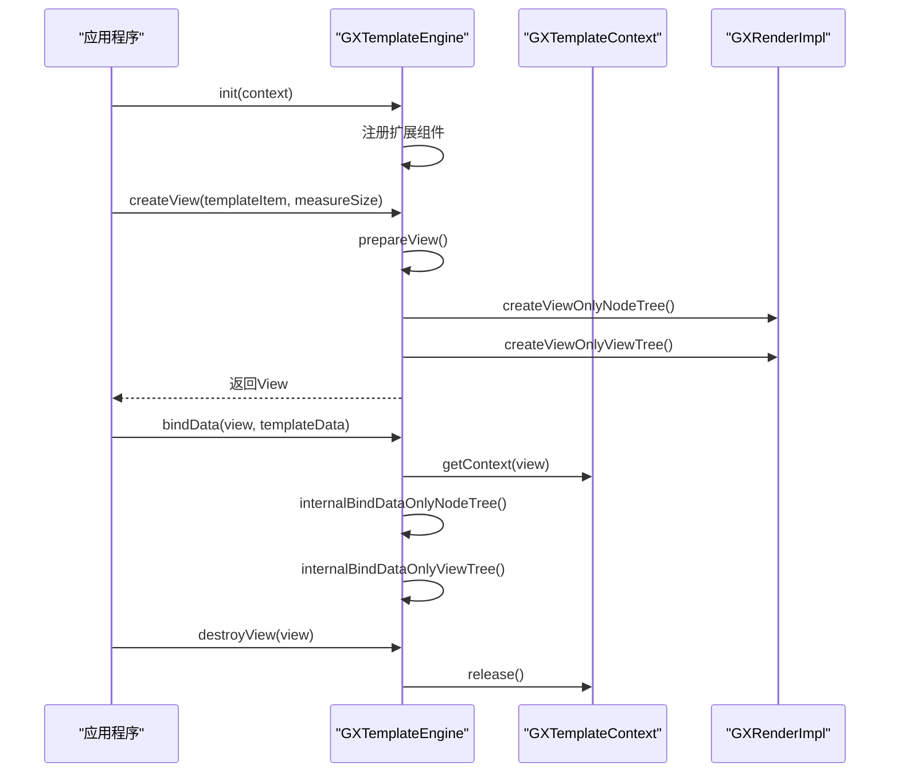
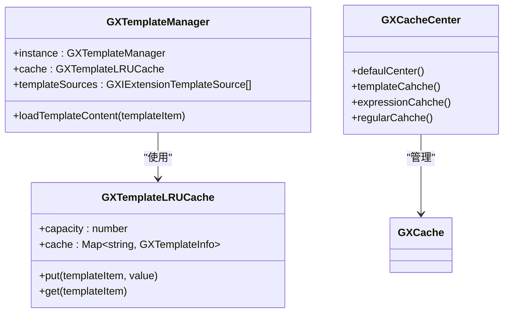

# 模板引擎

<cite>
**本文档中引用的文件**  
- [GXTemplateEngine.kt](file://GaiaXAndroid/src/main/kotlin/com/alibaba/gaiax/GXTemplateEngine.kt)
- [GXTemplateContext.kt](file://GaiaXAndroid/src/main/kotlin/com/alibaba/gaiax/context/GXTemplateContext.kt)
- [GXGlobalCache.kt](file://GaiaXAndroid/src/main/kotlin/com/alibaba/gaiax/utils/GXGlobalCache.kt)
- [GXTemplateLRUCache.ets](file://GaiaXHarmony/GaiaXCore/GaiaX/src/main/ets/template/GXTemplateLRUCache.ets)
- [GXCacheCenter.m](file://GaiaXiOS/GaiaXiOS/Template/Cache/GXCacheCenter.m)
</cite>

## 目录
1. [简介](#简介)
2. [核心组件](#核心组件)
3. [API详解](#api详解)
4. [生命周期管理](#生命周期管理)
5. [线程安全与异常处理](#线程安全与异常处理)
6. [性能优化建议](#性能优化建议)
7. [调用时序图](#调用时序图)
8. [内存与缓存机制](#内存与缓存机制)
9. [Android平台Kotlin示例](#android平台kotlin示例)
10. [结论](#结论)

## 简介
GaiaX模板引擎是一个轻量级跨平台纯原生动态卡片解决方案，旨在确保原生体验和性能的同时，帮助客户端实现低代码开发。该引擎支持模板的创建、编辑、实时预览和真机调试，提供完整的动态化能力。本文档重点介绍GXTemplateEngine类的核心API，包括初始化、模板创建、数据绑定和视图销毁等关键方法，以及GXTemplateItem、GXMeasureSize和GXTemplateContext在模板加载过程中的作用。

## 核心组件

GXTemplateEngine是GaiaX的核心引擎类，负责模板的创建、数据绑定和视图管理。GXTemplateContext作为模板的上下文管理器，维护模板的生命周期状态和运行时数据。GXTemplateItem封装了模板的基本信息，包括业务ID和模板ID，用于唯一标识一个模板。GXMeasureSize定义了模板的测量尺寸，作为视口限制模板内容的显示区域。

**本节来源**  
- [GXTemplateEngine.kt](file://GaiaXAndroid/src/main/kotlin/com/alibaba/gaiax/GXTemplateEngine.kt#L77-L927)
- [GXTemplateContext.kt](file://GaiaXAndroid/src/main/kotlin/com/alibaba/gaiax/context/GXTemplateContext.kt#L34-L251)

## API详解

### GXTemplateEngine初始化
通过`init(context: Context)`方法完成引擎的初始化，该方法会注册表达式扩展、模板信息源和本地模板源等核心组件。

### 模板创建
`createView(gxTemplateItem: GXTemplateItem, gxMeasureSize: GXMeasureSize)`方法用于创建模板视图。该方法首先调用`prepareView`进行视图预创建，然后构建节点树和视图树。`prepareView`方法会缓存布局计算结果，避免重复计算。

### 数据绑定
`bindData(gxView: View?, gxTemplateData: GXTemplateData, gxMeasureSize: GXMeasureSize? = null)`方法用于绑定模板数据。该方法分为两个阶段：`bindDataOnlyNodeTree`更新节点树的数据，`bindDataOnlyViewTree`更新视图树的数据。当测量尺寸发生变化时，会重新计算节点树以确保布局正确。

### 视图销毁
`destroyView(targetView: View?)`方法用于销毁模板视图，释放相关资源。该方法会清理GXTemplateContext中的引用，防止内存泄漏。

### GXTemplateItem
GXTemplateItem类封装了模板的基本信息，包括上下文、业务ID和模板ID。其`key()`方法生成唯一标识符，用于缓存管理。

### GXMeasureSize
GXMeasureSize类定义了模板的测量尺寸，包含宽度和高度两个可选参数。它作为视口限制模板内容的显示区域，支持三种使用场景：固定宽高、固定宽度不确定高度、不确定宽度固定高度。

**本节来源**  
- [GXTemplateEngine.kt](file://GaiaXAndroid/src/main/kotlin/com/alibaba/gaiax/GXTemplateEngine.kt#L558-L625)
- [GXTemplateEngine.kt](file://GaiaXAndroid/src/main/kotlin/com/alibaba/gaiax/GXTemplateEngine.kt#L368-L372)
- [GXTemplateEngine.kt](file://GaiaXAndroid/src/main/kotlin/com/alibaba/gaiax/GXTemplateEngine.kt#L417-L488)

## 生命周期管理

GXTemplateContext管理模板的完整生命周期。通过`createContext`静态方法创建上下文实例，`getContext`和`setContext`方法管理视图与上下文的关联。上下文对象维护模板数据、节点树、根视图等核心状态。

模板的生命周期包括：初始化（createContext）→ 预创建（prepareView）→ 创建视图（createView）→ 数据绑定（bindData）→ 可见性通知（onAppear/onDisappear）→ 销毁（destroyView）。`release()`方法用于释放上下文资源，`reset()`方法重置缓存的计算内容。

**本节来源**  
- [GXTemplateContext.kt](file://GaiaXAndroid/src/main/kotlin/com/alibaba/gaiax/context/GXTemplateContext.kt#L34-L251)
- [GXTemplateEngine.kt](file://GaiaXAndroid/src/main/kotlin/com/alibaba/gaiax/GXTemplateEngine.kt#L502-L511)

## 线程安全与异常处理

模板引擎的核心方法通过异常捕获机制处理运行时错误。当`GXExceptionHelper.isException()`返回true时，异常会被SDK内部处理；否则会重新抛出。关键操作如`createView`和`bindData`都包含try-catch块，确保异常不会导致应用崩溃。

引擎通过`GXPropUtils.isTrace()`检查是否启用性能追踪，使用Android Trace API标记关键方法的执行范围。`GXRegisterCenter`提供扩展异常注册接口，允许业务方监听和处理特定异常。

**本节来源**  
- [GXTemplateEngine.kt](file://GaiaXAndroid/src/main/kotlin/com/alibaba/gaiax/GXTemplateEngine.kt#L585-L625)
- [GXTemplateEngine.kt](file://GaiaXAndroid/src/main/kotlin/com/alibaba/gaiax/GXTemplateEngine.kt#L734-L767)

## 性能优化建议

1. **预创建视图**：使用`prepareView`提前计算布局，避免在主线程中进行耗时计算。
2. **缓存复用**：利用`GXGlobalCache`缓存布局结果，相同模板和尺寸下可直接复用。
3. **尺寸变化处理**：当测量尺寸变化时，及时清理缓存并重新计算布局。
4. **节点复用**：通过`scrollNodeCache`实现滚动容器中节点的复用，减少创建开销。
5. **批量操作**：在数据更新时，尽量批量调用`bindData`，减少UI刷新次数。

**本节来源**  
- [GXGlobalCache.kt](file://GaiaXAndroid/src/main/kotlin/com/alibaba/gaiax/utils/GXGlobalCache.kt#L40-L75)
- [GXTemplateEngine.kt](file://GaiaXAndroid/src/main/kotlin/com/alibaba/gaiax/GXTemplateEngine.kt#L635-L648)

## 调用时序图



**图示来源**  
- [GXTemplateEngine.kt](file://GaiaXAndroid/src/main/kotlin/com/alibaba/gaiax/GXTemplateEngine.kt#L558-L583)
- [GXTemplateEngine.kt](file://GaiaXAndroid/src/main/kotlin/com/alibaba/gaiax/GXTemplateEngine.kt#L585-L625)
- [GXTemplateContext.kt](file://GaiaXAndroid/src/main/kotlin/com/alibaba/gaiax/context/GXTemplateContext.kt#L158-L172)

## 内存与缓存机制

模板引擎采用多级缓存策略提升性能。`GXGlobalCache`在Android端缓存布局计算结果，`GXTemplateLRUCache`在Harmony端实现模板信息的LRU缓存，`GXCacheCenter`在iOS端管理模板、表达式和正则缓存。

缓存键由业务ID、模板ID和版本号组成，确保缓存的唯一性。`GXTemplateContext`中的`scrollItemLayoutCache`等集合用于缓存滚动容器的item布局，避免重复计算。缓存清理通过`clean()`方法统一管理，释放内存资源。



**图示来源**  
- [GXTemplateLRUCache.ets](file://GaiaXHarmony/GaiaXCore/GaiaX/src/main/ets/template/GXTemplateLRUCache.ets#L1-L71)
- [GXCacheCenter.m](file://GaiaXiOS/GaiaXiOS/Template/Cache/GXCacheCenter.m#L1-L55)

**本节来源**  
- [GXGlobalCache.kt](file://GaiaXAndroid/src/main/kotlin/com/alibaba/gaiax/utils/GXGlobalCache.kt#L40-L75)
- [GXTemplateLRUCache.ets](file://GaiaXHarmony/GaiaXCore/GaiaX/src/main/ets/template/GXTemplateLRUCache.ets#L1-L71)
- [GXCacheCenter.m](file://GaiaXiOS/GaiaXiOS/Template/Cache/GXCacheCenter.m#L1-L55)

## Android平台Kotlin示例

```kotlin
// 初始化引擎
GXTemplateEngine.instance.init(activity)

// 构建模板参数
val params = GXTemplateEngine.GXTemplateItem(activity, "template biz", "template id")

// 构建测量尺寸
val size = GXTemplateEngine.GXMeasureSize(screenWidth, null)

// 构建模板数据
val templateData = GXTemplateEngine.GXTemplateData(jsonData)

// 创建视图
val view = GXTemplateEngine.instance.createView(params, size)

// 更新数据
GXTemplateEngine.instance.bindData(view, templateData)

// 注入容器
findViewById<LinearLayoutCompat>(R.id.container).addView(view, 0)
```

**本节来源**  
- [GXTemplateEngine.kt](file://GaiaXAndroid/src/main/kotlin/com/alibaba/gaiax/GXTemplateEngine.kt#L60-L76)

## 结论
GaiaX模板引擎通过GXTemplateEngine类提供了完整的模板管理能力，包括初始化、创建、数据绑定和销毁等核心功能。GXTemplateContext有效管理模板的生命周期，GXTemplateItem和GXMeasureSize在模板加载过程中发挥关键作用。引擎具备完善的线程安全机制和异常处理策略，通过多级缓存和预创建机制实现性能优化。开发者可参考提供的Kotlin示例快速集成，利用时序图理解调用流程，通过深入分析内存和缓存机制进行高级优化。