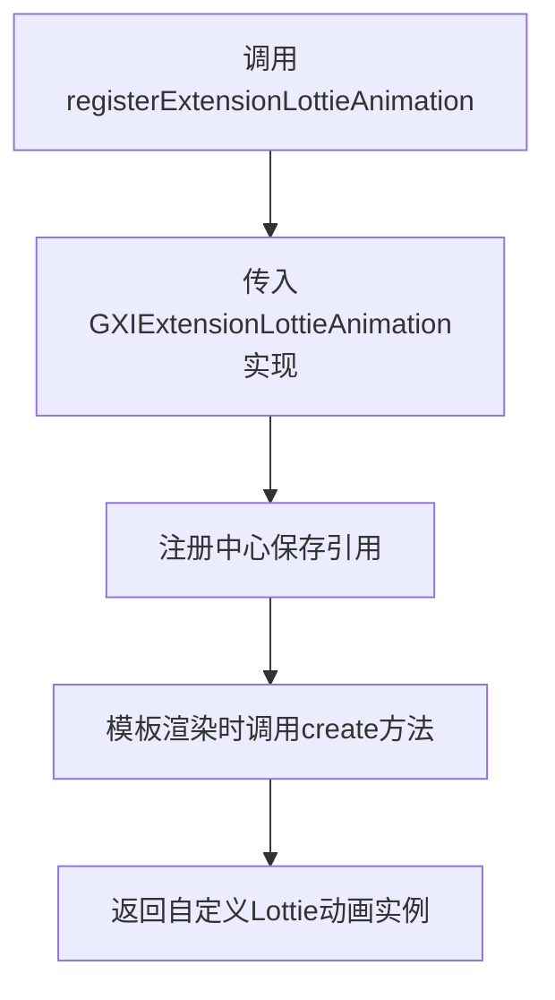
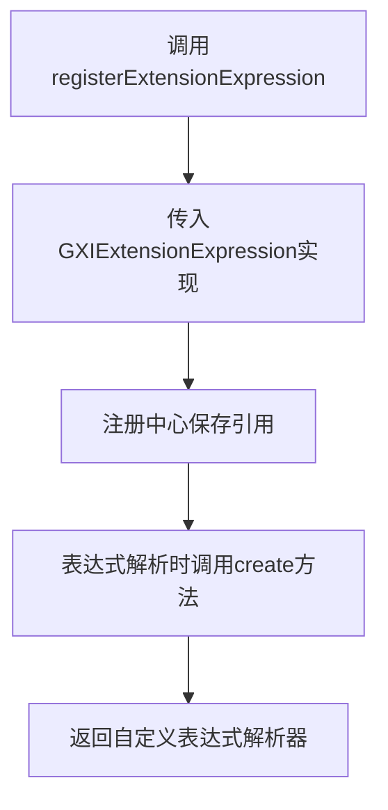
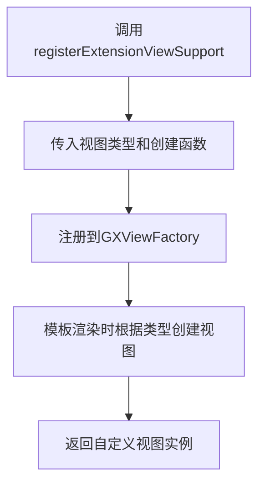
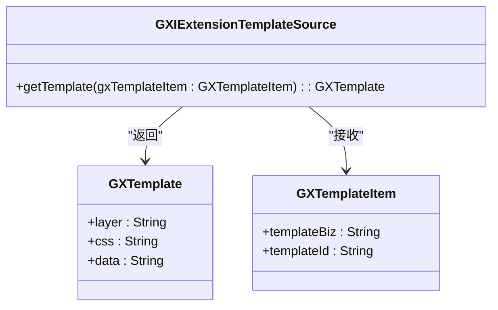
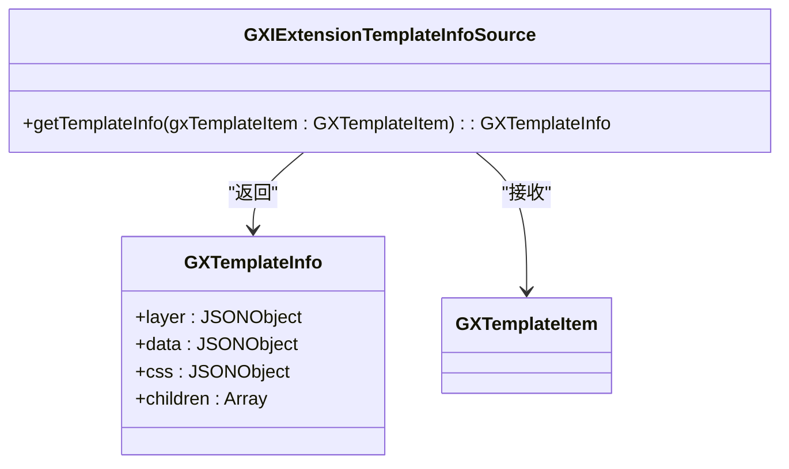
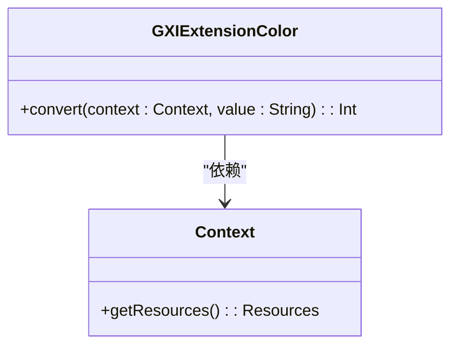
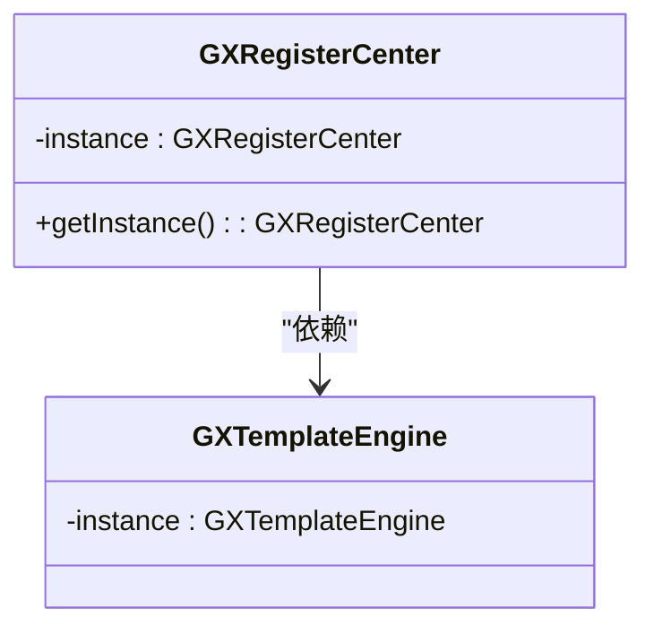
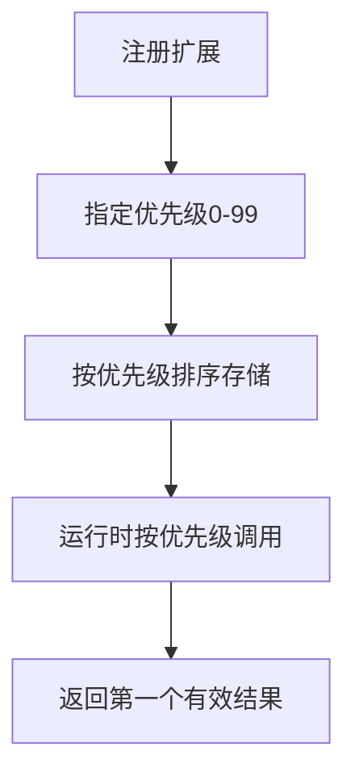
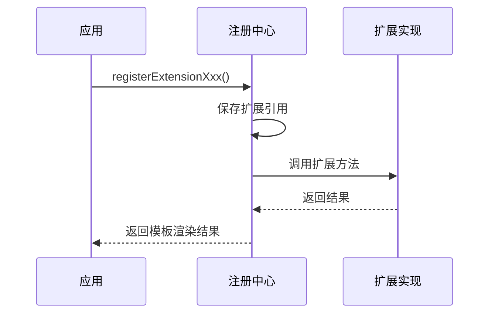

# 注册中心

<cite>
**本文档中引用的文件**  
- [GXRegisterCenter.kt](file://GaiaXAndroid/src/main/kotlin/com/alibaba/gaiax/GXRegisterCenter.kt)
- [GXViewFactory.kt](file://GaiaXAndroid/src/main/kotlin/com/alibaba/gaiax/render/view/GXViewFactory.kt)
- [GXRegisterCenter.ets](file://GaiaXHarmony/GaiaXCore/GaiaX/src/main/ets/GXRegisterCenter.ets)
- [GXRegisterCenter.tsx](file://GaiaXTaro/packages/gaiax-taro/src/gaiax/GXRegisterCenter.tsx)
- [GXRegisterCenter.h](file://GaiaXiOS/GaiaXiOS/Template/Register/GXRegisterCenter.h)
- [GXRegisterCenter.m](file://GaiaXiOS/GaiaXiOS/Template/Register/GXRegisterCenter.m)
</cite>

## 目录
1. [简介](#简介)
2. [核心注册方法](#核心注册方法)
3. [扩展接口技术规范](#扩展接口技术规范)
4. [自定义组件注册示例](#自定义组件注册示例)
5. [设计模式与运行时管理](#设计模式与运行时管理)
6. [最佳实践与常见问题](#最佳实践与常见问题)

## 简介
GaiaX注册中心（GXRegisterCenter）是GaiaX框架的核心扩展管理组件，负责管理各种功能扩展的注册与调用。作为跨平台动态模板解决方案的扩展枢纽，注册中心采用单例模式实现，为开发者提供统一的扩展注册接口。该中心支持Android、iOS、HarmonyOS和Taro等多个平台，通过统一的API设计确保跨平台一致性。注册中心采用优先级机制管理多个扩展实现，支持运行时动态注册与注销，为模板引擎提供灵活的扩展能力。

**Section sources**
- [GXRegisterCenter.kt](file://GaiaXAndroid/src/main/kotlin/com/alibaba/gaiax/GXRegisterCenter.kt#L47-L513)
- [GXRegisterCenter.ets](file://GaiaXHarmony/GaiaXCore/GaiaX/src/main/ets/GXRegisterCenter.ets#L1-L30)

## 核心注册方法

### registerExtensionLottieAnimation
该方法用于注册Lottie动画扩展实现，允许开发者自定义Lottie动画的创建逻辑。通过实现GXIExtensionLottieAnimation接口，可以控制Lottie动画实例的创建过程，满足特定业务场景下的动画需求。



**Diagram sources**
- [GXRegisterCenter.kt](file://GaiaXAndroid/src/main/kotlin/com/alibaba/gaiax/GXRegisterCenter.kt#L454-L457)
- [GXRegisterCenter.kt](file://GaiaXAndroid/src/main/kotlin/com/alibaba/gaiax/GXRegisterCenter.kt#L333-L333)

### registerExtensionExpression
该方法用于注册表达式扩展，支持自定义表达式的解析和计算逻辑。通过实现GXIExtensionExpression接口，开发者可以扩展框架的表达式能力，支持自定义函数和复杂逻辑运算。



**Diagram sources**
- [GXRegisterCenter.kt](file://GaiaXAndroid/src/main/kotlin/com/alibaba/gaiax/GXRegisterCenter.kt#L392-L395)
- [GXRegisterCenter.kt](file://GaiaXAndroid/src/main/kotlin/com/alibaba/gaiax/GXRegisterCenter.kt#L321-L321)

### registerExtensionViewSupport
该方法用于注册自定义视图支持，允许开发者注册特定类型的视图创建工厂。通过指定视图类型和创建函数，可以实现自定义UI组件的集成。



**Diagram sources**
- [GXRegisterCenter.kt](file://GaiaXAndroid/src/main/kotlin/com/alibaba/gaiax/GXRegisterCenter.kt#L427-L432)
- [GXViewFactory.kt](file://GaiaXAndroid/src/main/kotlin/com/alibaba/gaiax/render/view/GXViewFactory.kt#L29-L74)

**Section sources**
- [GXRegisterCenter.kt](file://GaiaXAndroid/src/main/kotlin/com/alibaba/gaiax/GXRegisterCenter.kt#L454-L457)
- [GXRegisterCenter.kt](file://GaiaXAndroid/src/main/kotlin/com/alibaba/gaiax/GXRegisterCenter.kt#L392-L395)
- [GXRegisterCenter.kt](file://GaiaXAndroid/src/main/kotlin/com/alibaba/gaiax/GXRegisterCenter.kt#L427-L432)

## 扩展接口技术规范

### GXIExtensionTemplateSource
模板数据源接口，用于从外部获取模板定义。实现该接口需要提供getTemplate方法，根据模板项返回相应的模板数据。



**Diagram sources**
- [GXRegisterCenter.kt](file://GaiaXAndroid/src/main/kotlin/com/alibaba/gaiax/GXRegisterCenter.kt#L144-L152)
- [GXRegisterCenter.tsx](file://GaiaXTaro/packages/gaiax-taro/src/gaiax/GXRegisterCenter.tsx#L9-L11)

### GXIExtensionTemplateInfoSource
模板信息数据源接口，用于获取模板的元信息。与模板数据源不同，该接口主要提供模板的结构和配置信息。



**Diagram sources**
- [GXRegisterCenter.kt](file://GaiaXAndroid/src/main/kotlin/com/alibaba/gaiax/GXRegisterCenter.kt#L131-L139)
- [GXRegisterCenter.tsx](file://GaiaXTaro/packages/gaiax-taro/src/gaiax/GXRegisterCenter.tsx#L9-L11)

### GXIExtensionColor
颜色扩展接口，用于自定义颜色值的解析逻辑。通过实现该接口，可以支持自定义颜色格式和主题系统。



**Diagram sources**
- [GXRegisterCenter.kt](file://GaiaXAndroid/src/main/kotlin/com/alibaba/gaiax/GXRegisterCenter.kt#L203-L205)

**Section sources**
- [GXRegisterCenter.kt](file://GaiaXAndroid/src/main/kotlin/com/alibaba/gaiax/GXRegisterCenter.kt#L144-L152)
- [GXRegisterCenter.kt](file://GaiaXAndroid/src/main/kotlin/com/alibaba/gaiax/GXRegisterCenter.kt#L131-L139)
- [GXRegisterCenter.kt](file://GaiaXAndroid/src/main/kotlin/com/alibaba/gaiax/GXRegisterCenter.kt#L203-L205)

## 自定义组件注册示例

### Android平台示例
```kotlin
// 注册自定义视图
GXRegisterCenter.instance.registerExtensionViewSupport("custom_button") { context ->
    CustomButtonView(context)
}

// 注册表达式扩展
GXRegisterCenter.instance.registerExtensionExpression(object : GXRegisterCenter.GXIExtensionExpression {
    override fun create(expVersion: String?, key: String?, value: Any): GXIExpression {
        return CustomExpression(expVersion, key, value)
    }
    
    override fun isTrue(expVersion: String?, key: String?, value: Any?): Boolean {
        return value == true
    }
})
```

### iOS平台示例
```objective-c
// 注册Lottie动画视图
[TheGXRegisterCenter registerLottieViewClass:[CustomLottieView class]];

// 注册模板数据源
[TheGXRegisterCenter registerTemplateSource:customTemplateSource];
```

### Taro平台示例
```typescript
// 注册自定义组件
const registerCenter = new GXRegisterCenter();
registerCenter.registerExtensionCustomComponent(customComponent);

// 注册模板数据源
registerCenter.registerExtensionTemplateSource(templateSource);
```

**Section sources**
- [GXRegisterCenter.kt](file://GaiaXAndroid/src/main/kotlin/com/alibaba/gaiax/GXRegisterCenter.kt#L427-L432)
- [GXRegisterCenter.h](file://GaiaXiOS/GaiaXiOS/Template/Register/GXRegisterCenter.h#L66-L68)
- [GXRegisterCenter.tsx](file://GaiaXTaro/packages/gaiax-taro/src/gaiax/GXRegisterCenter.tsx#L13-L15)

## 设计模式与运行时管理

### 单例模式实现
注册中心采用单例模式确保全局唯一实例，通过lazy初始化保证线程安全。



**Diagram sources**
- [GXRegisterCenter.kt](file://GaiaXAndroid/src/main/kotlin/com/alibaba/gaiax/GXRegisterCenter.kt#L509-L511)

### 优先级机制
注册中心采用优先级队列管理多个扩展实现，确保高优先级的扩展优先被调用。



**Diagram sources**
- [GXRegisterCenter.kt](file://GaiaXAndroid/src/main/kotlin/com/alibaba/gaiax/GXRegisterCenter.kt#L369-L374)
- [GXRegisterCenter.kt](file://GaiaXAndroid/src/main/kotlin/com/alibaba/gaiax/GXRegisterCenter.kt#L380-L385)

### 运行时管理策略
注册中心提供完整的生命周期管理，支持运行时动态注册、注销和重置。



**Diagram sources**
- [GXRegisterCenter.kt](file://GaiaXAndroid/src/main/kotlin/com/alibaba/gaiax/GXRegisterCenter.kt#L487-L505)

**Section sources**
- [GXRegisterCenter.kt](file://GaiaXAndroid/src/main/kotlin/com/alibaba/gaiax/GXRegisterCenter.kt#L509-L511)
- [GXRegisterCenter.kt](file://GaiaXAndroid/src/main/kotlin/com/alibaba/gaiax/GXRegisterCenter.kt#L369-L374)
- [GXRegisterCenter.kt](file://GaiaXAndroid/src/main/kotlin/com/alibaba/gaiax/GXRegisterCenter.kt#L487-L505)

## 最佳实践与常见问题

### 最佳实践
1. **优先级设置**：合理设置扩展优先级，避免冲突
2. **线程安全**：在主线程注册扩展，确保UI操作安全
3. **资源管理**：及时注销不再使用的扩展，避免内存泄漏
4. **错误处理**：实现GXIExtensionException接口处理内部异常

### 常见问题解决方案
1. **扩展未生效**：检查注册时机是否在模板渲染前
2. **优先级冲突**：使用不同的优先级值避免覆盖
3. **类型匹配错误**：确保视图类型字符串完全匹配
4. **内存泄漏**：在适当生命周期注销扩展

**Section sources**
- [GXRegisterCenter.kt](file://GaiaXAndroid/src/main/kotlin/com/alibaba/gaiax/GXRegisterCenter.kt#L471-L474)
- [GXRegisterCenter.kt](file://GaiaXAndroid/src/main/kotlin/com/alibaba/gaiax/GXRegisterCenter.kt#L487-L505)