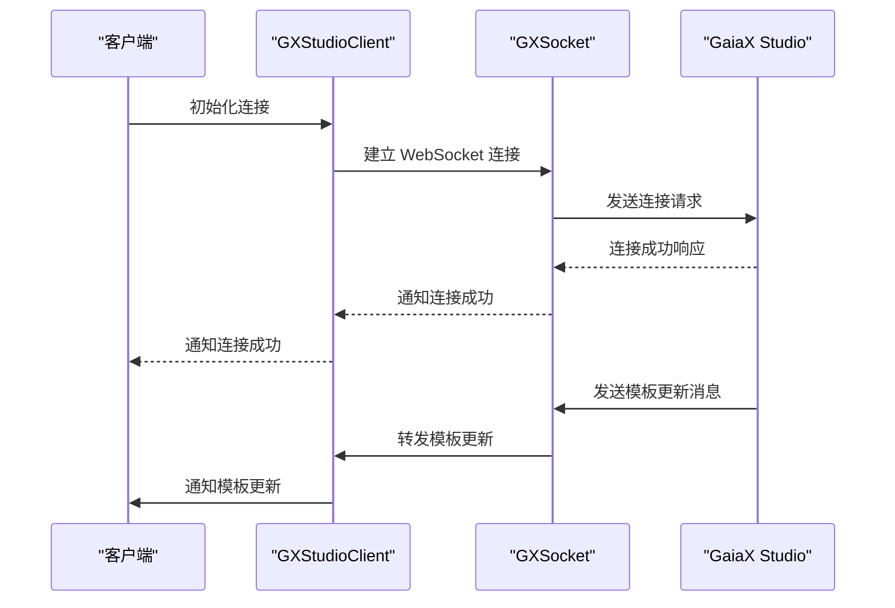
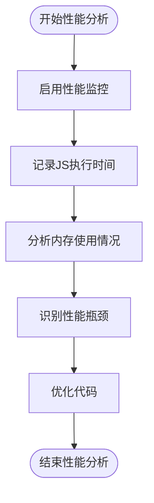
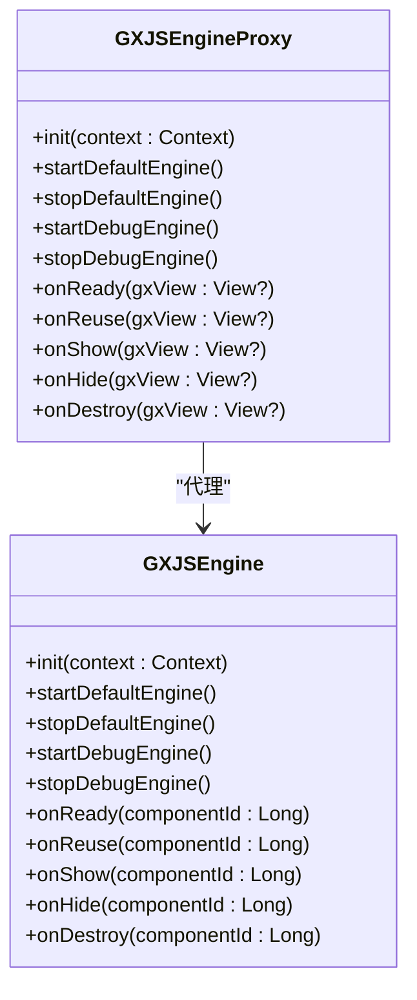

# 工具与调试

<cite>
**本文档中引用的文件**  
- [GXStudioClient.kt](file://GaiaXAndroidClientToStudio/src/main/java/com/alibaba/gaiax/studio/GXStudioClient.kt)
- [GXSocket.kt](file://GaiaXAndroidClientToStudio/src/main/java/com/alibaba/gaiax/studio/GXSocket.kt)
- [IDevTools.kt](file://GaiaXAndroidClientToStudio/src/main/java/com/alibaba/gaiax/studio/IDevTools.kt)
- [GXJSEngine.kt](file://GaiaXAndroidJS/src/main/kotlin/com/alibaba/gaiax/js/GXJSEngine.kt)
- [GXJSEngineProxy.kt](file://GaiaXAndroidJSProxy/src/main/java/com/alibaba/gaiax/js/proxy/GXJSEngineProxy.kt)
- [GXJSRenderProxy.kt](file://GaiaXAndroidJSProxy/src/main/java/com/alibaba/gaiax/js/proxy/GXJSRenderProxy.kt)
- [GXAdapter.kt](file://GaiaXAndroidAdapter/src/main/java/com/alibaba/gaiax/adapter/GXAdapter.kt)
- [GXAdapterImageView.kt](file://GaiaXAndroidAdapter/src/main/java/com/alibaba/gaiax/adapter/GXAdapterImageView.kt)
- [GaiaXDevTools.h](file://GaiaXiOSDemo/GaiaXiOSDemo/Preview/DevTools/GaiaXDevTools.h)
- [GaiaXJSConfig.h](file://GaiaXJSiOS/GaiaXJS/src/GaiaXJSConfig.h)
</cite>

## 目录
1. [简介](#简介)
2. [开发工具集成](#开发工具集成)
3. [调试技巧](#调试技巧)
4. [性能分析方法](#性能分析方法)
5. [核心组件分析](#核心组件分析)
6. [协议与安全](#协议与安全)
7. [配置与使用模式](#配置与使用模式)
8. [高级调试技巧](#高级调试技巧)
9. [性能优化建议](#性能优化建议)
10. [结论](#结论)

## 简介
GaiaX 是一个动态模板开发解决方案，提供了完整的开发工具链和调试支持。本文档重点介绍 GaiaX 的开发工具集成、调试技巧和性能分析方法，帮助开发者高效地进行应用开发和问题排查。

## 开发工具集成
GaiaX 提供了多种开发工具集成方式，包括 GXStudioClient、GXSocket 和 GaiaXDevTools。这些工具共同构成了一个完整的开发调试环境，支持实时预览、手动推送和断点调试等功能。

### GXStudioClient
GXStudioClient 是 GaiaX Studio 的客户端实现，负责与可视化开发工具建立连接。它通过 GXSocket 实现与 Studio 的实时通信，并提供了一系列接口用于接收和处理来自 Studio 的消息。

**核心功能**：
- 初始化与 Studio 的连接
- 处理实时预览和手动推送的消息
- 发送 JS 日志和调试信息

**Section sources**
- [GXStudioClient.kt](file://GaiaXAndroidClientToStudio/src/main/java/com/alibaba/gaiax/studio/GXStudioClient.kt#L1-L282)

### GXSocket
GXSocket 负责处理与 GaiaX Studio 的实时通信。它基于 WebSocket 协议，实现了稳定可靠的双向通信通道。GXSocket 支持多种消息类型，包括初始化、模板数据获取、JS 调用等。

**核心功能**：
- 建立和管理 WebSocket 连接
- 处理来自 Studio 的各种消息
- 发送响应和调试信息



**Diagram sources**
- [GXSocket.kt](file://GaiaXAndroidClientToStudio/src/main/java/com/alibaba/gaiax/studio/GXSocket.kt#L1-L442)
- [GXStudioClient.kt](file://GaiaXAndroidClientToStudio/src/main/java/com/alibaba/gaiax/studio/GXStudioClient.kt#L1-L282)

## 调试技巧
GaiaX 提供了丰富的调试功能，帮助开发者快速定位和解决问题。从基础的调试流程到高级的调试技巧，GaiaX 都提供了相应的支持。

### 基本调试流程
1. **连接 Studio**：通过 GXStudioClient 连接到 GaiaX Studio
2. **启动调试**：启用断点调试模式
3. **查看日志**：通过 GaiaXDevTools 查看 JS 执行日志
4. **断点调试**：在关键代码处设置断点进行调试

### GaiaXDevTools
GaiaXDevTools 是 GaiaX 的调试工具，提供了直观的用户界面用于查看和控制调试过程。它支持多种调试模式，包括日志调试和断点调试。

**核心功能**：
- 显示连接状态
- 切换调试模式
- 查看 JS 执行日志
- 控制调试流程

**Section sources**
- [GaiaXDevTools.h](file://GaiaXiOSDemo/GaiaXiOSDemo/Preview/DevTools/GaiaXDevTools.h#L1-L30)

## 性能分析方法
GaiaX 提供了多种性能分析工具和方法，帮助开发者优化应用性能。

### JS 引擎性能分析
GXJSEngine 是 GaiaX 的 JS 引擎，支持 QuickJS 和 DebugJS 两种模式。通过性能分析，可以了解 JS 代码的执行效率和内存使用情况。

**性能分析方法**：
- 启用性能监控
- 记录 JS 执行时间
- 分析内存使用情况
- 识别性能瓶颈



**Diagram sources**
- [GXJSEngine.kt](file://GaiaXAndroidJS/src/main/kotlin/com/alibaba/gaiax/js/GXJSEngine.kt#L1-L426)

## 核心组件分析
### GXJSEngine
GXJSEngine 是 GaiaX 的核心 JS 引擎，负责 JS 代码的执行和管理。它提供了丰富的 API 用于注册模块、启动引擎和处理事件。

**核心功能**：
- 初始化 JS 引擎
- 注册自定义模块
- 启动和停止引擎
- 处理 JS 事件

**Section sources**
- [GXJSEngine.kt](file://GaiaXAndroidJS/src/main/kotlin/com/alibaba/gaiax/js/GXJSEngine.kt#L1-L426)

### GXJSEngineProxy
GXJSEngineProxy 是 GXJSEngine 的代理类，封装了与 GaiaX 渲染库组合使用的一些常用方法。它简化了 JS 引擎的使用，提供了更高级的抽象。

**核心功能**：
- 管理 JS 组件生命周期
- 处理视图事件
- 注册内置模块
- 管理组件映射



**Diagram sources**
- [GXJSEngineProxy.kt](file://GaiaXAndroidJSProxy/src/main/java/com/alibaba/gaiax/js/proxy/GXJSEngineProxy.kt#L1-L407)
- [GXJSEngine.kt](file://GaiaXAndroidJS/src/main/kotlin/com/alibaba/gaiax/js/GXJSEngine.kt#L1-L426)

### GXJSRenderProxy
GXJSRenderProxy 负责管理 JS 组件与视图之间的映射关系。它在 JS 线程和 UI 线程之间架起桥梁，确保事件能够正确传递。

**核心功能**：
- 管理组件映射
- 处理数据更新
- 分发手势事件
- 管理原生消息

**Section sources**
- [GXJSRenderProxy.kt](file://GaiaXAndroidJSProxy/src/main/java/com/alibaba/gaiax/js/proxy/GXJSRenderProxy.kt#L1-L181)

## 协议与安全
### 通信协议
GaiaX 使用 JSON-RPC 2.0 协议进行客户端与 Studio 之间的通信。该协议定义了标准的消息格式和处理规则。

**消息格式**：
```json
{
  "jsonrpc": "2.0",
  "method": "method_name",
  "params": { /* 参数 */ },
  "id": 123
}
```

### 安全考虑
- **连接验证**：确保只有授权的客户端可以连接到 Studio
- **数据加密**：敏感数据在传输过程中进行加密
- **权限控制**：不同级别的调试功能需要相应的权限

**Section sources**
- [GXSocket.kt](file://GaiaXAndroidClientToStudio/src/main/java/com/alibaba/gaiax/studio/GXSocket.kt#L1-L442)

## 配置与使用模式
### 调试配置
GaiaX 提供了多种调试配置选项，可以根据需要进行调整。

**配置选项**：
- 调试模式：日志调试、断点调试
- 连接方式：自动连接、手动连接
- 日志级别：错误、警告、信息

### 使用模式
#### 开发模式
- 启用断点调试
- 查看详细日志
- 实时预览模板

#### 生产模式
- 禁用调试功能
- 最小化日志输出
- 优化性能

**Section sources**
- [GXJSEngine.kt](file://GaiaXAndroidJS/src/main/kotlin/com/alibaba/gaiax/js/GXJSEngine.kt#L1-L426)
- [GaiaXJSConfig.h](file://GaiaXJSiOS/GaiaXJS/src/GaiaXJSConfig.h#L1-L31)

## 高级调试技巧
### 断点调试
1. 在关键代码处设置断点
2. 触发相关操作使代码执行到断点
3. 检查变量值和调用栈
4. 逐步执行代码观察行为变化

### 性能瓶颈分析
1. 使用性能分析工具收集数据
2. 识别耗时较长的操作
3. 分析内存使用模式
4. 优化算法和数据结构

### 异常处理
1. 监控 JS 异常
2. 记录异常堆栈
3. 分析异常原因
4. 实现优雅的错误恢复

## 性能优化建议
### JS 代码优化
- 减少全局变量使用
- 避免频繁的 DOM 操作
- 使用合适的数据结构
- 优化循环和递归

### 内存管理
- 及时释放不再使用的对象
- 避免内存泄漏
- 使用对象池技术
- 优化资源加载

### 网络通信
- 减少不必要的网络请求
- 使用缓存机制
- 压缩传输数据
- 优化连接管理

## 结论
GaiaX 提供了一套完整的开发工具和调试解决方案，从基础的连接和调试到高级的性能分析和优化，都提供了相应的支持。通过合理使用这些工具和技巧，开发者可以大大提高开发效率，确保应用的高性能运行。