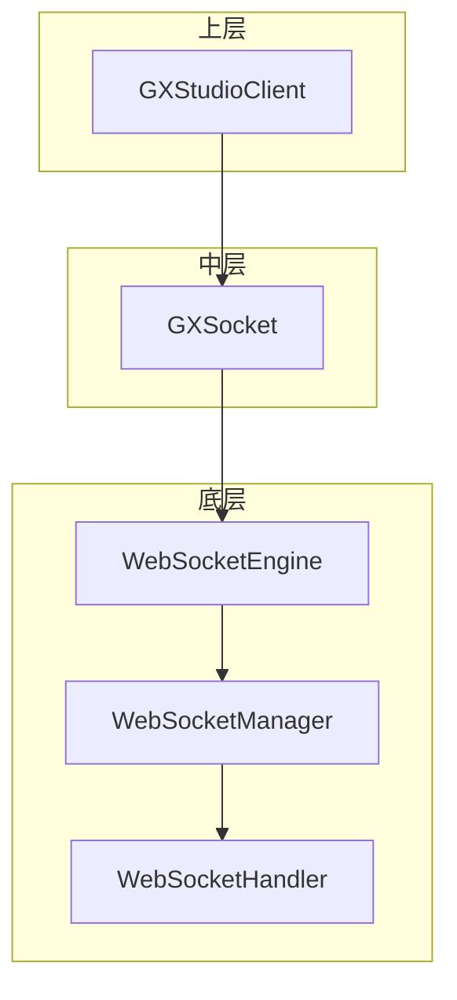
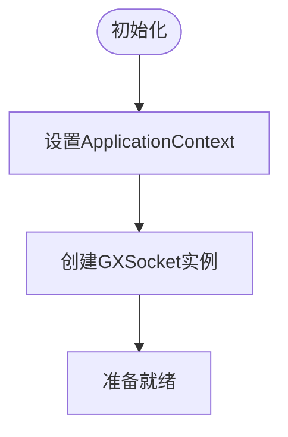
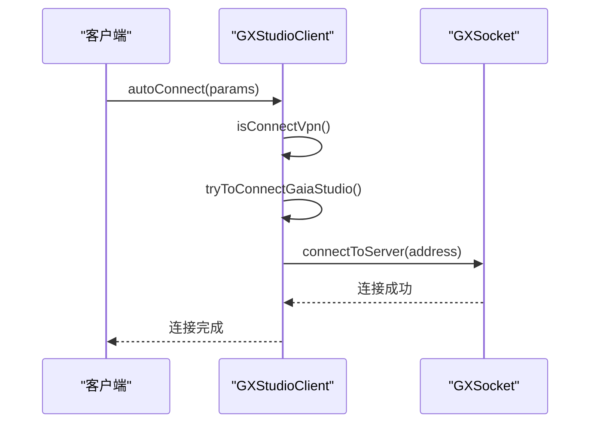
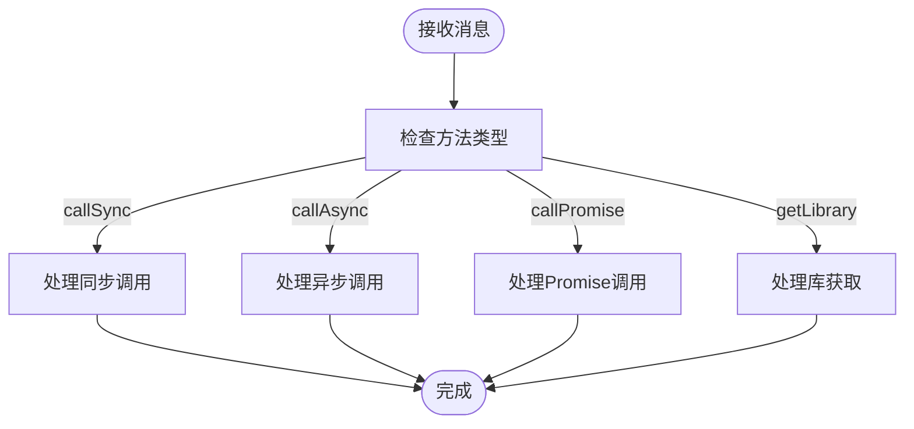
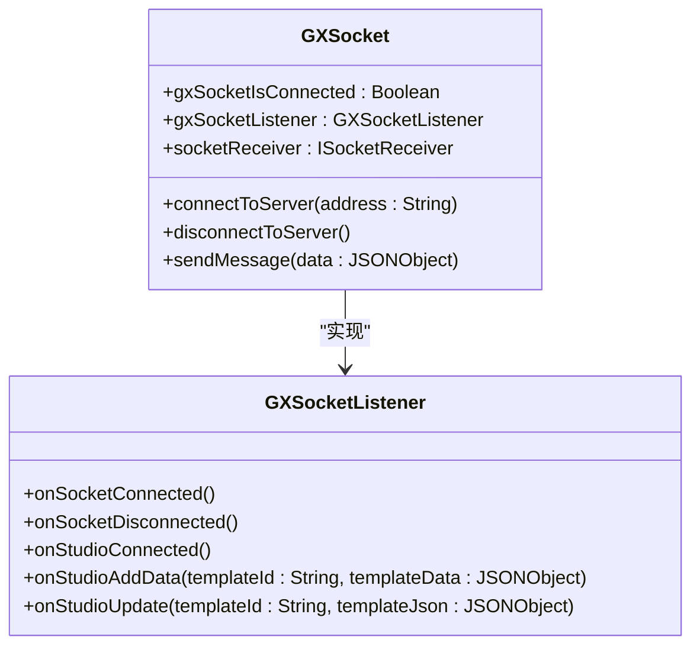
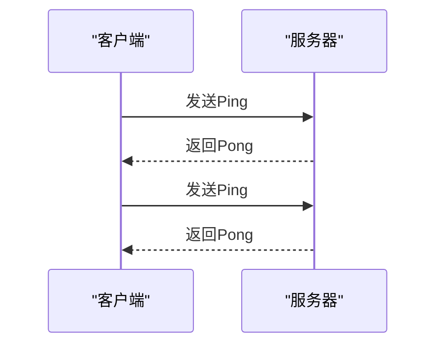
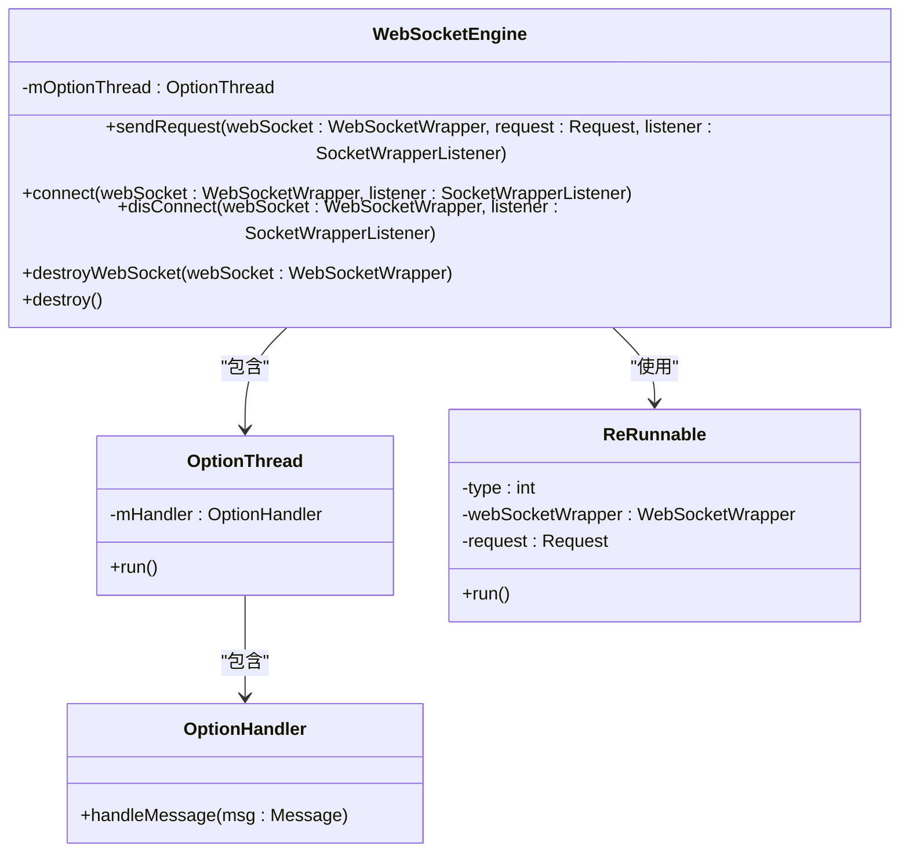
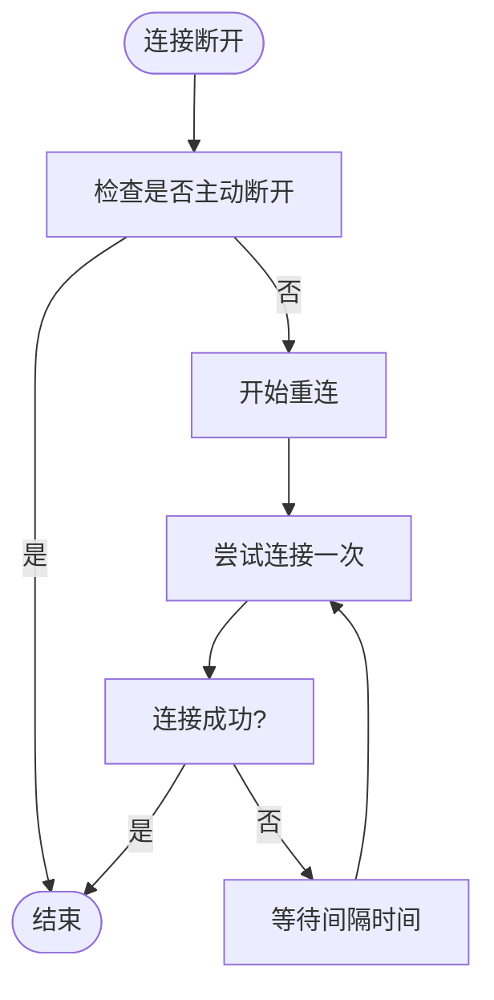
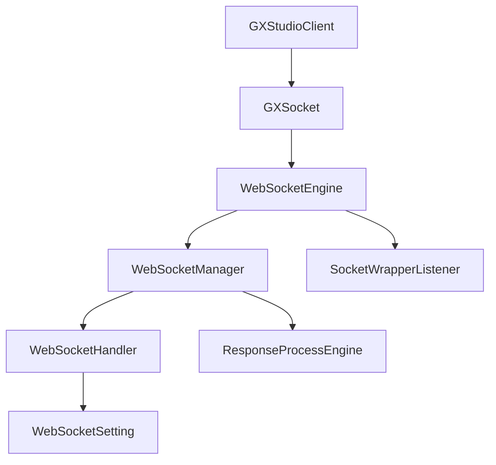

# 开发工具集成

<cite>
**本文档引用的文件**   
- [GXStudioClient.kt](file://GaiaXAndroidClientToStudio/src/main/java/com/alibaba/gaiax/studio/GXStudioClient.kt)
- [GXSocket.kt](file://GaiaXAndroidClientToStudio/src/main/java/com/alibaba/gaiax/studio/GXSocket.kt)
- [GXSocketKey.kt](file://GaiaXAndroidClientToStudio/src/main/java/com/alibaba/gaiax/studio/GXSocketKey.kt)
- [WebSocketEngine.java](file://GaiaXAndroidClientToStudio/src/main/java/com/alibaba/gaiax/studio/third/socket/websocket/WebSocketEngine.java)
- [WebSocketHandler.java](file://GaiaXAndroidClientToStudio/src/main/java/com/alibaba/gaiax/studio/third/socket/websocket/WebSocketHandler.java)
- [WebSocketManager.java](file://GaiaXAndroidClientToStudio/src/main/java/com/alibaba/gaiax/studio/third/socket/websocket/WebSocketManager.java)
- [IDevTools.kt](file://GaiaXAndroidClientToStudio/src/main/java/com/alibaba/gaiax/studio/IDevTools.kt)
</cite>

## 目录
1. [简介](#简介)
2. [核心组件](#核心组件)
3. [架构概述](#架构概述)
4. [详细组件分析](#详细组件分析)
5. [依赖分析](#依赖分析)
6. [性能考虑](#性能考虑)
7. [故障排除指南](#故障排除指南)
8. [结论](#结论)

## 简介
本文档详细介绍了GaiaX开发工具集成的核心机制，重点阐述了GXStudioClient如何实现与可视化开发工具的连接，GXSocket如何处理实时通信协议，以及WebSocketEngine如何管理网络连接。文档将为初学者提供基本配置和使用示例，同时为经验丰富的开发者深入解析Socket通信的底层实现、心跳机制和错误重连策略。

## 核心组件
本文档的核心组件包括GXStudioClient、GXSocket、GXSocketKey和WebSocketEngine。GXStudioClient是开发工具连接的入口，负责初始化连接、管理连接状态和处理消息。GXSocket处理实时通信协议，实现消息的发送和接收。GXSocketKey定义了通信协议的常量。WebSocketEngine管理网络连接，处理底层的WebSocket操作。

**本文档引用的文件**   
- [GXStudioClient.kt](file://GaiaXAndroidClientToStudio/src/main/java/com/alibaba/gaiax/studio/GXStudioClient.kt)
- [GXSocket.kt](file://GaiaXAndroidClientToStudio/src/main/java/com/alibaba/gaiax/studio/GXSocket.kt)
- [GXSocketKey.kt](file://GaiaXAndroidClientToStudio/src/main/java/com/alibaba/gaiax/studio/GXSocketKey.kt)
- [WebSocketEngine.java](file://GaiaXAndroidClientToStudio/src/main/java/com/alibaba/gaiax/studio/third/socket/websocket/WebSocketEngine.java)

## 架构概述
GaiaX开发工具集成采用分层架构，上层是GXStudioClient，负责与开发工具的交互；中层是GXSocket，负责通信协议的处理；底层是WebSocketEngine，负责网络连接的管理。这种分层设计使得各组件职责清晰，便于维护和扩展。

**图表来源**
- [GXStudioClient.kt](file://GaiaXAndroidClientToStudio/src/main/java/com/alibaba/gaiax/studio/GXStudioClient.kt)
- [GXSocket.kt](file://GaiaXAndroidClientToStudio/src/main/java/com/alibaba/gaiax/studio/GXSocket.kt)
- [WebSocketEngine.java](file://GaiaXAndroidClientToStudio/src/main/java/com/alibaba/gaiax/studio/third/socket/websocket/WebSocketEngine.java)
- [WebSocketManager.java](file://GaiaXAndroidClientToStudio/src/main/java/com/alibaba/gaiax/studio/third/socket/websocket/WebSocketManager.java)
- [WebSocketHandler.java](file://GaiaXAndroidClientToStudio/src/main/java/com/alibaba/gaiax/studio/third/socket/websocket/WebSocketHandler.java)

## 详细组件分析

### GXStudioClient分析
GXStudioClient是开发工具连接的入口，负责初始化连接、管理连接状态和处理消息。它通过单例模式确保全局唯一实例，提供了一系列方法来控制连接的生命周期。

#### 初始化流程
GXStudioClient的初始化流程如下：
1. 调用`init`方法传入Context
2. 设置applicationContext
3. 创建GXSocket实例
4. 准备连接所需的资源

**图表来源**
- [GXStudioClient.kt](file://GaiaXAndroidClientToStudio/src/main/java/com/alibaba/gaiax/studio/GXStudioClient.kt#L78-L83)

#### 连接建立机制
GXStudioClient提供了多种连接方式，包括自动连接和手动连接。连接建立时会检查VPN状态，避免在VPN环境下连接。

**图表来源**
- [GXStudioClient.kt](file://GaiaXAndroidClientToStudio/src/main/java/com/alibaba/gaiax/studio/GXStudioClient.kt#L101-L111)
- [GXSocket.kt](file://GaiaXAndroidClientToStudio/src/main/java/com/alibaba/gaiax/studio/GXSocket.kt#L69-L95)

#### 消息处理逻辑
GXStudioClient通过注册消息接收器来处理来自开发工具的消息，支持同步、异步和Promise调用。

**图表来源**
- [GXStudioClient.kt](file://GaiaXAndroidClientToStudio/src/main/java/com/alibaba/gaiax/studio/GXStudioClient.kt#L259-L261)

### GXSocket分析
GXSocket负责处理实时通信协议，实现消息的发送和接收。它基于WebSocket协议，提供了可靠的消息传输机制。

#### 通信协议处理
GXSocket使用JSON-RPC 2.0协议进行通信，通过GXSocketKey定义了协议名称和版本。

**图表来源**
- [GXSocket.kt](file://GaiaXAndroidClientToStudio/src/main/java/com/alibaba/gaiax/studio/GXSocket.kt#L17-L440)
- [GXSocketKey.kt](file://GaiaXAndroidClientToStudio/src/main/java/com/alibaba/gaiax/studio/GXSocketKey.kt#L1-L13)

#### 心跳机制
GXSocket通过WebSocket的心跳机制保持连接活跃，防止因网络空闲而断开。

**图表来源**
- [GXSocket.kt](file://GaiaXAndroidClientToStudio/src/main/java/com/alibaba/gaiax/studio/GXSocket.kt#L185-L187)

### WebSocketEngine分析
WebSocketEngine管理网络连接，处理底层的WebSocket操作。它使用独立的线程处理网络操作，避免阻塞主线程。

#### 网络连接管理
WebSocketEngine通过操作线程发送数据，确保网络操作不会影响UI性能。

**图表来源**
- [WebSocketEngine.java](file://GaiaXAndroidClientToStudio/src/main/java/com/alibaba/gaiax/studio/third/socket/websocket/WebSocketEngine.java#L19-L159)

#### 错误重连策略
WebSocketEngine实现了智能的错误重连策略，当连接断开时会自动尝试重新连接。

**图表来源**
- [WebSocketEngine.java](file://GaiaXAndroidClientToStudio/src/main/java/com/alibaba/gaiax/studio/third/socket/websocket/WebSocketEngine.java#L57-L67)

## 依赖分析
GaiaX开发工具集成的组件之间存在明确的依赖关系。GXStudioClient依赖GXSocket，GXSocket依赖WebSocketEngine，WebSocketEngine依赖WebSocketManager和WebSocketHandler。

**图表来源**
- [GXStudioClient.kt](file://GaiaXAndroidClientToStudio/src/main/java/com/alibaba/gaiax/studio/GXStudioClient.kt)
- [GXSocket.kt](file://GaiaXAndroidClientToStudio/src/main/java/com/alibaba/gaiax/studio/GXSocket.kt)
- [WebSocketEngine.java](file://GaiaXAndroidClientToStudio/src/main/java/com/alibaba/gaiax/studio/third/socket/websocket/WebSocketEngine.java)
- [WebSocketManager.java](file://GaiaXAndroidClientToStudio/src/main/java/com/alibaba/gaiax/studio/third/socket/websocket/WebSocketManager.java)
- [WebSocketHandler.java](file://GaiaXAndroidClientToStudio/src/main/java/com/alibaba/gaiax/studio/third/socket/websocket/WebSocketHandler.java)

## 性能考虑
为了确保开发工具的稳定运行，需要考虑以下性能优化建议：
1. 使用独立线程处理网络操作，避免阻塞主线程
2. 合理设置连接超时时间和心跳间隔
3. 实现智能的错误重连策略，避免频繁重连
4. 优化消息序列化和反序列化过程
5. 及时释放不再使用的资源

## 故障排除指南
当开发工具连接出现问题时，可以按照以下步骤进行排查：
1. 检查网络连接是否正常
2. 确认开发工具服务是否已启动
3. 检查连接参数是否正确
4. 查看日志输出，定位具体错误
5. 尝试重启开发工具和客户端

**本文档引用的文件**   
- [GXStudioClient.kt](file://GaiaXAndroidClientToStudio/src/main/java/com/alibaba/gaiax/studio/GXStudioClient.kt)
- [GXSocket.kt](file://GaiaXAndroidClientToStudio/src/main/java/com/alibaba/gaiax/studio/GXSocket.kt)
- [WebSocketEngine.java](file://GaiaXAndroidClientToStudio/src/main/java/com/alibaba/gaiax/studio/third/socket/websocket/WebSocketEngine.java)

## 结论
GaiaX开发工具集成通过GXStudioClient、GXSocket和WebSocketEngine三个核心组件，实现了稳定可靠的开发工具连接。通过分层架构设计，各组件职责清晰，便于维护和扩展。文档详细介绍了各组件的实现原理和使用方法，为开发者提供了全面的参考。