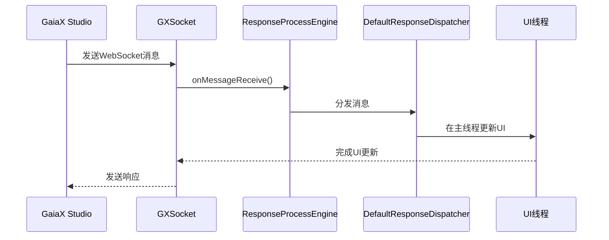
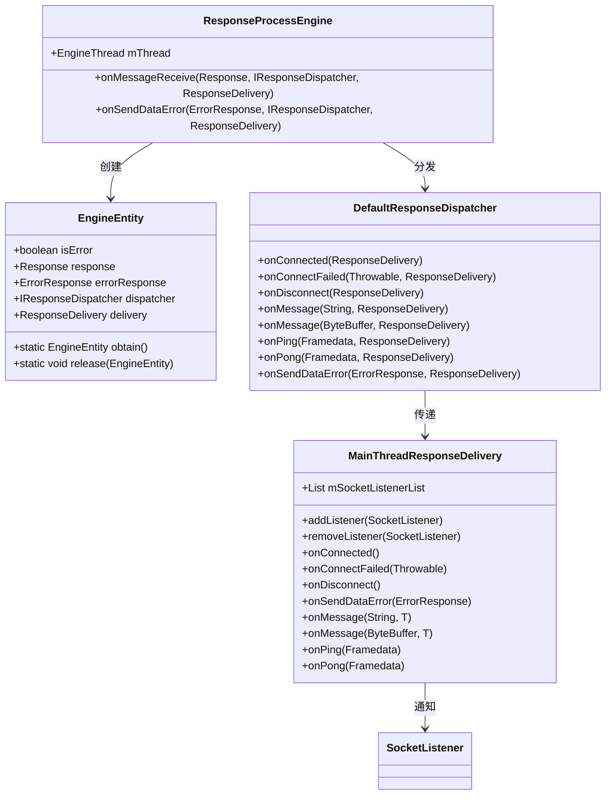
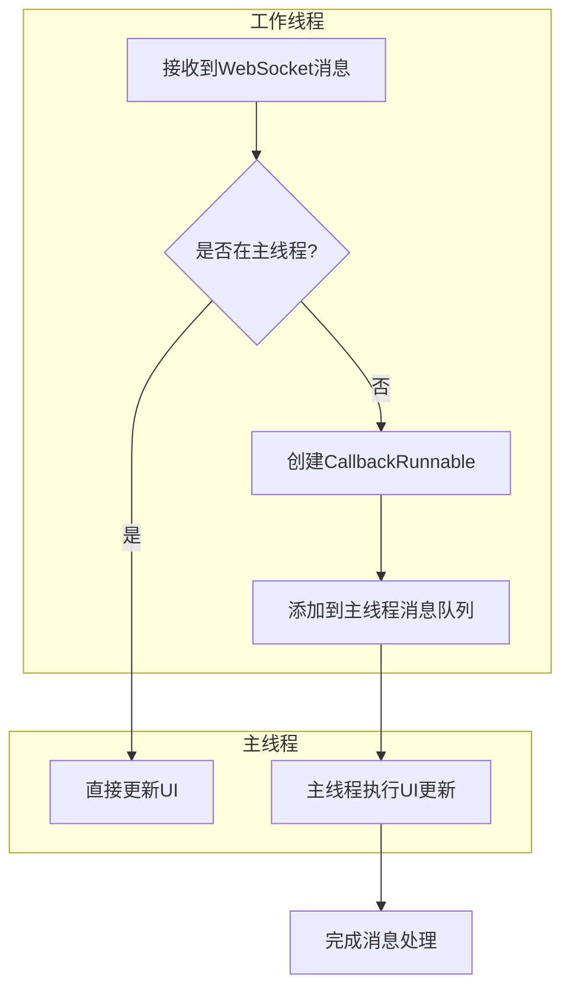
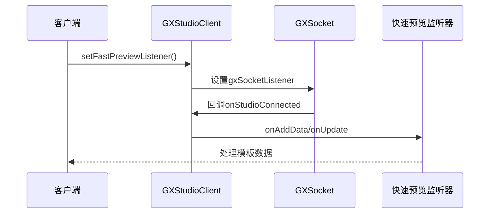
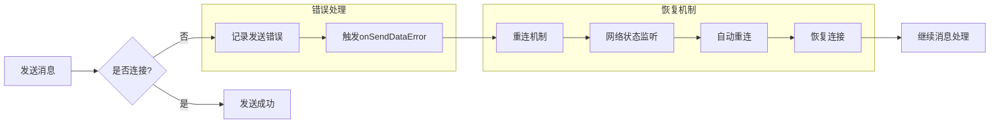
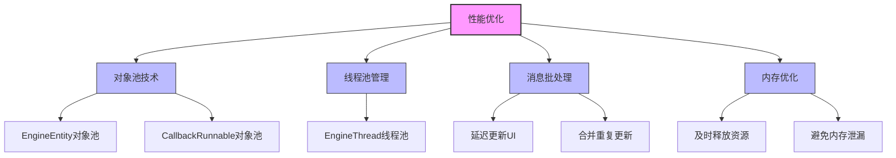

# 消息处理

<cite>
**本文档引用的文件**   
- [GXSocket.kt](file://GaiaXAndroidClientToStudio/src/main/java/com/alibaba/gaiax/studio/GXSocket.kt)
- [ResponseProcessEngine.java](file://GaiaXAndroidClientToStudio/src/main/java/com/alibaba/gaiax/studio/third/socket/websocket/dispatcher/ResponseProcessEngine.java)
- [DefaultResponseDispatcher.java](file://GaiaXAndroidClientToStudio/src/main/java/com/alibaba/gaiax/studio/third/socket/websocket/dispatcher/DefaultResponseDispatcher.java)
- [GXStudioClient.kt](file://GaiaXAndroidClientToStudio/src/main/java/com/alibaba/gaiax/studio/GXStudioClient.kt)
- [WebSocketHandler.java](file://GaiaXAndroidClientToStudio/src/main/java/com/alibaba/gaiax/studio/third/socket/websocket/WebSocketHandler.java)
- [WebSocketSetting.java](file://GaiaXAndroidClientToStudio/src/main/java/com/alibaba/gaiax/studio/third/socket/websocket/WebSocketSetting.java)
- [WebSocketManager.java](file://GaiaXAndroidClientToStudio/src/main/java/com/alibaba/gaiax/studio/third/socket/websocket/WebSocketManager.java)
</cite>

## 目录
1. [简介](#简介)
2. [核心组件](#核心组件)
3. [消息处理流程](#消息处理流程)
4. [消息分发机制](#消息分发机制)
5. [线程调度与UI更新](#线程调度与ui更新)
6. [消息监听器注册](#消息监听器注册)
7. [消息超时与错误处理](#消息超时与错误处理)
8. [性能优化建议](#性能优化建议)
9. [结论](#结论)

## 简介
GaiaX开发工具通过WebSocket实现可视化开发工具与客户端之间的实时通信。本文档详细介绍了GXSocket如何处理来自可视化开发工具的消息分发和响应，重点解析ResponseProcessEngine如何解析接收到的消息并路由到相应的处理器，以及DefaultResponseDispatcher如何在主线程中安全地处理UI更新。文档为初学者提供消息处理的基本流程和使用示例，同时为经验丰富的开发者深入解析消息队列机制、线程调度和异步处理模式。

## 核心组件

GaiaX消息处理系统由多个核心组件构成，包括GXSocket、ResponseProcessEngine、DefaultResponseDispatcher等。GXSocket作为主要的WebSocket客户端，负责与GaiaX Studio建立连接并处理消息。ResponseProcessEngine负责解析接收到的消息并将其分发到相应的处理器。DefaultResponseDispatcher则确保所有UI更新都在主线程中安全执行。

**本文档引用的文件**   
- [GXSocket.kt](file://GaiaXAndroidClientToStudio/src/main/java/com/alibaba/gaiax/studio/GXSocket.kt)
- [ResponseProcessEngine.java](file://GaiaXAndroidClientToStudio/src/main/java/com/alibaba/gaiax/studio/third/socket/websocket/dispatcher/ResponseProcessEngine.java)
- [DefaultResponseDispatcher.java](file://GaiaXAndroidClientToStudio/src/main/java/com/alibaba/gaiax/studio/third/socket/websocket/dispatcher/DefaultResponseDispatcher.java)

## 消息处理流程

**图表来源**
- [GXSocket.kt](file://GaiaXAndroidClientToStudio/src/main/java/com/alibaba/gaiax/studio/GXSocket.kt#L122-L181)
- [ResponseProcessEngine.java](file://GaiaXAndroidClientToStudio/src/main/java/com/alibaba/gaiax/studio/third/socket/websocket/dispatcher/ResponseProcessEngine.java#L23-L35)
- [DefaultResponseDispatcher.java](file://GaiaXAndroidClientToStudio/src/main/java/com/alibaba/gaiax/studio/third/socket/websocket/dispatcher/DefaultResponseDispatcher.java#L40-L43)

**消息处理流程说明**
1. GaiaX Studio通过WebSocket发送消息到客户端
2. GXSocket接收到消息后调用onMessage方法
3. ResponseProcessEngine解析消息并创建EngineEntity
4. EngineEntity被添加到消息队列中等待处理
5. DefaultResponseDispatcher在主线程中处理消息并更新UI
6. 完成处理后发送响应给GaiaX Studio

## 消息分发机制

**图表来源**
- [ResponseProcessEngine.java](file://GaiaXAndroidClientToStudio/src/main/java/com/alibaba/gaiax/studio/third/socket/websocket/dispatcher/ResponseProcessEngine.java#L14-L74)
- [DefaultResponseDispatcher.java](file://GaiaXAndroidClientToStudio/src/main/java/com/alibaba/gaiax/studio/third/socket/websocket/dispatcher/DefaultResponseDispatcher.java#L16-L64)
- [MainThreadResponseDelivery.java](file://GaiaXAndroidClientToStudio/src/main/java/com/alibaba/gaiax/studio/third/socket/websocket/dispatcher/MainThreadResponseDelivery.java#L35-L358)

**消息分发机制说明**
ResponseProcessEngine是消息处理的核心引擎，它通过EngineThread处理消息队列中的消息。每个消息被封装为EngineEntity对象，包含消息内容、分发器和交付器。DefaultResponseDispatcher作为默认的消息分发器，负责将消息传递给相应的处理器。MainThreadResponseDelivery确保所有UI相关的回调都在主线程中执行。

## 线程调度与UI更新

**图表来源**
- [MainThreadResponseDelivery.java](file://GaiaXAndroidClientToStudio/src/main/java/com/alibaba/gaiax/studio/third/socket/websocket/dispatcher/MainThreadResponseDelivery.java#L74-L230)
- [GXSocket.kt](file://GaiaXAndroidClientToStudio/src/main/java/com/alibaba/gaiax/studio/GXSocket.kt#L40-L40)

**线程调度说明**
为了确保UI更新的安全性，GaiaX采用了一套完善的线程调度机制：
1. 当消息在非主线程接收时，系统会创建一个CallbackRunnable对象
2. CallbackRunnable被添加到主线程的消息队列中
3. 主线程从消息队列中取出CallbackRunnable并执行
4. UI更新在主线程中安全完成
5. 使用对象池技术（RUNNABLE_POOL）减少对象创建开销

## 消息监听器注册

**图表来源**
- [GXStudioClient.kt](file://GaiaXAndroidClientToStudio/src/main/java/com/alibaba/gaiax/studio/GXStudioClient.kt#L20-L23)
- [GXSocket.kt](file://GaiaXAndroidClientToStudio/src/main/java/com/alibaba/gaiax/studio/GXSocket.kt#L27-L27)

**消息监听器注册说明**
1. 客户端通过GXStudioClient的setFastPreviewListener方法注册快速预览监听器
2. GXStudioClient将监听器设置给GXSocket的gxSocketListener
3. 当接收到模板数据时，GXSocket通过gxSocketListener回调onStudioAddData和onStudioUpdate方法
4. GXStudioClient的内部监听器接收到回调后，转发给客户端注册的快速预览监听器
5. 客户端在onAddData和onUpdate方法中处理模板数据并更新UI

## 消息超时与错误处理

**图表来源**
- [DefaultResponseDispatcher.java](file://GaiaXAndroidClientToStudio/src/main/java/com/alibaba/gaiax/studio/third/socket/websocket/dispatcher/DefaultResponseDispatcher.java#L60-L63)
- [WebSocketManager.java](file://GaiaXAndroidClientToStudio/src/main/java/com/alibaba/gaiax/studio/third/socket/websocket/WebSocketManager.java#L394-L398)
- [WebSocketHandler.java](file://GaiaXAndroidClientToStudio/src/main/java/com/alibaba/gaiax/studio/third/socket/websocket/WebSocketHandler.java#L159-L170)

**消息超时与错误处理说明**
1. 当网络未连接时，系统会记录发送错误并通过onSendDataError回调通知
2. WebSocketManager检测到发送失败后会自动触发重连机制
3. WebSocketHandler注册了网络状态变化监听器，当网络恢复时自动重连
4. 重连成功后继续处理消息队列中的消息
5. 系统支持配置重连次数和重连间隔，确保在网络不稳定情况下的可靠性

## 性能优化建议

**图表来源**
- [ResponseProcessEngine.java](file://GaiaXAndroidClientToStudio/src/main/java/com/alibaba/gaiax/studio/third/socket/websocket/dispatcher/ResponseProcessEngine.java#L55-L55)
- [MainThreadResponseDelivery.java](file://GaiaXAndroidClientToStudio/src/main/java/com/alibaba/gaiax/studio/third/socket/websocket/dispatcher/MainThreadResponseDelivery.java#L42-L42)

**性能优化建议**
1. **对象池技术**：使用对象池减少频繁的对象创建和垃圾回收开销
   - EngineEntity使用ArrayDeque作为对象池
   - CallbackRunnable也采用对象池技术
2. **线程池管理**：合理管理工作线程，避免线程创建过多
   - EngineThread作为消息处理的工作线程
   - 通过线程安全的方式管理线程生命周期
3. **消息批处理**：优化UI更新频率
   - 使用postDelayed延迟更新，避免频繁刷新
   - 合并重复的UI更新操作
4. **内存优化**：
   - 及时释放不再使用的资源
   - 避免持有Activity等上下文引用导致内存泄漏
   - 使用弱引用或软引用管理监听器

## 结论
GaiaX的消息处理系统通过GXSocket、ResponseProcessEngine和DefaultResponseDispatcher等组件构建了一个高效、可靠的消息通信框架。系统采用多线程架构，确保消息处理的及时性，同时通过主线程调度机制保证UI更新的安全性。对象池技术和合理的线程管理有效提升了系统性能。对于开发者而言，理解这套消息处理机制有助于更好地集成GaiaX开发工具，实现高效的可视化开发体验。