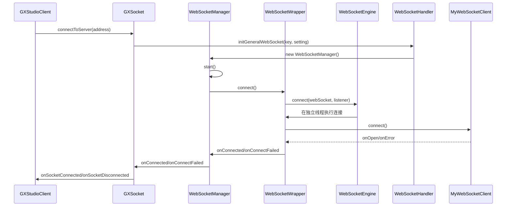
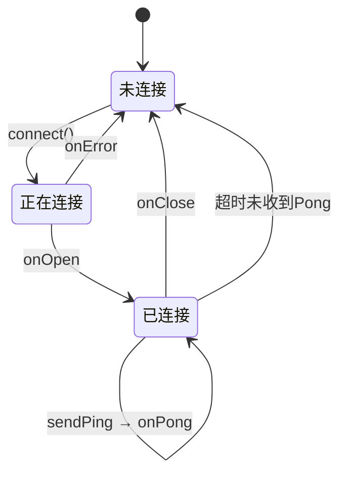
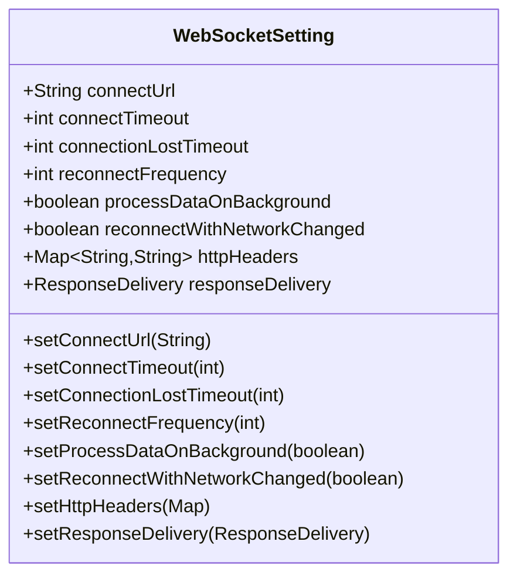
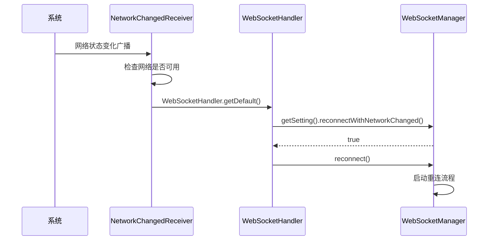
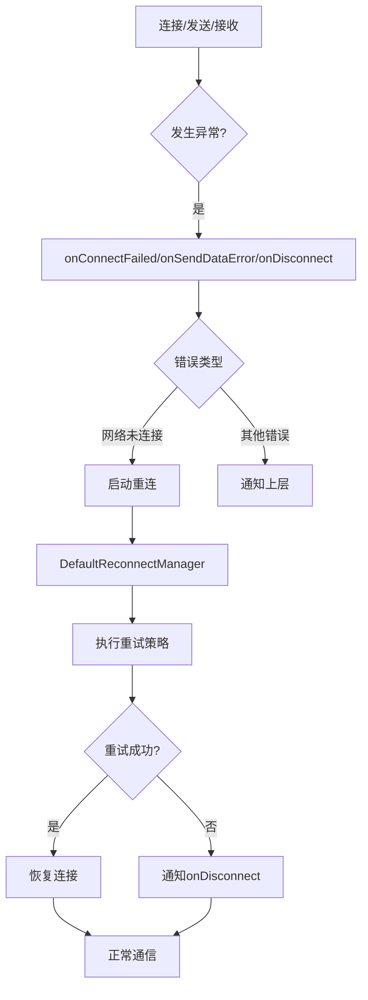

# 连接管理

<cite>
**本文档引用文件**   
- [GXStudioClient.kt](file://GaiaXAndroidClientToStudio/src/main/java/com/alibaba/gaiax/studio/GXStudioClient.kt)
- [WebSocketEngine.java](file://GaiaXAndroidClientToStudio/src/main/java/com/alibaba/gaiax/studio/third/socket/websocket/WebSocketEngine.java)
- [WebSocketSetting.java](file://GaiaXAndroidClientToStudio/src/main/java/com/alibaba/gaiax/studio/third/socket/websocket/WebSocketSetting.java)
- [WebSocketManager.java](file://GaiaXAndroidClientToStudio/src/main/java/com/alibaba/gaiax/studio/third/socket/websocket/WebSocketManager.java)
- [DefaultReconnectManager.java](file://GaiaXAndroidClientToStudio/src/main/java/com/alibaba/gaiax/studio/third/socket/websocket/DefaultReconnectManager.java)
- [GXSocket.kt](file://GaiaXAndroidClientToStudio/src/main/java/com/alibaba/gaiax/studio/GXSocket.kt)
- [WebSocketHandler.java](file://GaiaXAndroidClientToStudio/src/main/java/com/alibaba/gaiax/studio/third/socket/websocket/WebSocketHandler.java)
</cite>

## 目录
1. [简介](#简介)
2. [GXStudioClient初始化与连接管理](#gxstudioclient初始化与连接管理)
3. [WebSocket连接建立流程](#websocket连接建立流程)
4. [连接状态与心跳机制](#连接状态与心跳机制)
5. [WebSocketSetting配置详解](#websocketsetting配置详解)
6. [连接重试策略](#连接重试策略)
7. [网络状态监听与自动重连](#网络状态监听与自动重连)
8. [异常处理与连接中断恢复](#异常处理与连接中断恢复)
9. [安全考虑与资源释放](#安全考虑与资源释放)
10. [性能优化建议](#性能优化建议)

## 简介
GaiaX开发工具通过WebSocket协议实现可视化开发工具的连接管理，为开发者提供实时预览、调试和数据同步功能。本文档详细介绍了GXStudioClient如何初始化和管理与可视化开发工具的连接，重点解析WebSocketEngine的连接建立流程、连接状态管理和心跳机制。通过WebSocketSetting配置连接参数，开发者可以灵活调整连接行为。文档为初学者提供了连接建立的基本配置和使用示例，同时为经验丰富的开发者深入解析了连接重试策略、网络状态监听和异常处理机制。通过实际代码库中的例子，说明了如何处理连接中断、自动重连和连接超时等问题，确保开发工具连接的稳定性和可靠性。

## GXStudioClient初始化与连接管理

GXStudioClient是GaiaX开发工具连接管理的核心类，负责初始化和管理与可视化开发工具的连接。通过`init`方法进行初始化，传入Android上下文环境，创建GXSocket实例用于底层WebSocket通信。`autoConnect`和`manualConnect`方法分别支持自动和手动连接模式，根据传入的参数解析连接地址、模板ID和连接类型。当连接地址发生变化时，`tryToConnectGaiaStudio`方法会先断开现有连接，再尝试建立新连接，确保连接的正确性。`gxSocketListener`监听器处理连接状态变化，包括`onSocketConnected`、`onSocketDisconnected`和`onStudioConnected`等事件，实现连接状态的回调通知。

**Section sources**
- [GXStudioClient.kt](file://GaiaXAndroidClientToStudio/src/main/java/com/alibaba/gaiax/studio/GXStudioClient.kt#L78-L88)
- [GXStudioClient.kt](file://GaiaXAndroidClientToStudio/src/main/java/com/alibaba/gaiax/studio/GXStudioClient.kt#L101-L122)
- [GXStudioClient.kt](file://GaiaXAndroidClientToStudio/src/main/java/com/alibaba/gaiax/studio/GXStudioClient.kt#L176-L193)
- [GXStudioClient.kt](file://GaiaXAndroidClientToStudio/src/main/java/com/alibaba/gaiax/studio/GXStudioClient.kt#L44-L76)

## WebSocket连接建立流程

WebSocket连接建立流程由WebSocketManager和WebSocketWrapper协同完成。WebSocketManager作为管理类，通过`start`方法启动连接，调用WebSocketWrapper的`connect`方法。WebSocketWrapper负责实际的连接操作，创建MyWebSocketClient实例并调用`connect`方法。连接过程中，首先检查连接状态，避免重复连接。然后根据WebSocketSetting配置创建URI、Draft协议和请求头，设置连接超时时间。连接成功后，状态变为"已连接"，触发`onConnected`回调；连接失败则触发`onConnectFailed`回调。整个流程通过WebSocketEngine在独立线程中执行，确保UI线程不被阻塞。



**Diagram sources **
- [WebSocketManager.java](file://GaiaXAndroidClientToStudio/src/main/java/com/alibaba/gaiax/studio/third/socket/websocket/WebSocketManager.java#L73-L84)
- [WebSocketWrapper.java](file://GaiaXAndroidClientToStudio/src/main/java/com/alibaba/gaiax/studio/third/socket/websocket/WebSocketWrapper.java#L59-L109)
- [WebSocketEngine.java](file://GaiaXAndroidClientToStudio/src/main/java/com/alibaba/gaiax/studio/third/socket/websocket/WebSocketEngine.java#L46-L55)
- [GXSocket.kt](file://GaiaXAndroidClientToStudio/src/main/java/com/alibaba/gaiax/studio/GXSocket.kt#L69-L96)

## 连接状态与心跳机制

连接状态管理采用三态模型：0-未连接、1-正在连接、2-已连接。WebSocketWrapper通过`getConnectState`方法返回当前连接状态，WebSocketManager的`isConnect`方法封装了状态检查逻辑。心跳机制通过`setConnectionLostTimeout`方法配置，单位为秒，默认60秒。当连接建立后，WebSocket客户端会定期发送Ping帧，服务器响应Pong帧，维持连接活跃。如果在指定时间内未收到Pong响应，连接将被视为断开。`sendPing`和`sendPong`方法允许主动发送心跳包，`onPing`和`onPong`回调处理接收到的心跳消息。这种机制有效防止了因网络空闲导致的连接中断。



**Diagram sources **
- [WebSocketWrapper.java](file://GaiaXAndroidClientToStudio/src/main/java/com/alibaba/gaiax/studio/third/socket/websocket/WebSocketWrapper.java#L43-L43)
- [WebSocketManager.java](file://GaiaXAndroidClientToStudio/src/main/java/com/alibaba/gaiax/studio/third/socket/websocket/WebSocketManager.java#L89-L91)
- [WebSocketSetting.java](file://GaiaXAndroidClientToStudio/src/main/java/com/alibaba/gaiax/studio/third/socket/websocket/WebSocketSetting.java#L124-L131)

## WebSocketSetting配置详解

WebSocketSetting类提供了丰富的连接参数配置选项。`setConnectUrl`设置WebSocket连接地址，是必填项。`setConnectTimeout`配置连接超时时间，单位毫秒，默认0表示无超时。`setConnectionLostTimeout`设置心跳间隔时间，单位秒，默认60秒。`setReconnectFrequency`定义断开后的重连次数，默认10次。`setProcessDataOnBackground`控制是否在子线程处理数据，默认true。`setHttpHeaders`可设置自定义请求头。`setReconnectWithNetworkChanged`启用网络变化后自动重连功能。`setResponseDelivery`允许自定义消息发射器，实现灵活的消息处理机制。



**Diagram sources **
- [WebSocketSetting.java](file://GaiaXAndroidClientToStudio/src/main/java/com/alibaba/gaiax/studio/third/socket/websocket/WebSocketSetting.java#L24-L64)

## 连接重试策略

连接重试策略由DefaultReconnectManager实现，采用指数退避算法。`startReconnect`方法启动重试，`reconnectFrequency`参数控制最大重试次数。重试过程在独立线程中执行，避免阻塞主线程。每次重试前通过`BLOCK.wait`等待连接结果或超时，超时时间由`connectTimeout`决定。连接成功则立即返回，失败则继续下一次重试。`onConnected`和`onConnectError`回调通知重试结果。`stopReconnect`方法可主动停止重试。重试过程中，`reconnecting`标志位防止重复启动，`needStopReconnect`标志位支持优雅停止。

```mermaid
flowchart TD
Start([开始重试]) --> CheckReconnect["检查reconnecting标志"]
CheckReconnect --> |正在重连| Return["直接返回"]
CheckReconnect --> |未重连| SetFlag["设置reconnecting=true"]
SetFlag --> Loop["for i=1 to reconnectFrequency"]
Loop --> Connect["调用reconnectOnce"]
Connect --> Wait["等待connectTimeout"]
Wait --> CheckResult{"连接成功?"}
CheckResult --> |是| Success["通知onConnected"]
CheckResult --> |否||继续| Loop
Loop --> |重试完成| Failed["通知onDisconnect"]
Success --> End([结束])
Failed --> End
```

**Diagram sources **
- [DefaultReconnectManager.java](file://GaiaXAndroidClientToStudio/src/main/java/com/alibaba/gaiax/studio/third/socket/websocket/DefaultReconnectManager.java#L58-L76)
- [DefaultReconnectManager.java](file://GaiaXAndroidClientToStudio/src/main/java/com/alibaba/gaiax/studio/third/socket/websocket/DefaultReconnectManager.java#L81-L109)
- [WebSocketManager.java](file://GaiaXAndroidClientToStudio/src/main/java/com/alibaba/gaiax/studio/third/socket/websocket/WebSocketManager.java#L289-L302)

## 网络状态监听与自动重连

网络状态监听通过NetworkChangedReceiver实现，注册CONNECTIVITY_ACTION广播接收器。当网络状态变化时，检查是否连接到WiFi或移动网络，若可用则触发重连。`registerNetworkChangedReceiver`方法负责注册广播接收器，需要`ACCESS_NETWORK_STATE`权限。`reconnectWithNetworkChanged`配置项控制是否启用此功能。WebSocketHandler提供`registerNetworkChangedReceiver`静态方法简化注册过程。网络变化监听与连接状态管理协同工作，当检测到网络恢复且`reconnectWithNetworkChanged`为true时，自动调用`reconnect`方法尝试重新连接，实现无缝的网络切换体验。



**Diagram sources **
- [NetworkChangedReceiver.java](file://GaiaXAndroidClientToStudio/src/main/java/com/alibaba/gaiax/studio/third/socket/websocket/NetworkChangedReceiver.java#L26-L45)
- [WebSocketSetting.java](file://GaiaXAndroidClientToStudio/src/main/java/com/alibaba/gaiax/studio/third/socket/websocket/WebSocketSetting.java#L105-L116)
- [WebSocketHandler.java](file://GaiaXAndroidClientToStudio/src/main/java/com/alibaba/gaiax/studio/third/socket/websocket/WebSocketHandler.java#L159-L171)

## 异常处理与连接中断恢复

异常处理机制覆盖连接、发送和接收各个环节。连接失败时，`onConnectFailed`回调通知上层，同时触发重连流程。数据发送失败时，`onSendDataError`回调提供详细的错误信息，包括错误类型和异常原因。当检测到网络未连接时，自动启动重连。连接中断恢复通过`onDisconnect`回调处理，根据`disconnect`标志位判断是主动断开还是意外中断。意外中断时，若未设置`disconnect`标志，则启动重连流程。`destroy`方法彻底销毁连接资源，清除监听器和线程，防止内存泄漏。错误处理与重连机制协同工作，确保连接的稳定性和可靠性。



**Diagram sources **
- [WebSocketManager.java](file://GaiaXAndroidClientToStudio/src/main/java/com/alibaba/gaiax/studio/third/socket/websocket/WebSocketManager.java#L349-L381)
- [WebSocketWrapper.java](file://GaiaXAndroidClientToStudio/src/main/java/com/alibaba/gaiax/studio/third/socket/websocket/WebSocketWrapper.java#L154-L162)
- [WebSocketManager.java](file://GaiaXAndroidClientToStudio/src/main/java/com/alibaba/gaiax/studio/third/socket/websocket/WebSocketManager.java#L260-L283)

## 安全考虑与资源释放

安全考虑主要体现在权限管理和资源释放。网络状态监听需要`ACCESS_NETWORK_STATE`权限，应在AndroidManifest.xml中声明。资源释放通过`destroy`方法实现，彻底清理连接资源。`destroy`方法会停止重连、关闭WebSocket、清除监听器和线程，确保无内存泄漏。`disconnect`方法用于正常断开连接，保留重连能力。`removeWebSocket`静态方法从全局映射中移除指定连接，配合`destroy`使用实现完全清理。建议在Activity/Fragment的onDestroy生命周期中调用`destroy`方法，确保资源及时释放。

**Section sources**
- [WebSocketManager.java](file://GaiaXAndroidClientToStudio/src/main/java/com/alibaba/gaiax/studio/third/socket/websocket/WebSocketManager.java#L260-L283)
- [WebSocketHandler.java](file://GaiaXAndroidClientToStudio/src/main/java/com/alibaba/gaiax/studio/third/socket/websocket/WebSocketHandler.java#L140-L151)
- [GXStudioClient.kt](file://GaiaXAndroidClientToStudio/src/main/java/com/alibaba/gaiax/studio/GXStudioClient.kt#L85-L88)

## 性能优化建议

性能优化建议包括：1) 合理设置`connectTimeout`和`connectionLostTimeout`，避免过短导致频繁重连，过长导致响应延迟；2) 根据网络环境调整`reconnectFrequency`，弱网环境下可增加重试次数；3) 使用`processDataOnBackground`在子线程处理大数据量消息，避免阻塞主线程；4) 及时调用`destroy`方法释放资源，防止内存泄漏；5) 避免频繁创建和销毁WebSocketManager实例，重用现有连接；6) 合理使用`addListener`和`removeListener`，避免监听器泄漏；7) 在后台服务中维持连接时，考虑电池消耗，适时断开空闲连接。这些优化措施可显著提升连接稳定性和应用性能。

**Section sources**
- [WebSocketSetting.java](file://GaiaXAndroidClientToStudio/src/main/java/com/alibaba/gaiax/studio/third/socket/websocket/WebSocketSetting.java#L56-L60)
- [WebSocketSetting.java](file://GaiaXAndroidClientToStudio/src/main/java/com/alibaba/gaiax/studio/third/socket/websocket/WebSocketSetting.java#L170-L180)
- [WebSocketManager.java](file://GaiaXAndroidClientToStudio/src/main/java/com/alibaba/gaiax/studio/third/socket/websocket/WebSocketManager.java#L238-L249)