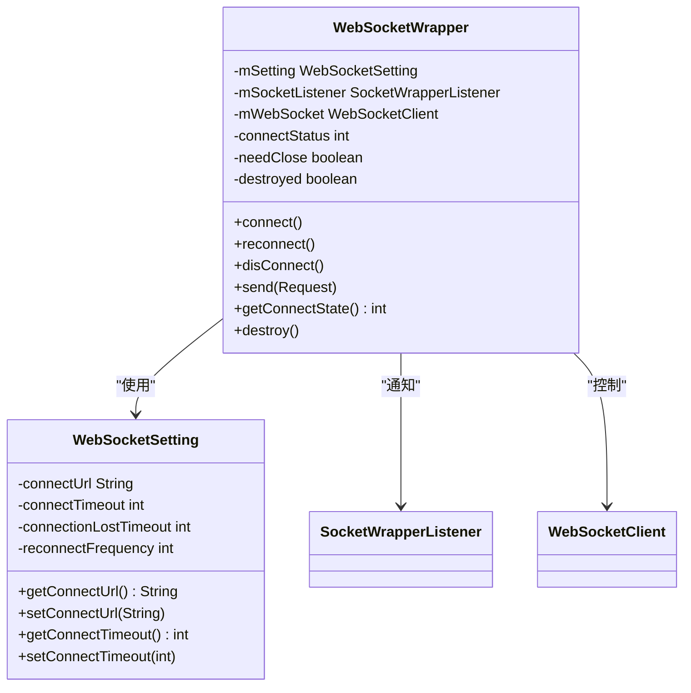
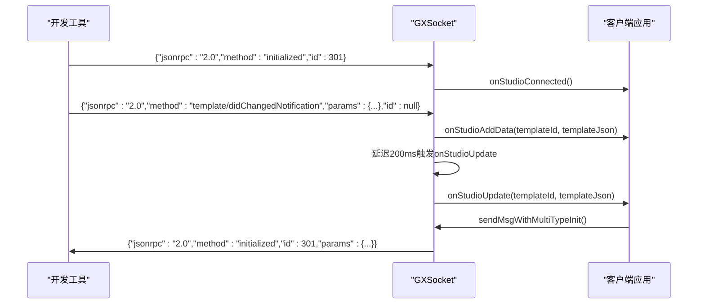
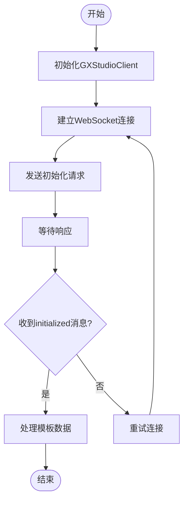

# 通信协议

<cite>
**本文档中引用的文件**  
- [GXSocket.kt](file://GaiaXAndroidClientToStudio/src/main/java/com/alibaba/gaiax/studio/GXSocket.kt)
- [GXSocketKey.kt](file://GaiaXAndroidClientToStudio/src/main/java/com/alibaba/gaiax/studio/GXSocketKey.kt)
- [WebSocketWrapper.java](file://GaiaXAndroidClientToStudio/src/main/java/com/alibaba/gaiax/studio/third/socket/websocket/WebSocketWrapper.java)
- [GaiaXSocketJsonRpcDefine.h](file://GaiaXSocketiOS/GaiaXSocket/GaiaXSocketJsonRpcDefine.h)
- [GaiaXSocketJsonRpcDefine.m](file://GaiaXSocketiOS/GaiaXSocket/GaiaXSocketJsonRpcDefine.m)
- [GXStudioClient.kt](file://GaiaXAndroidClientToStudio/src/main/java/com/alibaba/gaiax/studio/GXStudioClient.kt)
</cite>

## 目录
1. [简介](#简介)
2. [核心组件](#核心组件)
3. [协议常量与消息类型](#协议常量与消息类型)
4. [WebSocket数据帧封装与解析](#websocket数据帧封装与解析)
5. [JSON-RPC协议实现](#json-rpc协议实现)
6. [消息序列化与反序列化](#消息序列化与反序列化)
7. [协议扩展机制](#协议扩展机制)
8. [错误码定义](#错误码定义)
9. [性能优化建议](#性能优化建议)
10. [使用示例](#使用示例)

## 简介
GaiaX开发工具通信协议是连接可视化开发工具与客户端应用的核心机制。该协议基于WebSocket和JSON-RPC标准，实现了实时、双向的通信能力。GXSocket作为协议的主要实现类，负责管理连接状态、处理消息收发，并提供事件回调机制。本协议支持多种通信模式，包括实时预览和手动推送，满足不同开发场景的需求。

## 核心组件

GXSocket是通信协议的核心实现，它封装了WebSocket连接的建立、维护和消息处理逻辑。该类实现了SocketListener接口，能够监听连接状态变化并处理接收到的消息。GXSocket通过GXSocketListener接口向外部暴露连接状态和数据更新事件，使上层应用能够响应通信变化。

GXStudioClient作为客户端入口，负责初始化GXSocket实例并管理连接参数。它提供了多种连接方式，包括自动连接和手动连接，并能根据网络状态变化自动重连。该类还实现了ISocketReceiver接口，用于接收来自开发工具的调用请求。

**本节来源**  
- [GXSocket.kt](file://GaiaXAndroidClientToStudio/src/main/java/com/alibaba/gaiax/studio/GXSocket.kt#L17-L440)
- [GXStudioClient.kt](file://GaiaXAndroidClientToStudio/src/main/java/com/alibaba/gaiax/studio/GXStudioClient.kt#L18-L282)

## 协议常量与消息类型

GXSocketKey类定义了通信协议的核心常量。GAIA_STUDIO_SOCKET_PROTOCOL_NAME常量指定了协议名称为"jsonrpc"，GAIA_STUDIO_SOCKET_PROTOCOL_VERSION常量定义了协议版本为"2.0"。这些常量确保了客户端与开发工具之间的协议一致性。

在iOS实现中，GaiaXSocketJsonRpcDefine.h和GaiaXSocketJsonRpcDefine.m文件定义了JSON-RPC协议的关键字段。这些字段包括jsonrpc、id、method、params、result和error，构成了标准的JSON-RPC消息结构。通过统一的常量定义，确保了跨平台实现的一致性。

**本节来源**  
- [GXSocketKey.kt](file://GaiaXAndroidClientToStudio/src/main/java/com/alibaba/gaiax/studio/GXSocketKey.kt#L8-L12)
- [GaiaXSocketJsonRpcDefine.h](file://GaiaXSocketiOS/GaiaXSocket/GaiaXSocketJsonRpcDefine.h#L1-L31)
- [GaiaXSocketJsonRpcDefine.m](file://GaiaXSocketiOS/GaiaXSocket/GaiaXSocketJsonRpcDefine.m#L1-L30)

## WebSocket数据帧封装与解析

WebSocketWrapper类负责WebSocket连接的底层管理。该类封装了连接建立、数据发送和状态监听等核心功能。connect()方法用于建立WebSocket连接，disConnect()方法用于断开连接，send()方法用于发送数据帧。

WebSocketWrapper通过SocketWrapperListener接口与上层组件通信，实现了事件驱动的编程模型。当接收到消息时，onWSCallbackMessage()方法会被调用，并将消息传递给监听器。该类还实现了连接状态管理，通过connectStatus变量跟踪连接状态（0-未连接，1-正在连接，2-已连接）。

**图表来源**  
- [WebSocketWrapper.java](file://GaiaXAndroidClientToStudio/src/main/java/com/alibaba/gaiax/studio/third/socket/websocket/WebSocketWrapper.java#L29-L379)
- [WebSocketSetting.java](file://GaiaXAndroidClientToStudio/src/main/java/com/alibaba/gaiax/studio/third/socket/websocket/WebSocketSetting.java#L19-L243)

**本节来源**  
- [WebSocketWrapper.java](file://GaiaXAndroidClientToStudio/src/main/java/com/alibaba/gaiax/studio/third/socket/websocket/WebSocketWrapper.java#L29-L379)

## JSON-RPC协议实现

GXSocket实现了JSON-RPC 2.0协议，通过标准的消息格式实现方法调用和响应。每个消息包含jsonrpc、method、id和params/result/error字段。id字段用于匹配请求和响应，确保消息的有序处理。

在onMessage()方法中，GXSocket解析接收到的JSON消息，并根据method字段分发到相应的处理逻辑。例如，"initialized"方法表示开发工具已连接，"template/get"方法用于获取模板数据，"js/callSync"方法用于同步调用JavaScript函数。

**图表来源**  
- [GXSocket.kt](file://GaiaXAndroidClientToStudio/src/main/java/com/alibaba/gaiax/studio/GXSocket.kt#L123-L180)
- [GXSocket.kt](file://GaiaXAndroidClientToStudio/src/main/java/com/alibaba/gaiax/studio/GXSocket.kt#L235-L234)

**本节来源**  
- [GXSocket.kt](file://GaiaXAndroidClientToStudio/src/main/java/com/alibaba/gaiax/studio/GXSocket.kt#L123-L180)

## 消息序列化与反序列化

通信协议使用JSONObject进行消息的序列化和反序列化。在发送消息时，GXSocket构建包含jsonrpc、method、id和params字段的JSONObject，并通过sendMessage()方法发送。接收消息时，onMessage()方法解析JSON字符串为JSONObject，提取关键字段进行处理。

createTemplateData()方法展示了复杂数据结构的解析过程。该方法从模板数据中提取index.json、index.css、index.js等文件内容，并构建成结构化的JSONObject。这种分层解析方式确保了数据的完整性和一致性。

对于响应消息，sendMsgForChangeMode()方法演示了result字段的使用。该方法构建包含preview和js字段的result对象，用于通知开发工具当前的预览模式和JavaScript执行模式。

**本节来源**  
- [GXSocket.kt](file://GaiaXAndroidClientToStudio/src/main/java/com/alibaba/gaiax/studio/GXSocket.kt#L274-L290)
- [GXSocket.kt](file://GaiaXAndroidClientToStudio/src/main/java/com/alibaba/gaiax/studio/GXSocket.kt#L417-L434)

## 协议扩展机制

通信协议设计了灵活的扩展机制，支持新增消息类型和功能。通过在onMessage()方法中添加新的method分支，可以轻松支持新的消息类型。例如，添加"js/console"方法用于接收JavaScript日志，或添加"schema/update"方法用于更新数据模式。

GXStudioClient提供了sendMessage()方法，允许上层应用发送自定义消息。通过构建符合JSON-RPC规范的JSONObject，可以实现与开发工具的双向通信。这种设计模式使得协议能够适应不断变化的开发需求。

**本节来源**  
- [GXSocket.kt](file://GaiaXAndroidClientToStudio/src/main/java/com/alibaba/gaiax/studio/GXSocket.kt#L134-L180)
- [GXStudioClient.kt](file://GaiaXAndroidClientToStudio/src/main/java/com/alibaba/gaiax/studio/GXStudioClient.kt#L212-L214)

## 错误码定义

ErrorResponse类定义了通信协议的错误处理机制。该类包含三种预定义错误码：ERROR_NO_CONNECT（0，未连接）、ERROR_UNKNOWN（1，未知错误）和ERROR_UN_INIT（2，未初始化）。这些错误码帮助客户端识别和处理通信异常。

当发送数据失败时，onSendDataError()回调会被触发，传递ErrorResponse对象。客户端可以根据错误码采取相应的恢复措施，如重新连接或显示错误提示。这种结构化的错误处理机制提高了系统的健壮性。

**本节来源**  
- [ErrorResponse.java](file://GaiaXAndroidClientToStudio/src/main/java/com/alibaba/gaiax/studio/third/socket/websocket/response/ErrorResponse.java#L13-L26)
- [GXSocket.kt](file://GaiaXAndroidClientToStudio/src/main/java/com/alibaba/gaiax/studio/GXSocket.kt#L121-L122)

## 性能优化建议

为确保通信协议的高效性，建议采取以下优化措施：合理设置连接超时时间（connectTimeout）和心跳间隔（connectionLostTimeout），避免频繁重连；使用reconnectFrequency控制重连次数，防止无限重连；通过processDataOnBackground配置是否在后台线程处理数据，平衡性能和响应速度。

在消息处理方面，建议对频繁发送的消息进行合并或节流。例如，GXSocket在处理模板更新时，使用200ms的延迟来合并连续的更新请求，避免UI频繁刷新。这种优化策略显著提升了用户体验。

**本节来源**  
- [WebSocketSetting.java](file://GaiaXAndroidClientToStudio/src/main/java/com/alibaba/gaiax/studio/third/socket/websocket/WebSocketSetting.java#L56-L60)
- [GXSocket.kt](file://GaiaXAndroidClientToStudio/src/main/java/com/alibaba/gaiax/studio/GXSocket.kt#L313-L315)

## 使用示例

初始化通信协议的典型流程如下：首先调用GXStudioClient.init()方法初始化客户端，然后通过autoConnect()或manualConnect()方法建立连接。连接成功后，开发工具会发送"initialized"消息，触发onStudioConnected()回调。

获取模板数据的示例：调用sendMsgWithMultiTypeInit()发送初始化请求，开发工具响应后会推送模板数据，通过onStudioAddData()和onStudioUpdate()回调通知客户端。对于子模板，协议会自动递归获取所有依赖模板，确保数据完整性。

**图表来源**  
- [GXStudioClient.kt](file://GaiaXAndroidClientToStudio/src/main/java/com/alibaba/gaiax/studio/GXStudioClient.kt#L79-L84)
- [GXSocket.kt](file://GaiaXAndroidClientToStudio/src/main/java/com/alibaba/gaiax/studio/GXSocket.kt#L220-L234)

**本节来源**  
- [GXStudioClient.kt](file://GaiaXAndroidClientToStudio/src/main/java/com/alibaba/gaiax/studio/GXStudioClient.kt#L79-L84)
- [GXSocket.kt](file://GaiaXAndroidClientToStudio/src/main/java/com/alibaba/gaiax/studio/GXSocket.kt#L220-L234)