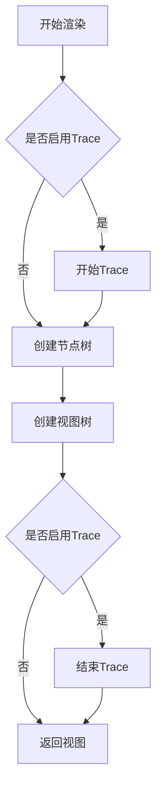
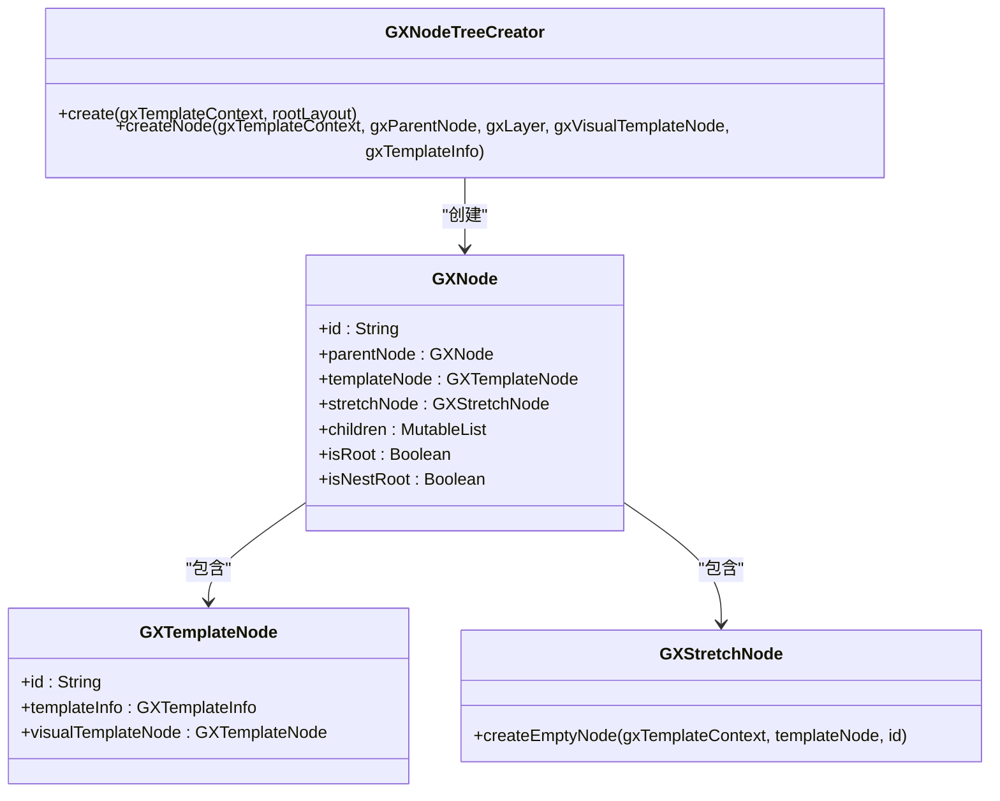
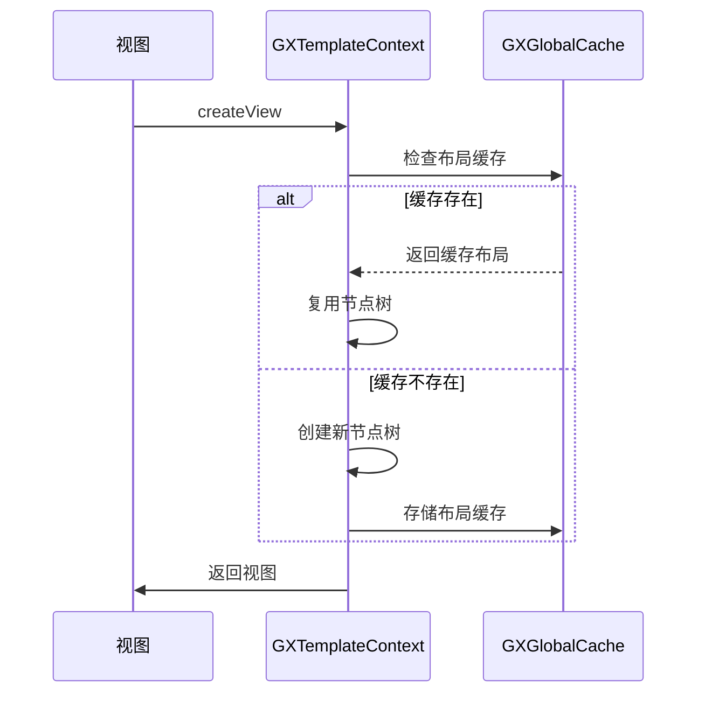

# 性能优化

<cite>
**本文档中引用的文件**  
- [GXTemplateEngine.kt](file://GaiaXAndroid/src/main/kotlin/com/alibaba/gaiax/GXTemplateEngine.kt)
- [Utils.kt](file://GaiaXAndroidClientToStudio/src/main/java/com/alibaba/gaiax/studio/Utils.kt)
- [GXRenderImpl.kt](file://GaiaXAndroid/src/main/kotlin/com/alibaba/gaiax/render/GXRenderImpl.kt)
- [GXPropUtils.kt](file://GaiaXAndroid/src/main/kotlin/com/alibaba/gaiax/utils/GXPropUtils.kt)
- [GXTemplateContext.kt](file://GaiaXAndroid/src/main/kotlin/com/alibaba/gaiax/context/GXTemplateContext.kt)
- [GXNodeTreeCreator.kt](file://GaiaXAndroid/src/main/kotlin/com/alibaba/gaiax/render/node/GXNodeTreeCreator.kt)
</cite>

## 目录
1. [引言](#引言)
2. [性能监控与分析工具](#性能监控与分析工具)
3. [GXTemplateEngine关键配置参数](#gxtemplateengine关键配置参数)
4. [初学者性能优化技巧](#初学者性能优化技巧)
5. [高级渲染优化技术](#高级渲染优化技术)
6. [实际优化案例分析](#实际优化案例分析)
7. [不同场景下的优化策略](#不同场景下的优化策略)
8. [结论](#结论)

## 引言

GaiaX作为阿里巴巴优酷技术团队研发的轻量级纯原生动态化卡片跨端解决方案，其性能优化是确保用户体验流畅的关键。本文档旨在深入解析GaiaX的性能优化机制，重点介绍如何基于性能监控数据进行系统性优化。通过分析Utils工具类提供的性能分析辅助方法，以及GXTemplateEngine中影响性能的关键配置参数，为不同层次的开发者提供全面的性能优化指导。

## 性能监控与分析工具

### Utils工具类性能分析方法

GaiaX提供了专门的工具类用于性能监控和分析。在`GaiaXAndroidClientToStudio`模块中，`Utils.kt`文件包含了用于本地存储和读取连接信息的方法，这些方法虽然主要用于开发调试，但其设计体现了性能监控的基本原则。

```kotlin
fun saveInLocal(context: Context, key: String, value: String) {
    val editor = context.getSharedPreferences(GX_SP_NAME, Context.MODE_PRIVATE).edit()
    editor.putString(key, value)
    editor.apply()
}

fun loadInLocal(context: Context, key: String): String? {
    val getter = context.getSharedPreferences(GX_SP_NAME, Context.MODE_PRIVATE)
    return getter.getString(key, "")
}
```

这些方法通过SharedPreferences实现了轻量级的数据持久化，避免了频繁的文件I/O操作，体现了性能优化中"减少不必要的系统调用"的原则。

### 性能监控配置

GaiaX通过`GXPropUtils`类提供了性能监控的开关配置。开发者可以通过系统属性来启用或禁用性能追踪功能，这对于生产环境和开发环境的性能监控具有重要意义。

```kotlin
object GXPropUtils {
    private var isTrace: Boolean? = null

    fun isTrace(): Boolean {
        if (isTrace == null) {
            isTrace = "1" == SystemProp["debug.com.alibaba.gaiax.trace", "0"]
        }
        return isTrace ?: false
    }

    private var isShowNodeLog: Boolean? = null

    fun isShowNodeLog(): Boolean {
        if (isShowNodeLog == null) {
            isShowNodeLog = "1" == SystemProp["debug.com.alibaba.gaiax.log.show_node_log", "0"]
        }
        return isShowNodeLog ?: false
    }
}
```

通过`adb shell setprop debug.com.alibaba.gaiax.trace 1`命令可以启用性能追踪，这使得开发者能够在不修改代码的情况下动态开启性能监控，大大提高了调试效率。

**Section sources**
- [Utils.kt](file://GaiaXAndroidClientToStudio/src/main/java/com/alibaba/gaiax/studio/Utils.kt#L1-L20)
- [GXPropUtils.kt](file://GaiaXAndroid/src/main/kotlin/com/alibaba/gaiax/utils/GXPropUtils.kt#L1-L44)

## GXTemplateEngine关键配置参数

### 模板引擎核心配置

`GXTemplateEngine`是GaiaX的核心组件，其配置参数直接影响模板的渲染性能。通过分析`GXTemplateEngine.kt`文件，我们可以识别出几个关键的性能相关配置。

#### GXMeasureSize配置

`GXMeasureSize`是一个限制性概念，它规定了GaiaX模板内容的最大显示区域。合理的`GXMeasureSize`配置可以避免不必要的布局计算和视图绘制。

```kotlin
data class GXMeasureSize(var width: Float?, var height: Float?) {
    override fun toString(): String {
        return "GXMeasureSize(width=$width, height=$height)"
    }
}
```

`GXMeasureSize`有三种使用情况：
1. 固定宽度和高度：如果模板内容超出尺寸，超出部分不会显示。
2. 固定宽度，不确定高度：模板高度可以自我撑开，最终视图高度为FlexBox计算后的高度。
3. 不确定宽度，固定高度：模板宽度可以自我撑开，最终视图宽度为FlexBox计算后的宽度。

#### 缓存机制配置

GaiaX通过`GXGlobalCache`实现了多层次的缓存机制，包括布局缓存、模板信息缓存等。这些缓存机制可以显著减少重复的计算和I/O操作。

```kotlin
fun clean() {
    GXGlobalCache.instance.clean()
    GXTemplateInfoSource.instance.clean()
}
```

`clean()`方法用于清除所有缓存，这在模板数据发生重大变化时非常有用，可以确保缓存的一致性。

### 渲染流程配置

`GXTemplateEngine`的渲染流程分为多个阶段，每个阶段都有相应的配置选项。

#### prepareView配置

`prepareView`方法用于预处理模板视图，它会检查缓存是否存在，如果存在则直接返回，避免重复计算。

```kotlin
fun prepareView(
    gxTemplateItem: GXTemplateItem,
    gxMeasureSize: GXMeasureSize,
    gxVisualTemplateNode: GXTemplateNode? = null
) {
    Log.runE(TAG) { "prepareView" }
    try {
        if (GXGlobalCache.instance.isExistForPrepareView(gxMeasureSize, gxTemplateItem)) {
            return
        }
        if (GXPropUtils.isTrace()) {
            Trace.beginSection("GX prepareView")
        }
        val templateInfo = data.getTemplateInfo(gxTemplateItem)
        val gxTemplateContext = GXTemplateContext.createContext(
            gxTemplateItem, gxMeasureSize, templateInfo, gxVisualTemplateNode
        )
        render.prepareView(gxTemplateContext)
        if (GXPropUtils.isTrace()) {
            Trace.endSection()
        }
    } catch (e: Exception) {
        if (GXExceptionHelper.isException()) {
            GXExceptionHelper.exception(e)
        } else {
            throw e
        }
    }
}
```

#### createView配置

`createView`方法是创建模板视图的核心方法，它分为两个阶段：`createViewOnlyNodeTree`和`createViewOnlyViewTree`。这种分离的设计使得节点树的创建和视图树的创建可以独立进行，提高了灵活性和性能。

```kotlin
fun createView(
    gxTemplateItem: GXTemplateItem,
    gxMeasureSize: GXMeasureSize,
    gxExtendParams: GXExtendParams? = null
): View? {
    Log.runE(TAG) { "createView" }
    return try {
        prepareView(gxTemplateItem, gxMeasureSize)

        val gxTemplateContext = createViewOnlyNodeTree(
            gxTemplateItem, gxMeasureSize, gxExtendParams
        )
        if (gxTemplateContext != null) {
            createViewOnlyViewTree(gxTemplateContext)
        } else {
            null
        }
    } catch (e: Exception) {
        if (GXExceptionHelper.isException()) {
            GXExceptionHelper.exception(e)
            null
        } else {
            throw e
        }
    }
}
```

**Section sources**
- [GXTemplateEngine.kt](file://GaiaXAndroid/src/main/kotlin/com/alibaba/gaiax/GXTemplateEngine.kt#L369-L373)
- [GXTemplateEngine.kt](file://GaiaXAndroid/src/main/kotlin/com/alibaba/gaiax/GXTemplateEngine.kt#L916-L919)
- [GXTemplateEngine.kt](file://GaiaXAndroid/src/main/kotlin/com/alibaba/gaiax/GXTemplateEngine.kt#L512-L540)
- [GXTemplateEngine.kt](file://GaiaXAndroid/src/main/kotlin/com/alibaba/gaiax/GXTemplateEngine.kt#L557-L582)

## 初学者性能优化技巧

### 减少模板复杂度

模板复杂度是影响渲染性能的关键因素。复杂的模板会导致更多的节点创建、更复杂的布局计算和更多的视图绘制操作。

#### 简化布局层级

过多的嵌套布局会增加布局计算的复杂度。建议遵循以下原则：
- 尽量使用扁平化的布局结构
- 避免不必要的ViewGroup嵌套
- 使用ConstraintLayout等高效的布局管理器

#### 优化CSS样式

CSS样式的复杂度也会影响渲染性能。建议：
- 避免使用过于复杂的CSS选择器
- 减少不必要的样式属性
- 使用预定义的样式类而不是内联样式

### 优化数据绑定频率

数据绑定是模板渲染中的重要环节，频繁的数据绑定会导致性能下降。

#### 合理使用GXTemplateData

`GXTemplateData`类用于封装模板数据，通过合理使用其属性可以优化数据绑定性能。

```kotlin
data class GXTemplateData(
    var data: JSONObject
) {
    var tag: Any? = null
    var scrollIndex: Int = -1
    var dataListener: GXIDataListener? = null
    var eventListener: GXIEventListener? = null
    var trackListener: GXITrackListener? = null
}
```

- `dataListener`：用于监听数据处理事件，可以在此处进行数据预处理，减少绑定时的计算量。
- `eventListener`：用于监听手势事件，合理使用可以避免不必要的事件监听器注册。
- `trackListener`：用于监听埋点事件，可以在此处进行事件聚合，减少网络请求次数。

### 合理使用缓存策略

缓存是提高性能的重要手段，GaiaX提供了多层次的缓存机制。

#### 启用布局缓存

通过`GXGlobalCache`可以启用布局缓存，避免重复的布局计算。

```kotlin
if (GXGlobalCache.instance.isExistForPrepareView(gxMeasureSize, gxTemplateItem)) {
    return
}
```

#### 合理设置缓存键

`GXTemplateItem`的`key`方法用于生成缓存键，合理的缓存键设计可以提高缓存命中率。

```kotlin
fun key(size: GXMeasureSize): String {
    return "${bizId}-${templateId}-${size.width}"
}
```

通过将尺寸信息加入缓存键，可以避免布局变化时错误使用缓存导致的计算错误。

**Section sources**
- [GXTemplateEngine.kt](file://GaiaXAndroid/src/main/kotlin/com/alibaba/gaiax/GXTemplateEngine.kt#L385-L413)
- [GXTemplateEngine.kt](file://GaiaXAndroid/src/main/kotlin/com/alibaba/gaiax/GXTemplateEngine.kt#L482-L484)

## 高级渲染优化技术

### 视图复用机制

视图复用是提高列表滚动性能的关键技术。GaiaX通过`GXTemplateContext`中的`scrollNodeCache`实现了视图复用。

```kotlin
val scrollNodeCache: MutableMap<String, GXNode>? by lazy {
    mutableMapOf()
}
```

当在滚动容器中使用模板时，可以通过`gxExtendParams`传递`gxHostTemplateContext`，实现节点的复用。

```kotlin
private fun internalCreateViewOnlyNodeTree(
    gxTemplateItem: GXTemplateItem,
    gxMeasureSize: GXMeasureSize,
    gxExtendParams: GXExtendParams?
): GXTemplateContext {
    val gxTemplateInfo = data.getTemplateInfo(gxTemplateItem)

    val gxTemplateContext = GXTemplateContext.createContext(gxTemplateItem, gxMeasureSize, gxTemplateInfo, gxExtendParams?.gxVisualTemplateNode)

    val gxHostTemplateContext = gxExtendParams?.gxHostTemplateContext
    if (gxHostTemplateContext != null) {
        val itemCacheKey = "${gxExtendParams.gxItemPosition}-${gxExtendParams.gxItemData.hashCode()}"
        if (gxHostTemplateContext.scrollNodeCache?.containsKey(itemCacheKey) == true) {
            gxTemplateContext.rootNode = gxHostTemplateContext.scrollNodeCache?.remove(itemCacheKey)
            gxTemplateContext.isReuseRootNode = true
            return gxTemplateContext
        }
    }

    render.createViewOnlyNodeTree(gxTemplateContext)
    return gxTemplateContext
}
```

### 懒加载策略

懒加载可以显著减少初始渲染时的资源消耗。GaiaX通过`prepareView`和`createView`的分离实现了懒加载。

#### 分阶段渲染

- `prepareView`阶段：只进行必要的数据准备和布局计算，不创建实际的视图。
- `createView`阶段：在需要显示时才创建实际的视图。

这种分阶段的渲染策略可以有效减少内存占用和CPU消耗。

### GPU渲染优化

GPU渲染优化是提高复杂动画和过渡效果性能的关键。

#### 启用硬件加速

通过`Trace.beginSection`和`Trace.endSection`可以标记性能关键区域，帮助开发者识别GPU渲染瓶颈。

```kotlin
if (GXPropUtils.isTrace()) {
    Trace.beginSection("GX createViewOnlyNodeTree")
}
// ... 性能关键代码
if (GXPropUtils.isTrace()) {
    Trace.endSection()
}
```

#### 减少过度绘制

过度绘制会导致GPU资源浪费。建议：
- 使用简单的背景色而不是复杂的渐变
- 避免不必要的透明度设置
- 合理使用`clipPath`等裁剪操作

### 内存管理最佳实践

内存管理是保证应用稳定运行的基础。

#### 及时释放资源

`GXTemplateContext`提供了`release`方法用于释放资源。

```kotlin
fun release() {
    flags = 0
    sliderItemLayoutCache?.clear()
    scrollItemLayoutCache?.clear()
    containers?.clear()
    isDirty = false
    dirtyTexts?.clear()
    dirtyTexts = null
    templateData = null
    rootView = null
    visualTemplateNode = null
    rootNode?.release()
    rootNode = null
    isReuseRootNode = false
}
```

#### 避免内存泄漏

通过`destroyView`方法可以确保视图被正确销毁。

```kotlin
fun destroyView(targetView: View?) {
    GXTemplateContext.getContext(targetView)?.release()
    GXTemplateContext.setContext(null)
}
```

**Section sources**
- [GXTemplateContext.kt](file://GaiaXAndroid/src/main/kotlin/com/alibaba/gaiax/context/GXTemplateContext.kt#L127-L129)
- [GXTemplateEngine.kt](file://GaiaXAndroid/src/main/kotlin/com/alibaba/gaiax/GXTemplateEngine.kt#L681-L702)
- [GXTemplateContext.kt](file://GaiaXAndroid/src/main/kotlin/com/alibaba/gaiax/context/GXTemplateContext.kt#L158-L172)
- [GXTemplateEngine.kt](file://GaiaXAndroid/src/main/kotlin/com/alibaba/gaiax/GXTemplateEngine.kt#L626-L629)

## 实际优化案例分析

### 减少过度绘制案例

在实际项目中，过度绘制是常见的性能问题。通过分析`GXRenderImpl`的渲染流程，我们可以找到优化点。



**Diagram sources**
- [GXRenderImpl.kt](file://GaiaXAndroid/src/main/kotlin/com/alibaba/gaiax/render/GXRenderImpl.kt#L62-L75)

通过这个流程图可以看出，Trace的启用与否会影响渲染性能。在生产环境中应该关闭Trace以减少性能开销。

### 优化布局层级案例

复杂的布局层级会导致布局计算时间增加。通过`GXNodeTreeCreator`的节点创建流程，我们可以优化布局结构。



**Diagram sources**
- [GXNodeTreeCreator.kt](file://GaiaXAndroid/src/main/kotlin/com/alibaba/gaiax/render/node/GXNodeTreeCreator.kt#L29-L42)
- [GXNodeTreeCreator.kt](file://GaiaXAndroid/src/main/kotlin/com/alibaba/gaiax/render/node/GXNodeTreeCreator.kt#L53-L135)

通过这个类图可以看出，节点树的创建是一个递归过程。优化建议：
- 减少不必要的节点嵌套
- 合并功能相似的节点
- 使用虚拟节点减少实际视图的创建

### 合理管理资源案例

资源管理不当会导致内存占用过高。通过`GXTemplateContext`的资源管理机制，我们可以实现高效的资源管理。



**Diagram sources**
- [GXTemplateEngine.kt](file://GaiaXAndroid/src/main/kotlin/com/alibaba/gaiax/GXTemplateEngine.kt#L558-L582)
- [GXRenderImpl.kt](file://GaiaXAndroid/src/main/kotlin/com/alibaba/gaiax/render/GXRenderImpl.kt#L42-L49)

通过这个序列图可以看出，GaiaX通过缓存机制实现了资源的高效管理。优化建议：
- 合理设置缓存大小
- 及时清理过期缓存
- 避免缓存雪崩

**Section sources**
- [GXRenderImpl.kt](file://GaiaXAndroid/src/main/kotlin/com/alibaba/gaiax/render/GXRenderImpl.kt#L42-L75)
- [GXNodeTreeCreator.kt](file://GaiaXAndroid/src/main/kotlin/com/alibaba/gaiax/render/node/GXNodeTreeCreator.kt#L31-L42)
- [GXTemplateContext.kt](file://GaiaXAndroid/src/main/kotlin/com/alibaba/gaiax/context/GXTemplateContext.kt#L115-L129)

## 不同场景下的优化策略

### 静态内容场景

对于静态内容，主要优化策略是最大化缓存利用率。

#### 预加载策略

- 在应用启动时预加载常用模板
- 使用`prepareView`提前计算布局
- 将常用模板保留在内存中

#### 长期缓存

- 使用持久化存储保存模板数据
- 设置较长的缓存过期时间
- 定期检查缓存有效性

### 动态内容场景

对于动态内容，主要优化策略是减少实时计算量。

#### 数据预处理

- 在后台线程进行数据处理
- 使用`dataListener`进行数据预处理
- 缓存处理后的数据

#### 增量更新

- 只更新变化的部分数据
- 使用`bindDataOnlyNodeTree`和`bindDataOnlyViewTree`分别更新
- 避免全量重新绑定

### 列表滚动场景

列表滚动是性能要求最高的场景之一。

#### 视图池复用

- 使用`scrollNodeCache`实现节点复用
- 合理设置视图池大小
- 预创建常用视图类型

#### 懒加载

- 只加载可视区域内的内容
- 预加载临近区域的内容
- 使用占位符减少布局跳动

### 动画交互场景

动画交互需要保证高帧率。

#### GPU加速

- 启用硬件加速
- 使用简单的动画效果
- 避免复杂的路径动画

#### 事件优化

- 合并连续的事件
- 使用节流和防抖
- 减少事件监听器数量

## 结论

GaiaX的性能优化是一个系统工程，需要从多个层面进行综合考虑。对于初学者，建议从减少模板复杂度、优化数据绑定频率和合理使用缓存策略入手。对于经验丰富的开发者，则需要深入理解渲染优化技术，包括视图复用机制、懒加载策略、GPU渲染优化和内存管理最佳实践。

通过实际代码库的优化案例可以看出，减少过度绘制、优化布局层级和合理管理资源是提升渲染性能的有效方法。在不同场景下，需要选择合适的优化策略，如静态内容场景的预加载策略、动态内容场景的增量更新、列表滚动场景的视图池复用和动画交互场景的GPU加速。

最终，性能优化的目标是在保证原生体验与性能的同时，帮助客户端开发实现低代码。通过系统性的性能监控和优化，可以显著提升用户体验，降低开发和维护成本。