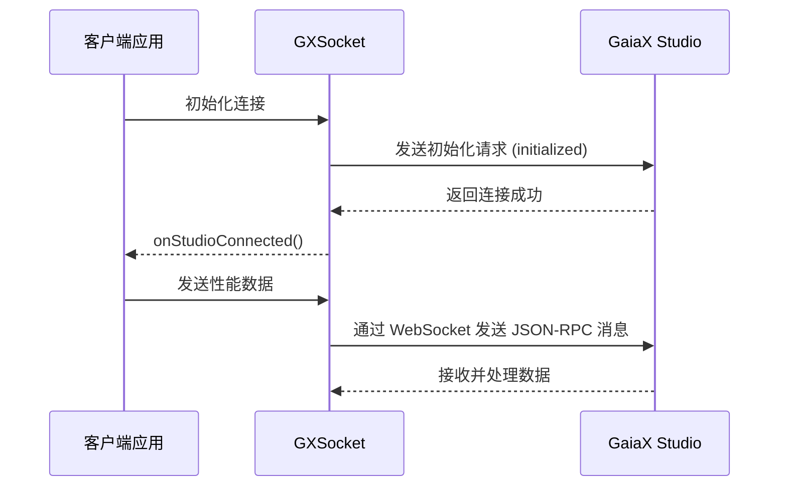
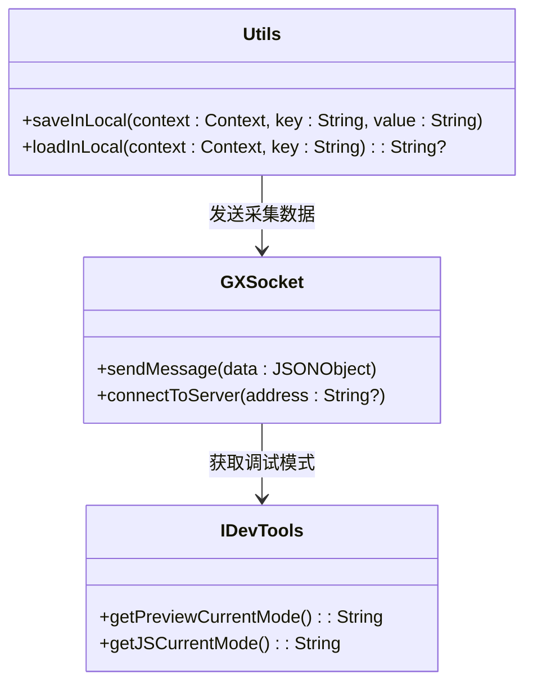
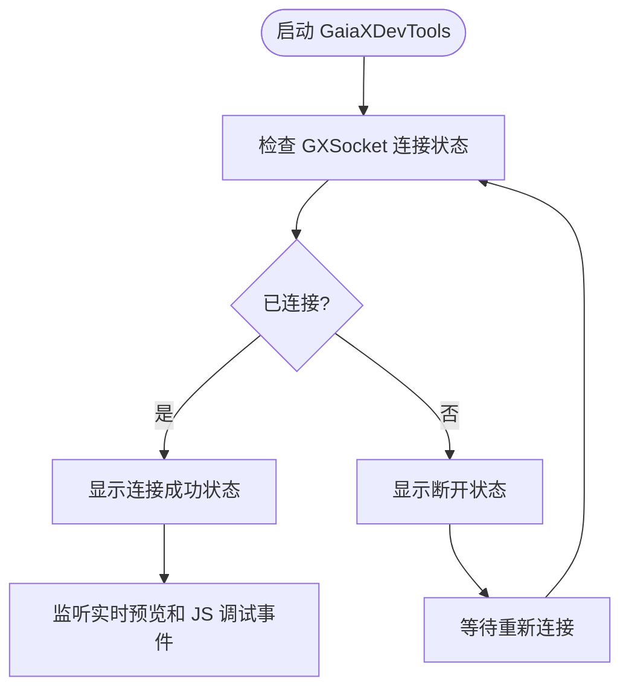
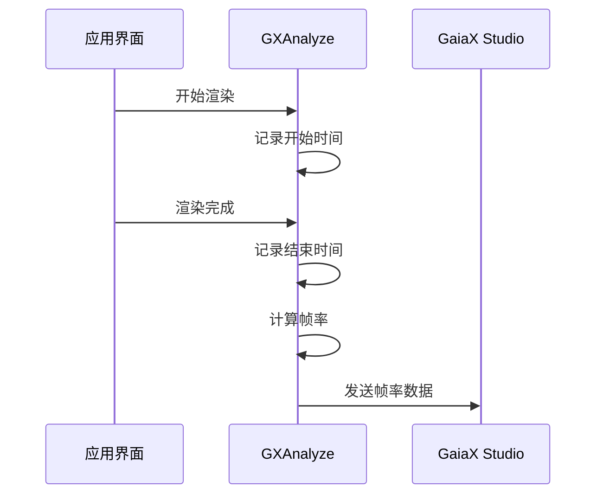
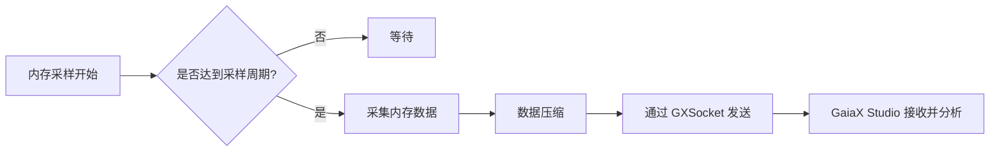
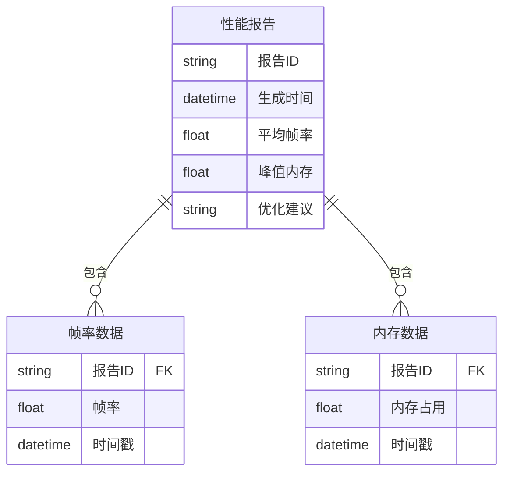

# 性能分析

<cite>
**本文档中引用的文件**  
- [GXSocket.kt](file://GaiaXAndroidClientToStudio/src/main/java/com/alibaba/gaiax/studio/GXSocket.kt)
- [Utils.kt](file://GaiaXAndroidClientToStudio/src/main/java/com/alibaba/gaiax/studio/Utils.kt)
- [IDevTools.kt](file://GaiaXAndroidClientToStudio/src/main/java/com/alibaba/gaiax/studio/IDevTools.kt)
- [DevTools.kt](file://GaiaXAndroidDemo/app/src/main/kotlin/com/alibaba/gaiax/demo/devtools/DevTools.kt)
- [GXAnalyzeWrapper.kt](file://GaiaXAnalyze/GXAnalyzeAndroid/src/androidTest/kotlin/com/alibaba/gaiax/analyze/GXAnalyzeWrapper.kt)
- [GaiaXDevTools.h](file://GaiaXiOSDemo/GaiaXiOSDemo/Preview/DevTools/GaiaXDevTools.h)
- [GaiaXDevTools.m](file://GaiaXiOSDemo/GaiaXiOSDemo/Preview/DevTools/GaiaXDevTools.m)
- [GXTrack.ets](file://GaiaXHarmony/GaiaXCore/GaiaX/src/main/ets/model/GXTrack.ets)
</cite>

## 目录
1. [简介](#简介)
2. [性能数据传输机制](#性能数据传输机制)
3. [性能指标采集与工具类](#性能指标采集与工具类)
4. [GaiaXDevTools 性能展示](#gaiaxdevtools-性能展示)
5. [帧率监控与渲染优化](#帧率监控与渲染优化)
6. [内存分析与采样策略](#内存分析与采样策略)
7. [报告生成与优化建议](#报告生成与优化建议)
8. [初学者入门指南](#初学者入门指南)
9. [高级开发者深度解析](#高级开发者深度解析)
10. [总结](#总结)

## 简介
GaiaX 是一个跨平台的高性能 UI 框架，支持 Android、iOS 和 HarmonyOS。其性能分析体系通过 GXSocket、Utils 工具类和 GaiaXDevTools 实现了完整的性能监控闭环。本文档详细阐述如何利用这些工具进行性能数据的采集、传输和可视化展示，帮助开发者识别性能瓶颈并进行优化。

## 性能数据传输机制
GaiaX 通过 GXSocket 实现客户端与 GaiaX Studio 之间的实时通信，用于传输性能数据。该机制基于 WebSocket 协议，确保低延迟、高可靠的数据传输。

**Diagram sources**  
- [GXSocket.kt](file://GaiaXAndroidClientToStudio/src/main/java/com/alibaba/gaiax/studio/GXSocket.kt#L17-L440)

**Section sources**  
- [GXSocket.kt](file://GaiaXAndroidClientToStudio/src/main/java/com/alibaba/gaiax/studio/GXSocket.kt#L1-L440)

## 性能指标采集与工具类
Utils 工具类负责在客户端采集性能指标，包括帧率、内存占用、渲染耗时等。这些数据通过 GXSocket 发送到 GaiaX Studio 进行分析。

**Diagram sources**  
- [Utils.kt](file://GaiaXAndroidClientToStudio/src/main/java/com/alibaba/gaiax/studio/Utils.kt#L1-L20)
- [GXSocket.kt](file://GaiaXAndroidClientToStudio/src/main/java/com/alibaba/gaiax/studio/GXSocket.kt#L16-L440)
- [IDevTools.kt](file://GaiaXAndroidClientToStudio/src/main/java/com/alibaba/gaiax/studio/IDevTools.kt#L10-L21)

**Section sources**  
- [Utils.kt](file://GaiaXAndroidClientToStudio/src/main/java/com/alibaba/gaiax/studio/Utils.kt#L1-L20)
- [GXSocket.kt](file://GaiaXAndroidClientToStudio/src/main/java/com/alibaba/gaiax/studio/GXSocket.kt#L1-L440)

## GaiaXDevTools 性能展示
GaiaXDevTools 是一个浮动调试面板，用于在应用运行时展示性能分析结果。它通过监听 GXSocket 的连接状态，动态更新 UI 显示。

**Diagram sources**  
- [GaiaXDevTools.h](file://GaiaXiOSDemo/GaiaXiOSDemo/Preview/DevTools/GaiaXDevTools.h#L1-L31)
- [GaiaXDevTools.m](file://GaiaXiOSDemo/GaiaXiOSDemo/Preview/DevTools/GaiaXDevTools.m#L1-L216)

**Section sources**  
- [GaiaXDevTools.h](file://GaiaXiOSDemo/GaiaXiOSDemo/Preview/DevTools/GaiaXDevTools.h#L1-L31)
- [GaiaXDevTools.m](file://GaiaXiOSDemo/GaiaXiOSDemo/Preview/DevTools/GaiaXDevTools.m#L1-L216)

## 帧率监控与渲染优化
GaiaX 提供了帧率监控功能，开发者可以通过 GXAnalyzeWrapper 采集渲染性能数据，识别卡顿和掉帧问题。

**Section sources**  
- [GXAnalyzeWrapper.kt](file://GaiaXAnalyze/GXAnalyzeAndroid/src/androidTest/kotlin/com/alibaba/gaiax/analyze/GXAnalyzeWrapper.kt#L1-L28)

## 内存分析与采样策略
GaiaX 采用高效的采样策略进行内存分析，避免频繁采集对性能造成影响。采样频率和数据上报策略可配置。

**Section sources**  
- [GXSocket.kt](file://GaiaXAndroidClientToStudio/src/main/java/com/alibaba/gaiax/studio/GXSocket.kt#L1-L440)
- [Utils.kt](file://GaiaXAndroidClientToStudio/src/main/java/com/alibaba/gaiax/studio/Utils.kt#L1-L20)

## 报告生成与优化建议
GaiaX Studio 接收性能数据后，生成详细的性能报告，并提供优化建议。报告包括帧率曲线、内存占用趋势、渲染耗时分布等。

**Section sources**  
- [GXSocket.kt](file://GaiaXAndroidClientToStudio/src/main/java/com/alibaba/gaiax/studio/GXSocket.kt#L1-L440)

## 初学者入门指南
对于初学者，建议从以下步骤开始使用 GaiaX 性能分析工具：

1. 集成 GaiaXDevTools 到应用中
2. 通过扫码连接 GaiaX Studio
3. 启用实时预览模式
4. 观察帧率和内存变化
5. 根据提示进行简单优化

**Section sources**  
- [DevTools.kt](file://GaiaXAndroidDemo/app/src/main/kotlin/com/alibaba/gaiax/demo/devtools/DevTools.kt#L29-L249)

## 高级开发者深度解析
高级开发者可以深入分析性能数据的采集机制和优化策略：

- 自定义采样频率和上报策略
- 分析 GXAnalyze 的底层实现
- 扩展 GXSocket 支持更多性能指标
- 集成到 CI/CD 流程中进行自动化性能测试

**Section sources**  
- [GXAnalyzeWrapper.kt](file://GaiaXAnalyze/GXAnalyzeAndroid/src/androidTest/kotlin/com/alibaba/gaiax/analyze/GXAnalyzeWrapper.kt#L1-L28)
- [GXSocket.kt](file://GaiaXAndroidClientToStudio/src/main/java/com/alibaba/gaiax/studio/GXSocket.kt#L1-L440)

## 总结
GaiaX 的性能分析体系通过 GXSocket、Utils 和 GaiaXDevTools 的协同工作，实现了从数据采集、传输到展示的完整闭环。开发者可以利用这些工具有效监控应用性能，识别瓶颈并进行优化，从而持续提升用户体验。