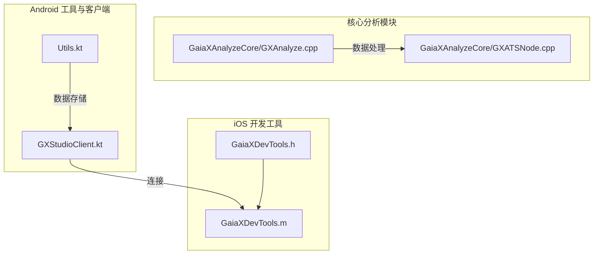
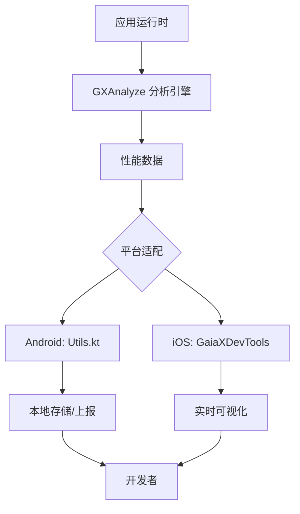
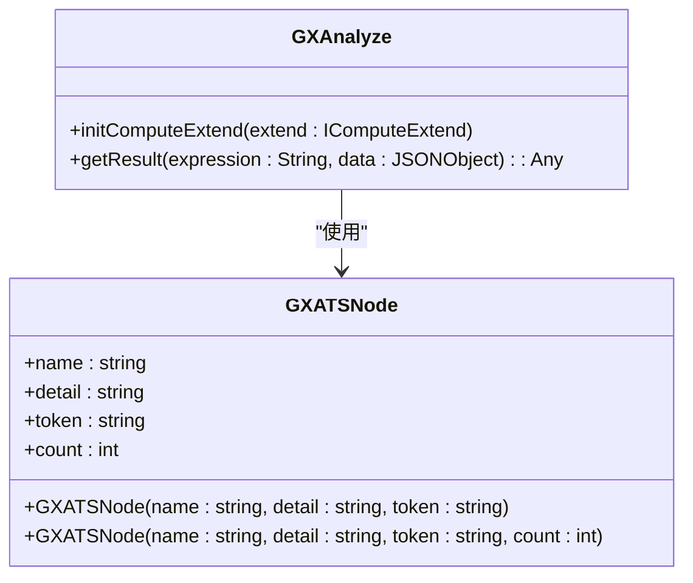
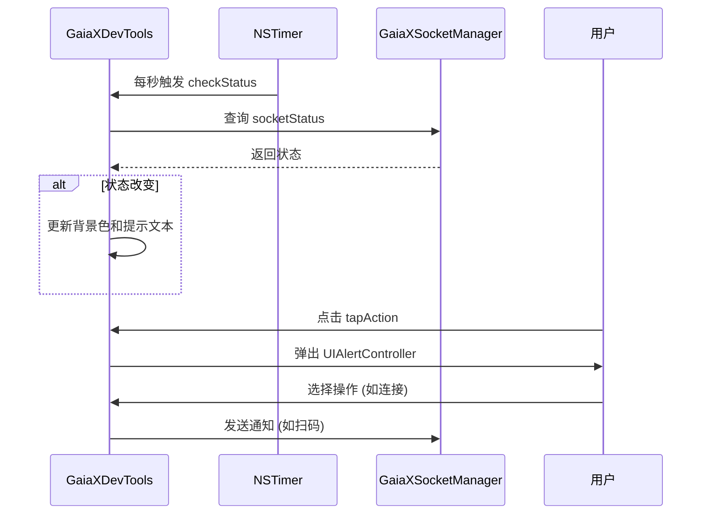
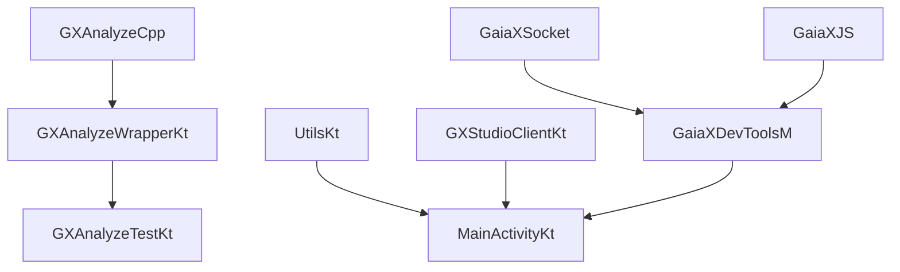

# 性能报告

<cite>
**本文档中引用的文件**  
- [Utils.kt](file://GaiaXAndroidClientToStudio/src/main/java/com/alibaba/gaiax/studio/Utils.kt)
- [GaiaXDevTools.h](file://GaiaXiOSDemo/GaiaXiOSDemo/Preview/DevTools/GaiaXDevTools.h)
- [GaiaXDevTools.m](file://GaiaXiOSDemo/GaiaXiOSDemo/Preview/DevTools/GaiaXDevTools.m)
- [GXAnalyze.cpp](file://GaiaXHarmony/GaiaXAnalyze/GXAnalyzeCore/GXAnalyze.cpp)
- [GXATSNode.cpp](file://GaiaXHarmony/GaiaXAnalyze/GXAnalyzeCore/GXATSNode.cpp)
- [GXAnalyzeWrapper.kt](file://GaiaXAnalyze/GXAnalyzeAndroid/src/androidTest/kotlin/com/alibaba/gaiax/analyze/GXAnalyzeWrapper.kt)
- [GXAnalyzeTest.kt](file://GaiaXAnalyze/GXAnalyzeAndroid/src/androidTest/kotlin/com/alibaba/gaiax/analyze/GXAnalyzeTest.kt)
- [GXTrack.ets](file://GaiaXHarmony/GaiaXCore/GaiaX/src/main/ets/model/GXTrack.ets)
- [MainActivity.kt](file://GaiaXAndroidDemo/app/src/main/kotlin/com/alibaba/gaiax/demo/MainActivity.kt)
</cite>

## 目录
1. [简介](#简介)
2. [项目结构](#项目结构)
3. [核心组件](#核心组件)
4. [架构概述](#架构概述)
5. [详细组件分析](#详细组件分析)
6. [依赖分析](#依赖分析)
7. [性能考量](#性能考量)
8. [故障排除指南](#故障排除指南)
9. [结论](#结论)

## 简介
本文件旨在深入解析 GaiaX 框架中的性能报告系统，涵盖从数据采集、汇总、可视化到长期趋势分析的完整流程。文档面向初学者和资深开发者，提供从基础解读到高级优化策略的全面指导。通过实际代码示例，阐述如何利用 `Utils` 工具类和 `GaiaXDevTools` 生成并分析性能报告，以建立有效的持续性能监控体系。

## 项目结构
GaiaX 的性能分析功能分散在多个模块中，主要涉及 `GaiaXAnalyze`、`GaiaXAndroidClientToStudio` 和 `GaiaXiOSDemo` 等子项目。`GaiaXAnalyze` 模块是性能数据处理的核心，包含跨平台的 C++ 和 Kotlin 实现。`GaiaXAndroidClientToStudio` 模块提供了 Android 端的工具类，用于数据持久化。`GaiaXiOSDemo` 则包含了 `GaiaXDevTools` 的实现，负责在 iOS 端展示性能监控界面。



**图示来源**
- [GXAnalyze.cpp](file://GaiaXHarmony/GaiaXAnalyze/GXAnalyzeCore/GXAnalyze.cpp#L1-L23)
- [GXATSNode.cpp](file://GaiaXHarmony/GaiaXAnalyze/GXAnalyzeCore/GXATSNode.cpp#L1-L46)
- [Utils.kt](file://GaiaXAndroidClientToStudio/src/main/java/com/alibaba/gaiax/studio/Utils.kt#L1-L20)
- [GaiaXDevTools.h](file://GaiaXiOSDemo/GaiaXiOSDemo/Preview/DevTools/GaiaXDevTools.h#L1-L31)
- [GaiaXDevTools.m](file://GaiaXiOSDemo/GaiaXiOSDemo/Preview/DevTools/GaiaXDevTools.m#L1-L216)

**本节来源**
- [GXAnalyze.cpp](file://GaiaXHarmony/GaiaXAnalyze/GXAnalyzeCore/GXAnalyze.cpp#L1-L23)
- [GXATSNode.cpp](file://GaiaXHarmony/GaiaXAnalyze/GXAnalyzeCore/GXATSNode.cpp#L1-L46)
- [Utils.kt](file://GaiaXAndroidClientToStudio/src/main/java/com/alibaba/gaiax/studio/Utils.kt#L1-L20)
- [GaiaXDevTools.h](file://GaiaXiOSDemo/GaiaXiOSDemo/Preview/DevTools/GaiaXDevTools.h#L1-L31)
- [GaiaXDevTools.m](file://GaiaXiOSDemo/GaiaXiOSDemo/Preview/DevTools/GaiaXDevTools.m#L1-L216)

## 核心组件
本系统的核心组件包括 `GXAnalyze`（负责表达式解析和性能计算）、`Utils`（负责本地数据存储）和 `GaiaXDevTools`（负责性能数据的可视化和用户交互）。`GXAnalyze` 模块通过 `GXATSNode` 结构体来表示和统计分析过程中的节点信息，是性能数据聚合的基础。

**本节来源**
- [GXAnalyze.cpp](file://GaiaXHarmony/GaiaXAnalyze/GXAnalyzeCore/GXAnalyze.cpp#L1-L23)
- [GXATSNode.cpp](file://GaiaXHarmony/GaiaXAnalyze/GXAnalyzeCore/GXATSNode.cpp#L1-L46)
- [Utils.kt](file://GaiaXAndroidClientToStudio/src/main/java/com/alibaba/gaiax/studio/Utils.kt#L1-L20)
- [GaiaXDevTools.h](file://GaiaXiOSDemo/GaiaXiOSDemo/Preview/DevTools/GaiaXDevTools.h#L1-L31)
- [GaiaXDevTools.m](file://GaiaXiOSDemo/GaiaXiOSDemo/Preview/DevTools/GaiaXDevTools.m#L1-L216)

## 架构概述
GaiaX 的性能报告系统采用分层架构。底层是 `GXAnalyze` 提供的跨平台分析引擎，它接收原始数据并执行计算。中层是平台特定的工具类，如 Android 的 `Utils` 用于数据持久化，iOS 的 `GaiaXDevTools` 用于界面展示。上层是开发者工具（DevTools），它整合了所有功能，为开发者提供一个统一的性能监控入口。数据流从应用运行时产生，经由分析引擎处理，最终通过 DevTools 可视化呈现。



**图示来源**
- [GXAnalyze.cpp](file://GaiaXHarmony/GaiaXAnalyze/GXAnalyzeCore/GXAnalyze.cpp#L1-L23)
- [Utils.kt](file://GaiaXAndroidClientToStudio/src/main/java/com/alibaba/gaiax/studio/Utils.kt#L1-L20)
- [GaiaXDevTools.m](file://GaiaXiOSDemo/GaiaXiOSDemo/Preview/DevTools/GaiaXDevTools.m#L1-L216)

## 详细组件分析

### GXAnalyze 核心分析引擎
`GXAnalyze` 是性能报告的计算核心，它通过解析表达式来评估数据。其 C++ 实现位于 `GXAnalyze.cpp`，定义了分析器的初始化和计算扩展接口。`GXATSNode` 类用于表示分析过程中的节点，包含名称、详情、类型和计数等属性，是实现数据聚合和统计的基础。



**图示来源**
- [GXAnalyze.cpp](file://GaiaXHarmony/GaiaXAnalyze/GXAnalyzeCore/GXAnalyze.cpp#L1-L23)
- [GXATSNode.cpp](file://GaiaXHarmony/GaiaXAnalyze/GXAnalyzeCore/GXATSNode.cpp#L1-L46)

### GaiaXDevTools 可视化工具
`GaiaXDevTools` 是 iOS 平台上的性能监控工具，它以一个浮动视图的形式覆盖在应用界面上。该工具通过 `NSTimer` 定期检查与 Gaia Studio 的连接状态，并根据状态改变自身背景颜色和提示文本。用户可以通过点击该视图弹出操作菜单，进行连接、断开、开启实时预览等操作。



**图示来源**
- [GaiaXDevTools.m](file://GaiaXiOSDemo/GaiaXiOSDemo/Preview/DevTools/GaiaXDevTools.m#L1-L216)

### Utils 工具类
`Utils.kt` 文件提供了 Android 平台下简单的本地数据存储功能。它使用 `SharedPreferences` 来保存和读取键值对，主要用于存储与 Gaia Studio 的连接 URL。这些持久化的数据在应用重启后依然有效，为 `GXStudioClient` 的自动重连提供了支持。

```mermaid
flowchart TD
Start([开始]) --> Save["saveInLocal(context, key, value)"]
Save --> GetEditor["获取 SharedPreferences.Editor"]
GetEditor --> PutString["editor.putString(key, value)"]
PutString --> Apply["editor.apply()"]
Apply --> End([保存完成])
Load["loadInLocal(context, key)"] --> GetPrefs["获取 SharedPreferences"]
GetPrefs --> GetString["getter.getString(key, \"\")"]
GetString --> Return["返回字符串值"]
Return --> End2([读取完成])
```

**图示来源**
- [Utils.kt](file://GaiaXAndroidClientToStudio/src/main/java/com/alibaba/gaiax/studio/Utils.kt#L1-L20)

**本节来源**
- [GXAnalyze.cpp](file://GaiaXHarmony/GaiaXAnalyze/GXAnalyzeCore/GXAnalyze.cpp#L1-L23)
- [GXATSNode.cpp](file://GaiaXHarmony/GaiaXAnalyze/GXAnalyzeCore/GXATSNode.cpp#L1-L46)
- [GaiaXDevTools.m](file://GaiaXiOSDemo/GaiaXiOSDemo/Preview/DevTools/GaiaXDevTools.m#L1-L216)
- [Utils.kt](file://GaiaXAndroidClientToStudio/src/main/java/com/alibaba/gaiax/studio/Utils.kt#L1-L20)

## 依赖分析
系统各组件之间存在明确的依赖关系。`GXAnalyze` 模块是独立的核心库，被上层应用直接依赖。`GaiaXDevTools` 依赖于 `GaiaXSocket` 和 `GaiaXJS` 模块来实现与后端的通信和调试功能。`Utils.kt` 作为 Android 工具类，仅依赖于 Android SDK 的 `SharedPreferences`。`MainActivity.kt` 作为示例应用，整合了 `GXStudioClient`、`GXJSEngineProxy` 等多个模块，是整个系统集成的入口点。



**图示来源**
- [GXAnalyzeWrapper.kt](file://GaiaXAnalyze/GXAnalyzeAndroid/src/androidTest/kotlin/com/alibaba/gaiax/analyze/GXAnalyzeWrapper.kt#L1-L28)
- [GXAnalyzeTest.kt](file://GaiaXAnalyze/GXAnalyzeAndroid/src/androidTest/kotlin/com/alibaba/gaiax/analyze/GXAnalyzeTest.kt#L1-L43)
- [Utils.kt](file://GaiaXAndroidClientToStudio/src/main/java/com/alibaba/gaiax/studio/Utils.kt#L1-L20)
- [MainActivity.kt](file://GaiaXAndroidDemo/app/src/main/kotlin/com/alibaba/gaiax/demo/MainActivity.kt#L1-L238)
- [GaiaXDevTools.m](file://GaiaXiOSDemo/GaiaXiOSDemo/Preview/DevTools/GaiaXDevTools.m#L1-L216)

**本节来源**
- [GXAnalyzeWrapper.kt](file://GaiaXAnalyze/GXAnalyzeAndroid/src/androidTest/kotlin/com/alibaba/gaiax/analyze/GXAnalyzeWrapper.kt#L1-L28)
- [GXAnalyzeTest.kt](file://GaiaXAnalyze/GXAnalyzeAndroid/src/androidTest/kotlin/com/alibaba/gaiax/analyze/GXAnalyzeTest.kt#L1-L43)
- [Utils.kt](file://GaiaXAndroidClientToStudio/src/main/java/com/alibaba/gaiax/studio/Utils.kt#L1-L20)
- [MainActivity.kt](file://GaiaXAndroidDemo/app/src/main/kotlin/com/alibaba/gaiax/demo/MainActivity.kt#L1-L238)
- [GaiaXDevTools.m](file://GaiaXiOSDemo/GaiaXiOSDemo/Preview/DevTools/GaiaXDevTools.m#L1-L216)

## 性能考量
`GXAnalyze` 模块的性能直接影响整个系统的响应速度。其 C++ 实现保证了核心计算的高效性。`GaiaXDevTools` 使用 `NSTimer` 进行状态轮询，虽然简单但可能带来轻微的性能开销，建议在生产环境中关闭。`Utils.kt` 使用的 `SharedPreferences` 在 Android 上是轻量级的，适合存储少量配置数据。对于大规模性能数据的长期跟踪，应考虑使用更高效的数据库或日志系统。

## 故障排除指南
当性能报告功能无法正常工作时，可按以下步骤排查：
1.  **检查连接**：确认 `GaiaXDevTools` 的状态指示条是否显示“已连接”。
2.  **验证数据存储**：检查 `GX_SP_NAME` 对应的 `SharedPreferences` 文件，确认连接 URL 是否已正确保存。
3.  **查看日志**：在 `GXAnalyzeTest.kt` 中有单元测试用例，可用于验证 `GXAnalyze` 引擎的基本功能是否正常。
4.  **确认集成**：检查 `MainActivity.kt` 中的 `initGXStudio()` 等初始化方法是否被正确调用。

**本节来源**
- [Utils.kt](file://GaiaXAndroidClientToStudio/src/main/java/com/alibaba/gaiax/studio/Utils.kt#L1-L20)
- [GaiaXDevTools.m](file://GaiaXiOSDemo/GaiaXiOSDemo/Preview/DevTools/GaiaXDevTools.m#L1-L216)
- [GXAnalyzeTest.kt](file://GaiaXAnalyze/GXAnalyzeAndroid/src/androidTest/kotlin/com/alibaba/gaiax/analyze/GXAnalyzeTest.kt#L1-L43)
- [MainActivity.kt](file://GaiaXAndroidDemo/app/src/main/kotlin/com/alibaba/gaiax/demo/MainActivity.kt#L1-L238)

## 结论
GaiaX 的性能报告系统通过 `GXAnalyze`、`Utils` 和 `GaiaXDevTools` 等组件的协同工作，为开发者提供了一套完整的性能监控解决方案。该系统具备跨平台能力，能够有效地收集、处理和可视化性能数据。通过深入理解其架构和实现细节，开发者可以更好地利用该工具进行性能优化，提升应用质量。未来可进一步增强数据聚合策略和趋势分析算法，以提供更深层次的洞察。