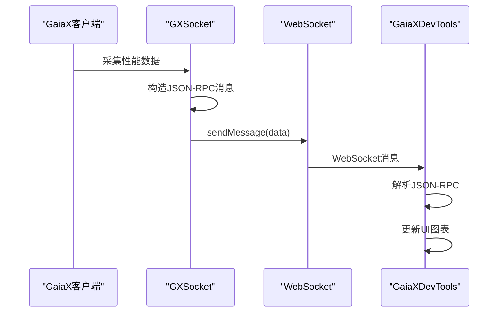
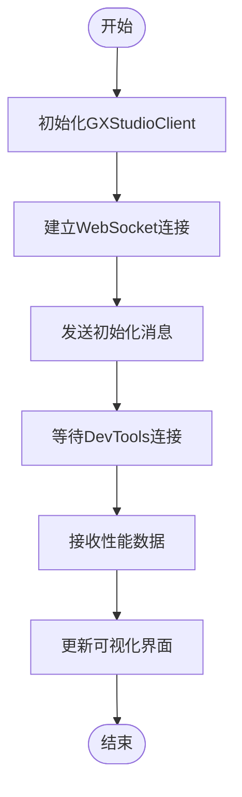

# 性能监控

<cite>
**本文档中引用的文件**  
- [GXSocket.kt](file://GaiaXAndroidClientToStudio/src/main/java/com/alibaba/gaiax/studio/GXSocket.kt)
- [GXStudioClient.kt](file://GaiaXAndroidClientToStudio/src/main/java/com/alibaba/gaiax/studio/GXStudioClient.kt)
- [IDevTools.kt](file://GaiaXAndroidClientToStudio/src/main/java/com/alibaba/gaiax/studio/IDevTools.kt)
- [GaiaXSocketClient.m](file://GaiaXSocketiOS/GaiaXSocket/GaiaXSocketClient.m)
- [GaiaXSocketManager.m](file://GaiaXSocketiOS/GaiaXSocket/GaiaXSocketManager.m)
</cite>

## 目录
1. [简介](#简介)
2. [性能监控架构概述](#性能监控架构概述)
3. [GXSocket连接机制](#gxsocket连接机制)
4. [性能数据采集与传输](#性能数据采集与传输)
5. [GaiaXDevTools数据接收与可视化](#gaiaxdevtools数据接收与可视化)
6. [性能监控配置与使用指南](#性能监控配置与使用指南)
7. [高级性能分析](#高级性能分析)
8. [异常检测与采样策略](#异常检测与采样策略)
9. [结论](#结论)

## 简介
GaiaX性能监控系统通过GXSocket实现与开发工具之间的实时通信，支持对帧率、内存使用、渲染耗时等关键性能指标的实时采集与监控。该系统为开发者提供了从基础配置到高级分析的完整工具链，帮助及时发现UI线程阻塞、过度绘制和内存泄漏等问题。本文档详细阐述了GXSocket如何建立连接、传输性能数据，以及GaiaXDevTools如何接收并可视化这些数据。

## 性能监控架构概述

```mermaid
graph TB
subgraph "客户端 (GaiaX)"
A[GXSocket] --> B[GXStudioClient]
B --> C[性能数据采集器]
C --> D[帧率监控]
C --> E[内存使用]
C --> F[渲染耗时]
C --> G[UI线程监控]
end
subgraph "开发工具 (GaiaXDevTools)"
H[GaiaXSocketManager] --> I[GaiaXSocketClient]
I --> J[数据接收]
J --> K[性能可视化]
K --> L[帧率图表]
K --> M[内存趋势]
K --> N[渲染分析]
end
A < --> |WebSocket| I
```

**图表来源**  
- [GXSocket.kt](file://GaiaXAndroidClientToStudio/src/main/java/com/alibaba/gaiax/studio/GXSocket.kt#L1-L440)
- [GaiaXSocketClient.m](file://GaiaXSocketiOS/GaiaXSocket/GaiaXSocketClient.m#L1-L282)

## GXSocket连接机制

GXSocket是GaiaX与开发工具之间通信的核心组件，基于WebSocket协议实现双向实时通信。在Android端，`GXSocket.kt`定义了与WebSocket的连接、消息接收和发送逻辑，通过`WebSocketManager`管理连接状态，并在连接成功后触发`onSocketConnected`回调。

iOS端通过`GaiaXSocketClient.m`实现类似功能，利用`SRWebSocket`库建立WebSocket连接，并通过`delegate`模式处理连接状态变化。`GaiaXSocketManager.m`作为单例管理器，负责维护`GaiaXSocketClient`实例并分发消息给注册的监听器。

连接建立后，客户端会发送初始化消息（`initialized`），包含平台信息、设备型号和系统版本，以便开发工具识别并建立会话。

**本节来源**  
- [GXSocket.kt](file://GaiaXAndroidClientToStudio/src/main/java/com/alibaba/gaiax/studio/GXSocket.kt#L70-L119)
- [GaiaXSocketClient.m](file://GaiaXSocketiOS/GaiaXSocket/GaiaXSocketClient.m#L62-L72)
- [GaiaXSocketManager.m](file://GaiaXSocketiOS/GaiaXSocket/GaiaXSocketManager.m#L48-L56)

## 性能数据采集与传输

性能数据的采集由客户端内部的监控模块完成，包括帧率（FPS）、内存占用、渲染耗时等指标。这些数据通过GXSocket以JSON-RPC 2.0协议格式发送到开发工具。在Android端，`GXSocket.kt`中的`sendMessage`方法负责将包含性能指标的JSON对象发送到WebSocket服务端。

数据格式遵循标准JSON-RPC结构，包含`jsonrpc`、`method`、`params`和`id`字段。例如，帧率数据可能通过`performance/fps`方法名发送，参数中包含时间戳和FPS值。iOS端通过`GaiaXSocketClient`的`sendRequest`方法实现类似功能，确保跨平台数据格式一致性。



**图表来源**  
- [GXSocket.kt](file://GaiaXAndroidClientToStudio/src/main/java/com/alibaba/gaiax/studio/GXSocket.kt#L373-L379)
- [GaiaXSocketClient.m](file://GaiaXSocketiOS/GaiaXSocket/GaiaXSocketClient.m#L165-L173)

**本节来源**  
- [GXSocket.kt](file://GaiaXAndroidClientToStudio/src/main/java/com/alibaba/gaiax/studio/GXSocket.kt#L373-L379)
- [GaiaXSocketClient.m](file://GaiaXSocketiOS/GaiaXSocket/GaiaXSocketClient.m#L165-L173)

## GaiaXDevTools数据接收与可视化

GaiaXDevTools通过`GaiaXSocketManager`接收来自客户端的性能数据，并进行可视化展示。`GaiaXSocketManager.m`中的`socketClient:didReceiveMessage:`方法负责接收消息，并通过`listenerMap`将消息分发给注册的监听器。

接收到性能数据后，DevTools会解析JSON-RPC消息，提取性能指标，并更新对应的图表组件。例如，帧率数据会实时绘制在折线图中，内存使用情况以趋势图展示，渲染耗时则通过柱状图呈现。开发者可以通过这些可视化界面直观地观察应用性能变化，及时发现性能瓶颈。

**本节来源**  
- [GaiaXSocketManager.m](file://GaiaXSocketiOS/GaiaXSocket/GaiaXSocketManager.m#L124-L132)
- [GXSocket.kt](file://GaiaXAndroidClientToStudio/src/main/java/com/alibaba/gaiax/studio/GXSocket.kt#L123-L180)

## 性能监控配置与使用指南

对于初学者，GaiaX提供了简单的性能监控配置方法。首先，在应用初始化时调用`GXStudioClient.init(context)`完成基础配置。然后，通过`autoConnect`或`manualConnect`方法建立与开发工具的连接。



**图表来源**  
- [GXStudioClient.kt](file://GaiaXAndroidClientToStudio/src/main/java/com/alibaba/gaiax/studio/GXStudioClient.kt#L79-L84)
- [GaiaXSocketClient.m](file://GaiaXSocketiOS/GaiaXSocket/GaiaXSocketClient.m#L62-L72)

实时监控界面显示帧率、内存、CPU等关键指标的实时曲线，支持时间轴缩放和数据点查看。开发者可以通过点击特定时间点查看当时的性能快照，辅助定位性能问题。

**本节来源**  
- [GXStudioClient.kt](file://GaiaXAndroidClientToStudio/src/main/java/com/alibaba/gaiax/studio/GXStudioClient.kt#L91-L123)
- [GXSocket.kt](file://GaiaXAndroidClientToStudio/src/main/java/com/alibaba/gaiax/studio/GXSocket.kt#L220-L234)

## 高级性能分析

对于经验丰富的开发者，GaiaX提供了更深入的性能分析功能。通过`IDevTools`接口，可以获取当前预览模式和JS调试模式，实现更精细的性能控制。`GXSocket.kt`中的`sendMsgForChangeMode`方法允许动态切换调试模式，影响性能数据的采集频率和内容。

性能数据的采集频率可根据需要调整，支持高频率采样以捕捉瞬时性能波动。传输协议基于WebSocket，确保低延迟和高吞吐量。数据格式采用紧凑的JSON结构，减少网络传输开销。

通过分析UI线程的阻塞情况、过度绘制区域和内存分配模式，开发者可以深入理解应用性能特征，优化渲染流程和资源管理。

**本节来源**  
- [IDevTools.kt](file://GaiaXAndroidClientToStudio/src/main/java/com/alibaba/gaiax/studio/IDevTools.kt#L11-L21)
- [GXSocket.kt](file://GaiaXAndroidClientToStudio/src/main/java/com/alibaba/gaiax/studio/GXSocket.kt#L417-L434)

## 异常检测与采样策略

性能监控系统内置了异常检测算法，能够自动识别帧率骤降、内存泄漏等异常情况。数据采样策略采用自适应机制，根据系统负载动态调整采样频率，在保证监控精度的同时最小化对应用性能的影响。

实时更新机制确保性能数据能够以最小延迟反映到开发工具界面。通过对比历史数据和当前数据，系统可以预测潜在的性能问题，提前发出警告。

**本节来源**  
- [GXSocket.kt](file://GaiaXAndroidClientToStudio/src/main/java/com/alibaba/gaiax/studio/GXSocket.kt#L310-L320)
- [GaiaXSocketClient.m](file://GaiaXSocketiOS/GaiaXSocket/GaiaXSocketClient.m#L182-L193)

## 结论
GaiaX性能监控系统通过GXSocket实现了高效、实时的性能数据传输，为开发者提供了从基础监控到高级分析的完整工具链。通过WebSocket协议和JSON-RPC格式，确保了跨平台的一致性和高效性。GaiaXDevTools的可视化界面使性能数据易于理解和分析，帮助开发者快速定位和解决性能问题，提升应用质量和用户体验。