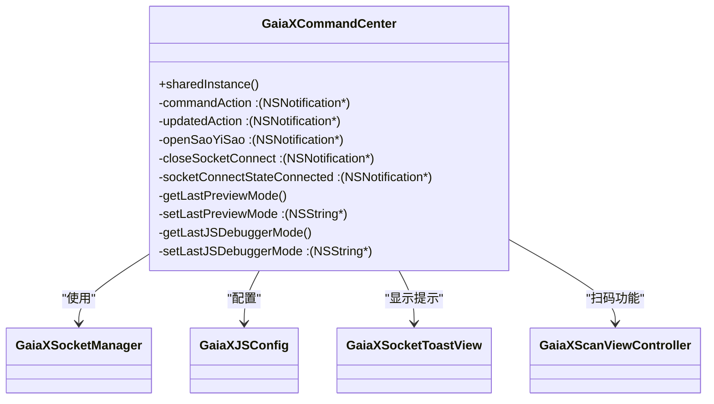
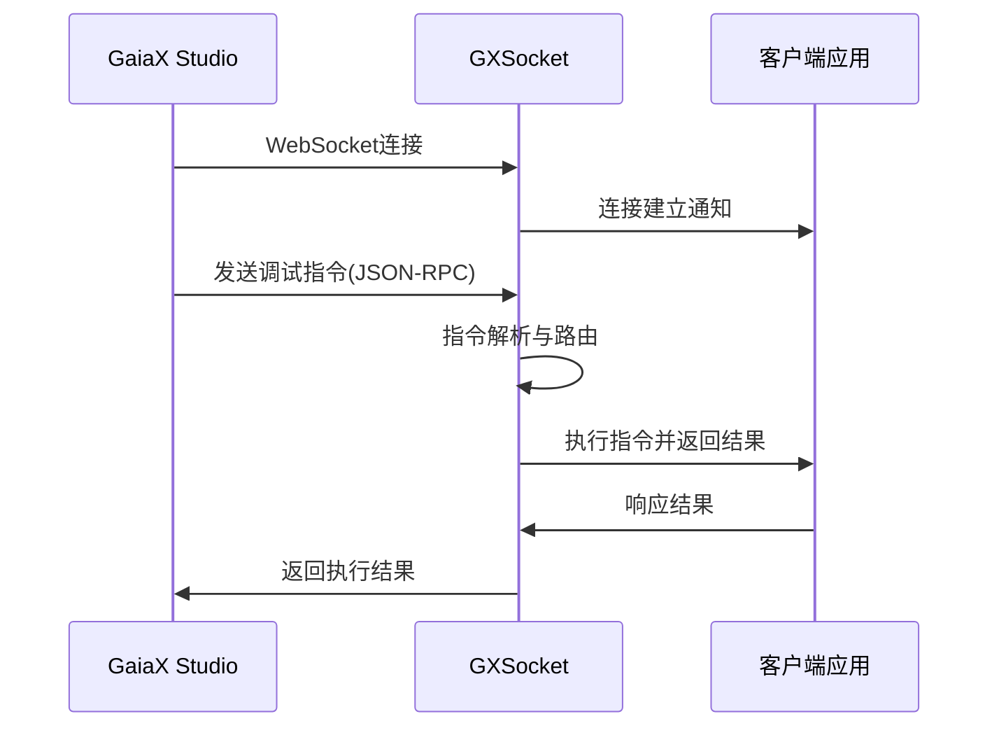
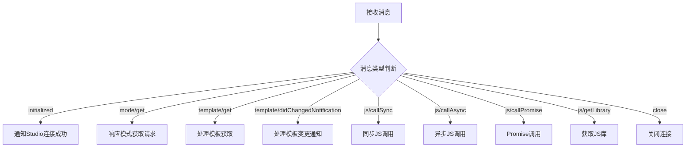
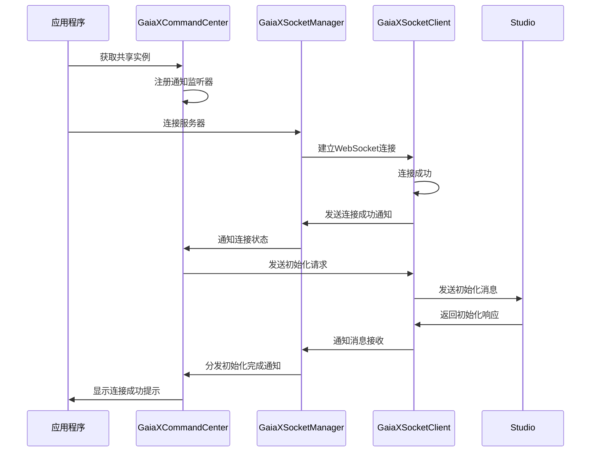
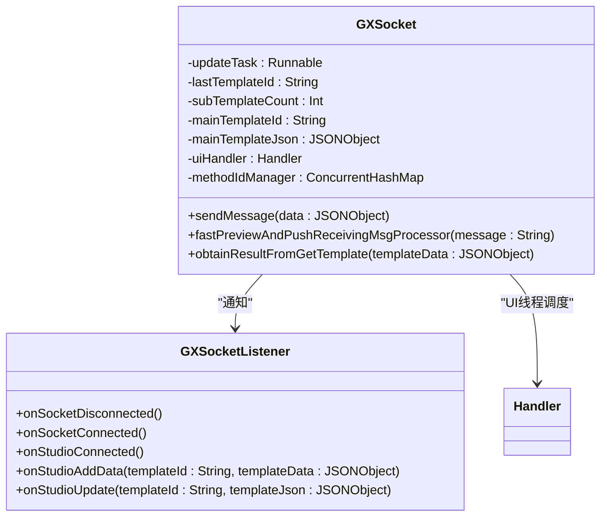
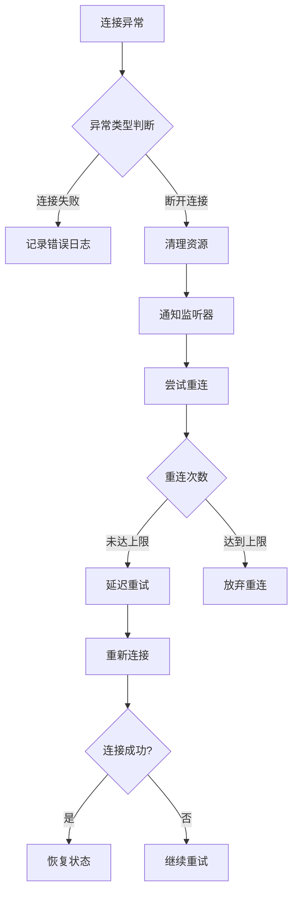

# 命令处理

<cite>
**本文档引用文件**  
- [GXSocket.kt](file://GaiaXAndroidClientToStudio/src/main/java/com/alibaba/gaiax/studio/GXSocket.kt)
- [GXSocketKey.kt](file://GaiaXAndroidClientToStudio/src/main/java/com/alibaba/gaiax/studio/GXSocketKey.kt)
- [GXStudioClient.kt](file://GaiaXAndroidClientToStudio/src/main/java/com/alibaba/gaiax/studio/GXStudioClient.kt)
- [GaiaXCommandCenter.h](file://GaiaXiOSDemo/GaiaXiOSDemo/Preview/DevTools/GaiaXCommandCenter.h)
- [GaiaXCommandCenter.m](file://GaiaXiOSDemo/GaiaXiOSDemo/Preview/DevTools/GaiaXCommandCenter.m)
- [GaiaXSocketManager.h](file://GaiaXSocketiOS/GaiaXSocket/GaiaXSocketManager.h)
- [GaiaXSocketManager.m](file://GaiaXSocketiOS/GaiaXSocket/GaiaXSocketManager.m)
- [GaiaXSocketClient.h](file://GaiaXSocketiOS/GaiaXSocket/GaiaXSocketClient.h)
- [GaiaXSocketModel.h](file://GaiaXSocketiOS/GaiaXSocket/GaiaXSocketModel.h)
</cite>

## 目录
1. [简介](#简介)
2. [核心组件分析](#核心组件分析)
3. [命令中心架构](#命令中心架构)
4. [GXSocket通信机制](#gxsocket通信机制)
5. [命令路由与分发](#命令路由与分发)
6. [命令执行流程](#命令执行流程)
7. [异步处理与上下文管理](#异步处理与上下文管理)
8. [线程安全与错误恢复](#线程安全与错误恢复)
9. [性能分析与优化](#性能分析与优化)
10. [总结](#总结)

## 简介

GaiaX命令处理系统是连接开发工具与运行时环境的核心桥梁，负责调试指令的接收、解析和执行。该系统通过GXSocket实现跨平台通信，以GaiaXCommandCenter作为命令分发中枢，构建了完整的调试指令处理链路。本文档深入分析命令处理的完整流程，涵盖通信机制、路由策略、执行模式及性能优化方案，为开发者提供全面的技术指导。

## 核心组件分析

GaiaX命令处理系统由多个核心组件构成，各组件协同工作实现完整的命令处理能力。

**Section sources**
- [GaiaXCommandCenter.h](file://GaiaXiOSDemo/GaiaXiOSDemo/Preview/DevTools/GaiaXCommandCenter.h#L1-L26)
- [GaiaXCommandCenter.m](file://GaiaXiOSDemo/GaiaXiOSDemo/Preview/DevTools/GaiaXCommandCenter.m#L1-L139)

## 命令中心架构

GaiaXCommandCenter作为命令处理的核心中枢，采用单例模式实现全局命令管理。该组件通过NSNotificationCenter监听系统事件，实现命令的集中分发与状态管理。

**Diagram sources**
- [GaiaXCommandCenter.m](file://GaiaXiOSDemo/GaiaXiOSDemo/Preview/DevTools/GaiaXCommandCenter.m#L24-L138)

## GXSocket通信机制

GXSocket组件实现了基于WebSocket的双向通信机制，采用JSON-RPC 2.0协议进行消息交换。该机制支持请求-响应、通知和异步回调等多种通信模式。

**Diagram sources**
- [GXSocket.kt](file://GaiaXAndroidClientToStudio/src/main/java/com/alibaba/gaiax/studio/GXSocket.kt#L16-L440)
- [GaiaXSocketManager.m](file://GaiaXSocketiOS/GaiaXSocket/GaiaXSocketManager.m#L49-L94)

## 命令路由与分发

命令路由系统采用方法名映射机制，通过methodIdManager维护请求ID与方法名的对应关系，实现响应的准确路由。系统支持多种命令类型，包括模板更新、模式切换和JS调用等。

**Diagram sources**
- [GXSocket.kt](file://GaiaXAndroidClientToStudio/src/main/java/com/alibaba/gaiax/studio/GXSocket.kt#L122-L181)
- [GXSocketKey.kt](file://GaiaXAndroidClientToStudio/src/main/java/com/alibaba/gaiax/studio/GXSocketKey.kt#L1-L13)

## 命令执行流程

命令执行流程从连接建立开始，经过初始化、指令接收、处理和响应返回等阶段，形成完整的闭环。

**Diagram sources**
- [ViewController.m](file://GaiaXiOSDemo/GaiaXiOSDemo/ViewController.m#L54-L61)
- [GaiaXCommandCenter.m](file://GaiaXiOSDemo/GaiaXiOSDemo/Preview/DevTools/GaiaXCommandCenter.m#L86-L97)

## 异步处理与上下文管理

系统采用异步处理机制管理命令执行，通过updateTask实现延迟更新，避免频繁的UI刷新。上下文管理采用ConcurrentHashMap存储方法ID与方法名的映射关系，确保多线程环境下的数据一致性。

**Diagram sources**
- [GXSocket.kt](file://GaiaXAndroidClientToStudio/src/main/java/com/alibaba/gaiax/studio/GXSocket.kt#L30-L44)
- [GXSocket.kt](file://GaiaXAndroidClientToStudio/src/main/java/com/alibaba/gaiax/studio/GXSocket.kt#L372-L378)

## 线程安全与错误恢复

系统通过多种机制确保线程安全和错误恢复能力。采用ConcurrentHashMap保证方法ID管理的线程安全，通过WebSocket重连机制实现网络异常恢复，使用NSUserDefaults持久化存储连接信息。

**Diagram sources**
- [GXSocket.kt](file://GaiaXAndroidClientToStudio/src/main/java/com/alibaba/gaiax/studio/GXSocket.kt#L103-L106)
- [GXSocket.kt](file://GaiaXAndroidClientToStudio/src/main/java/com/alibaba/gaiax/studio/GXSocket.kt#L108-L118)

## 性能分析与优化

命令处理系统在性能方面进行了多项优化，包括批量处理、延迟更新和资源复用等策略。通过分析潜在的性能瓶颈，提出相应的优化方案。

### 性能瓶颈分析

| 瓶颈类型 | 描述 | 影响 | 优化方案 |
|---------|------|------|---------|
| 频繁UI更新 | 模板变更时频繁刷新UI | UI卡顿 | 延迟更新机制 |
| 网络请求过多 | 子模板逐个请求 | 延迟增加 | 批量请求优化 |
| 内存占用 | 模板数据缓存 | 内存压力 | 智能缓存策略 |
| 解析开销 | JSON解析频繁 | CPU占用高 | 解析结果缓存 |

### 优化方案

1. **批量处理优化**：对相关联的模板请求进行合并，减少网络往返次数
2. **智能缓存**：对常用模板数据进行缓存，避免重复解析
3. **资源复用**：WebSocket连接复用，减少连接建立开销
4. **异步处理**：耗时操作放入后台线程，避免阻塞主线程

**Section sources**
- [GXSocket.kt](file://GaiaXAndroidClientToStudio/src/main/java/com/alibaba/gaiax/studio/GXSocket.kt#L291-L370)
- [GXSocket.kt](file://GaiaXAndroidClientToStudio/src/main/java/com/alibaba/gaiax/studio/GXSocket.kt#L393-L414)

## 总结

GaiaX命令处理系统通过GXSocket和GaiaXCommandCenter等核心组件，构建了高效、可靠的调试指令处理框架。系统采用JSON-RPC协议实现跨平台通信，通过单例模式和观察者模式确保命令处理的集中管理和及时响应。异步处理机制和上下文管理策略有效提升了系统性能，线程安全设计和错误恢复机制保障了系统的稳定性。未来可通过引入更智能的缓存策略和批量处理机制，进一步优化系统性能。