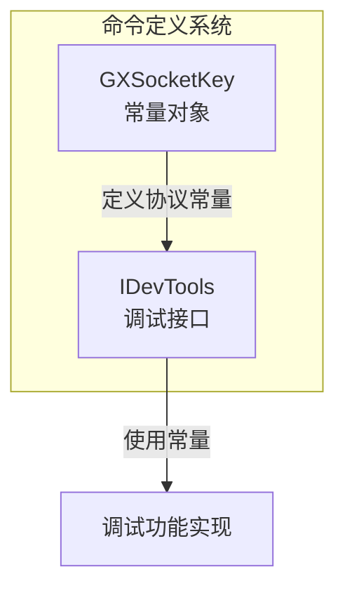
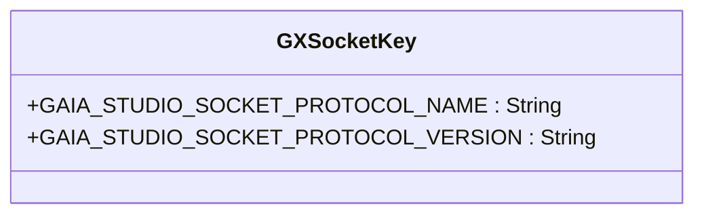
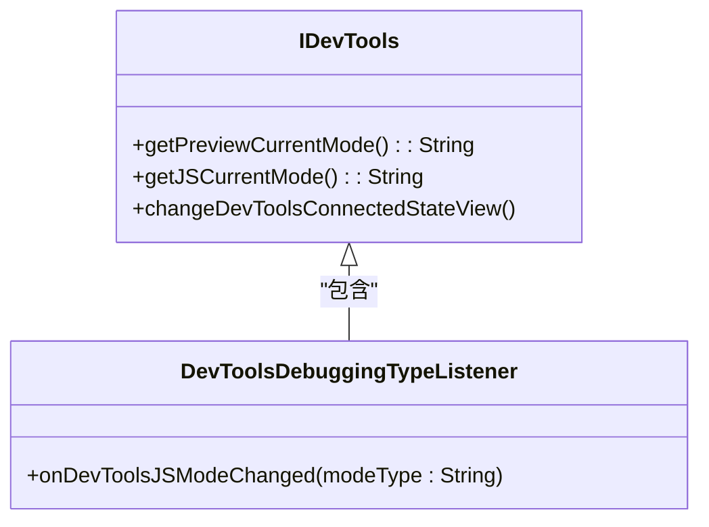
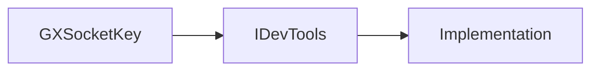

# 命令定义

<cite>
**本文档中引用的文件**
- [GXSocketKey.kt](file://GaiaXAndroidClientToStudio/src/main/java/com/alibaba/gaiax/studio/GXSocketKey.kt)
- [IDevTools.kt](file://GaiaXAndroidClientToStudio/src/main/java/com/alibaba/gaiax/studio/IDevTools.kt)
</cite>

## 目录
1. [简介](#简介)
2. [核心组件](#核心组件)
3. [架构概述](#架构概述)
4. [详细组件分析](#详细组件分析)
5. [依赖分析](#依赖分析)
6. [性能考虑](#性能考虑)
7. [故障排除指南](#故障排除指南)
8. [结论](#结论)
9. [附录](#附录)（如有必要）

## 简介
本文档详细介绍了GaiaX框架中的命令定义机制，重点阐述了调试命令的常量定义和接口规范。文档将深入解析GXSocketKey中定义的各类调试命令常量及其分类，详细说明IDevTools接口中声明的调试功能方法。通过本指南，开发者可以全面了解命令类型的设计原则、命名规范和版本控制策略，掌握常用命令的使用场景和参数说明，并学习命令参数的序列化与反序列化机制。

## 核心组件
本节分析GaiaX命令系统的核心组件，包括命令常量定义和调试接口。文档将重点介绍GXSocketKey对象中定义的协议名称和版本号常量，以及IDevTools接口中声明的获取预览模式、JS调试模式和状态变更通知等核心功能方法。

**Section sources**
- [GXSocketKey.kt](file://GaiaXAndroidClientToStudio/src/main/java/com/alibaba/gaiax/studio/GXSocketKey.kt#L8-L13)
- [IDevTools.kt](file://GaiaXAndroidClientToStudio/src/main/java/com/alibaba/gaiax/studio/IDevTools.kt#L11-L22)

## 架构概述
GaiaX的命令定义系统采用模块化设计，通过独立的常量对象和接口定义来实现调试功能的标准化。系统架构分为两个主要部分：命令键值定义和调试工具接口。命令键值定义位于GXSocketKey对象中，负责管理协议相关的常量；调试工具接口由IDevTools定义，提供了一系列用于获取和变更调试状态的方法。

**Diagram sources**
- [GXSocketKey.kt](file://GaiaXAndroidClientToStudio/src/main/java/com/alibaba/gaiax/studio/GXSocketKey.kt#L8-L13)
- [IDevTools.kt](file://GaiaXAndroidClientToStudio/src/main/java/com/alibaba/gaiax/studio/IDevTools.kt#L11-L22)

## 详细组件分析
本节将深入分析GaiaX命令定义系统的各个关键组件，包括常量定义对象和调试接口的具体实现。

### GXSocketKey 分析
GXSocketKey是一个Kotlin对象，用于集中管理GaiaX Studio套接字通信的协议相关常量。该对象采用单例模式设计，确保在整个应用中常量值的一致性。

**Diagram sources**
- [GXSocketKey.kt](file://GaiaXAndroidClientToStudio/src/main/java/com/alibaba/gaiax/studio/GXSocketKey.kt#L8-L13)

#### 常量定义
GXSocketKey对象定义了两个核心常量：
- `GAIA_STUDIO_SOCKET_PROTOCOL_NAME`: 套接字通信协议名称，当前值为"jsonrpc"
- `GAIA_STUDIO_SOCKET_PROTOCOL_VERSION`: 协议版本号，当前值为"2.0"

这些常量的设计遵循了清晰的命名规范，采用全大写字母和下划线分隔的格式，确保了代码的可读性和维护性。

**Section sources**
- [GXSocketKey.kt](file://GaiaXAndroidClientToStudio/src/main/java/com/alibaba/gaiax/studio/GXSocketKey.kt#L9-L11)

### IDevTools 接口分析
IDevTools是GaiaX调试工具的核心接口，定义了与开发工具交互所需的方法。该接口采用Kotlin接口设计，支持函数式编程特性。

**Diagram sources**
- [IDevTools.kt](file://GaiaXAndroidClientToStudio/src/main/java/com/alibaba/gaiax/studio/IDevTools.kt#L11-L22)

#### 接口方法
IDevTools接口声明了以下主要方法：
- `getPreviewCurrentMode()`: 获取当前预览模式，返回模式类型的字符串表示
- `getJSCurrentMode()`: 获取当前JS调试模式，返回模式类型的字符串表示
- `changeDevToolsConnectedStateView()`: 变更开发工具连接状态视图

此外，接口还包含一个内部监听器接口`DevToolsDebuggingTypeListener`，用于监听JS调试模式的变化。

**Section sources**
- [IDevTools.kt](file://GaiaXAndroidClientToStudio/src/main/java/com/alibaba/gaiax/studio/IDevTools.kt#L13-L21)

## 依赖分析
GaiaX命令定义系统的组件间依赖关系相对简单，主要体现在IDevTools接口对GXSocketKey常量的潜在使用。虽然当前代码中未直接显示这种依赖，但从设计意图来看，IDevTools的实现类可能会引用GXSocketKey中定义的协议常量来确保通信的一致性。

**Diagram sources**
- [GXSocketKey.kt](file://GaiaXAndroidClientToStudio/src/main/java/com/alibaba/gaiax/studio/GXSocketKey.kt#L8-L13)
- [IDevTools.kt](file://GaiaXAndroidClientToStudio/src/main/java/com/alibaba/gaiax/studio/IDevTools.kt#L11-L22)

## 性能考虑
由于GXSocketKey和IDevTools都是轻量级的定义组件，不包含复杂的业务逻辑，因此对系统性能的影响极小。常量对象的内存占用可以忽略不计，接口方法的调用开销也非常低。在实际使用中，这些组件不会成为性能瓶颈。

## 故障排除指南
当遇到与命令定义相关的调试问题时，建议按照以下步骤进行排查：
1. 检查GXSocketKey中定义的协议常量是否正确
2. 验证IDevTools接口的实现是否正确返回预期的模式信息
3. 确认开发工具连接状态视图的更新逻辑是否正常工作

**Section sources**
- [GXSocketKey.kt](file://GaiaXAndroidClientToStudio/src/main/java/com/alibaba/gaiax/studio/GXSocketKey.kt#L8-L13)
- [IDevTools.kt](file://GaiaXAndroidClientToStudio/src/main/java/com/alibaba/gaiax/studio/IDevTools.kt#L11-L22)

## 结论
GaiaX的命令定义系统通过GXSocketKey和IDevTools两个核心组件，为调试功能提供了清晰、标准化的接口。这种设计不仅提高了代码的可维护性，还为开发者提供了统一的调试体验。通过遵循本文档中介绍的设计原则和使用方法，开发者可以有效地利用GaiaX的调试功能，提升开发效率。

## 附录
本文档基于GaiaX Android Client To Studio模块的最新代码编写，主要参考了GXSocketKey.kt和IDevTools.kt两个文件。随着框架的演进，相关API可能会有所调整，请以最新代码为准。