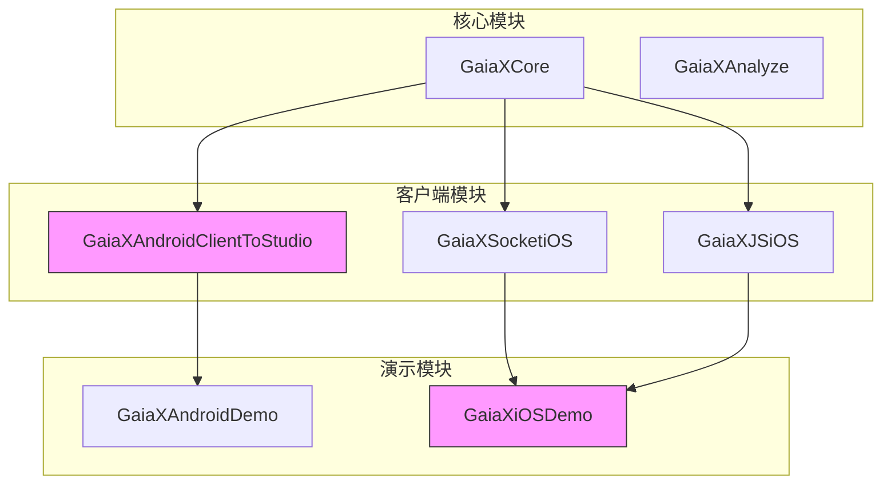
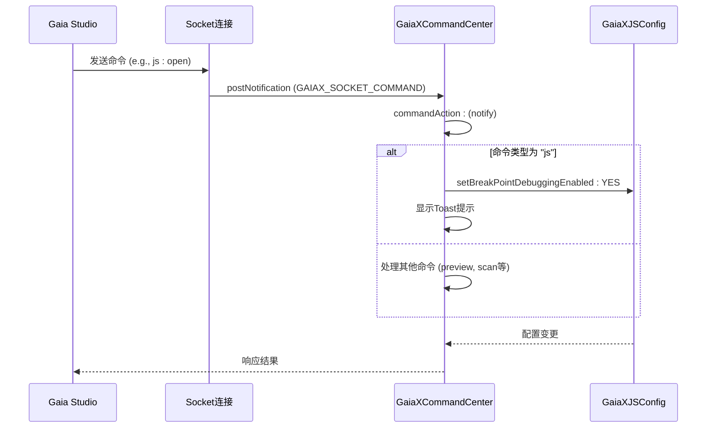
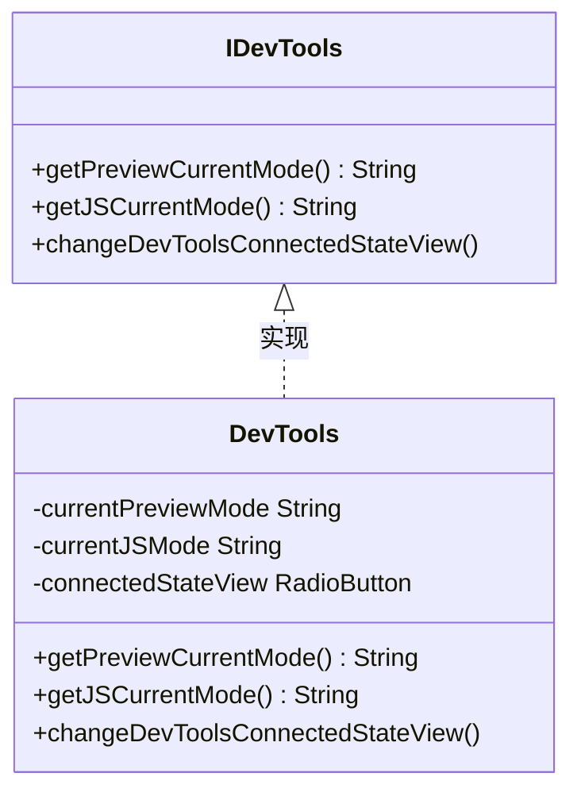
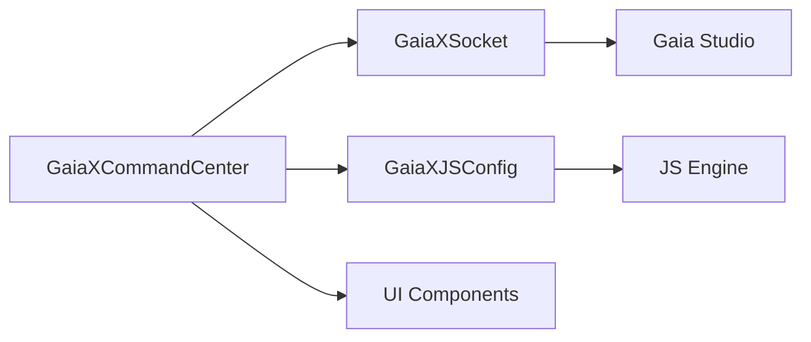

# 命令扩展

<cite>
**本文档引用的文件**
- [IDevTools.kt](file://GaiaXAndroidClientToStudio/src/main/java/com/alibaba/gaiax/studio/IDevTools.kt)
- [DevTools.kt](file://GaiaXAndroidDemo/app/src/main/kotlin/com/alibaba/gaiax/demo/devtools/DevTools.kt)
- [GaiaXCommandCenter.h](file://GaiaXiOSDemo/GaiaXiOSDemo/Preview/DevTools/GaiaXCommandCenter.h)
- [GaiaXCommandCenter.m](file://GaiaXiOSDemo/GaiaXiOSDemo/Preview/DevTools/GaiaXCommandCenter.m)
</cite>

## 目录
1. [简介](#简介)
2. [项目结构](#项目结构)
3. [核心组件](#核心组件)
4. [架构概述](#架构概述)
5. [详细组件分析](#详细组件分析)
6. [依赖分析](#依赖分析)
7. [性能考虑](#性能考虑)
8. [故障排除指南](#故障排除指南)
9. [结论](#结论)

## 简介
本文档详细介绍了 GaiaX 命令扩展机制，重点阐述了如何通过实现 `IDevTools` 接口来扩展自定义调试命令。文档深入解析了 `GaiaXCommandCenter` 的命令注册与拦截机制，揭示了扩展点的设计原理、插件化架构和动态加载策略。为初学者提供了自定义命令的开发步骤与测试方法，同时为高级开发者讲解了命令扩展的沙箱环境、权限验证和安全隔离机制。文档包含实际代码示例，展示了从定义新命令到集成到调试系统的完整过程，并分析了命令扩展的版本兼容性和热更新方案。

## 项目结构
GaiaX 项目是一个跨平台的 UI 框架，其命令扩展功能主要分布在 Android 和 iOS 客户端模块中。核心的命令处理逻辑位于 `GaiaXAndroidClientToStudio` 模块，而具体的命令中心实现则在 `GaiaXiOSDemo` 的 `DevTools` 目录下。项目采用模块化设计，将调试工具（DevTools）的功能与核心渲染引擎分离，确保了调试功能的可插拔性和灵活性。



**Diagram sources**
- [GaiaXAndroidClientToStudio/src/main/java/com/alibaba/gaiax/studio/IDevTools.kt](file://GaiaXAndroidClientToStudio/src/main/java/com/alibaba/gaiax/studio/IDevTools.kt)
- [GaiaXiOSDemo/GaiaXiOSDemo/Preview/DevTools/GaiaXCommandCenter.h](file://GaiaXiOSDemo/GaiaXiOSDemo/Preview/DevTools/GaiaXCommandCenter.h)

**Section sources**
- [GaiaXAndroidClientToStudio/src/main/java/com/alibaba/gaiax/studio/IDevTools.kt](file://GaiaXAndroidClientToStudio/src/main/java/com/alibaba/gaiax/studio/IDevTools.kt)
- [GaiaXiOSDemo/GaiaXiOSDemo/Preview/DevTools/GaiaXCommandCenter.h](file://GaiaXiOSDemo/GaiaXiOSDemo/Preview/DevTools/GaiaXCommandCenter.h)

## 核心组件
本节分析命令扩展的核心组件，包括 `IDevTools` 接口和 `GaiaXCommandCenter` 类。`IDevTools` 接口定义了调试工具所需的基本功能，如获取当前预览模式和 JS 调试模式。`GaiaXCommandCenter` 则是命令的中枢，负责接收、分发和执行来自 Gaia Studio 的各种调试指令。

**Section sources**
- [IDevTools.kt](file://GaiaXAndroidClientToStudio/src/main/java/com/alibaba/gaiax/studio/IDevTools.kt)
- [GaiaXCommandCenter.h](file://GaiaXiOSDemo/GaiaXiOSDemo/Preview/DevTools/GaiaXCommandCenter.h)
- [GaiaXCommandCenter.m](file://GaiaXiOSDemo/GaiaXiOSDemo/Preview/DevTools/GaiaXCommandCenter.m)

## 架构概述
GaiaX 的命令扩展架构采用观察者模式和单例模式。`GaiaXCommandCenter` 作为单例，通过 `NSNotificationCenter` 监听来自 Socket 连接的各种命令通知。当收到命令时，`commandAction:` 方法会被触发，根据命令的类型（type）和动作（action）执行相应的逻辑，例如开启或关闭 JS 断点调试。



**Diagram sources**
- [GaiaXCommandCenter.m](file://GaiaXiOSDemo/GaiaXiOSDemo/Preview/DevTools/GaiaXCommandCenter.m#L39-L57)

## 详细组件分析
### IDevTools 接口分析
`IDevTools` 接口是实现自定义调试命令的入口点。任何想要集成到 GaiaX DevTools 的功能都必须实现此接口。该接口定义了获取当前模式和更新 UI 状态的方法。



**Diagram sources**
- [IDevTools.kt](file://GaiaXAndroidClientToStudio/src/main/java/com/alibaba/gaiax/studio/IDevTools.kt#L11-L21)
- [DevTools.kt](file://GaiaXAndroidDemo/app/src/main/kotlin/com/alibaba/gaiax/demo/devtools/DevTools.kt#L30-L249)

#### 命令注册与拦截机制
`GaiaXCommandCenter` 在其 `+sharedInstance` 方法中通过 `NSNotificationCenter` 的 `addObserver:selector:name:object:` 方法注册了多个命令监听器。这构成了命令的注册机制。当特定名称的通知被发出时，对应的 `selector`（即处理方法）就会被调用，从而实现了命令的拦截和分发。

**Section sources**
- [GaiaXCommandCenter.m](file://GaiaXiOSDemo/GaiaXiOSDemo/Preview/DevTools/GaiaXCommandCenter.m#L25-L37)

### GaiaXCommandCenter 分析
`GaiaXCommandCenter` 是命令处理的核心。它不仅负责处理 JS 调试命令，还处理预览、扫码、连接状态更新等多种命令。

#### JS 调试命令处理流程
当收到 `GAIAX_SOCKET_COMMAND` 通知，且其 userInfo 中 type 为 "js" 时，`commandAction:` 方法会检查 action 是 "open" 还是 "close"，并相应地调用 `GaiaXJSConfig` 的 API 来开启或关闭断点调试。

```mermaid
flowchart TD
A[收到 GAIAX_SOCKET_COMMAND 通知] --> B{type == "js"?}
B --> |是| C{action == "open"?}
C --> |是| D[调用 GaiaXJSConfig.setBreakPointDebuggingEnabled:YES]
C --> |否| E[调用 GaiaXJSConfig.setBreakPointDebuggingEnabled:NO]
D --> F[显示“断点调试已打开”Toast]
E --> G[显示“断点调试已关闭”Toast]
B --> |否| H[处理其他类型命令]
```

**Diagram sources**
- [GaiaXCommandCenter.m](file://GaiaXiOSDemo/GaiaXiOSDemo/Preview/DevTools/GaiaXCommandCenter.m#L39-L57)

**Section sources**
- [GaiaXCommandCenter.m](file://GaiaXiOSDemo/GaiaXiOSDemo/Preview/DevTools/GaiaXCommandCenter.m#L39-L69)

## 依赖分析
命令扩展功能依赖于多个核心模块：
1.  **Socket 通信模块** (`GaiaXSocketiOS`): 负责与 Gaia Studio 建立 WebSocket 连接，传输命令和数据。
2.  **JS 引擎模块** (`GaiaXJSiOS`): 提供 JS 调试功能的底层支持，`GaiaXCommandCenter` 通过 `GaiaXJSConfig` 与之交互。
3.  **核心框架模块** (`GaiaXCore`): 提供模板渲染、数据绑定等基础能力，命令扩展最终服务于这些核心功能的调试。



**Diagram sources**
- [GaiaXCommandCenter.m](file://GaiaXiOSDemo/GaiaXiOSDemo/Preview/DevTools/GaiaXCommandCenter.m#L17-L20)

## 性能考虑
由于命令处理通常在主线程进行（通过 `NSNotificationCenter`），应避免在命令处理方法中执行耗时操作，以免阻塞 UI。对于复杂的命令逻辑，建议使用异步任务或后台线程来处理。

## 故障排除指南
- **命令无响应**：检查 `GaiaXCommandCenter` 的 `sharedInstance` 是否已被调用以完成监听器注册。
- **JS 调试未生效**：确认 `GaiaXJSConfig` 的相关 API 是否正确调用，并检查 JS 引擎的调试端口是否正常开启。
- **连接状态不更新**：验证 `socketConnectStateConnected:` 方法是否被正确触发，并检查网络连接状态。

**Section sources**
- [GaiaXCommandCenter.m](file://GaiaXiOSDemo/GaiaXiOSDemo/Preview/DevTools/GaiaXCommandCenter.m#L86-L97)

## 结论
GaiaX 的命令扩展机制通过 `IDevTools` 接口和 `GaiaXCommandCenter` 中心，提供了一个灵活、可扩展的调试框架。开发者可以通过实现接口和监听通知来轻松添加自定义调试功能。该设计遵循了关注点分离的原则，将命令的接收、分发和执行清晰地解耦，为构建强大的开发者工具奠定了坚实的基础。