# 命令系统

<cite>
**本文档中引用的文件**  
- [IDevTools.kt](file://GaiaXAndroidClientToStudio/src/main/java/com/alibaba/gaiax/studio/IDevTools.kt)
- [GXSocketKey.kt](file://GaiaXAndroidClientToStudio/src/main/java/com/alibaba/gaiax/studio/GXSocketKey.kt)
- [GXStudioClient.kt](file://GaiaXAndroidClientToStudio/src/main/java/com/alibaba/gaiax/studio/GXStudioClient.kt)
- [DevTools.kt](file://GaiaXAndroidDemo/app/src/main/kotlin/com/alibaba/gaiax/demo/devtools/DevTools.kt)
- [GaiaXCommandCenter.h](file://GaiaXiOSDemo/GaiaXiOSDemo/Preview/DevTools/GaiaXCommandCenter.h)
- [GaiaXCommandCenter.m](file://GaiaXiOSDemo/GaiaXiOSDemo/Preview/DevTools/GaiaXCommandCenter.m)
</cite>

## 目录
1. [简介](#简介)
2. [核心组件](#核心组件)
3. [命令注册与路由机制](#命令注册与路由机制)
4. [参数解析与执行流程](#参数解析与执行流程)
5. [执行反馈与状态管理](#执行反馈与状态管理)
6. [安全验证与权限控制](#安全验证与权限控制)
7. [错误处理策略](#错误处理策略)
8. [常用调试命令示例](#常用调试命令示例)
9. [自定义命令扩展](#自定义命令扩展)
10. [命令拦截与异步执行](#命令拦截与异步执行)
11. [iOS平台命令中心实现](#ios平台命令中心实现)

## 简介
GaiaX命令系统是GaiaX框架中用于调试和开发的核心通信机制，通过WebSocket协议实现客户端与开发工具（Gaia Studio）之间的双向通信。该系统基于JSON-RPC 2.0协议规范，定义了一套完整的调试命令集，支持页面预览、JS调试、模板更新等多种开发场景。系统通过IDevTools接口定义调试能力，利用GXSocketKey标识命令类型，并由GaiaXCommandCenter在iOS端负责命令的集中处理与分发。

## 核心组件

### IDevTools接口定义
IDevTools接口是调试功能的核心契约，定义了获取当前预览模式和JS调试模式的方法，以及连接状态视图的更新机制。该接口还包含一个内部监听器DevToolsDebuggingTypeListener，用于监听JS调试模式的变化事件。

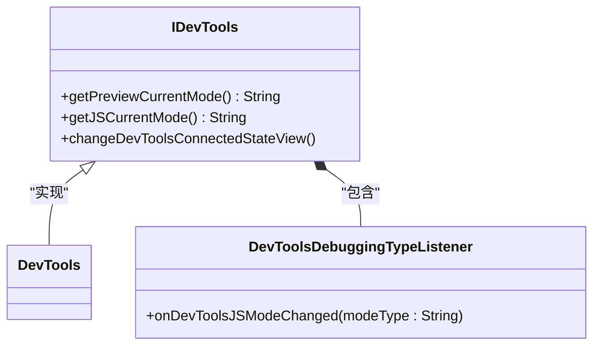

**图示来源**
- [IDevTools.kt](file://GaiaXAndroidClientToStudio/src/main/java/com/alibaba/gaiax/studio/IDevTools.kt#L1-L22)

**本节来源**
- [IDevTools.kt](file://GaiaXAndroidClientToStudio/src/main/java/com/alibaba/gaiax/studio/IDevTools.kt#L1-L22)

### GXSocketKey常量定义
GXSocketKey对象定义了WebSocket通信的协议名称和版本号，为命令系统提供标准化的通信基础。该对象通过常量GAIA_STUDIO_SOCKET_PROTOCOL_NAME和GAIA_STUDIO_SOCKET_PROTOCOL_VERSION确保客户端与服务端使用一致的JSON-RPC协议版本进行通信。

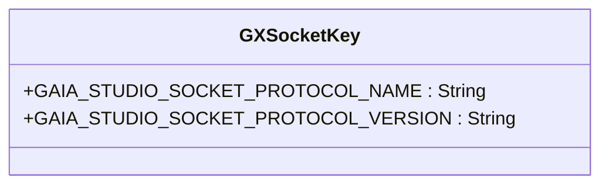

**图示来源**
- [GXSocketKey.kt](file://GaiaXAndroidClientToStudio/src/main/java/com/alibaba/gaiax/studio/GXSocketKey.kt#L7-L12)

**本节来源**
- [GXSocketKey.kt](file://GaiaXAndroidClientToStudio/src/main/java/com/alibaba/gaiax/studio/GXSocketKey.kt#L7-L12)

## 命令注册与路由机制
命令系统通过GXStudioClient类实现命令的注册与路由。该类维护了一个WebSocket连接，并通过内部的gxSocketListener监听器接收来自服务端的命令消息。当接收到命令时，系统会根据消息中的method字段进行路由分发，支持多种类型的命令处理，包括同步调用、异步调用和Promise调用。

系统通过ISocketReceiver接口定义了三种命令接收方法：onReceiveCallSync、onReceiveCallAsync和onReceiveCallPromise，分别对应不同类型的命令执行模式。这种设计使得命令系统能够灵活处理各种执行需求，从即时响应的同步命令到需要长时间处理的异步任务。

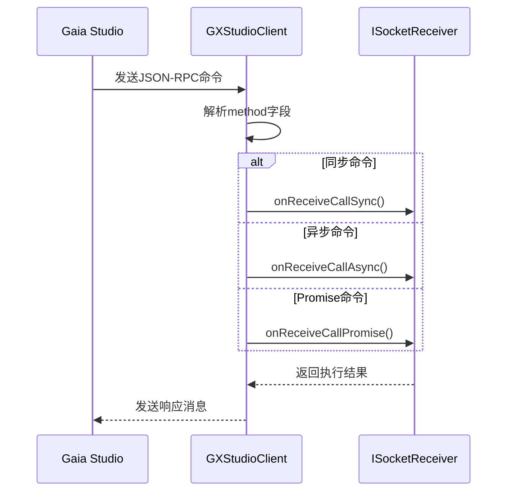

**图示来源**
- [GXStudioClient.kt](file://GaiaXAndroidClientToStudio/src/main/java/com/alibaba/gaiax/studio/GXStudioClient.kt#L20-L33)

**本节来源**
- [GXStudioClient.kt](file://GaiaXAndroidClientToStudio/src/main/java/com/alibaba/gaiax/studio/GXStudioClient.kt#L18-L282)

## 参数解析与执行流程
命令系统的参数解析流程始于GXStudioClient的getParams方法，该方法负责从URL中提取WebSocket地址、模板ID和连接类型等关键参数。参数解析采用正则表达式匹配和URL解码技术，确保能够正确处理各种编码格式的输入。

执行流程从手动连接或自动连接开始，系统首先验证网络环境（如检查VPN连接），然后尝试建立WebSocket连接。连接建立后，系统会发送初始化消息，并根据当前状态决定是否获取模板数据。整个流程通过状态机模式管理，确保在不同连接状态下执行正确的操作序列。

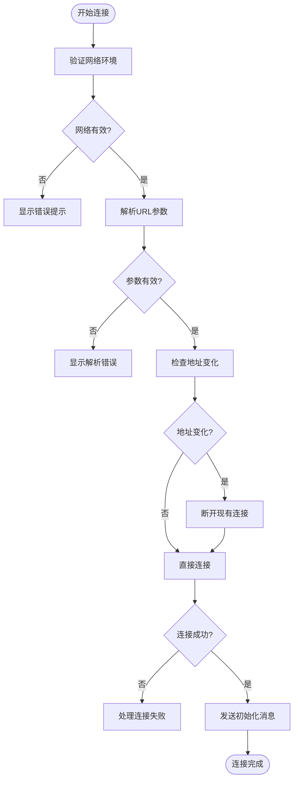

**图示来源**
- [GXStudioClient.kt](file://GaiaXAndroidClientToStudio/src/main/java/com/alibaba/gaiax/studio/GXStudioClient.kt#L129-L163)

**本节来源**
- [GXStudioClient.kt](file://GaiaXAndroidClientToStudio/src/main/java/com/alibaba/gaiax/studio/GXStudioClient.kt#L91-L282)

## 执行反馈与状态管理
系统通过多种机制实现执行反馈和状态管理。在Android端，DevTools类实现了IDevTools接口，维护了当前的预览模式和JS调试模式状态。当模式发生变化时，系统会更新UI并通知相关组件。

状态管理采用本地持久化存储，通过NSUserDefaults在iOS端保存最后的预览模式和JS调试模式。这种设计确保了应用重启后能够恢复到上次的调试状态，提升了开发体验的连续性。同时，系统通过广播机制（NSNotificationCenter）实现跨组件的状态同步，确保所有监听器都能及时收到状态变更通知。

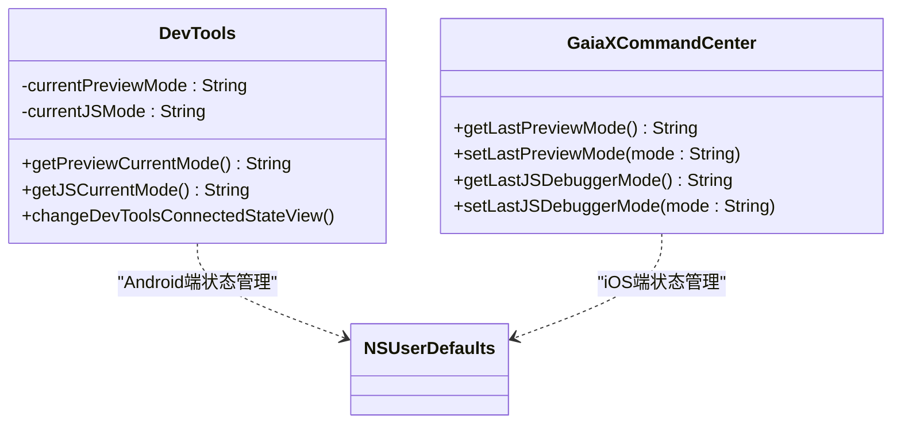

**图示来源**
- [DevTools.kt](file://GaiaXAndroidDemo/app/src/main/kotlin/com/alibaba/gaiax/demo/devtools/DevTools.kt#L41-L43)
- [GaiaXCommandCenter.m](file://GaiaXiOSDemo/GaiaXiOSDemo/Preview/DevTools/GaiaXCommandCenter.m#L101-L136)

**本节来源**
- [DevTools.kt](file://GaiaXAndroidDemo/app/src/main/kotlin/com/alibaba/gaiax/demo/devtools/DevTools.kt#L30-L250)
- [GaiaXCommandCenter.m](file://GaiaXiOSDemo/GaiaXiOSDemo/Preview/DevTools/GaiaXCommandCenter.m#L101-L136)

## 安全验证与权限控制
命令系统在连接阶段实施了基本的安全验证，通过检查设备是否连接VPN来防止在不安全的网络环境下建立调试连接。这一机制由isConnectVpn方法实现，遍历所有网络接口并检查是否存在已连接的VPN接口。

在权限控制方面，系统通过连接状态验证来控制命令的执行权限。在执行关键操作前，系统会调用isGaiaStudioConnected方法检查连接状态，只有在成功连接到Gaia Studio的情况下才允许执行调试命令。这种设计防止了未经授权的调试操作，确保了生产环境的安全性。

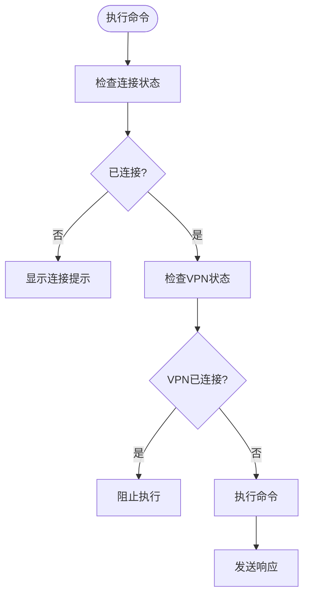

**图示来源**
- [GXStudioClient.kt](file://GaiaXAndroidClientToStudio/src/main/java/com/alibaba/gaiax/studio/GXStudioClient.kt#L165-L175)
- [DevTools.kt](file://GaiaXAndroidDemo/app/src/main/kotlin/com/alibaba/gaiax/demo/devtools/DevTools.kt#L148-L155)

**本节来源**
- [GXStudioClient.kt](file://GaiaXAndroidClientToStudio/src/main/java/com/alibaba/gaiax/studio/GXStudioClient.kt#L165-L175)
- [DevTools.kt](file://GaiaXAndroidDemo/app/src/main/kotlin/com/alibaba/gaiax/demo/devtools/DevTools.kt#L148-L155)

## 错误处理策略
系统采用分层的错误处理策略，针对不同类型的错误采取相应的处理措施。对于网络连接错误，系统会记录详细的错误日志并提示用户检查网络设置。对于参数解析错误，系统会捕获UnsupportedEncodingException异常并返回null，避免程序崩溃。

在命令执行过程中，系统通过try-catch机制捕获潜在的运行时异常，并通过Toast提示等方式向用户反馈错误信息。对于WebSocket连接断开的情况，系统实现了断线重连机制，当检测到IP地址变化时，会自动断开并重新连接，确保调试会话的连续性。

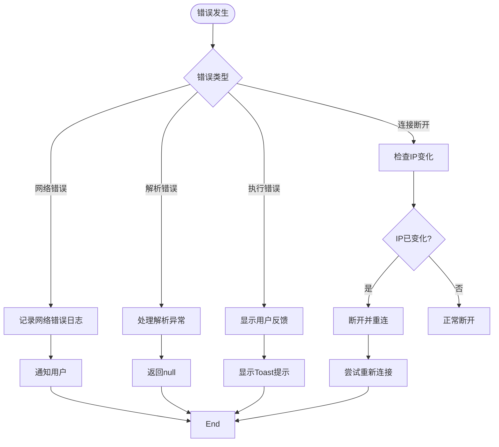

**图示来源**
- [GXStudioClient.kt](file://GaiaXAndroidClientToStudio/src/main/java/com/alibaba/gaiax/studio/GXStudioClient.kt#L52-L58)
- [DevTools.kt](file://GaiaXAndroidDemo/app/src/main/kotlin/com/alibaba/gaiax/demo/devtools/DevTools.kt#L121-L124)

**本节来源**
- [GXStudioClient.kt](file://GaiaXAndroidClientToStudio/src/main/java/com/alibaba/gaiax/studio/GXStudioClient.kt#L45-L69)
- [DevTools.kt](file://GaiaXAndroidDemo/app/src/main/kotlin/com/alibaba/gaiax/demo/devtools/DevTools.kt#L121-L124)

## 常用调试命令示例
系统支持多种常用的调试命令，通过简单的API调用即可实现复杂的调试功能。以下是一些典型的使用示例：

### 连接与断开命令
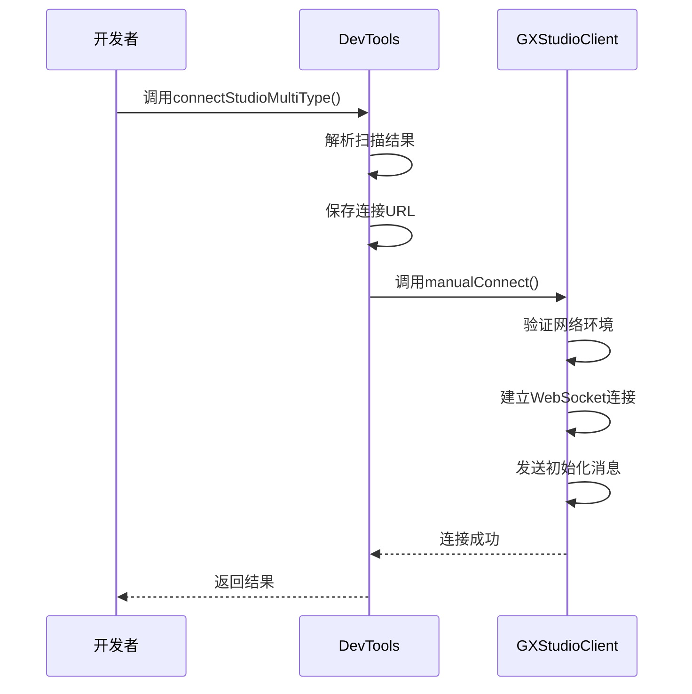

### JS调试模式切换
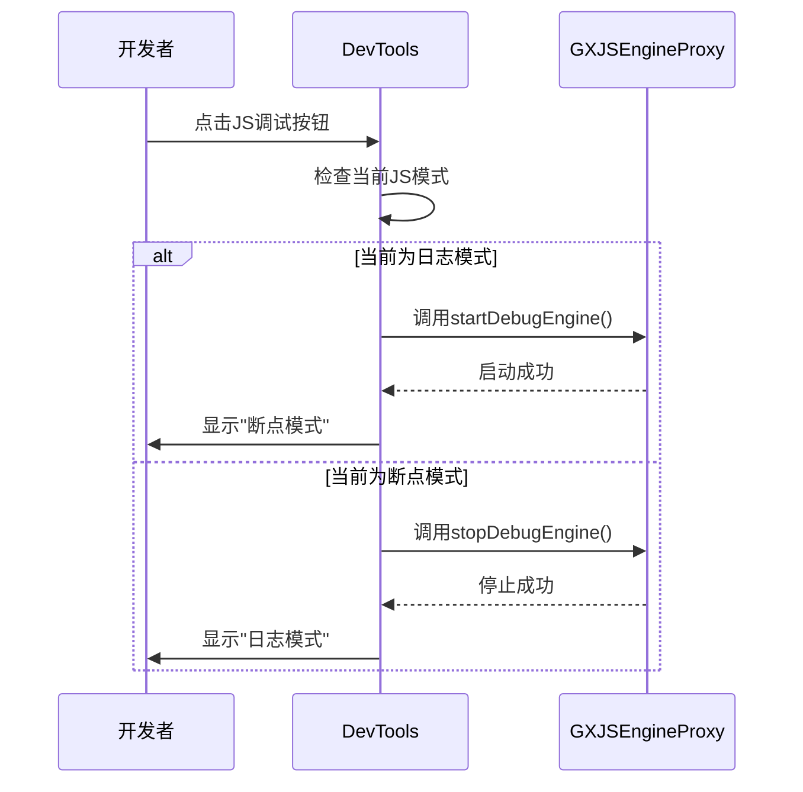

**图示来源**
- [DevTools.kt](file://GaiaXAndroidDemo/app/src/main/kotlin/com/alibaba/gaiax/demo/devtools/DevTools.kt#L78-L92)
- [DevTools.kt](file://GaiaXAndroidDemo/app/src/main/kotlin/com/alibaba/gaiax/demo/devtools/DevTools.kt#L171-L183)

**本节来源**
- [DevTools.kt](file://GaiaXAndroidDemo/app/src/main/kotlin/com/alibaba/gaiax/demo/devtools/DevTools.kt#L78-L92)
- [DevTools.kt](file://GaiaXAndroidDemo/app/src/main/kotlin/com/alibaba/gaiax/demo/devtools/DevTools.kt#L171-L183)

## 自定义命令扩展
系统设计支持自定义命令的扩展，开发者可以通过实现ISocketReceiver接口来处理自定义的命令类型。通过setSocketReceiver方法注册接收器，系统会在收到对应命令时回调相应的处理方法。

扩展自定义命令的步骤包括：定义新的命令方法名、实现ISocketReceiver接口中的对应方法、注册接收器实例。这种设计模式使得命令系统具有良好的可扩展性，能够适应不同项目的特定调试需求。

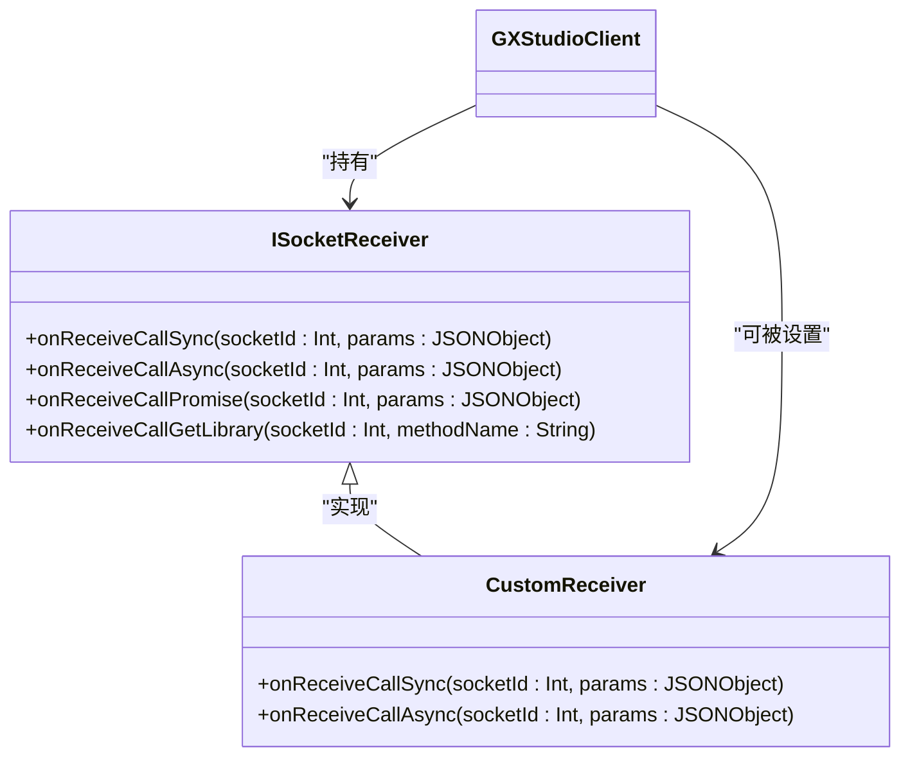

**图示来源**
- [GXStudioClient.kt](file://GaiaXAndroidClientToStudio/src/main/java/com/alibaba/gaiax/studio/GXStudioClient.kt#L20-L33)
- [GXStudioClient.kt](file://GaiaXAndroidClientToStudio/src/main/java/com/alibaba/gaiax/studio/GXStudioClient.kt#L260-L262)

**本节来源**
- [GXStudioClient.kt](file://GaiaXAndroidClientToStudio/src/main/java/com/alibaba/gaiax/studio/GXStudioClient.kt#L20-L33)

## 命令拦截与异步执行
系统支持命令拦截和异步执行机制，通过在命令执行前添加检查逻辑实现拦截功能。例如，在执行任何调试命令前，系统会检查是否已连接到Gaia Studio，如果未连接则提示用户先进行连接。

异步执行通过ISocketReceiver的onReceiveCallAsync方法实现，允许长时间运行的任务在后台线程中执行，避免阻塞主线程。系统还支持Promise模式的命令执行，通过onReceiveCallPromise方法处理需要异步回调的命令，提供更灵活的异步编程模型。

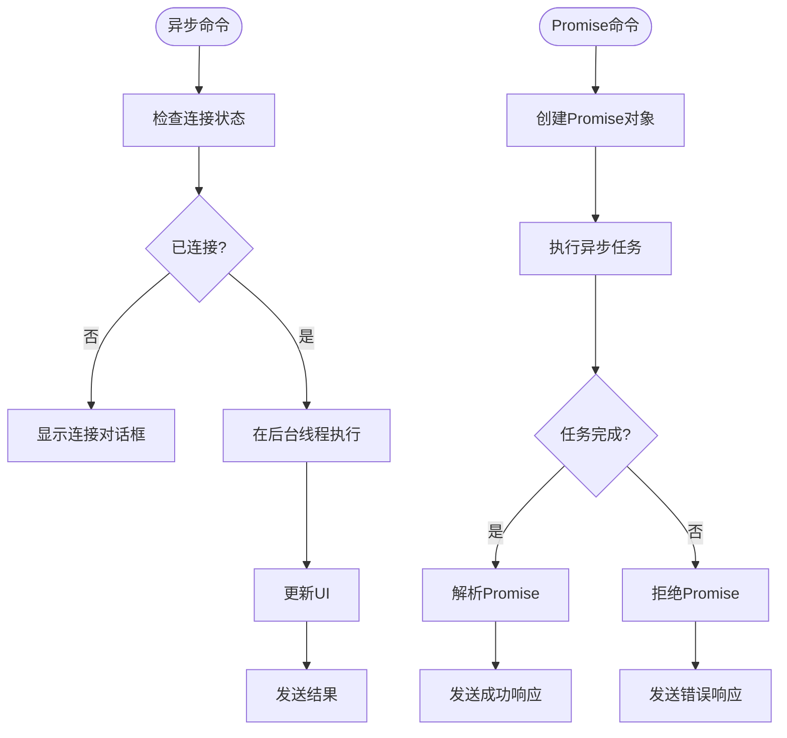

**图示来源**
- [GXStudioClient.kt](file://GaiaXAndroidClientToStudio/src/main/java/com/alibaba/gaiax/studio/GXStudioClient.kt#L27-L30)
- [DevTools.kt](file://GaiaXAndroidDemo/app/src/main/kotlin/com/alibaba/gaiax/demo/devtools/DevTools.kt#L148-L155)

**本节来源**
- [GXStudioClient.kt](file://GaiaXAndroidClientToStudio/src/main/java/com/alibaba/gaiax/studio/GXStudioClient.kt#L27-L30)
- [DevTools.kt](file://GaiaXAndroidDemo/app/src/main/kotlin/com/alibaba/gaiax/demo/devtools/DevTools.kt#L148-L155)

## iOS平台命令中心实现
在iOS平台，GaiaXCommandCenter类作为命令处理的中心枢纽，采用单例模式确保全局唯一实例。该类通过NSNotificationCenter注册多个通知监听器，将不同类型的命令映射到相应的处理方法。

命令中心的实现特点包括：使用dispatch_once保证单例的线程安全、通过NSUserDefaults持久化存储调试模式状态、集成GaiaXSocket和GaiaXJS组件实现完整的调试功能。当收到命令通知时，系统会解析userInfo中的type和action字段，执行相应的调试操作并更新UI反馈。

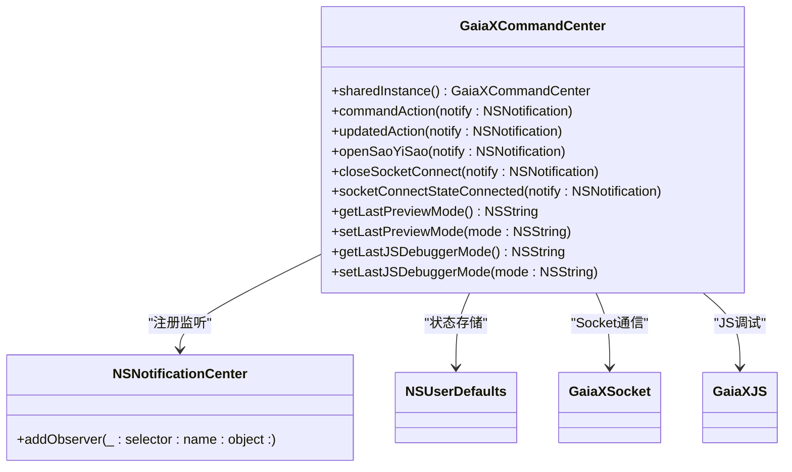

**图示来源**
- [GaiaXCommandCenter.h](file://GaiaXiOSDemo/GaiaXiOSDemo/Preview/DevTools/GaiaXCommandCenter.h#L20-L24)
- [GaiaXCommandCenter.m](file://GaiaXiOSDemo/GaiaXiOSDemo/Preview/DevTools/GaiaXCommandCenter.m#L25-L37)

**本节来源**
- [GaiaXCommandCenter.h](file://GaiaXiOSDemo/GaiaXiOSDemo/Preview/DevTools/GaiaXCommandCenter.h#L20-L24)
- [GaiaXCommandCenter.m](file://GaiaXiOSDemo/GaiaXiOSDemo/Preview/DevTools/GaiaXCommandCenter.m#L25-L138)