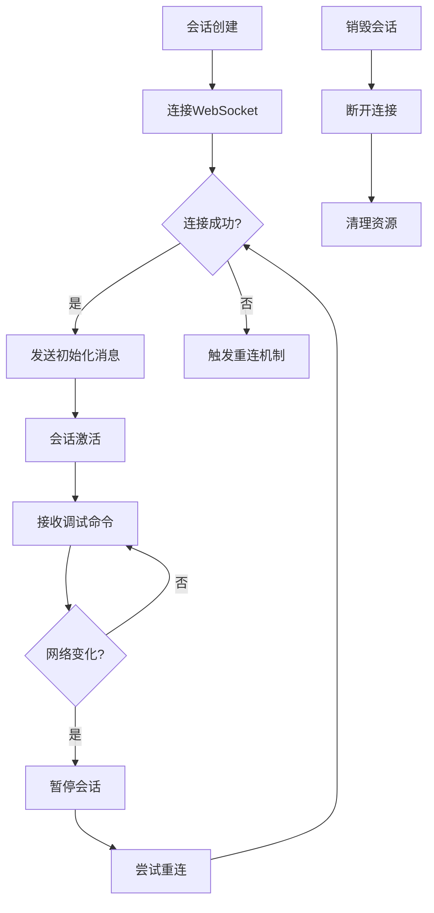
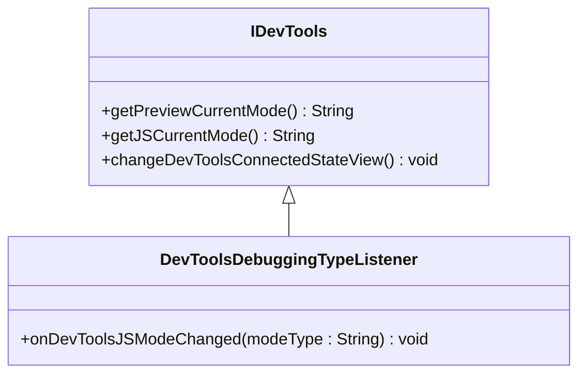
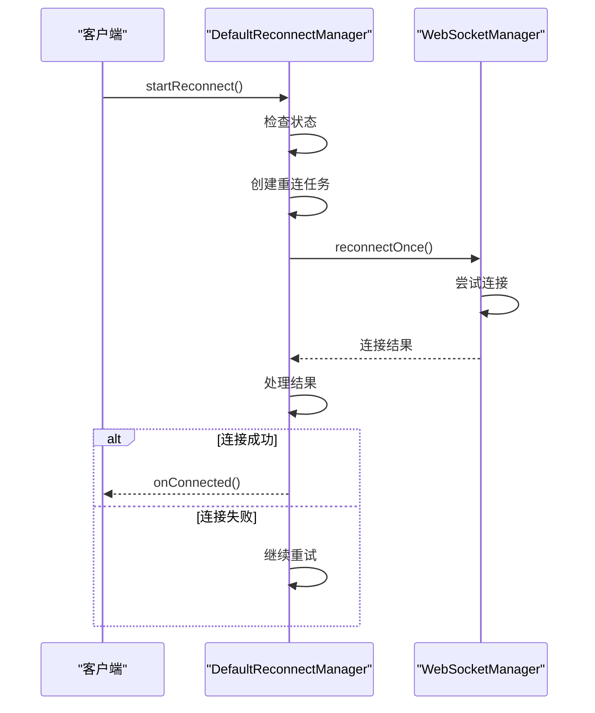
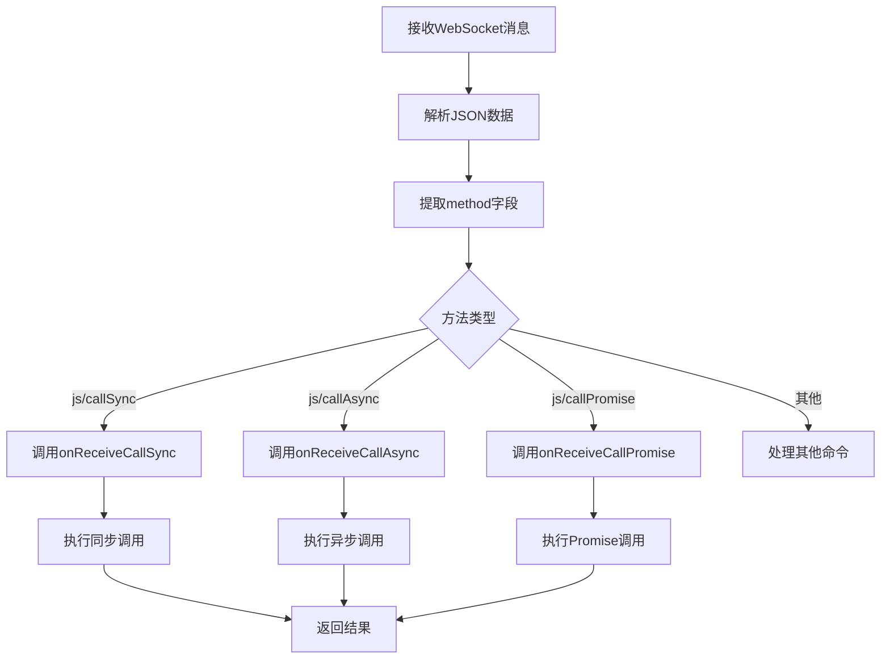
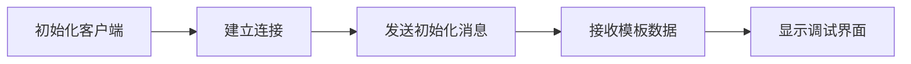

# 会话控制

<cite>
**本文档引用的文件**   
- [GXStudioClient.kt](file://GaiaXAndroidClientToStudio/src/main/java/com/alibaba/gaiax/studio/GXStudioClient.kt)
- [IDevTools.kt](file://GaiaXAndroidClientToStudio/src/main/java/com/alibaba/gaiax/studio/IDevTools.kt)
- [Utils.kt](file://GaiaXAndroidClientToStudio/src/main/java/com/alibaba/gaiax/studio/Utils.kt)
- [DefaultReconnectManager.java](file://GaiaXAndroidClientToStudio/src/main/java/com/alibaba/gaiax/studio/third/socket/websocket/DefaultReconnectManager.java)
- [GXSocket.kt](file://GaiaXAndroidClientToStudio/src/main/java/com/alibaba/gaiax/studio/GXSocket.kt)
</cite>

## 目录
1. [简介](#简介)
2. [会话生命周期管理](#会话生命周期管理)
3. [调试功能契约定义](#调试功能契约定义)
4. [会话状态管理与持久化](#会话状态管理与持久化)
5. [调试命令分发与处理](#调试命令分发与处理)
6. [安全考虑](#安全考虑)
7. [性能优化建议](#性能优化建议)
8. [初学者示例](#初学者示例)
9. [高级开发者指南](#高级开发者指南)

## 简介
GaiaX实时调试会话控制机制为开发者提供了强大的调试能力，通过GXStudioClient和IDevTools接口实现调试会话的全生命周期管理。该系统支持实时预览、手动推送和JS调试等多种模式，为开发者提供了灵活的调试环境。会话控制核心基于WebSocket通信协议，实现了稳定可靠的双向通信通道。

**Section sources**
- [GXStudioClient.kt](file://GaiaXAndroidClientToStudio/src/main/java/com/alibaba/gaiax/studio/GXStudioClient.kt#L1-L282)
- [GXSocket.kt](file://GaiaXAndroidClientToStudio/src/main/java/com/alibaba/gaiax/studio/GXSocket.kt#L1-L442)

## 会话生命周期管理
GaiaX的调试会话生命周期由GXStudioClient类统一管理，包含创建、激活、暂停和销毁四个主要阶段。会话创建通过`autoConnect`或`manualConnect`方法触发，系统会自动处理WebSocket连接的建立过程。会话激活在WebSocket连接成功后通过`onSocketConnected`回调通知，此时会发送初始化消息以建立完整的调试通道。

会话暂停机制通过网络状态监听实现，当设备网络发生变化时，系统会自动断开连接并尝试重连。会话销毁通过`destroy`方法执行，该方法会清理所有资源并断开WebSocket连接。整个生命周期管理过程中，系统通过`gxSocketListener`监听器接收各种状态变化事件。

**Diagram sources **
- [GXStudioClient.kt](file://GaiaXAndroidClientToStudio/src/main/java/com/alibaba/gaiax/studio/GXStudioClient.kt#L17-L281)
- [GXSocket.kt](file://GaiaXAndroidClientToStudio/src/main/java/com/alibaba/gaiax/studio/GXSocket.kt#L16-L440)

**Section sources**
- [GXStudioClient.kt](file://GaiaXAndroidClientToStudio/src/main/java/com/alibaba/gaiax/studio/GXStudioClient.kt#L79-L266)
- [GXSocket.kt](file://GaiaXAndroidClientToStudio/src/main/java/com/alibaba/gaiax/studio/GXSocket.kt#L62-L119)

## 调试功能契约定义
IDevTools接口定义了调试功能的核心契约，为调试工具提供了标准化的交互方式。该接口包含`getPreviewCurrentMode`和`getJSCurrentMode`方法，用于获取当前的预览模式和JS调试模式。接口还定义了`changeDevToolsConnectedStateView`方法，用于更新调试工具的连接状态视图。

IDevTools接口的`DevToolsDebuggingTypeListener`内部接口定义了调试模式变化的监听机制，当JS调试模式发生改变时会触发`onDevToolsJSModeChanged`回调。这种契约设计实现了调试功能的解耦，使得不同的调试工具可以基于同一接口实现，提高了系统的可扩展性。

**Diagram sources **
- [IDevTools.kt](file://GaiaXAndroidClientToStudio/src/main/java/com/alibaba/gaiax/studio/IDevTools.kt#L10-L21)

**Section sources**
- [IDevTools.kt](file://GaiaXAndroidClientToStudio/src/main/java/com/alibaba/gaiax/studio/IDevTools.kt#L10-L21)

## 会话状态管理与持久化
会话状态管理通过Utils工具类和DefaultReconnectManager实现。Utils类提供了`saveInLocal`和`loadInLocal`方法，用于将会话相关的URL等信息持久化存储在SharedPreferences中。这些方法使用`GX_SP_NAME`作为共享首选项名称，确保数据的安全存储。

DefaultReconnectManager实现了会话的持久化重连机制，通过单线程执行器管理重连任务。该管理器使用阻塞锁机制确保线程安全，通过`reconnecting`标志位跟踪重连状态。重连过程采用循环尝试策略，最多尝试`getReconnectFrequency`次，每次尝试间隔由`getConnectTimeout`决定。

**Diagram sources **
- [Utils.kt](file://GaiaXAndroidClientToStudio/src/main/java/com/alibaba/gaiax/studio/Utils.kt#L1-L20)
- [DefaultReconnectManager.java](file://GaiaXAndroidClientToStudio/src/main/java/com/alibaba/gaiax/studio/third/socket/websocket/DefaultReconnectManager.java#L13-L161)

**Section sources**
- [Utils.kt](file://GaiaXAndroidClientToStudio/src/main/java/com/alibaba/gaiax/studio/Utils.kt#L10-L20)
- [DefaultReconnectManager.java](file://GaiaXAndroidClientToStudio/src/main/java/com/alibaba/gaiax/studio/third/socket/websocket/DefaultReconnectManager.java#L13-L161)

## 调试命令分发与处理
调试命令的分发与处理机制基于WebSocket消息协议实现。GXSocket类通过`onMessage`方法接收来自GaiaX Studio的消息，并根据消息中的`method`字段进行路由分发。系统支持多种调试命令类型，包括`js/callSync`、`js/callAsync`和`js/callPromise`等同步和异步调用。

命令处理流程首先解析JSON消息，提取`socketId`和`socketMethod`，然后根据方法类型调用相应的处理器。对于JS相关命令，系统会通过`socketReceiver`回调通知上层应用。消息分发过程中，系统使用`methodIdManager`映射表管理方法ID，确保响应消息能够正确路由到发起请求的组件。

**Diagram sources **
- [GXSocket.kt](file://GaiaXAndroidClientToStudio/src/main/java/com/alibaba/gaiax/studio/GXSocket.kt#L123-L180)

**Section sources**
- [GXSocket.kt](file://GaiaXAndroidClientToStudio/src/main/java/com/alibaba/gaiax/studio/GXSocket.kt#L123-L180)

## 安全考虑
会话控制系统的安全机制主要体现在连接验证和权限控制两个方面。系统通过`isConnectVpn`方法检测设备是否连接了VPN，防止在不安全的网络环境下建立调试连接。在连接建立过程中，系统会对URL参数进行严格验证，确保连接地址的合法性。

权限分级控制通过不同的调试模式实现，系统提供了`PREVIEW_AUTO`、`PREVIEW_MANUAL`和`PREVIEW_NONE`三种预览模式，以及`JS_DEFAULT`和`JS_BREAKPOINT`两种JS调试模式。敏感操作如断开连接和模式切换都经过明确的用户确认，防止误操作导致调试中断。

**Section sources**
- [GXStudioClient.kt](file://GaiaXAndroidClientToStudio/src/main/java/com/alibaba/gaiax/studio/GXStudioClient.kt#L165-L175)
- [GXSocket.kt](file://GaiaXAndroidClientToStudio/src/main/java/com/alibaba/gaiax/studio/GXSocket.kt#L71-L95)

## 性能优化建议
为提高会话控制的性能，建议采用以下优化策略：首先，合理配置WebSocket的重连频率和超时时间，避免过于频繁的重连尝试消耗系统资源。其次，使用会话缓存机制，将会话状态信息存储在内存中，减少重复的网络请求。

资源清理方面，应在会话销毁时及时释放所有相关资源，包括WebSocket连接、监听器和线程池。对于长时间不活动的会话，建议实现自动清理机制，防止内存泄漏。此外，可以考虑对调试消息进行批量处理，减少频繁的UI更新操作。

**Section sources**
- [DefaultReconnectManager.java](file://GaiaXAndroidClientToStudio/src/main/java/com/alibaba/gaiax/studio/third/socket/websocket/DefaultReconnectManager.java#L43-L44)
- [GXSocket.kt](file://GaiaXAndroidClientToStudio/src/main/java/com/alibaba/gaiax/studio/GXSocket.kt#L83-L87)

## 初学者示例
对于初学者，可以从简单的会话初始化开始。首先调用`GXStudioClient.instance.init(context)`初始化客户端，然后通过`autoConnect`或`manualConnect`方法建立调试连接。基本的调试操作包括发送日志消息和获取模板数据，分别使用`sendJSLogMsg`和`sendMsgForGetTemplateData`方法实现。

**Section sources**
- [GXStudioClient.kt](file://GaiaXAndroidClientToStudio/src/main/java/com/alibaba/gaiax/studio/GXStudioClient.kt#L79-L84)
- [GXSocket.kt](file://GaiaXAndroidClientToStudio/src/main/java/com/alibaba/gaiax/studio/GXSocket.kt#L220-L234)

## 高级开发者指南
高级开发者可以利用多会话并发管理功能，通过维护多个GXStudioClient实例实现同时调试多个模板。调试状态同步可以通过自定义的`IFastPreviewListener`实现，监听模板数据的变化并实时更新UI。会话恢复机制利用DefaultReconnectManager的持久化功能，在网络中断后自动恢复调试会话。

对于复杂的调试场景，可以扩展IDevTools接口，添加自定义的调试功能。通过实现`DevToolsDebuggingTypeListener`，可以监听调试模式的变化并执行相应的业务逻辑。此外，可以利用GXSocket的`sendMessage`方法发送自定义的调试命令，实现更精细的调试控制。

**Section sources**
- [GXStudioClient.kt](file://GaiaXAndroidClientToStudio/src/main/java/com/alibaba/gaiax/studio/GXStudioClient.kt#L20-L23)
- [DefaultReconnectManager.java](file://GaiaXAndroidClientToStudio/src/main/java/com/alibaba/gaiax/studio/third/socket/websocket/DefaultReconnectManager.java#L156-L161)