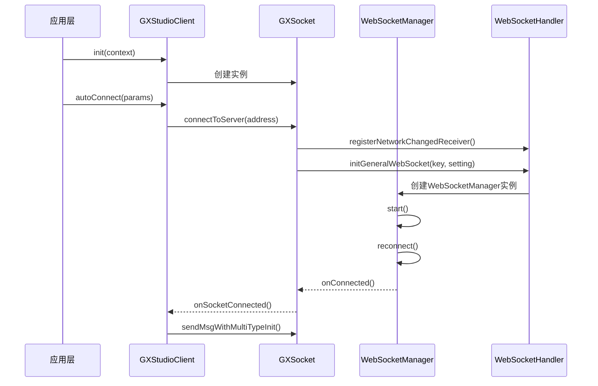
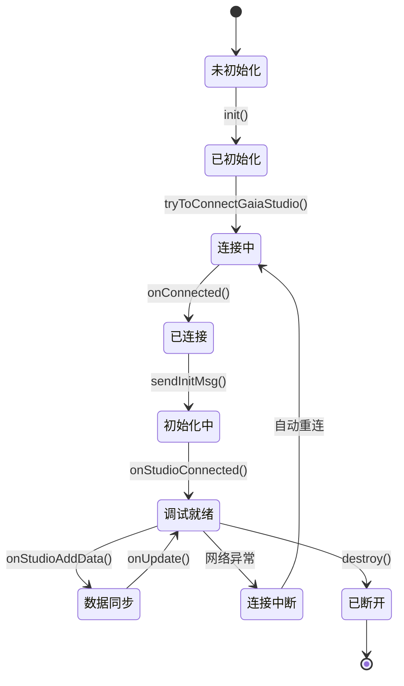
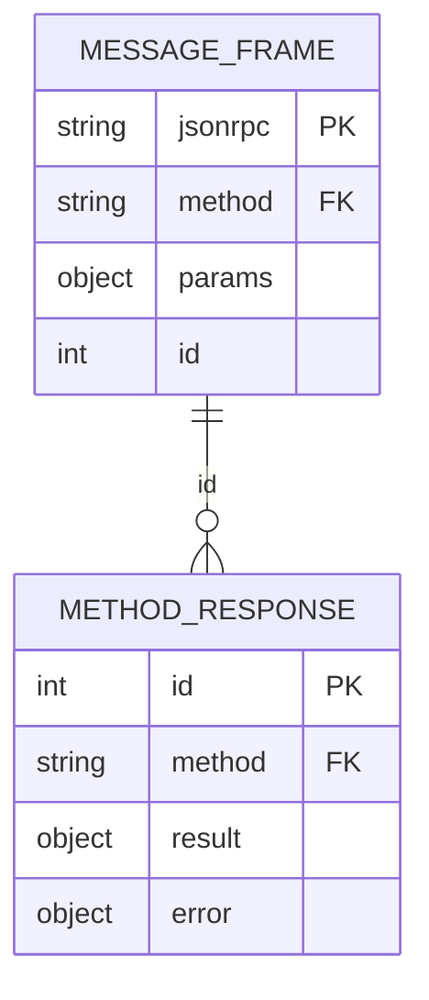
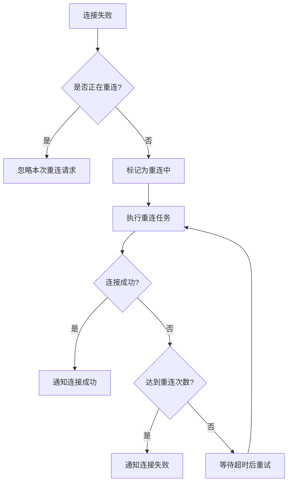
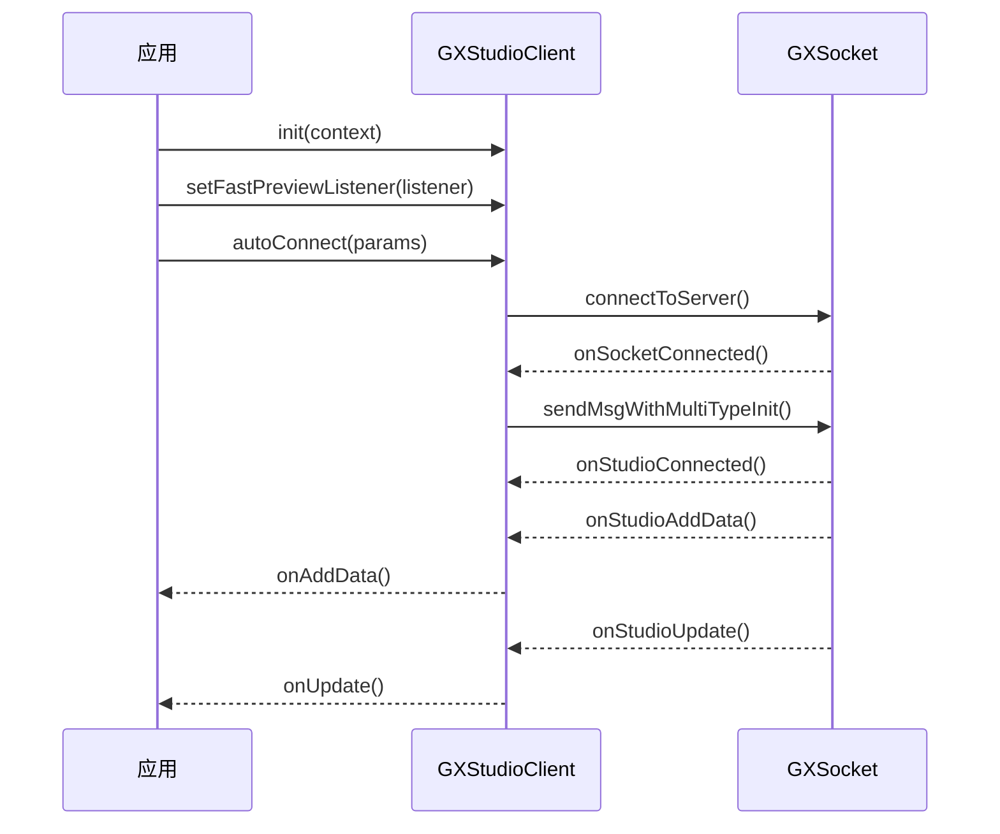
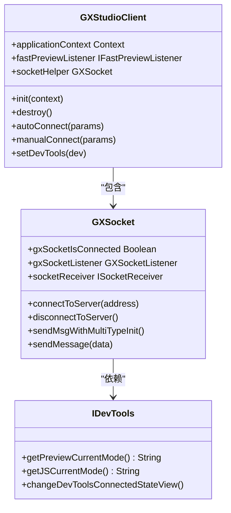

# 实时调试

<cite>
**本文档引用文件**   
- [GXSocket.kt](file://GaiaXAndroidClientToStudio/src/main/java/com/alibaba/gaiax/studio/GXSocket.kt)
- [GXSocketKey.kt](file://GaiaXAndroidClientToStudio/src/main/java/com/alibaba/gaiax/studio/GXSocketKey.kt)
- [GXStudioClient.kt](file://GaiaXAndroidClientToStudio/src/main/java/com/alibaba/gaiax/studio/GXStudioClient.kt)
- [IDevTools.kt](file://GaiaXAndroidClientToStudio/src/main/java/com/alibaba/gaiax/studio/IDevTools.kt)
- [WebSocketManager.java](file://GaiaXAndroidClientToStudio/src/main/java/com/alibaba/gaiax/studio/third/socket/websocket/WebSocketManager.java)
- [WebSocketHandler.java](file://GaiaXAndroidClientToStudio/src/main/java/com/alibaba/gaiax/studio/third/socket/websocket/WebSocketHandler.java)
</cite>

## 目录
1. [简介](#简介)
2. [连接建立过程](#连接建立过程)
3. [会话生命周期管理](#会话生命周期管理)
4. [通信协议与数据帧格式](#通信协议与数据帧格式)
5. [心跳机制与错误重连策略](#心跳机制与错误重连策略)
6. [基础通信示例](#基础通信示例)
7. [多设备调试与高级会话管理](#多设备调试与高级会话管理)
8. [安全考虑](#安全考虑)
9. [性能优化建议](#性能优化建议)
10. [故障排除指南](#故障排除指南)

## 简介
GaiaX实时调试系统通过WebSocket连接实现客户端与调试工具之间的双向通信，为开发者提供高效的实时预览和调试能力。该系统主要由GXSocket、GXStudioClient和WebSocketManager等核心组件构成，支持手动推送和实时预览两种调试模式。本文档详细阐述了WebSocket连接的建立过程、会话生命周期管理、通信协议格式、心跳机制以及错误处理策略，为不同层次的开发者提供全面的指导。

**Section sources**
- [GXSocket.kt](file://GaiaXAndroidClientToStudio/src/main/java/com/alibaba/gaiax/studio/GXSocket.kt#L1-L442)
- [GXStudioClient.kt](file://GaiaXAndroidClientToStudio/src/main/java/com/alibaba/gaiax/studio/GXStudioClient.kt#L1-L282)

## 连接建立过程
GaiaX的WebSocket连接建立过程由GXStudioClient和GXSocket协同完成。首先，开发者需要调用GXStudioClient的init方法初始化调试环境，该方法会创建GXSocket实例并设置应用上下文。连接的核心方法是GXSocket.connectToServer，该方法接收服务器地址作为参数，初始化WebSocketSetting配置对象，设置连接超时时间为15秒，重连频率为1次，并启用网络状态变化时的自动重连功能。

**Diagram sources **
- [GXStudioClient.kt](file://GaiaXAndroidClientToStudio/src/main/java/com/alibaba/gaiax/studio/GXStudioClient.kt#L78-L83)
- [GXSocket.kt](file://GaiaXAndroidClientToStudio/src/main/java/com/alibaba/gaiax/studio/GXSocket.kt#L69-L95)
- [WebSocketHandler.java](file://GaiaXAndroidClientToStudio/src/main/java/com/alibaba/gaiax/studio/third/socket/websocket/WebSocketHandler.java#L84-L99)
- [WebSocketManager.java](file://GaiaXAndroidClientToStudio/src/main/java/com/alibaba/gaiax/studio/third/socket/websocket/WebSocketManager.java#L75-L84)

**Section sources**
- [GXSocket.kt](file://GaiaXAndroidClientToStudio/src/main/java/com/alibaba/gaiax/studio/GXSocket.kt#L69-L95)
- [GXStudioClient.kt](file://GaiaXAndroidClientToStudio/src/main/java/com/alibaba/gaiax/studio/GXStudioClient.kt#L78-L83)

## 会话生命周期管理
GXStudioClient负责管理整个调试会话的生命周期，通过状态机模式协调连接、初始化、数据同步和断开等各个阶段。会话管理的核心是GXStudioClient的tryToConnectGaiaStudio方法，该方法会检查当前连接地址是否发生变化，如果地址不同则先断开现有连接再建立新连接，确保会话的正确性。

**Diagram sources **
- [GXStudioClient.kt](file://GaiaXAndroidClientToStudio/src/main/java/com/alibaba/gaiax/studio/GXStudioClient.kt#L177-L193)
- [GXSocket.kt](file://GaiaXAndroidClientToStudio/src/main/java/com/alibaba/gaiax/studio/GXSocket.kt#L98-L101)

**Section sources**
- [GXStudioClient.kt](file://GaiaXAndroidClientToStudio/src/main/java/com/alibaba/gaiax/studio/GXStudioClient.kt#L177-L193)
- [GXSocket.kt](file://GaiaXAndroidClientToStudio/src/main/java/com/alibaba/gaiax/studio/GXSocket.kt#L98-L101)

## 通信协议与数据帧格式
GaiaX使用基于JSON-RPC 2.0的自定义通信协议，通过GXSocketKey定义了协议名称和版本号。数据帧采用标准的JSON格式，包含jsonrpc、method、params和id等字段。GXSocket类中的sendMessage方法负责将JSON数据序列化并通过WebSocket发送，同时使用methodIdManager映射表管理方法调用的响应。

**Diagram sources **
- [GXSocketKey.kt](file://GaiaXAndroidClientToStudio/src/main/java/com/alibaba/gaiax/studio/GXSocketKey.kt#L8-L13)
- [GXSocket.kt](file://GaiaXAndroidClientToStudio/src/main/java/com/alibaba/gaiax/studio/GXSocket.kt#L373-L379)

**Section sources**
- [GXSocketKey.kt](file://GaiaXAndroidClientToStudio/src/main/java/com/alibaba/gaiax/studio/GXSocketKey.kt#L8-L13)
- [GXSocket.kt](file://GaiaXAndroidClientToStudio/src/main/java/com/alibaba/gaiax/studio/GXSocket.kt#L373-L379)

## 心跳机制与错误重连策略
系统实现了多层次的连接稳定性保障机制。在心跳机制方面，WebSocketSetting的connectionLostTimeout被设置为0，表示不使用内置心跳，而是依赖应用层的消息交互来维持连接活跃。错误重连策略由DefaultReconnectManager实现，当连接失败时会执行重连逻辑，通过单线程池执行重连任务，避免并发重连导致的问题。

**Diagram sources **
- [WebSocketManager.java](file://GaiaXAndroidClientToStudio/src/main/java/com/alibaba/gaiax/studio/third/socket/websocket/WebSocketManager.java#L289-L302)
- [DefaultReconnectManager.java](file://GaiaXAndroidClientToStudio/src/main/java/com/alibaba/gaiax/studio/third/socket/websocket/DefaultReconnectManager.java#L78-L123)

**Section sources**
- [WebSocketManager.java](file://GaiaXAndroidClientToStudio/src/main/java/com/alibaba/gaiax/studio/third/socket/websocket/WebSocketManager.java#L289-L302)
- [DefaultReconnectManager.java](file://GaiaXAndroidClientToStudio/src/main/java/com/alibaba/gaiax/studio/third/socket/websocket/DefaultReconnectManager.java#L78-L123)

## 基础通信示例
对于初学者，可以通过简单的API调用来实现基础通信。首先调用GXStudioClient.init初始化客户端，然后使用autoConnect或manualConnect方法建立连接。连接成功后，系统会自动发送初始化消息，开发者可以通过设置IFastPreviewListener来接收模板数据更新事件。

**Diagram sources **
- [GXStudioClient.kt](file://GaiaXAndroidClientToStudio/src/main/java/com/alibaba/gaiax/studio/GXStudioClient.kt#L101-L111)
- [GXSocket.kt](file://GaiaXAndroidClientToStudio/src/main/java/com/alibaba/gaiax/studio/GXSocket.kt#L219-L233)

**Section sources**
- [GXStudioClient.kt](file://GaiaXAndroidClientToStudio/src/main/java/com/alibaba/gaiax/studio/GXStudioClient.kt#L101-L111)
- [GXSocket.kt](file://GaiaXAndroidClientToStudio/src/main/java/com/alibaba/gaiax/studio/GXSocket.kt#L219-L233)

## 多设备调试与高级会话管理
系统支持多设备同时调试，通过WebSocketHandler的initGeneralWebSocket方法为每个连接创建独立的WebSocketManager实例，并使用唯一key进行标识。高级会话管理功能包括模式切换、JS调试控制和连接状态监控。IDevTools接口定义了获取当前预览模式和JS调试模式的方法，允许开发者根据需要动态调整调试行为。

**Diagram sources **
- [GXStudioClient.kt](file://GaiaXAndroidClientToStudio/src/main/java/com/alibaba/gaiax/studio/GXStudioClient.kt#L17-L281)
- [GXSocket.kt](file://GaiaXAndroidClientToStudio/src/main/java/com/alibaba/gaiax/studio/GXSocket.kt#L16-L440)
- [IDevTools.kt](file://GaiaXAndroidClientToStudio/src/main/java/com/alibaba/gaiax/studio/IDevTools.kt#L11-L22)

**Section sources**
- [GXStudioClient.kt](file://GaiaXAndroidClientToStudio/src/main/java/com/alibaba/gaiax/studio/GXStudioClient.kt#L17-L281)
- [GXSocket.kt](file://GaiaXAndroidClientToStudio/src/main/java/com/alibaba/gaiax/studio/GXSocket.kt#L16-L440)
- [IDevTools.kt](file://GaiaXAndroidClientToStudio/src/main/java/com/alibaba/gaiax/studio/IDevTools.kt#L11-L22)

## 安全考虑
系统在安全方面采取了多项措施。首先，通过检查VPN连接状态来避免在不安全的网络环境下建立调试连接。其次，使用WebSocketSetting配置对象来管理连接参数，包括代理设置和请求头信息。此外，系统还实现了连接验证机制，通过initialized消息来确认调试环境的正确性。

**Section sources**
- [GXStudioClient.kt](file://GaiaXAndroidClientToStudio/src/main/java/com/alibaba/gaiax/studio/GXStudioClient.kt#L164-L174)
- [WebSocketSetting.java](file://GaiaXAndroidClientToStudio/src/main/java/com/alibaba/gaiax/studio/third/socket/websocket/WebSocketSetting.java#L1-L243)

## 性能优化建议
为确保调试过程的流畅性，建议开发者遵循以下性能优化原则：合理设置重连频率，避免过于频繁的重连尝试；在UI线程中处理模板更新，使用updateTask延迟执行来避免频繁刷新；正确管理WebSocket连接生命周期，在Activity销毁时调用destroy方法释放资源；避免在调试模式下进行大量数据传输，只同步必要的模板变更。

**Section sources**
- [GXSocket.kt](file://GaiaXAndroidClientToStudio/src/main/java/com/alibaba/gaiax/studio/GXSocket.kt#L30-L31)
- [GXStudioClient.kt](file://GaiaXAndroidClientToStudio/src/main/java/com/alibaba/gaiax/studio/GXStudioClient.kt#L85-L88)

## 故障排除指南
常见问题包括连接失败、数据不同步和频繁重连。连接失败通常由网络问题或VPN导致，可通过isConnectVpn方法检测并提示用户。数据不同步问题可能源于模板ID管理不当，应确保正确处理mainTemplateId和subTemplateCount。频繁重连可能是由于网络不稳定或服务器配置问题，建议检查connectionLostTimeout设置和网络环境。

**Section sources**
- [GXSocket.kt](file://GaiaXAndroidClientToStudio/src/main/java/com/alibaba/gaiax/studio/GXSocket.kt#L103-L106)
- [GXStudioClient.kt](file://GaiaXAndroidClientToStudio/src/main/java/com/alibaba/gaiax/studio/GXStudioClient.kt#L164-L174)
- [WebSocketManager.java](file://GaiaXAndroidClientToStudio/src/main/java/com/alibaba/gaiax/studio/third/socket/websocket/WebSocketManager.java#L350-L358)