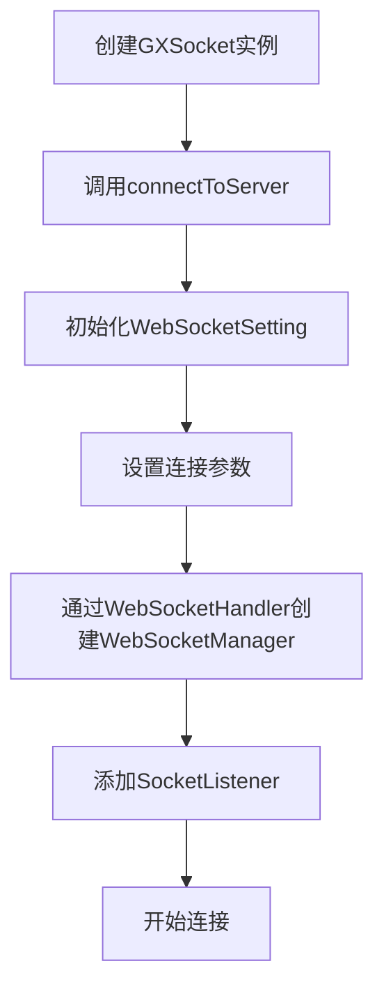
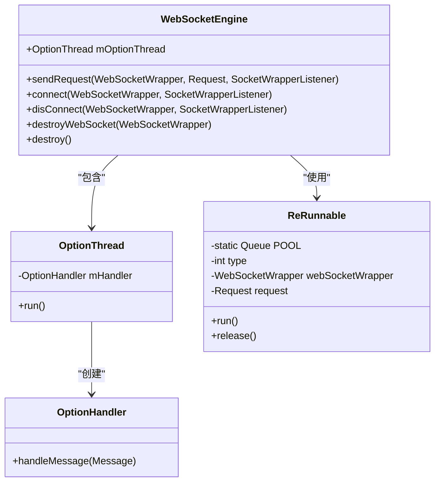
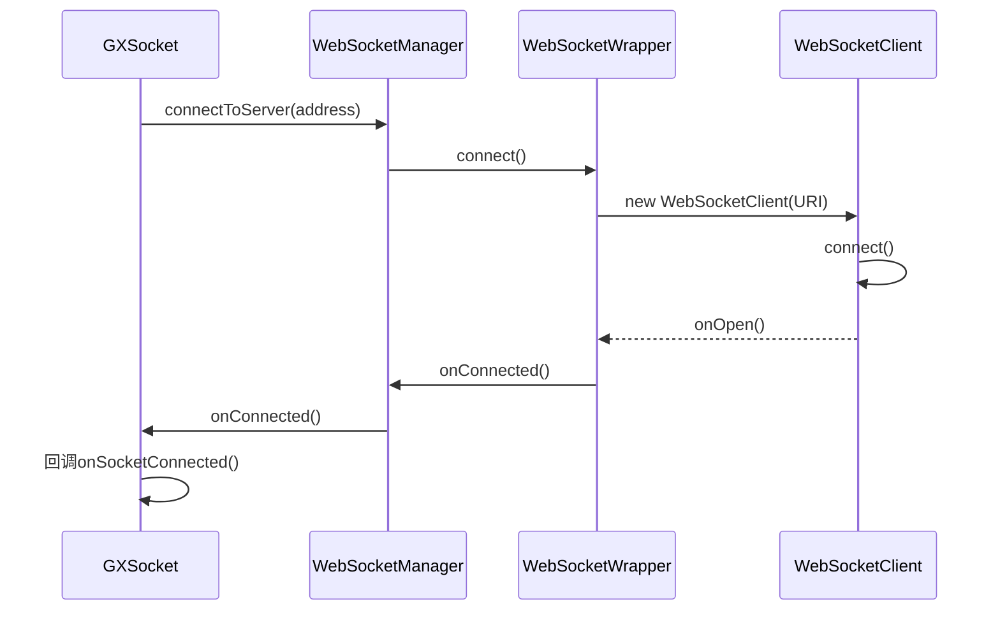
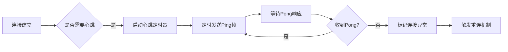
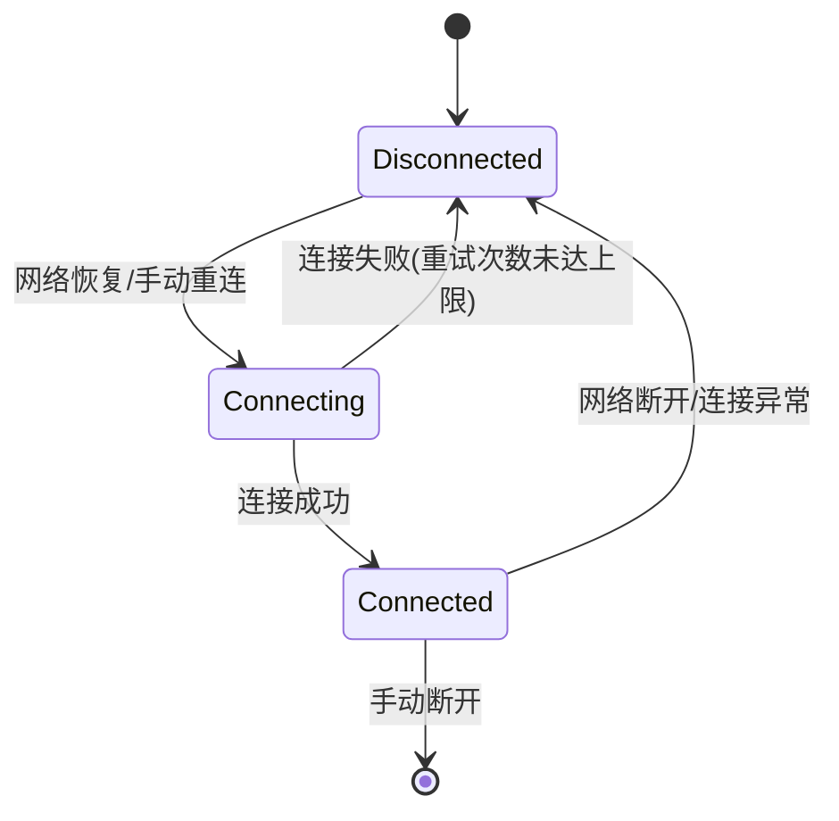
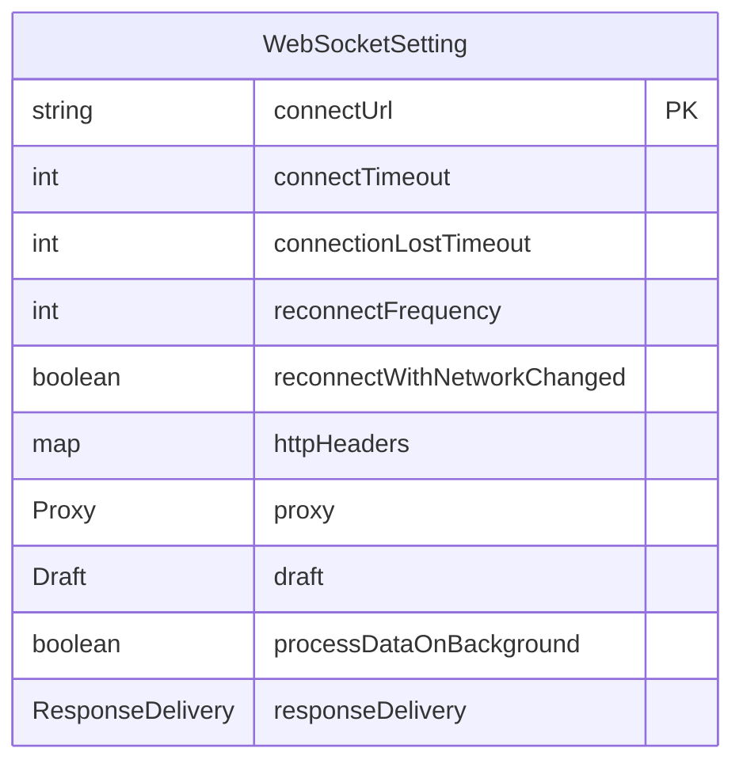
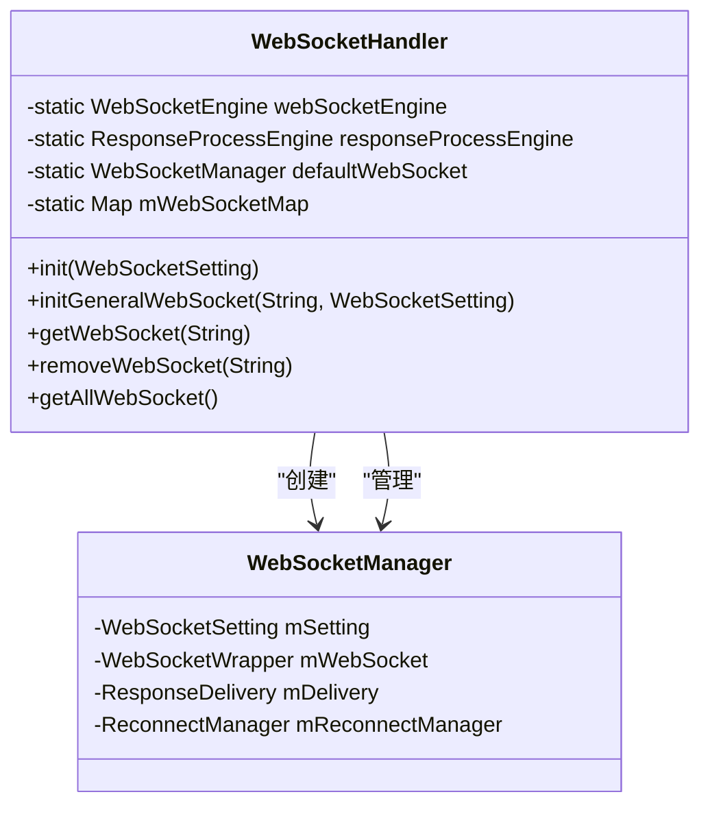

# 连接管理

<cite>
**本文档中引用的文件**  
- [GXSocket.kt](file://GaiaXAndroidClientToStudio/src/main/java/com/alibaba/gaiax/studio/GXSocket.kt)
- [WebSocketManager.java](file://GaiaXAndroidClientToStudio/src/main/java/com/alibaba/gaiax/studio/third/socket/websocket/WebSocketManager.java)
- [WebSocketEngine.java](file://GaiaXAndroidClientToStudio/src/main/java/com/alibaba/gaiax/studio/third/socket/websocket/WebSocketEngine.java)
- [WebSocketSetting.java](file://GaiaXAndroidClientToStudio/src/main/java/com/alibaba/gaiax/studio/third/socket/websocket/WebSocketSetting.java)
- [WebSocketHandler.java](file://GaiaXAndroidClientToStudio/src/main/java/com/alibaba/gaiax/studio/third/socket/websocket/WebSocketHandler.java)
- [WebSocketWrapper.java](file://GaiaXAndroidClientToStudio/src/main/java/com/alibaba/gaiax/studio/third/socket/websocket/WebSocketWrapper.java)
</cite>

## 目录
1. [简介](#简介)
2. [连接初始化与管理](#连接初始化与管理)
3. [底层通信处理](#底层通信处理)
4. [连接建立流程](#连接建立流程)
5. [心跳机制实现](#心跳机制实现)
6. [网络状态监听与自动重连策略](#网络状态监听与自动重连策略)
7. [连接配置参数说明](#连接配置参数说明)
8. [基础连接示例](#基础连接示例)
9. [高级连接管理](#高级连接管理)
10. [安全考虑](#安全考虑)
11. [性能优化建议](#性能优化建议)

## 简介
GaiaX实时调试连接管理通过WebSocket协议实现客户端与GaiaX Studio之间的双向通信，支持实时预览和手动推送功能。该系统由GXSocket、WebSocketManager、WebSocketEngine等核心组件构成，提供完整的连接生命周期管理、消息通信和错误处理机制。

## 连接初始化与管理
WebSocketManager是WebSocket连接的核心管理类，负责连接的创建、维护和销毁。通过WebSocketHandler进行初始化，支持单例模式和多实例模式。GXSocket作为高层封装，提供简洁的API接口用于连接服务器、发送消息和接收回调。

**连接初始化流程：**
1. 创建WebSocketSetting配置对象
2. 设置连接URL、超时时间、重连频率等参数
3. 通过WebSocketHandler初始化WebSocketManager
4. 添加SocketListener监听连接状态变化



**连接管理源码路径**
- [GXSocket.kt](file://GaiaXAndroidClientToStudio/src/main/java/com/alibaba/gaiax/studio/GXSocket.kt#L70-L96)
- [WebSocketManager.java](file://GaiaXAndroidClientToStudio/src/main/java/com/alibaba/gaiax/studio/third/socket/websocket/WebSocketManager.java#L54-L71)
- [WebSocketHandler.java](file://GaiaXAndroidClientToStudio/src/main/java/com/alibaba/gaiax/studio/third/socket/websocket/WebSocketHandler.java#L85-L98)

## 底层通信处理
WebSocketEngine负责底层通信的线程调度和任务执行，采用独立的工作线程处理所有WebSocket操作，避免阻塞主线程。通过ReRunnable对象池机制复用任务对象，提高内存使用效率。

**通信处理架构：**
- OptionThread：独立的工作线程，负责执行所有WebSocket操作
- OptionHandler：消息处理器，接收并分发任务
- ReRunnable：可复用的任务对象，包含任务类型和相关数据



**底层通信源码路径**
- [WebSocketEngine.java](file://GaiaXAndroidClientToStudio/src/main/java/com/alibaba/gaiax/studio/third/socket/websocket/WebSocketEngine.java#L19-L159)
- [ReRunnable.java](file://GaiaXAndroidClientToStudio/src/main/java/com/alibaba/gaiax/studio/third/socket/websocket/WebSocketEngine.java#L112-L158)

## 连接建立流程
连接建立流程包括参数配置、连接尝试、状态回调和连接确认四个阶段。系统通过WebSocketWrapper封装底层WebSocketClient，提供统一的连接接口。

**连接建立步骤：**
1. 验证连接URL有效性
2. 创建WebSocketClient实例
3. 设置代理、请求头等连接参数
4. 发起连接请求
5. 处理连接结果回调



**连接建立源码路径**
- [WebSocketWrapper.java](file://GaiaXAndroidClientToStudio/src/main/java/com/alibaba/gaiax/studio/third/socket/websocket/WebSocketWrapper.java#L59-L111)
- [MyWebSocketClient.java](file://GaiaXAndroidClientToStudio/src/main/java/com/alibaba/gaiax/studio/third/socket/websocket/WebSocketWrapper.java#L321-L378)

## 心跳机制实现
系统通过定时发送Ping/Pong帧来维持连接活跃状态，防止因网络空闲导致连接被中间设备断开。心跳间隔时间可通过WebSocketSetting进行配置。

**心跳机制特点：**
- 可配置的心跳间隔时间（默认60秒）
- 自动处理Ping/Pong帧的收发
- 连接断开后自动停止心跳
- 支持自定义心跳策略



**心跳机制源码路径**
- [WebSocketSetting.java](file://GaiaXAndroidClientToStudio/src/main/java/com/alibaba/gaiax/studio/third/socket/websocket/WebSocketSetting.java#L38-L40)
- [WebSocketWrapper.java](file://GaiaXAndroidClientToStudio/src/main/java/com/alibaba/gaiax/studio/third/socket/websocket/WebSocketWrapper.java#L89-L90)

## 网络状态监听与自动重连策略
系统提供完善的网络状态监听和自动重连机制，确保在网络波动情况下仍能保持稳定连接。

**网络状态监听：**
- 注册ConnectivityManager.CONNECTIVITY_ACTION广播
- 监听网络状态变化
- 网络恢复后自动触发重连

**自动重连策略：**
- 可配置的重连次数（默认10次）
- 指数退避重连算法
- 网络变化自动重连
- 手动控制重连开关



**网络监听与重连源码路径**
- [WebSocketHandler.java](file://GaiaXAndroidClientToStudio/src/main/java/com/alibaba/gaiax/studio/third/socket/websocket/WebSocketHandler.java#L159-L171)
- [WebSocketManager.java](file://GaiaXAndroidClientToStudio/src/main/java/com/alibaba/gaiax/studio/third/socket/websocket/WebSocketManager.java#L105-L114)
- [DefaultReconnectManager.java](file://GaiaXAndroidClientToStudio/src/main/java/com/alibaba/gaiax/studio/third/socket/websocket/WebSocketManager.java#L319-L333)

## 连接配置参数说明
WebSocketSetting类提供全面的连接配置选项，支持运行时动态调整。

**核心配置参数：**
- connectUrl：WebSocket连接地址（必填）
- connectTimeout：连接超时时间（毫秒）
- connectionLostTimeout：心跳间隔时间（秒）
- reconnectFrequency：断开后重连次数
- reconnectWithNetworkChanged：网络变化后是否重连
- httpHeaders：自定义请求头
- proxy：代理设置
- draft：WebSocket协议版本



**配置参数源码路径**
- [WebSocketSetting.java](file://GaiaXAndroidClientToStudio/src/main/java/com/alibaba/gaiax/studio/third/socket/websocket/WebSocketSetting.java#L24-L65)

## 基础连接示例
以下示例展示如何使用GXSocket进行基础连接操作：

```kotlin
// 创建GXSocket实例
val gxSocket = GXSocket()

// 设置连接监听器
gxSocket.gxSocketListener = object : GXSocket.GXSocketListener {
    override fun onSocketDisconnected() {
        // 处理断开连接
    }
    
    override fun onSocketConnected() {
        // 处理连接成功
    }
    
    override fun onStudioConnected() {
        // 处理与Studio连接成功
    }
    
    override fun onStudioAddData(templateId: String, templateData: JSONObject) {
        // 处理接收到的模板数据
    }
    
    override fun onStudioUpdate(templateId: String, templateJson: JSONObject) {
        // 处理模板更新
    }
}

// 连接到服务器
gxSocket.connectToServer("ws://192.168.1.100:8080")

// 发送初始化消息
gxSocket.sendMsgWithMultiTypeInit()

// 断开连接
gxSocket.disconnectToServer()
```

**基础连接示例源码路径**
- [GXSocket.kt](file://GaiaXAndroidClientToStudio/src/main/java/com/alibaba/gaiax/studio/GXSocket.kt#L70-L96)
- [GXSocket.kt](file://GaiaXAndroidClientToStudio/src/main/java/com/alibaba/gaiax/studio/GXSocket.kt#L195-L234)

## 高级连接管理
系统支持多设备并发连接、连接池管理和网络异常恢复等高级功能。

**连接池管理：**
- 通过WebSocketHandler管理多个WebSocketManager实例
- 使用Map结构存储不同key对应的连接
- 支持按key获取、移除和遍历连接

**多设备并发连接：**
- 每个设备使用独立的SOCKET_KEY
- 并行处理多个设备的连接请求
- 独立的消息回调机制

**网络异常恢复：**
- 连接异常自动检测
- 断线重连机制
- 消息队列缓存（待实现）
- 状态同步恢复



**高级连接管理源码路径**
- [WebSocketHandler.java](file://GaiaXAndroidClientToStudio/src/main/java/com/alibaba/gaiax/studio/third/socket/websocket/WebSocketHandler.java#L48-L49)
- [WebSocketManager.java](file://GaiaXAndroidClientToStudio/src/main/java/com/alibaba/gaiax/studio/third/socket/websocket/WebSocketManager.java#L31-L35)

## 安全考虑
系统在设计时充分考虑了安全性，提供多种安全配置选项。

**安全配置：**
- SSL/TLS加密通信（通过wss协议）
- 连接超时设置防止资源耗尽
- 权限验证（ACCESS_NETWORK_STATE权限）
- 请求头自定义支持身份验证
- 异常处理防止信息泄露

**安全建议：**
- 生产环境使用wss协议
- 设置合理的连接超时时间
- 验证服务器证书
- 敏感信息加密传输
- 限制重连次数防止DDoS

**安全配置源码路径**
- [WebSocketSetting.java](file://GaiaXAndroidClientToStudio/src/main/java/com/alibaba/gaiax/studio/third/socket/websocket/WebSocketSetting.java#L24-L25)
- [WebSocketWrapper.java](file://GaiaXAndroidClientToStudio/src/main/java/com/alibaba/gaiax/studio/third/socket/websocket/WebSocketWrapper.java#L81-L84)

## 性能优化建议
为确保连接管理的高效运行，建议采用以下性能优化措施：

**连接复用：**
- 避免频繁创建和销毁连接
- 使用长连接减少握手开销
- 合理配置心跳间隔

**资源释放：**
- 及时调用destroy()方法释放资源
- 移除不再需要的监听器
- 清理消息队列

**线程优化：**
- 数据处理在后台线程进行
- UI更新在主线程执行
- 避免在回调中执行耗时操作

**内存管理：**
- 使用对象池减少GC压力
- 及时释放ByteBuffer等大对象
- 避免内存泄漏

**性能优化源码路径**
- [WebSocketEngine.java](file://GaiaXAndroidClientToStudio/src/main/java/com/alibaba/gaiax/studio/third/socket/websocket/WebSocketEngine.java#L114-L123)
- [RequestFactory.java](file://GaiaXAndroidClientToStudio/src/main/java/com/alibaba/gaiax/studio/third/socket/websocket/request/RequestFactory.java#L17-L25)