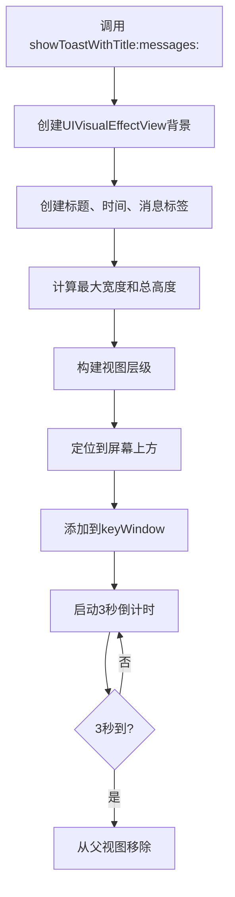
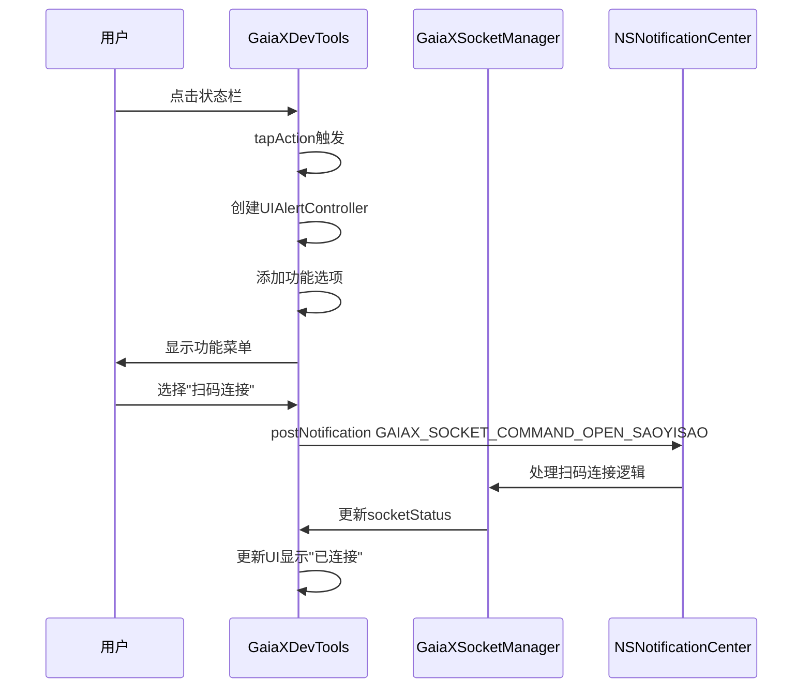
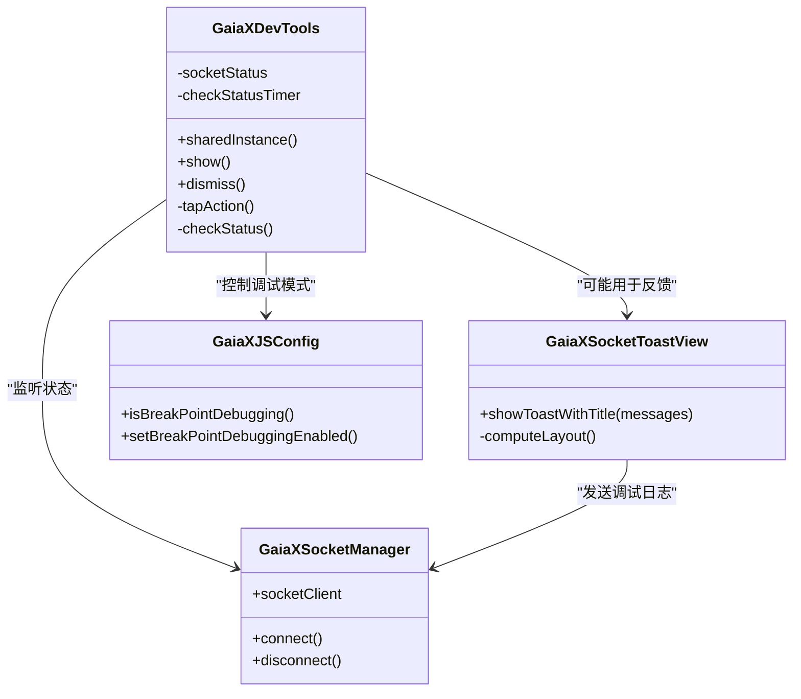

# 调试可视化

<cite>
**本文档中引用的文件**  
- [GaiaXSocketToastView.h](file://GaiaXiOSDemo/GaiaXiOSDemo/Preview/DevTools/GaiaXSocketToastView.h)
- [GaiaXSocketToastView.m](file://GaiaXiOSDemo/GaiaXiOSDemo/Preview/DevTools/GaiaXSocketToastView.m)
- [GaiaXDevTools.h](file://GaiaXiOSDemo/GaiaXiOSDemo/Preview/DevTools/GaiaXDevTools.h)
- [GaiaXDevTools.m](file://GaiaXiOSDemo/GaiaXiOSDemo/Preview/DevTools/GaiaXDevTools.m)
- [Utils.kt](file://GaiaXAndroidClientToStudio/src/main/java/com/alibaba/gaiax/studio/Utils.kt)
</cite>

## 目录
1. [简介](#简介)
2. [核心组件](#核心组件)
3. [架构概览](#架构概览)
4. [详细组件分析](#详细组件分析)
5. [依赖分析](#依赖分析)
6. [性能考虑](#性能考虑)
7. [故障排除指南](#故障排除指南)
8. [结论](#结论)

## 简介
GaiaX 提供了一套完整的调试可视化解决方案，旨在帮助开发者在开发过程中实时获取模板渲染、事件绑定、数据通信等关键环节的反馈信息。通过 GaiaXDevTools 和 GaiaXSocketToastView 等组件，开发者可以快速定位问题、验证逻辑并优化性能。本文档将深入解析 GaiaX 的调试可视化机制，涵盖 Toast 消息的显示、样式定制、生命周期管理以及与 GaiaX Studio 的集成方式，同时为初学者和高级开发者提供实用的使用指导和最佳实践。

## 核心组件

GaiaX 的调试可视化系统主要由两个核心组件构成：**GaiaXDevTools** 和 **GaiaXSocketToastView**。前者作为调试工具的主控视图，提供连接状态展示和功能入口；后者则负责以非侵入式的方式向用户展示实时的调试信息。此外，`Utils.kt` 工具类为 Android 平台提供了本地数据持久化支持，确保调试配置的连续性。

**本节来源**  
- [GaiaXDevTools.h](file://GaiaXiOSDemo/GaiaXiOSDemo/Preview/DevTools/GaiaXDevTools.h#L1-L31)
- [GaiaXSocketToastView.h](file://GaiaXiOSDemo/GaiaXiOSDemo/Preview/DevTools/GaiaXSocketToastView.h#L1-L29)
- [Utils.kt](file://GaiaXAndroidClientToStudio/src/main/java/com/alibaba/gaiax/studio/Utils.kt#L1-L20)

## 架构概览

GaiaX 的调试可视化架构建立在客户端与 GaiaX Studio 之间的 WebSocket 通信基础之上。当开发者在设备上启用调试模式后，应用会通过 `GaiaXSocketManager` 建立与 Studio 的连接。`GaiaXDevTools` 作为状态指示器，实时反映连接状态（等待连接、已连接、已断开），并提供用户交互入口。当需要展示调试信息时，系统会调用 `GaiaXSocketToastView` 的接口，将信息以 Toast 的形式短暂地显示在屏幕上方，3 秒后自动消失，确保不影响主业务流程。

```mermaid
graph TB
subgraph "GaiaX 客户端"
DevTools[GaiaXDevTools<br/>状态指示与控制]
ToastView[GaiaXSocketToastView<br/>实时信息展示]
SocketManager[GaiaXSocketManager<br/>WebSocket 通信]
end
subgraph "GaiaX Studio"
Studio[开发调试平台]
end
DevTools --> |用户交互| SocketManager
ToastView --> |发送调试信息| SocketManager
SocketManager < --> |WebSocket| Studio
SocketManager --> |更新状态| DevTools
```

**图表来源**  
- [GaiaXDevTools.m](file://GaiaXiOSDemo/GaiaXiOSDemo/Preview/DevTools/GaiaXDevTools.m#L30-L216)
- [GaiaXSocketToastView.m](file://GaiaXiOSDemo/GaiaXiOSDemo/Preview/DevTools/GaiaXSocketToastView.m#L29-L134)

## 详细组件分析

### GaiaXSocketToastView 分析

`GaiaXSocketToastView` 是一个继承自 `UIView` 的自定义视图，专门用于显示临时的调试信息。它通过 `showToastWithTitle:messages:` 方法接收标题和消息数组，并将其格式化后展示。

#### 显示机制与生命周期
Toast 的显示流程如下：
1.  **创建与配置**：调用 `showToastWithTitle:messages:` 方法时，会创建一个 `UIVisualEffectView` 作为背景，提供毛玻璃效果，并设置圆角。
2.  **内容布局计算**：遍历消息数组，为每条消息创建一个 `UILabel`，并计算所有文本的最大宽度，以确定 Toast 的整体宽度。
3.  **界面构建**：依次添加标题、时间戳、分隔线和消息内容标签到视图中。
4.  **布局定位**：根据计算出的尺寸，将 Toast 定位在屏幕中央偏上的位置，避免遮挡底部操作栏。
5.  **自动移除**：使用 `dispatch_after` 在 3 秒后将视图从其父视图中移除，完成生命周期。



**图表来源**  
- [GaiaXSocketToastView.m](file://GaiaXiOSDemo/GaiaXiOSDemo/Preview/DevTools/GaiaXSocketToastView.m#L31-L134)

#### 样式定制与交互设计
该组件的样式具有高度一致性：
- **背景**：使用 `UIBlurEffectStyleLight` 毛玻璃效果，底色为深绿色（RGB: 41, 142, 70），增强可读性。
- **文本**：标题使用 14pt 中等粗细字体，消息使用 13pt 中等粗细字体，时间戳使用 12pt 中等粗细字体，颜色均为白色或半透明白色。
- **布局**：采用固定边距（12pt）和间隙（3pt），确保视觉舒适。
- **交互**：Toast 本身无交互，3秒后自动消失。其父视图 `GaiaXDevTools` 通过 `UITapGestureRecognizer` 处理点击事件，弹出功能菜单。

**本节来源**  
- [GaiaXSocketToastView.m](file://GaiaXiOSDemo/GaiaXiOSDemo/Preview/DevTools/GaiaXSocketToastView.m#L30-L134)

### GaiaXDevTools 分析

`GaiaXDevTools` 是一个单例模式的 `UIView`，作为调试工具的常驻入口。

#### 集成与状态管理
- **单例实现**：通过 `dispatch_once` 确保全局唯一实例，避免重复创建。
- **状态同步**：内部维护 `socketStatus` 属性，并通过 `NSTimer` 每秒检查 `GaiaXSocketManager` 的实际连接状态，实现 UI 的实时更新。
- **UI 反馈**：根据不同的连接状态（默认、已连接、已断开）改变背景色和提示文本，例如已连接时为绿色，断开时为红色。

#### 交互设计
- **点击触发**：添加 `UITapGestureRecognizer` 手势识别器，点击后弹出 `UIAlertController` 动作表。
- **功能菜单**：菜单包含“扫码连接/断开连接”、“打开/关闭实时预览”、“开启/关闭断点调试”和“关闭 DevTools”等选项，通过 `NSNotificationCenter` 发送通知来触发相应功能。



**图表来源**  
- [GaiaXDevTools.m](file://GaiaXiOSDemo/GaiaXiOSDemo/Preview/DevTools/GaiaXDevTools.m#L30-L216)

## 依赖分析

GaiaX 的调试可视化功能依赖于多个内部和外部组件：
- **内部依赖**：
  - `GaiaXSocketManager`：提供与 GaiaX Studio 的底层通信能力。
  - `GaiaXJSConfig`：管理 JavaScript 引擎的调试配置，如断点调试开关。
- **外部依赖**：
  - `UIKit`：构建所有 UI 组件的基础框架。
  - `Foundation`：提供日期格式化、定时器等基础服务。



**图表来源**  
- [GaiaXDevTools.m](file://GaiaXiOSDemo/GaiaXiOSDemo/Preview/DevTools/GaiaXDevTools.m#L16-L216)
- [GaiaXSocketToastView.m](file://GaiaXiOSDemo/GaiaXiOSDemo/Preview/DevTools/GaiaXSocketToastView.m#L16-L134)

## 性能考虑

尽管调试工具本身不参与核心业务，但仍需关注其对应用性能的影响：
- **内存管理**：`GaiaXDevTools` 使用单例模式，避免了重复创建视图对象。`GaiaXSocketToastView` 在显示后 3 秒自动移除并释放，防止内存泄漏。
- **渲染优化**：Toast 视图结构简单，仅包含几个 `UILabel` 和一个 `UIVisualEffectView`，渲染开销极小。布局计算在主线程进行，但由于内容简单，不会造成卡顿。
- **用户体验**：Toast 采用非阻塞式设计，短暂显示后自动消失，最大限度减少了对用户操作的干扰。状态栏常驻但占用空间小，信息明确。

## 故障排除指南

当调试功能无法正常工作时，可参考以下步骤：
1.  **检查连接**：确认设备与运行 GaiaX Studio 的电脑处于同一网络。
2.  **验证状态**：查看 `GaiaXDevTools` 状态栏颜色，绿色表示已连接，黄色表示等待，红色表示断开。
3.  **重启连接**：尝试在 `GaiaXDevTools` 的菜单中先“断开连接”，再“扫码连接”。
4.  **检查代码**：确保已正确集成 `GaiaXSocket` 和 `GaiaXJS` 库，并在代码中调用了 `[GaiaXDevTools show]`。

**本节来源**  
- [GaiaXDevTools.m](file://GaiaXiOSDemo/GaiaXiOSDemo/Preview/DevTools/GaiaXDevTools.m#L157-L187)
- [GaiaXSocketToastView.m](file://GaiaXiOSDemo/GaiaXiOSDemo/Preview/DevTools/GaiaXSocketToastView.m#L31-L102)

## 结论

GaiaX 的调试可视化系统通过 `GaiaXDevTools` 和 `GaiaXSocketToastView` 的协同工作，为开发者提供了一个高效、直观的调试环境。`GaiaXDevTools` 作为控制中心，实现了连接管理和功能集成；`GaiaXSocketToastView` 则以轻量级的 Toast 形式，实现了关键信息的实时反馈。整个系统设计精巧，兼顾了功能性与性能，是 GaiaX 开发生态中不可或缺的一部分。开发者应熟练掌握其使用方法，并可基于此框架进行二次开发，以满足更复杂的调试需求。