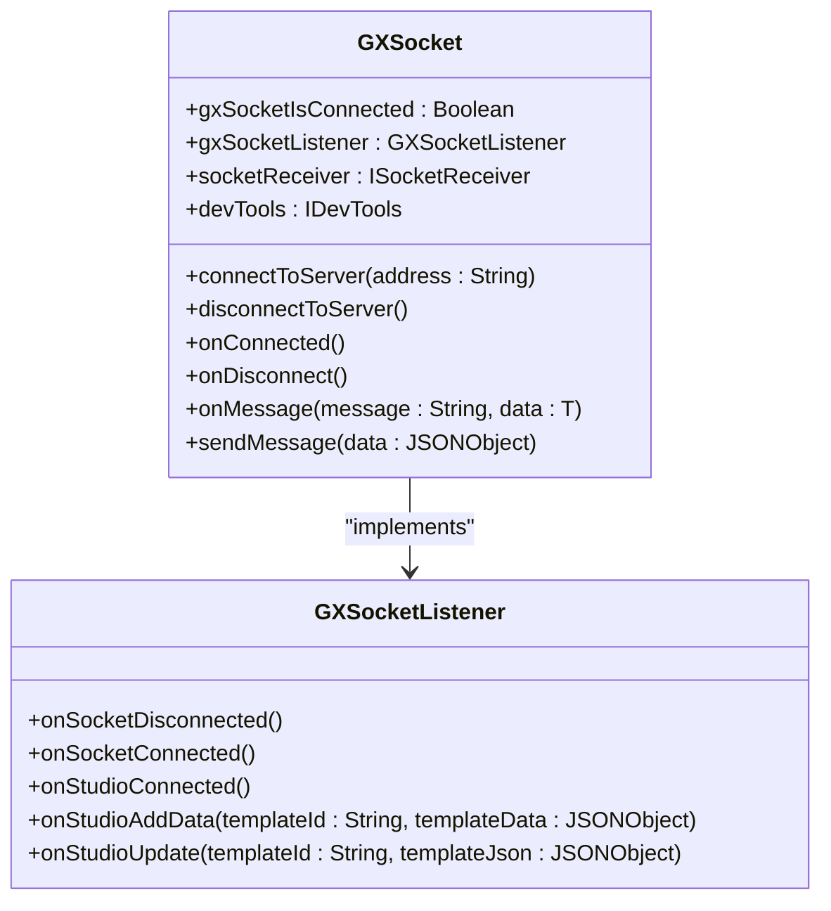
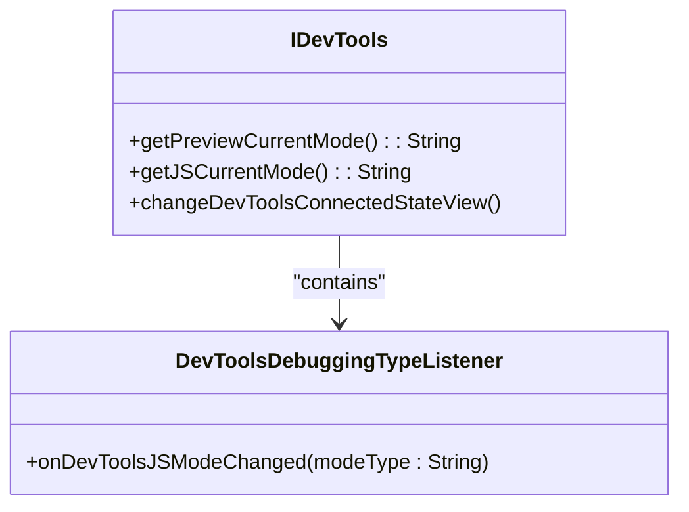
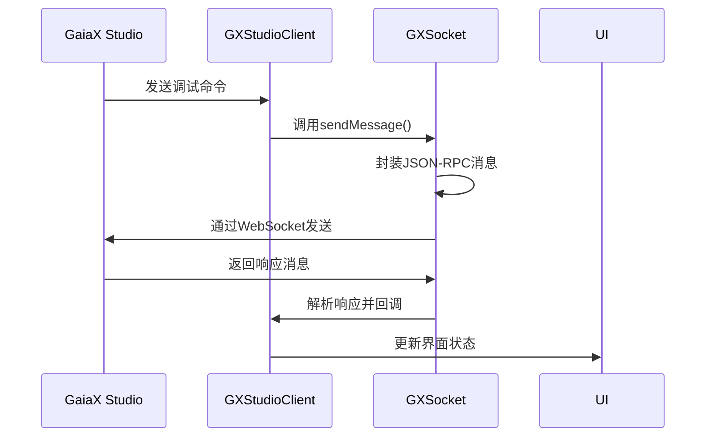
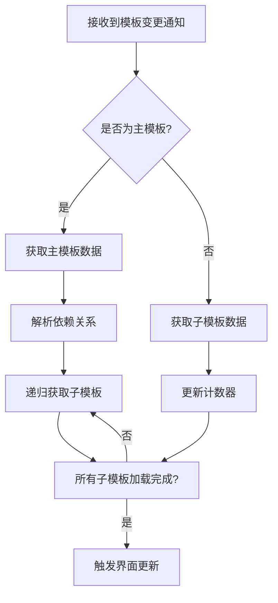

# 调试技巧

<cite>
**本文档中引用的文件**  
- [GXSocket.kt](file://GaiaXAndroidClientToStudio/src/main/java/com/alibaba/gaiax/studio/GXSocket.kt)
- [IDevTools.kt](file://GaiaXAndroidClientToStudio/src/main/java/com/alibaba/gaiax/studio/IDevTools.kt)
- [GXStudioClient.kt](file://GaiaXAndroidClientToStudio/src/main/java/com/alibaba/gaiax/studio/GXStudioClient.kt)
- [GXSocketKey.kt](file://GaiaXAndroidClientToStudio/src/main/java/com/alibaba/gaiax/studio/GXSocketKey.kt)
- [Utils.kt](file://GaiaXAndroidClientToStudio/src/main/java/com/alibaba/gaiax/studio/Utils.kt)
- [GaiaXSocket.h](file://GaiaXSocketiOS/GaiaXSocket/GaiaXSocket.h)
- [GaiaXSocketManager.h](file://GaiaXSocketiOS/GaiaXSocket/GaiaXSocketManager.h)
- [GaiaXSocketClient.h](file://GaiaXSocketiOS/GaiaXSocket/GaiaXSocketClient.h)
- [GaiaXSocketProtocol.h](file://GaiaXSocketiOS/GaiaXSocket/GaiaXSocketProtocol.h)
</cite>

## 目录
1. [简介](#简介)
2. [调试会话建立过程](#调试会话建立过程)
3. [核心调试组件分析](#核心调试组件分析)
4. [命令执行机制](#命令执行机制)
5. [实时反馈系统](#实时反馈系统)
6. [基础调试流程](#基础调试流程)
7. [高级调试技巧](#高级调试技巧)
8. [错误处理与安全考虑](#错误处理与安全考虑)
9. [最佳实践](#最佳实践)
10. [常见问题解决方案](#常见问题解决方案)

## 简介
GaiaX 提供了一套完整的调试解决方案，通过 GXSocket、IDevTools 和 GaiaXCommandCenter 等核心组件实现高效的实时调试功能。本文档详细介绍了如何利用这些组件进行调试，包括调试会话的建立、命令执行机制和实时反馈系统的运作原理。文档为初学者提供了基本的调试流程，同时也为经验丰富的开发者介绍了断点设置、变量监控和性能瓶颈分析等高级技巧。

## 调试会话建立过程
GaiaX 的调试会话建立过程基于 WebSocket 协议，通过 GXSocket 组件实现客户端与 GaiaX Studio 之间的双向通信。当开发者在 GaiaX Studio 中启动调试模式时，系统会生成一个包含 WebSocket 地址、模板 ID 和调试类型（实时预览或手动推送）的二维码。移动设备扫描该二维码后，GXStudioClient 组件会解析 URL 参数并建立连接。

连接建立过程首先通过 `connectToServer` 方法初始化 WebSocket 连接，设置连接超时时间为 15 秒，并配置网络状态变化后的自动重连机制。连接成功后，客户端会发送一个包含设备信息（如平台、设备名称、系统版本等）的初始化请求（method: "initialized"），完成调试会话的建立。整个过程通过 JSON-RPC 2.0 协议进行通信，确保了跨平台的兼容性和可靠性。

**Section sources**
- [GXSocket.kt](file://GaiaXAndroidClientToStudio/src/main/java/com/alibaba/gaiax/studio/GXSocket.kt#L70-L119)
- [GXStudioClient.kt](file://GaiaXAndroidClientToStudio/src/main/java/com/alibaba/gaiax/studio/GXStudioClient.kt#L177-L203)

## 核心调试组件分析

### GXSocket 组件
GXSocket 是 GaiaX 调试系统的核心通信组件，负责管理 WebSocket 连接和消息收发。该组件实现了 SocketListener 接口，能够处理连接建立、断开、消息接收等事件。通过 `onMessage` 方法，GXSocket 可以解析来自 GaiaX Studio 的各种调试指令，如模板更新通知（template/didChangedNotification）、JS 调用请求（js/callSync）等。

**Diagram sources**
- [GXSocket.kt](file://GaiaXAndroidClientToStudio/src/main/java/com/alibaba/gaiax/studio/GXSocket.kt#L17-L440)

### IDevTools 接口
IDevTools 接口定义了调试工具的核心功能，包括获取当前预览模式和 JS 调试模式，以及监听调试模式变化。该接口允许开发者自定义调试工具的 UI 状态，通过 `changeDevToolsConnectedStateView` 方法更新连接状态视图。同时，`DevToolsDebuggingTypeListener` 子接口提供了 JS 调试模式变化的回调机制，使开发者能够及时响应断点模式或日志调试模式的切换。

**Diagram sources**
- [IDevTools.kt](file://GaiaXAndroidClientToStudio/src/main/java/com/alibaba/gaiax/studio/IDevTools.kt#L11-L21)

### GaiaXCommandCenter 组件
虽然代码库中未直接体现 GaiaXCommandCenter 的实现，但从 GXStudioClient 的设计可以看出其命令处理机制。GXStudioClient 作为命令中心的代理，通过 `sendMessage` 方法将各种调试命令转发给 GXSocket。这些命令包括获取模板数据（template/get）、发送 JS 日志（js/console）、获取当前调试模式（mode/get）等。命令中心采用请求-响应模式，每个请求都包含唯一的 ID，便于客户端匹配响应。

**Section sources**
- [GXStudioClient.kt](file://GaiaXAndroidClientToStudio/src/main/java/com/alibaba/gaiax/studio/GXStudioClient.kt#L212-L254)

## 命令执行机制
GaiaX 的命令执行机制基于 JSON-RPC 2.0 协议，通过 WebSocket 进行双向通信。当 GaiaX Studio 发送调试命令时，GXSocket 的 `onMessage` 方法会解析消息内容，根据 "method" 字段确定命令类型，并调用相应的处理逻辑。例如，当接收到 "js/callSync" 命令时，系统会调用 `socketReceiver.onReceiveCallSync` 方法执行同步 JS 调用。

命令的发送过程通过 `sendMessage` 方法实现，该方法首先将命令参数封装为 JSONObject，设置 "jsonrpc" 版本为 "2.0"，并分配唯一的 ID。发送前，系统会将方法名与 ID 的映射关系存储在 `methodIdManager` 中，以便在收到响应时能够正确匹配。对于需要响应的命令，系统会等待 Studio 返回包含相同 ID 的响应消息，并根据响应内容更新 UI 或执行后续操作。

**Diagram sources**
- [GXSocket.kt](file://GaiaXAndroidClientToStudio/src/main/java/com/alibaba/gaiax/studio/GXSocket.kt#L373-L379)
- [GXStudioClient.kt](file://GaiaXAndroidClientToStudio/src/main/java/com/alibaba/gaiax/studio/GXStudioClient.kt#L212-L214)

## 实时反馈系统
GaiaX 的实时反馈系统通过模板变更通知机制实现。当开发者在 GaiaX Studio 中修改模板时，系统会发送 "template/didChangedNotification" 消息，包含更新后的模板 ID 和数据。GXSocket 接收到该消息后，会通过 `onStudioAddData` 和 `onStudioUpdate` 回调通知 UI 层更新界面。

对于复杂模板，系统采用分层加载策略。首先获取主模板数据（ID: 103），然后递归获取所有依赖的子模板（ID: 104）。通过 `subTemplateCount` 计数器跟踪子模板加载进度，当所有子模板加载完成后，触发最终的界面更新。这种机制确保了即使在模板结构复杂的情况下，也能保证数据的一致性和界面的及时更新。

**Diagram sources**
- [GXSocket.kt](file://GaiaXAndroidClientToStudio/src/main/java/com/alibaba/gaiax/studio/GXSocket.kt#L292-L370)

## 基础调试流程
初学者可以按照以下步骤进行基本的 GaiaX 调试：

1. 在应用启动时调用 `GXStudioClient.instance.init(context)` 初始化调试客户端
2. 扫描 GaiaX Studio 生成的调试二维码，获取连接参数
3. 调用 `GXStudioClient.instance.autoConnect()` 或 `manualConnect()` 建立连接
4. 实现 `IFastPreviewListener` 接口，处理模板数据更新事件
5. 在 `onAddData` 和 `onUpdate` 回调中更新 UI 界面

调试过程中，开发者可以通过 `sendJSLogMsg` 方法发送 JS 日志，帮助定位问题。当调试完成时，调用 `destroy()` 方法清理资源，断开连接。

**Section sources**
- [GXStudioClient.kt](file://GaiaXAndroidClientToStudio/src/main/java/com/alibaba/gaiax/studio/GXStudioClient.kt#L79-L89)

## 高级调试技巧

### 断点设置与变量监控
通过 IDevTools 接口，开发者可以实现断点调试功能。当 `getJSCurrentMode()` 返回 "breakpoint" 时，系统会暂停 JS 执行，允许开发者检查当前作用域的变量状态。可以结合 `sendMsgForChangeMode` 方法动态切换调试模式，在断点模式和正常模式之间切换。

### 性能瓶颈分析
利用 GXSocket 的消息日志功能，开发者可以监控调试通信的性能。通过分析 `onMessage` 方法的执行时间，识别消息处理的瓶颈。对于频繁更新的模板，可以优化 `updateTask` 的延迟时间（默认 200ms），平衡实时性和性能消耗。

### 可视化调试反馈
虽然代码库中未直接体现 GXSocketToastView，但可以通过自定义 UI 组件实现可视化调试反馈。例如，在界面角落显示当前连接状态、模板加载进度和错误信息，帮助开发者快速了解调试会话的健康状况。

**Section sources**
- [IDevTools.kt](file://GaiaXAndroidClientToStudio/src/main/java/com/alibaba/gaiax/studio/IDevTools.kt#L12-L21)
- [GXSocket.kt](file://GaiaXAndroidClientToStudio/src/main/java/com/alibaba/gaiax/studio/GXSocket.kt#L313-L315)

## 错误处理与安全考虑
GaiaX 调试系统实现了完善的错误处理机制。当 WebSocket 连接失败时，`onConnectFailed` 回调会通知上层应用，开发者可以在此处显示错误提示。对于网络 VPN 的干扰，系统通过 `isConnectVpn` 方法检测并提示用户断开 VPN 连接。

安全方面，调试功能仅在开发环境中启用，生产环境应禁用相关代码。连接地址通过本地存储（SharedPreferences）管理，避免敏感信息泄露。同时，建议在调试完成后及时调用 `destroy()` 方法，释放资源并断开连接，防止调试通道被滥用。

**Section sources**
- [GXSocket.kt](file://GaiaXAndroidClientToStudio/src/main/java/com/alibaba/gaiax/studio/GXSocket.kt#L104-L107)
- [GXStudioClient.kt](file://GaiaXAndroidClientToStudio/src/main/java/com/alibaba/gaiax/studio/GXStudioClient.kt#L165-L175)

## 最佳实践
1. **连接管理**：在 Activity/Fragment 的生命周期中正确管理连接状态，避免内存泄漏
2. **错误恢复**：实现自动重连机制，提高调试会话的稳定性
3. **性能优化**：合理设置模板更新的延迟时间，避免频繁刷新导致的性能问题
4. **日志记录**：充分利用 `sendJSLogMsg` 方法记录关键调试信息
5. **资源清理**：确保在应用退出或页面销毁时调用 `destroy()` 方法

## 常见问题解决方案
1. **连接失败**：检查设备与电脑是否在同一局域网，确认防火墙未阻止 WebSocket 端口
2. **模板不更新**：验证模板 ID 是否正确，检查网络连接状态
3. **VPN 干扰**：断开手机 VPN 连接后重试
4. **消息延迟**：调整 `updateTask` 的延迟时间，优化消息处理逻辑
5. **内存泄漏**：确保正确实现生命周期管理，及时清理回调引用