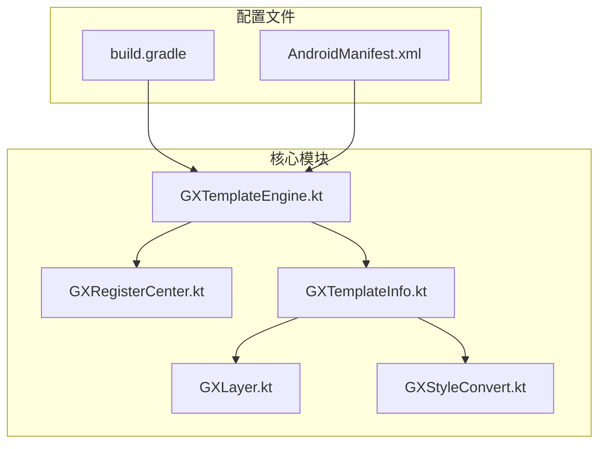
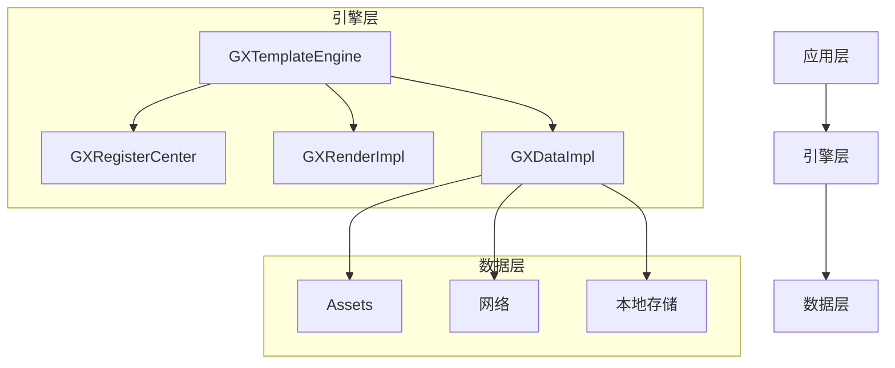
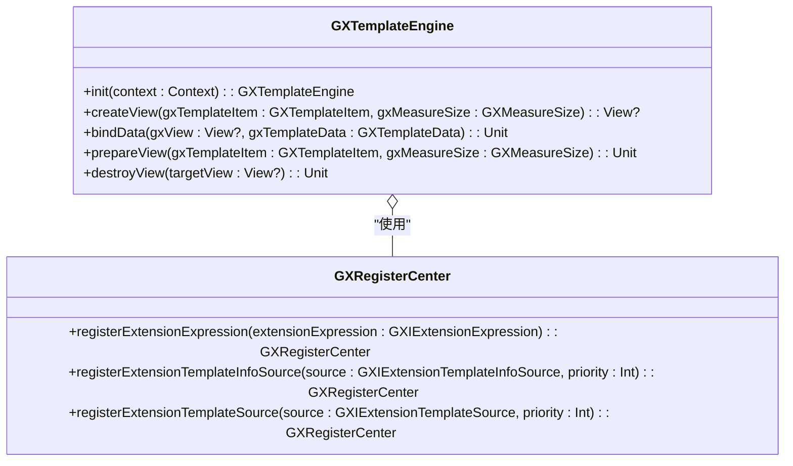
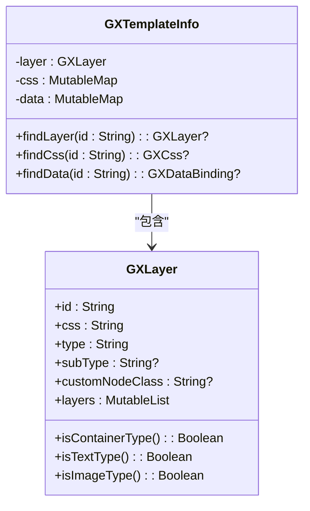
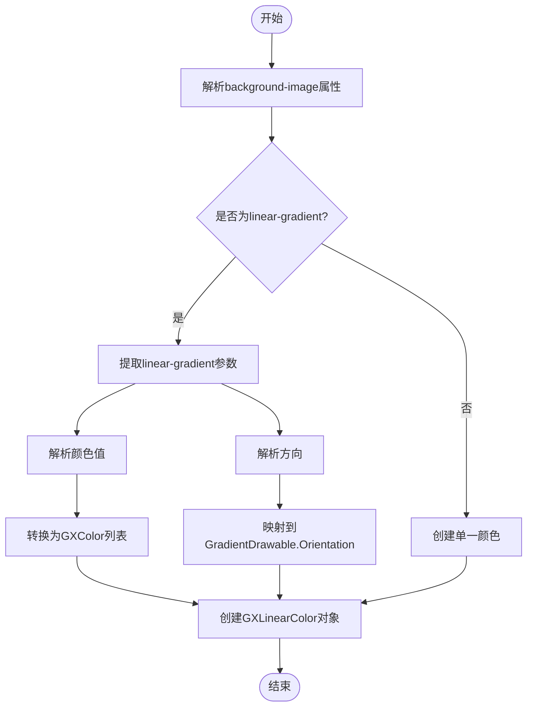
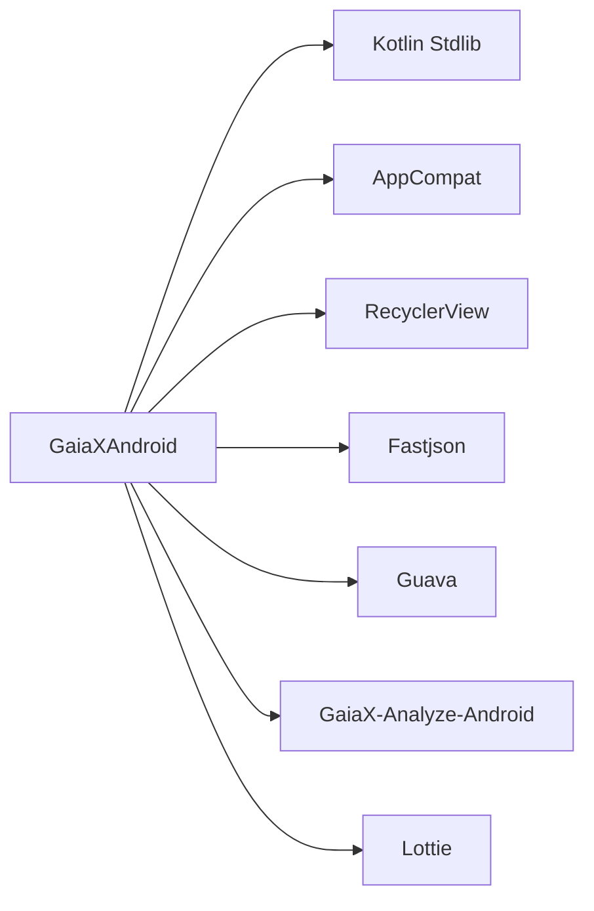

# Android实现

<cite>
**本文档引用的文件**  
- [GXTemplateEngine.kt](file://GaiaXAndroid/src/main/kotlin/com/alibaba/gaiax/GXTemplateEngine.kt)
- [GXRegisterCenter.kt](file://GaiaXAndroid/src/main/kotlin/com/alibaba/gaiax/GXRegisterCenter.kt)
- [GXTemplateInfo.kt](file://GaiaXAndroid/src/main/kotlin/com/alibaba/gaiax/template/GXTemplateInfo.kt)
- [GXLayer.kt](file://GaiaXAndroid/src/main/kotlin/com/alibaba/gaiax/template/GXLayer.kt)
- [GXStyleConvert.kt](file://GaiaXAndroid/src/main/kotlin/com/alibaba/gaiax/template/GXStyleConvert.kt)
- [build.gradle](file://GaiaXAndroid/build.gradle)
- [AndroidManifest.xml](file://GaiaXAndroid/src/main/AndroidManifest.xml)
</cite>

## 目录
1. [简介](#简介)
2. [项目结构](#项目结构)
3. [核心组件](#核心组件)
4. [架构概述](#架构概述)
5. [详细组件分析](#详细组件分析)
6. [依赖分析](#依赖分析)
7. [性能考虑](#性能考虑)
8. [故障排除指南](#故障排除指南)
9. [结论](#结论)

## 简介
GaiaX Android平台实现提供了一套完整的动态模板渲染解决方案，旨在通过纯原生方式实现高性能的动态卡片展示。本平台的核心是Android核心引擎，它负责协调模板解析、数据绑定和视图渲染等关键组件。`GXTemplateEngine`作为主入口点，通过单例模式确保全局唯一性，并通过`GXRegisterCenter`提供的扩展注册机制，支持自定义功能的灵活集成。`GXTemplateInfo`和`GXLayer`共同管理模板的层级结构，而`GXStyleConvert`则负责将样式定义转换为Android平台可识别的格式。对于初学者，本文档提供了从`build.gradle`配置到`AndroidManifest.xml`声明的快速集成指南；对于高级开发者，则深入剖析了Kotlin实现细节、工厂模式构建视图以及观察者模式处理事件的机制。此外，文档还包含实际代码示例，展示模板加载、数据绑定和事件处理的完整流程，并说明了Android特有的视图复用和内存管理等性能优化策略。

## 项目结构
GaiaX Android项目采用模块化设计，主要包含核心引擎、适配器、客户端到工作室的通信、演示应用、JS引擎、JS代理、QuickJS实现等多个模块。核心引擎模块（`GaiaXAndroid`）位于项目根目录下，其源代码位于`src/main/kotlin`目录中，主要包含`com.alibaba.gaiax`包下的核心类，如`GXTemplateEngine`和`GXRegisterCenter`。适配器模块（`GaiaXAndroidAdapter`）提供了对Lottie动画、图片加载等第三方库的集成支持。演示应用模块（`GaiaXAndroidDemo`）包含了详细的使用示例和测试用例。JS相关模块（`GaiaXAndroidJS`、`GaiaXAndroidJSProxy`、`GaiaXAndroidQuickJS`）实现了JavaScript表达式的解析和执行能力。整个项目的构建由`build.gradle`文件管理，依赖于Kotlin、AppCompat、RecyclerView和Fastjson等库。

**图表来源**
- [GXTemplateEngine.kt](file://GaiaXAndroid/src/main/kotlin/com/alibaba/gaiax/GXTemplateEngine.kt)
- [GXRegisterCenter.kt](file://GaiaXAndroid/src/main/kotlin/com/alibaba/gaiax/GXRegisterCenter.kt)
- [GXTemplateInfo.kt](file://GaiaXAndroid/src/main/kotlin/com/alibaba/gaiax/template/GXTemplateInfo.kt)
- [GXLayer.kt](file://GaiaXAndroid/src/main/kotlin/com/alibaba/gaiax/template/GXLayer.kt)
- [GXStyleConvert.kt](file://GaiaXAndroid/src/main/kotlin/com/alibaba/gaiax/template/GXStyleConvert.kt)
- [build.gradle](file://GaiaXAndroid/build.gradle)
- [AndroidManifest.xml](file://GaiaXAndroid/src/main/AndroidManifest.xml)

**章节来源**
- [build.gradle](file://GaiaXAndroid/build.gradle)
- [AndroidManifest.xml](file://GaiaXAndroid/src/main/AndroidManifest.xml)

## 核心组件
`GXTemplateEngine`是整个GaiaX Android平台的核心，它作为主入口协调所有操作。`GXRegisterCenter`提供了扩展注册机制，允许开发者注册自定义功能，如表达式解析、数据绑定、颜色转换等。`GXTemplateInfo`类封装了模板的完整信息，包括层级结构、样式、数据绑定和事件配置。`GXLayer`类表示模板中的单个节点，通过递归结构形成树状的层级关系。`GXStyleConvert`类负责将CSS样式的字符串描述转换为Android平台的`GXStyle`对象，是样式系统的关键转换器。

**章节来源**
- [GXTemplateEngine.kt](file://GaiaXAndroid/src/main/kotlin/com/alibaba/gaiax/GXTemplateEngine.kt)
- [GXRegisterCenter.kt](file://GaiaXAndroid/src/main/kotlin/com/alibaba/gaiax/GXRegisterCenter.kt)
- [GXTemplateInfo.kt](file://GaiaXAndroid/src/main/kotlin/com/alibaba/gaiax/template/GXTemplateInfo.kt)
- [GXLayer.kt](file://GaiaXAndroid/src/main/kotlin/com/alibaba/gaiax/template/GXLayer.kt)
- [GXStyleConvert.kt](file://GaiaXAndroid/src/main/kotlin/com/alibaba/gaiax/template/GXStyleConvert.kt)

## 架构概述
GaiaX Android平台的架构设计遵循分层原则，从上至下分为应用层、引擎层和数据层。应用层通过`GXTemplateEngine`的API与引擎交互。引擎层是核心，由`GXTemplateEngine`主导，它调用`GXRegisterCenter`获取注册的扩展功能，并利用`GXDataImpl`加载模板数据。数据层负责从assets或网络等来源获取原始的JSON数据。`GXTemplateInfo`在数据加载后被创建，它解析JSON并构建出包含`GXLayer`树的完整模板信息。在视图创建阶段，`GXRenderImpl`根据`GXTemplateInfo`和`GXMeasureSize`生成视图树。`GXStyleConvert`在整个过程中负责将样式信息转换为具体的Android属性。

**图表来源**
- [GXTemplateEngine.kt](file://GaiaXAndroid/src/main/kotlin/com/alibaba/gaiax/GXTemplateEngine.kt)
- [GXRegisterCenter.kt](file://GaiaXAndroid/src/main/kotlin/com/alibaba/gaiax/GXRegisterCenter.kt)
- [GXTemplateInfo.kt](file://GaiaXAndroid/src/main/kotlin/com/alibaba/gaiax/template/GXTemplateInfo.kt)

## 详细组件分析

### GXTemplateEngine 分析
`GXTemplateEngine`是整个系统的主入口，采用单例模式（通过`companion object`实现）确保全局唯一实例。它通过`init`方法进行初始化，该方法会注册默认的模板信息源和模板源。`createView`方法是创建视图的主要入口，它首先调用`prepareView`进行布局预计算，然后通过`createViewOnlyNodeTree`和`createViewOnlyViewTree`两个阶段分别构建节点树和视图树。`bindData`方法用于更新视图的数据，它会触发数据绑定和事件监听的更新。

#### 对象导向组件

**图表来源**
- [GXTemplateEngine.kt](file://GaiaXAndroid/src/main/kotlin/com/alibaba/gaiax/GXTemplateEngine.kt)
- [GXRegisterCenter.kt](file://GaiaXAndroid/src/main/kotlin/com/alibaba/gaiax/GXRegisterCenter.kt)

### GXRegisterCenter 分析
`GXRegisterCenter`是扩展功能的注册中心，它定义了一系列接口（如`GXIExtensionExpression`、`GXIExtensionDataBinding`），允许开发者通过`registerExtensionXXX`方法注册自定义实现。这些扩展在模板解析和渲染过程中被调用，从而实现功能的灵活扩展。例如，`registerExtensionExpression`可以注册一个自定义的表达式解析器，`registerExtensionViewSupport`可以注册一个自定义视图的创建工厂。

**章节来源**
- [GXRegisterCenter.kt](file://GaiaXAndroid/src/main/kotlin/com/alibaba/gaiax/GXRegisterCenter.kt)

### GXTemplateInfo 和 GXLayer 分析
`GXTemplateInfo`和`GXLayer`共同构成了模板的层级结构。`GXTemplateInfo`是模板的顶层信息容器，它持有一个`GXLayer`对象作为根节点。`GXLayer`是一个数据类，它包含`id`、`css`、`type`等基本信息，并通过`layers`字段形成一个递归的树状结构，表示子节点。`GXTemplateInfo`的`create`方法会递归地解析JSON数据，构建出完整的`GXLayer`树。

#### 对象导向组件

**图表来源**
- [GXTemplateInfo.kt](file://GaiaXAndroid/src/main/kotlin/com/alibaba/gaiax/template/GXTemplateInfo.kt)
- [GXLayer.kt](file://GaiaXAndroid/src/main/kotlin/com/alibaba/gaiax/template/GXLayer.kt)

### GXStyleConvert 分析
`GXStyleConvert`是样式转换的核心组件，它负责将CSS样式的字符串值转换为Android平台的具体对象。例如，`fontColor`方法将颜色字符串（如"#FF0000"）转换为`GXColor`对象，`backgroundImage`方法将`linear-gradient`字符串解析为`GXLinearColor`对象。该类通过`companion object`实现单例，并在`GXTemplateEngine`初始化时通过`init`方法传入`AssetManager`。

#### 复杂逻辑组件

**图表来源**
- [GXStyleConvert.kt](file://GaiaXAndroid/src/main/kotlin/com/alibaba/gaiax/template/GXStyleConvert.kt)

## 依赖分析
GaiaX Android项目通过`build.gradle`文件管理其依赖关系。核心依赖包括Kotlin标准库、AndroidX的AppCompat和RecyclerView，以及Fastjson用于JSON解析。测试依赖包括JUnit、Espresso和Lottie。项目还依赖于`GaiaX-Analyze-Android`库，用于性能分析。这些依赖确保了项目在不同Android版本上的兼容性和功能完整性。

**图表来源**
- [build.gradle](file://GaiaXAndroid/build.gradle)

**章节来源**
- [build.gradle](file://GaiaXAndroid/build.gradle)

## 性能考虑
GaiaX Android平台在性能方面进行了多项优化。首先，通过`GXGlobalCache`对布局计算结果进行缓存，避免了重复计算。其次，在`GXTemplateEngine`中，`prepareView`方法可以预先计算布局，提高后续`createView`的效率。对于列表场景，`GXContainerViewAdapter`实现了视图复用机制，有效减少了内存分配和GC压力。此外，`GXTemplateEngine`的`bindData`方法支持局部数据更新，避免了整个视图树的重建。

## 故障排除指南
在集成和使用GaiaX Android平台时，可能会遇到一些常见问题。如果视图无法正常显示，请检查`GXTemplateEngine`是否已正确`init`，并确认`GXTemplateItem`中的`bizId`和`templateId`是否正确。如果样式不生效，请检查`GXStyleConvert`的转换逻辑或确认CSS属性名是否正确。对于数据绑定失败，应检查`GXDataBinding`的表达式语法。在调试时，可以启用`GXPropUtils.isTrace()`来获取详细的执行日志。

**章节来源**
- [GXTemplateEngine.kt](file://GaiaXAndroid/src/main/kotlin/com/alibaba/gaiax/GXTemplateEngine.kt)
- [GXStyleConvert.kt](file://GaiaXAndroid/src/main/kotlin/com/alibaba/gaiax/template/GXStyleConvert.kt)

## 结论
GaiaX Android平台通过精心设计的架构和高效的实现，提供了一套强大且灵活的动态模板解决方案。`GXTemplateEngine`作为核心引擎，通过单例模式和清晰的API为开发者提供了便捷的入口。`GXRegisterCenter`的扩展机制使得平台功能可以无限扩展。`GXTemplateInfo`和`GXLayer`对模板层级结构的有效管理，以及`GXStyleConvert`对样式的精确转换，共同保证了模板渲染的准确性和性能。无论是初学者还是高级开发者，都能从本文档中找到所需的信息，快速集成并深入定制GaiaX平台，以满足复杂的业务需求。