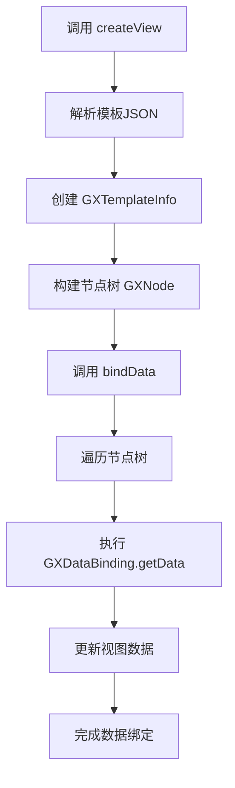
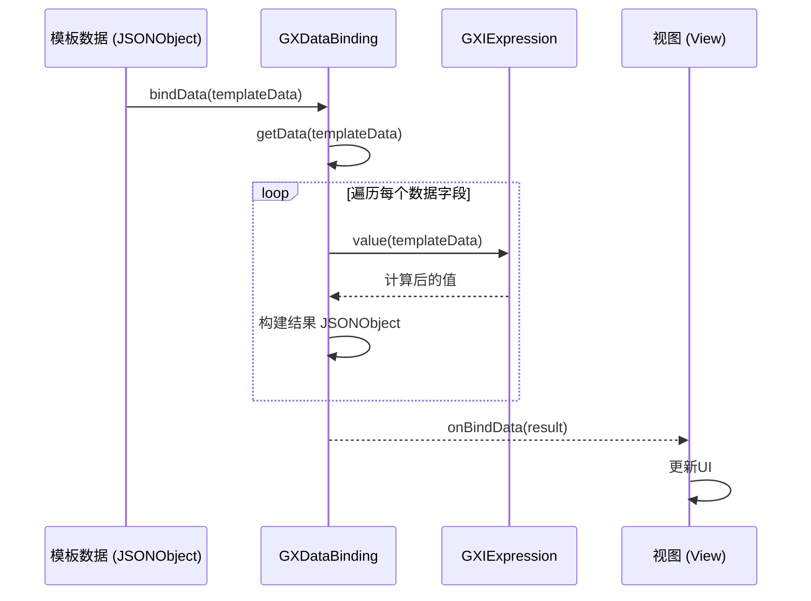
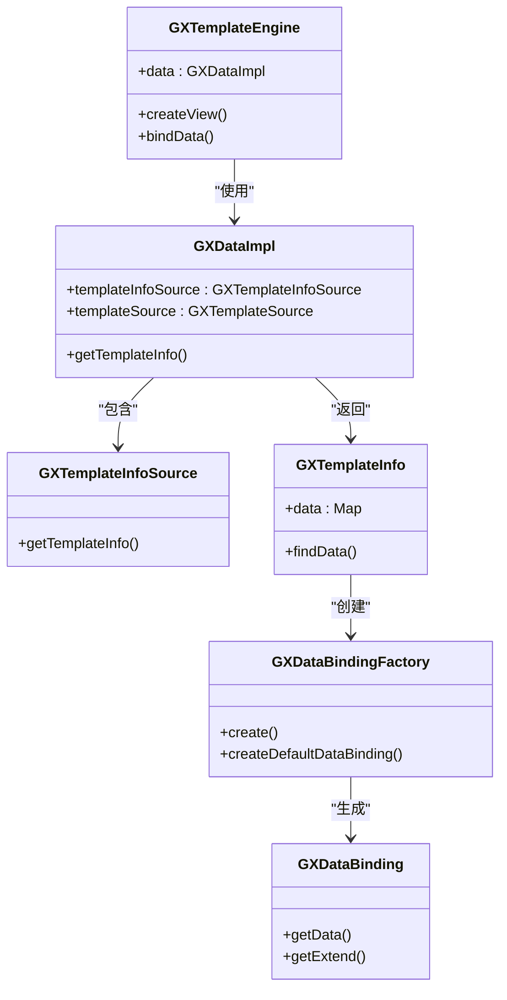
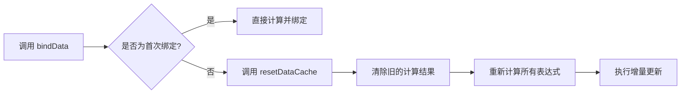
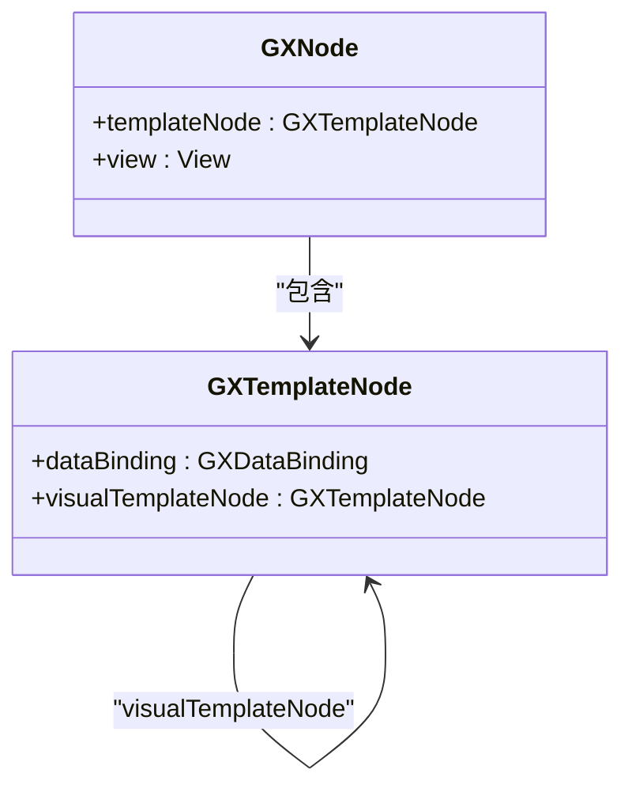

# 数据绑定

<cite>
**本文档引用的文件**   
- [GXDataImpl.kt](file://GaiaXAndroid/src/main/kotlin/com/alibaba/gaiax/data/GXDataImpl.kt)
- [GXDataBinding.kt](file://GaiaXAndroid/src/main/kotlin/com/alibaba/gaiax/template/GXDataBinding.kt)
- [GXTemplateInfo.kt](file://GaiaXAndroid/src/main/kotlin/com/alibaba/gaiax/template/GXTemplateInfo.kt)
- [GXNodeTreeUpdate.kt](file://GaiaXAndroid/src/main/kotlin/com/alibaba/gaiax/render/node/GXNodeTreeUpdate.kt)
- [GXTemplateNode.kt](file://GaiaXAndroid/src/main/kotlin/com/alibaba/gaiax/render/node/GXTemplateNode.kt)
- [GXDataBindingFactory.kt](file://GaiaXAndroid/src/main/kotlin/com/alibaba/gaiax/template/factory/GXDataBindingFactory.kt)
- [GXTemplateEngine.kt](file://GaiaXAndroid/src/main/kotlin/com/alibaba/gaiax/GXTemplateEngine.kt)
- [GXTemplateKey.kt](file://GaiaXAndroid/src/main/kotlin/com/alibaba/gaiax/template/GXTemplateKey.kt)
</cite>

## 目录
1. [简介](#简介)
2. [核心组件](#核心组件)
3. [数据绑定生命周期](#数据绑定生命周期)
4. [数据更新机制](#数据更新机制)
5. [与模板引擎集成](#与模板引擎集成)
6. [基础用法示例](#基础用法示例)
7. [高级特性剖析](#高级特性剖析)
8. [复杂数据结构绑定](#复杂数据结构绑定)
9. [错误处理与安全实践](#错误处理与安全实践)
10. [性能优化策略](#性能优化策略)

## 简介
GaiaX Android的数据绑定机制是其动态模板系统的核心功能之一，它实现了数据与UI的高效、灵活连接。该机制主要由`GXDataImpl`和`GXDataBinding`两个核心类驱动，通过表达式解析和数据映射，将JSON格式的模板数据动态地绑定到原生视图上。此文档将深入解析其内部实现原理，为开发者提供从入门到精通的全面指导。

## 核心组件

`GXDataImpl`是数据处理的主入口，负责管理模板信息和数据源。它通过`GXTemplateInfoSource`和`GXTemplateSource`两个内部类来缓存和获取模板的结构信息与资源文件，确保数据的高效加载和复用。

`GXDataBinding`类则代表了单个视图节点的数据绑定配置。它封装了视图渲染所需的所有数据字段，如`value`（渲染值）、`placeholder`（占位符）、`accessibilityDesc`（无障碍描述）等，并通过`getData`方法计算出最终的绑定结果。

**Section sources**
- [GXDataImpl.kt](file://GaiaXAndroid/src/main/kotlin/com/alibaba/gaiax/data/GXDataImpl.kt#L28-L167)
- [GXDataBinding.kt](file://GaiaXAndroid/src/main/kotlin/com/alibaba/gaiax/template/GXDataBinding.kt#L26-L105)

## 数据绑定生命周期

数据绑定的生命周期始于`GXTemplateEngine`的`createView`调用，此时系统会解析模板的JSON文件，创建`GXTemplateInfo`对象，其中包含了所有节点的`GXDataBinding`配置。当调用`bindData`方法时，生命周期进入核心阶段。



**Diagram sources**
- [GXTemplateEngine.kt](file://GaiaXAndroid/src/main/kotlin/com/alibaba/gaiax/GXTemplateEngine.kt#L558-L583)
- [GXNodeTreeUpdate.kt](file://GaiaXAndroid/src/main/kotlin/com/alibaba/gaiax/render/node/GXNodeTreeUpdate.kt#L960-L991)

**Section sources**
- [GXTemplateInfo.kt](file://GaiaXAndroid/src/main/kotlin/com/alibaba/gaiax/template/GXTemplateInfo.kt#L174-L249)
- [GXNodeTreeUpdate.kt](file://GaiaXAndroid/src/main/kotlin/com/alibaba/gaiax/render/node/GXNodeTreeUpdate.kt#L657-L743)

## 数据更新机制

数据更新机制的核心在于`GXDataBinding`的`getData`方法。该方法接收一个`JSONObject`类型的模板数据作为输入，通过内部的`GXIExpression`表达式对象计算出每个字段的最终值。



**Diagram sources**
- [GXDataBinding.kt](file://GaiaXAndroid/src/main/kotlin/com/alibaba/gaiax/template/GXDataBinding.kt#L47-L88)
- [GXTemplateNode.kt](file://GaiaXAndroid/src/main/kotlin/com/alibaba/gaiax/render/node/GXTemplateNode.kt#L71-L75)

**Section sources**
- [GXDataBinding.kt](file://GaiaXAndroid/src/main/kotlin/com/alibaba/gaiax/template/GXDataBinding.kt#L47-L88)

## 与模板引擎集成

`GXDataImpl`作为`GXTemplateEngine`的数据层，通过`getTemplateInfo`方法为模板引擎提供`GXTemplateInfo`实例。`GXTemplateInfo`在创建时，会调用`GXDataBindingFactory`来解析数据绑定文件中的JSON配置，将其转换为内存中的`GXDataBinding`对象。



**Diagram sources**
- [GXTemplateEngine.kt](file://GaiaXAndroid/src/main/kotlin/com/alibaba/gaiax/GXTemplateEngine.kt#L502-L511)
- [GXDataImpl.kt](file://GaiaXAndroid/src/main/kotlin/com/alibaba/gaiax/data/GXDataImpl.kt#L30-L33)
- [GXTemplateInfo.kt](file://GaiaXAndroid/src/main/kotlin/com/alibaba/gaiax/template/GXTemplateInfo.kt#L279-L298)
- [GXDataBindingFactory.kt](file://GaiaXAndroid/src/main/kotlin/com/alibaba/gaiax/template/factory/GXDataBindingFactory.kt#L10-L15)

## 基础用法示例

对于初学者，数据绑定的基本用法非常直观。开发者只需在模板的`databinding.json`文件中定义数据映射关系，然后在代码中调用`bindData`即可。

**静态数据绑定：**
```json
{
  "data": {
    "text_node": {
      "value": "Hello GaiaX"
    },
    "image_node": {
      "value": "https://example.com/image.png",
      "placeholder": "local://placeholder"
    }
  }
}
```

**动态数据更新：**
```kotlin
val newData = JSONObject().apply {
    put("nodes", JSONArray().apply { add(JSONObject()) })
}
templateEngine.bindData(view, GXTemplateData(newData))
```

**Section sources**
- [GXTemplateKey.kt](file://GaiaXAndroid/src/main/kotlin/com/alibaba/gaiax/template/GXTemplateKey.kt#L376-L381)
- [GXTemplateEngine.kt](file://GaiaXAndroid/src/main/kotlin/com/alibaba/gaiax/GXTemplateEngine.kt#L593-L610)

## 高级特性剖析

高级开发者可以深入理解数据差异计算和增量更新算法。系统通过`GXTemplateNode`的`resetDataCache`方法来管理数据缓存，确保在`bindData`被多次调用时，能够正确地重新计算表达式。



性能优化策略包括对`GXExpression`的缓存和对`GXTemplateInfo`的全局缓存，避免了重复的JSON解析和对象创建。

**Section sources**
- [GXTemplateNode.kt](file://GaiaXAndroid/src/main/kotlin/com/alibaba/gaiax/render/node/GXTemplateNode.kt#L92-L97)
- [GXNodeTreeUpdate.kt](file://GaiaXAndroid/src/main/kotlin/com/alibaba/gaiax/render/node/GXNodeTreeUpdate.kt#L952-L958)

## 复杂数据结构绑定

对于复杂数据结构，如嵌套模板，系统通过`visualTemplateNode`机制实现数据传递。父模板的`dataBinding`会作为`visualTemplateNode`的输入，从而实现数据的层级传递。



**Diagram sources**
- [GXTemplateNode.kt](file://GaiaXAndroid/src/main/kotlin/com/alibaba/gaiax/render/node/GXTemplateNode.kt#L40-L68)
- [GXNodeTreeUpdate.kt](file://GaiaXAndroid/src/main/kotlin/com/alibaba/gaiax/render/node/GXNodeTreeUpdate.kt#L203-L238)

## 错误处理与安全实践

系统内置了严格的错误处理机制。例如，在`GXDataBindingFactory.createDefaultDataBinding`中，会对输入数据进行类型检查，确保其为`JSONObject`，否则返回`null`以防止后续的空指针异常。

内存管理的最佳实践包括使用`lazy`委托来延迟初始化`GXTemplateInfoSource`和`GXTemplateSource`，以及在`destroyView`时及时释放`GXTemplateContext`，避免内存泄漏。

**Section sources**
- [GXDataBindingFactory.kt](file://GaiaXAndroid/src/main/kotlin/com/alibaba/gaiax/template/factory/GXDataBindingFactory.kt#L19-L21)
- [GXTemplateEngine.kt](file://GaiaXAndroid/src/main/kotlin/com/alibaba/gaiax/GXTemplateEngine.kt#L627-L630)

## 性能优化策略

性能优化是GaiaX数据绑定机制的关键。除了前述的缓存策略，系统还通过`GXGlobalCache`对整个节点树的布局进行缓存，当`measureSize`未发生变化时，可直接复用之前的布局结果，极大提升了`createView`的性能。

此外，`GXNodeTreeUpdate`中的`updateNodeTreeLayoutByDirtyText`方法实现了延迟计算，将文字自适应的计算推迟到布局计算之后，避免了因`flexGrow`等动态属性导致的布局错误。

**Section sources**
- [GXTemplateEngine.kt](file://GaiaXAndroid/src/main/kotlin/com/alibaba/gaiax/GXTemplateEngine.kt#L635-L648)
- [GXNodeTreeUpdate.kt](file://GaiaXAndroid/src/main/kotlin/com/alibaba/gaiax/render/node/GXNodeTreeUpdate.kt#L134-L155)