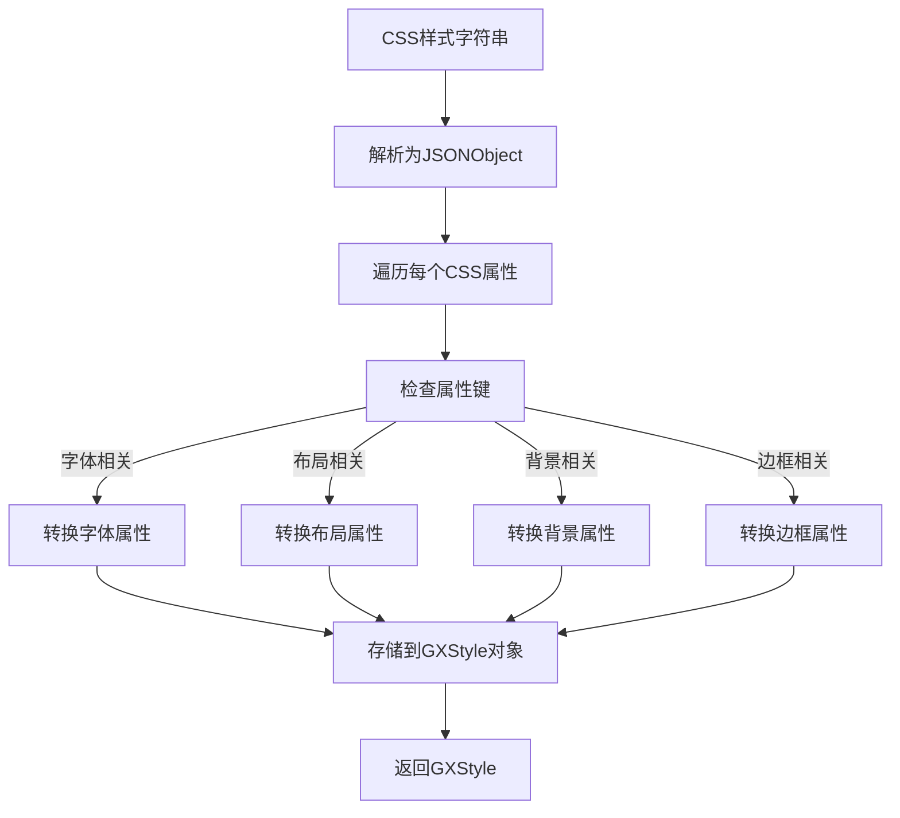
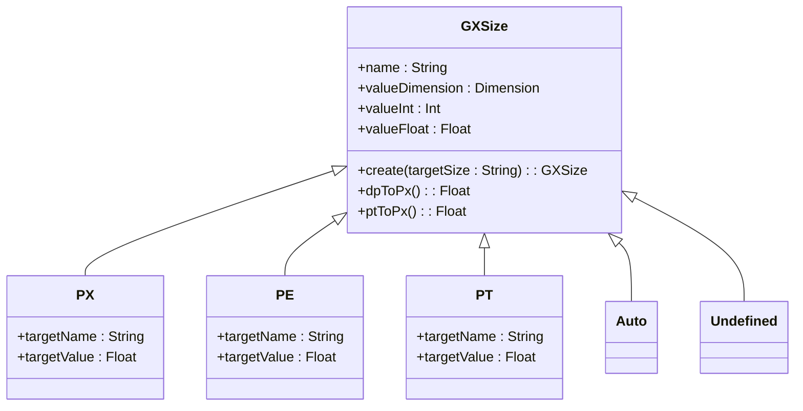
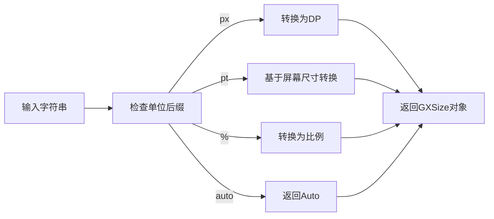
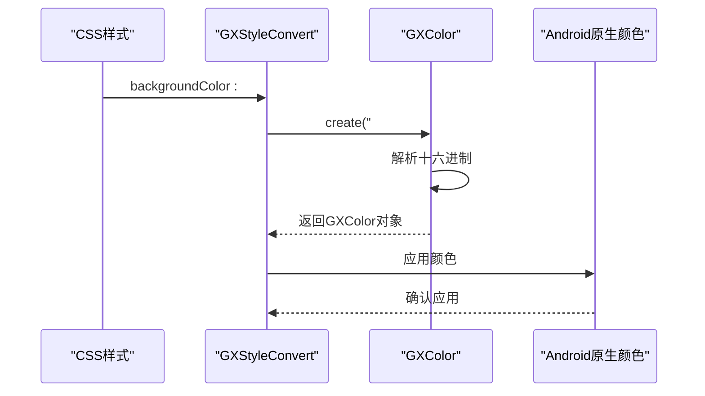
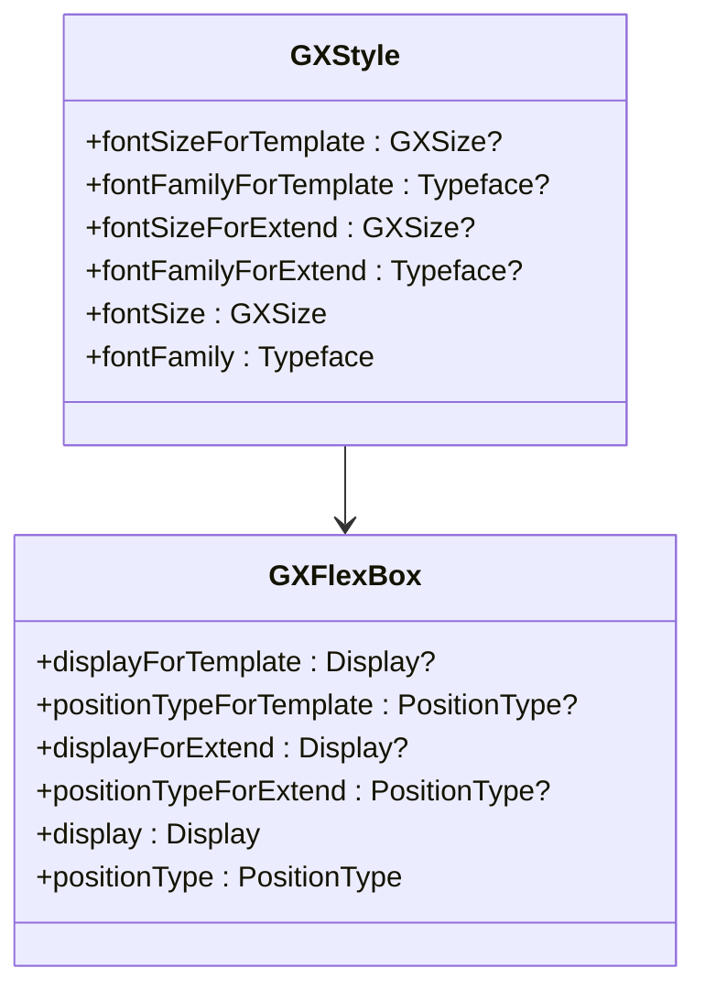
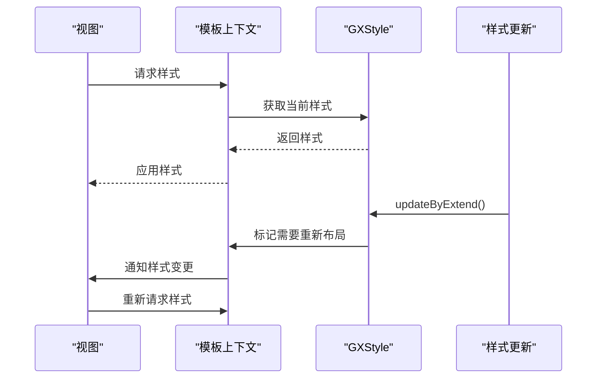
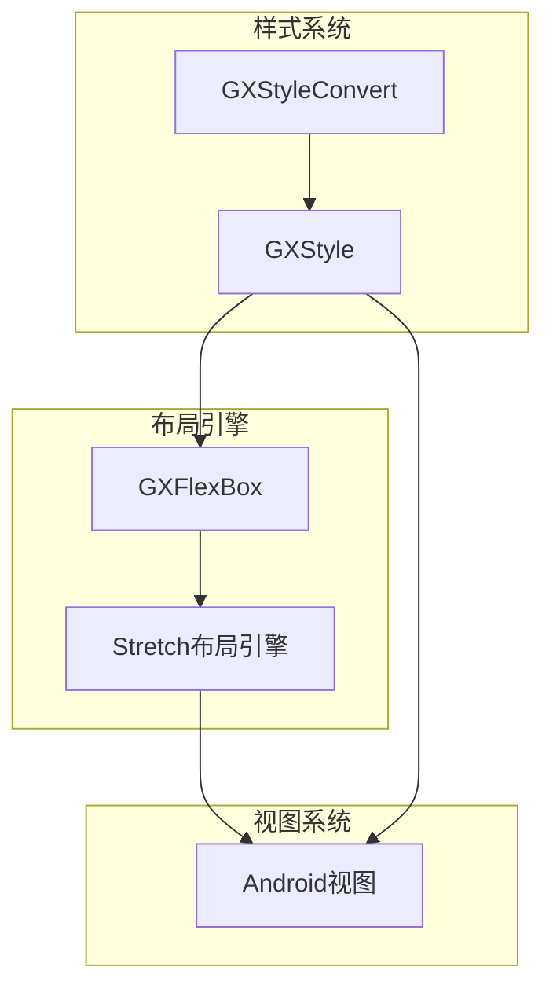

# 样式系统

<cite>
**本文档引用文件**  
- [GXStyle.kt](file://GaiaXAndroid/src/main/kotlin/com/alibaba/gaiax/template/GXStyle.kt)
- [GXStyleConvert.kt](file://GaiaXAndroid/src/main/kotlin/com/alibaba/gaiax/template/GXStyleConvert.kt)
- [GXTemplateKey.kt](file://GaiaXAndroid/src/main/kotlin/com/alibaba/gaiax/template/GXTemplateKey.kt)
- [GXFlexBox.kt](file://GaiaXAndroid/src/main/kotlin/com/alibaba/gaiax/template/GXFlexBox.kt)
- [GXSize.kt](file://GaiaXAndroid/src/main/kotlin/com/alibaba/gaiax/template/GXSize.kt)
- [GXCss.kt](file://GaiaXAndroid/src/main/kotlin/com/alibaba/gaiax/template/GXCss.kt)
</cite>

## 目录
1. [简介](#简介)
2. [核心组件](#核心组件)
3. [样式转换逻辑](#样式转换逻辑)
4. [尺寸单位处理](#尺寸单位处理)
5. [颜色值解析](#颜色值解析)
6. [样式继承与优先级](#样式继承与优先级)
7. [动态样式更新与主题切换](#动态样式更新与主题切换)
8. [布局引擎交互](#布局引擎交互)
9. [最佳实践](#最佳实践)

## 简介
GaiaX Android样式系统是一个基于CSS的声明式样式管理框架，旨在实现跨平台一致的UI表现。该系统通过GXStyleConvert将CSS样式转换为原生Android样式，并由GXStyle进行统一管理。样式系统支持丰富的CSS属性，包括布局、文本、背景、边框等，并提供了灵活的扩展机制。

## 核心组件

### GXStyle
GXStyle是样式系统的核心数据结构，负责存储和管理所有样式属性。它采用模板-扩展（Template-Extend）模式，将样式分为模板定义和动态扩展两部分。这种设计实现了样式定义与样式的动态更新分离，提高了样式的可维护性和灵活性。

### GXStyleConvert
GXStyleConvert是样式转换器，负责将CSS字符串转换为GXStyle对象。它实现了从CSS属性到Android原生样式的映射，包括尺寸单位转换、颜色解析、字体处理等。转换器采用单例模式，确保全局样式转换的一致性。

**Section sources**
- [GXStyle.kt](file://GaiaXAndroid/src/main/kotlin/com/alibaba/gaiax/template/GXStyle.kt)
- [GXStyleConvert.kt](file://GaiaXAndroid/src/main/kotlin/com/alibaba/gaiax/template/GXStyleConvert.kt)

## 样式转换逻辑



**Diagram sources**
- [GXStyleConvert.kt](file://GaiaXAndroid/src/main/kotlin/com/alibaba/gaiax/template/GXStyleConvert.kt)

### 转换流程
1. **解析阶段**：将CSS字符串解析为JSONObject对象
2. **遍历阶段**：逐个处理每个CSS属性
3. **转换阶段**：根据属性类型调用相应的转换方法
4. **存储阶段**：将转换结果存储到GXStyle对象中

### 支持的CSS属性
| 属性类别 | 支持的属性 |
|---------|----------|
| 字体 | font-size, font-family, font-weight, color, text-align, text-overflow |
| 布局 | display, position, flex-direction, justify-content, align-items |
| 背景 | background-color, background-image, opacity |
| 边框 | border-width, border-color, border-radius, box-shadow |

**Section sources**
- [GXStyleConvert.kt](file://GaiaXAndroid/src/main/kotlin/com/alibaba/gaiax/template/GXStyleConvert.kt)
- [GXTemplateKey.kt](file://GaiaXAndroid/src/main/kotlin/com/alibaba/gaiax/template/GXTemplateKey.kt)

## 尺寸单位处理



**Diagram sources**
- [GXSize.kt](file://GaiaXAndroid/src/main/kotlin/com/alibaba/gaiax/template/GXSize.kt)

### 单位类型
GaiaX支持三种尺寸单位：
- **px**：像素单位，直接转换为DP
- **pt**：点单位，基于屏幕尺寸进行响应式转换
- **%**：百分比单位，转换为相对比例

### 转换规则


**Section sources**
- [GXSize.kt](file://GaiaXAndroid/src/main/kotlin/com/alibaba/gaiax/template/GXSize.kt)

## 颜色值解析



**Diagram sources**
- [GXStyleConvert.kt](file://GaiaXAndroid/src/main/kotlin/com/alibaba/gaiax/template/GXStyleConvert.kt)

### 支持的颜色格式
- **十六进制**：#RRGGBB, #RGB
- **RGB函数**：rgb(r,g,b), rgba(r,g,b,a)
- **设计令牌**：通过扩展机制支持设计系统令牌

### 解析流程
1. 检查颜色值格式
2. 调用GXColor.create()方法
3. 返回GXColor对象
4. 在视图渲染时转换为Android原生颜色

**Section sources**
- [GXStyleConvert.kt](file://GaiaXAndroid/src/main/kotlin/com/alibaba/gaiax/template/GXStyleConvert.kt)

## 样式继承与优先级



**Diagram sources**
- [GXStyle.kt](file://GaiaXAndroid/src/main/kotlin/com/alibaba/gaiax/template/GXStyle.kt)
- [GXFlexBox.kt](file://GaiaXAndroid/src/main/kotlin/com/alibaba/gaiax/template/GXFlexBox.kt)

### 优先级规则
样式系统采用"扩展优先"原则：
1. **扩展样式**：通过updateByExtend方法动态设置的样式
2. **模板样式**：在模板定义时设置的样式
3. **默认样式**：系统内置的默认样式

### 继承机制
- 通过updateByVisual方法实现样式继承
- 子节点可以继承父节点的样式属性
- 支持选择性继承，可以只继承特定属性

**Section sources**
- [GXStyle.kt](file://GaiaXAndroid/src/main/kotlin/com/alibaba/gaiax/template/GXStyle.kt)

## 动态样式更新与主题切换



**Diagram sources**
- [GXStyle.kt](file://GaiaXAndroid/src/main/kotlin/com/alibaba/gaiax/template/GXStyle.kt)

### 动态更新
通过updateByExtend方法实现动态样式更新：
```kotlin
val extendCssData = JSONObject()
extendCssData.put("color", "#FF0000")
gxStyle.updateByExtend(extendCssData)
```

### 主题切换
1. 定义主题配置
2. 批量更新样式属性
3. 触发视图重绘

**Section sources**
- [GXStyle.kt](file://GaiaXAndroid/src/main/kotlin/com/alibaba/gaiax/template/GXStyle.kt)

## 布局引擎交互



**Diagram sources**
- [GXCss.kt](file://GaiaXAndroid/src/main/kotlin/com/alibaba/gaiax/template/GXCss.kt)

### 交互流程
1. 样式系统生成GXStyle和GXFlexBox
2. 布局引擎使用FlexBox进行布局计算
3. 视图系统应用Style进行样式渲染
4. 三者通过模板上下文进行协调

**Section sources**
- [GXCss.kt](file://GaiaXAndroid/src/main/kotlin/com/alibaba/gaiax/template/GXCss.kt)

## 最佳实践

### 样式定义
- 使用语义化类名
- 遵循BEM命名规范
- 避免过度嵌套

### 性能优化
- 减少动态样式更新频率
- 使用样式缓存
- 避免频繁的布局重计算

### 可维护性
- 将常用样式提取为变量
- 使用主题系统管理颜色和字体
- 文档化自定义样式属性

**Section sources**
- [GXStyle.kt](file://GaiaXAndroid/src/main/kotlin/com/alibaba/gaiax/template/GXStyle.kt)
- [GXStyleConvert.kt](file://GaiaXAndroid/src/main/kotlin/com/alibaba/gaiax/template/GXStyleConvert.kt)